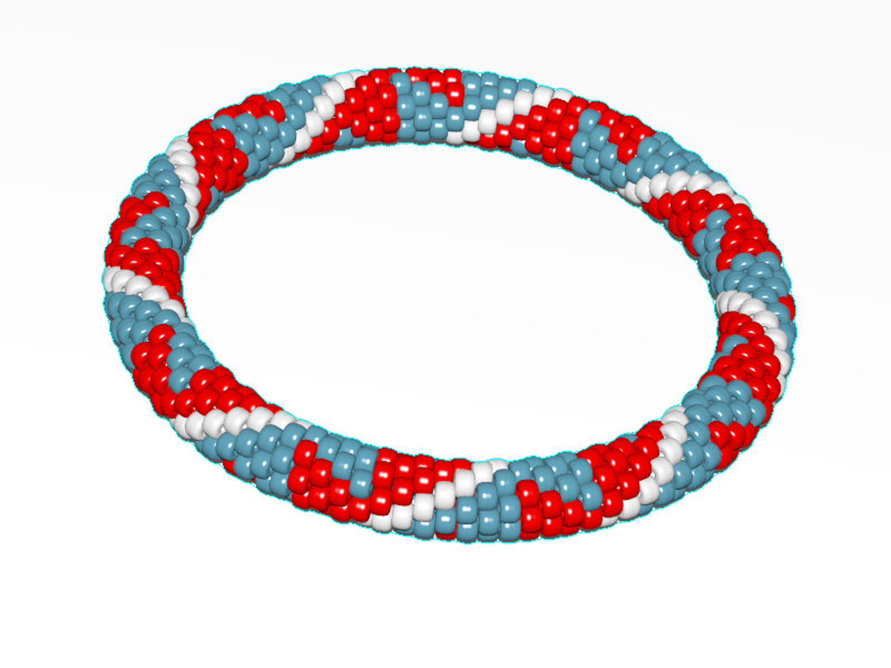
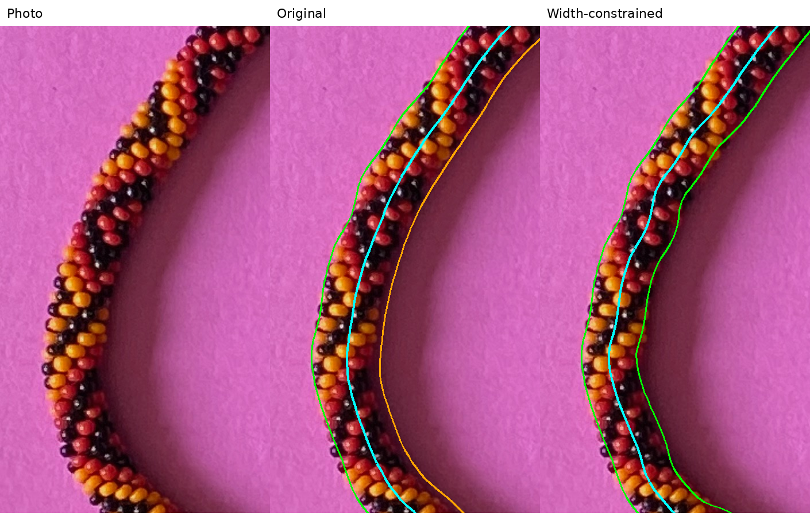
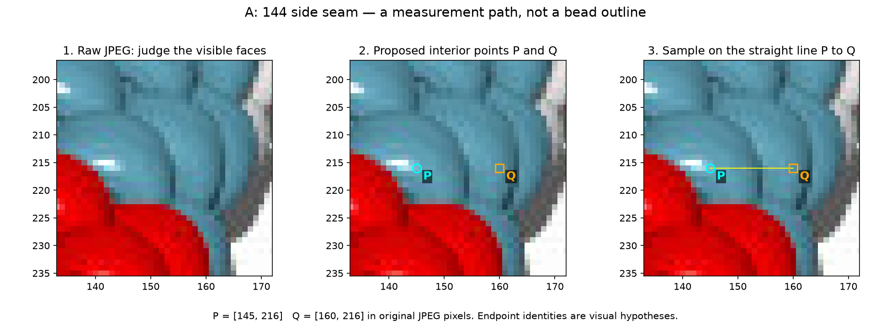

# How the reconstruction methods work so far

Updated 2026-09-27 for R091. **We can isolate an approximate necklace region and
produce reviewed candidate bead maps. We have a saved centerline for photo 2.
We do not yet have a verified complete bead inventory or recovered full pattern.**

There are two separate workflows. The current work on **beads1.jpg–beads7.jpg**
uses generated JPEGs, without consulting their source patterns. The earlier
**beads-photo-2.jpg** work has saved boundary curves and a centerline. The current
generated-image detector does not use the photograph's curves.

| Product | What it means | What we have |
| --- | --- | --- |
| Foreground mask | Pixels that may belong to the necklace | Approximate masks; shadow and pale edges remain difficult |
| Inner/outer boundaries | The two sides of the whole rope | Saved photo-2 curves; pixel envelopes for the seven JPEGs |
| Centerline | A path along the middle of the whole rope | Saved photo-2 curve; no equivalent saved spline in the current seven-image inventory pipeline |
| Bead observations | Markers, colors and provisional visible regions | Reviewed maps for all seven JPEGs |
| Physical bead centers / chain indices | Actual 3D positions / order along the thread | Not recovered by these inventory maps |

## 1. How I separate the background from the necklace

### Generated images: first obtain a broad search region

The original detector, [blind_generated.py](photo2/blind_generated.py), uses
the light background of the 800×600 JPEGs:

1. Keep a pixel if **at least one RGB channel is below 190**, on a 0–255 scale.
   A bright red pixel can qualify even though its red channel is bright, because
   its green and blue channels are dark. Nearly white floor pixels usually fail.
2. Close small gaps using a disk of radius **4 pixels**. This expands and then
   contracts the selected region, connecting nearby pieces.
3. Keep the largest connected piece as the approximate necklace region.
4. Fill enclosed holes smaller than **300 pixels**. Preserve the large central
   opening and any background component connected to the image border.

This is a search mask, not precise background removal. It can include dark cast
shadow, omit pale bead surfaces, discard disconnected portions, or bridge real
gaps. The thresholds were chosen for these images and are not universal.

### Reviewed inventories: adapt the mask to each palette

The later maps refine this with **color support**: a mask of pixels eligible for
each visible color. These are image-specific rules chosen from JPEG inspection,
not a trained segmentation model or palette read from the renderer.

- **beads1:** use strong red/green/blue channel dominance. The largest channel
  must exceed the second-largest by more than 25 and be at least 35. This rejects
  much neutral floor/shadow. Fill enclosed highlight holes up to 64 pixels and
  borrow the nearest colored support's class for those holes.
- **beads2:** use its own orange/yellow/violet/lavender hue and color-strength
  rules, including a separate pale-lavender class.
- **beads3–7:** white, gray or black bodies need a broader search envelope.
  Close the original mask with a **10-pixel** disk and fill enclosed holes up to
  **1,500 pixels**, retaining the main opening. Then apply each image's color
  and brightness rules inside that envelope.

For example, [beads6](photo2/BEADS6_INVENTORY.md) accepts red when
`R − max(G,B) ≥ 25`, and blue-gray when `min(G,B) − R ≥ 12`, with saturation
at least 0.13. Other eligible pixels with maximum RGB at least 95 supply white
support. Small enclosed glints are filled within the chromatic classes.



The difficult cases remain white beads against white floor, black beads against
shadow, and highlights connected to neighboring pale regions. Beads7 needed two
explicitly recorded local black-glint repairs; those are manual corrections,
not a general solution. A poor mask can make a substantial bead look artificially
small, so I review the foreground and colors before applying the size filter.
See [the beads7 repair examples](photo2/BEADS7_INVENTORY.md).

### Photo 2: select the colored paper in HSV

Photo 2 lies on magenta paper. Its existing extraction workflow uses **HSV**:
hue describes color, saturation describes color strength, and value is the
largest RGB channel, so darker pixels have lower value. A selected paper-color
range distinguishes background from possible necklace pixels. The current
extractor also has an alternative that selects the union of red, yellow and
black foreground colors.

The saved file says `image_only_hsv`, but does not specify which of the current
predicate options produced it. I cannot reconstruct its exact historical
threshold choice from that metadata. The implementation is in the sibling
repository's [find_splines.py](../fft-image-explorer/find_splines.py); the frozen
[curve source](photo2/boundary-splines-source.json) is tracked here. Shadows can
shift paper outside its selected color range, which is why the resulting outline
still needs review.

## 2. How I find the centerline

For photo 2, the method first traces the outside of the necklace and the inside
edge around the opening. The saved display curves use Catmull–Rom interpolation:
a smooth curve passes through the boundary control points.

The available centerline builder works from the **boundary control polylines**:

1. Resample the inner and outer closed polylines at evenly spaced distances.
2. For each inner sample, find the closest point on the outer polyline.
3. Take the midpoint of that pair as a centerline sample.
4. Join the samples into a closed path. Half the pair's distance is an
   accompanying estimate of the rope's projected half-width.

For an inner point `I` and its nearest outer point `O`, the center sample is
`C = (I + O) / 2`. This is an approximate geometric middle. At tight bends,
nearest points need not be physically corresponding cross-section edges; a
shadow-biased outline also shifts the midpoint. It is not a skeleton extracted
from individual bead centers.

The saved photo-2 geometry contains **907 outer-boundary samples, 847 inner
samples and 303 centerline points**, including repeated closing points. The
outer/inner control arrays contain 152/142 points. The centerline copy is
[centerline.json](photo2/centerline.json), with source and photograph hashes.

For the forward model, [reconstruct.py](photo2/reconstruct.py) fits a smooth
periodic cubic spline to those centerline points. It then evaluates positions
at requested distances along the curve, also obtaining tangent and normal
directions. Equal distance along this curve is different from equal increments
of a spline's internal parameter.



The picture shows the shadow problem and a later **proposed** correction. The
[width diagnostic](photo2/WIDTH_CORRECTION.md) measures cross sections, estimates
width from clearer sections, and moves an uncertain edge while holding the
clearer edge fixed. These candidate curves have not replaced the original
geometry. A later [direct image-edge attempt](photo2/IMAGE_EDGES.md) performed
worse against the saved visual review and was rejected. That visual review was
an assistant assessment, not independently measured ground truth.

For the seven generated-image inventories, I have **not** extracted and adopted
equivalent centerline splines. An older neighbor experiment estimated rough
tangent directions from an ellipse fitted to the spread of candidate positions.
That reference ellipse is not a recovered centerline, and it does not determine
the current bead masks.

## 3. How I determine bead locations

### Start with brightness peaks, then review the image

The original automatic detector smooths HSV value with a Gaussian of sigma
**1.25 pixels** and finds local peaks at least **5 pixels** apart. It requires
value above **0.22** on a 0–1 scale and contrast above **0.025** compared with
a broader sigma-4 smoothed neighborhood. Many peaks are specular highlights.

Each peak becomes a **marker**, a candidate starting location for one region.
It is not assumed to be the bead's physical center. A bead can have no strong
peak, several peaks, or a peak displaced toward its edge.

I then review the whole JPEG and enlarged numbered crops. Saved annotations
remove unsupported and duplicate peaks, add substantial visible bodies missed
by peak finding, and correct marker positions and color labels. This makes the
current inventories **partly automatic and partly manually reviewed**. The
scripts replay those explicit corrections; they do not discover them anew.

Beads6 provides a concrete example: 354 initial candidates, minus 53 reviewed
removals, plus 17 additions, minus eight small-region exclusions, leaves **310
active observations**. This arithmetic records decisions; it is not a count
verified against known bead identities.

### Grow a provisional visible region around each marker

The segmentation method is **watershed**. Think of flooding a landscape from
several marked starting points: each grows a region until it meets another
region or an eligibility boundary.

The original landscape combines negative smoothed brightness with a smaller
color-gradient term; a compactness penalty discourages very long regions. That
was an improvement over a gradient-only trial which often isolated glints.
The reviewed maps instead segment each eligible support class separately, usually
using negative sigma-1 smoothed brightness with compactness. Black classes in
beads3 and beads7 use a flat landscape, relying on support and seed geometry
because their glints are poor boundary guides. This can still divide a region
arbitrarily when the pixels do not reveal a seam.

Some color names share a support class: gray/white in beads5 and silver/white in
beads7. A color label therefore does not always supply a separate pixel boundary.

A marker can be moved slightly to nearby support of its assigned color, usually
by at most six pixels. Assigned pixels are limited to within 28 pixels of a
same-class seed. Later inventories retain only the component connected to each
seed and leave detached islands unassigned. These safeguards prevent some
implausible assignments but do not establish true bead outlines.

The location terms matter:

| Stored location | Meaning |
| --- | --- |
| Marker | Original brightness peak or manually reviewed image point |
| Segmentation seed | Marker adjusted to eligible color/interior support |
| Region centroid | Average position of assigned visible pixels, where recorded |
| Physical bead center | A 3D geometric quantity that these points do not directly measure |
| Observation ID | A stable reference within one image, not an index along the thread |

### Ignore slivers and flag suspicious areas

Following the maker's instruction, known fragments are ignored. The numerical
[area rule](photo2/INVENTORY_SELECTION.md) compares each reviewed region with
up to eight nearby reviewed bodies within 45 pixels, requiring at least four
references. The reference pool is frozen before filtering.

Regions below **half** the neighbors' median area are excluded; regions above
**twice** it are warned as possibly merged. Those thresholds are assistant-chosen
heuristics, not physical bead-identity tests. Excluded pixels remain unassigned;
neighbors do not absorb them. Beads1 marker 211 remains explicitly excluded.
Small masks must first be checked for segmentation mistakes.

The [reference-sensitivity audit](photo2/AREA_WARNING_STABILITY.md) found 14
active observations whose area status changes when one reference is omitted,
plus two persistently large beads3 regions. Passing this check does not establish
a complete or correct bead map.

## 4. What the recent paths add

The latest work examines difficult **same-color neighbors**. I choose a path
between proposed visible interiors, sample its RGB colors, and plot saturation
and value along it. Darkening toward an edge followed by lightening over the
next face can help explain a seam. A highlight can instead produce a large color
change inside one bead; ordinary shading can also make a brightness valley.



The illustration preserves the original provisional wording. The maker has
since [confirmed that A and B connect different beads](photo2/BEADS6_SV_QUESTIONS.md).
The [travel-order pictures](photo2/review/r087/review.html) show sampled colors
and stops linked to the image. In the rejected K example, the maker identifies
**both endpoints as boundary points**, so neither is a valid interior reference.
Specular spots are not boundary markers. Those answers establish relationships
at the original points, not exact outlines or labels for moved endpoints.

These paths are measurements across a possible boundary, not lines tracing it.
They have not changed any inventory mask. Whole-path translations and smoothing
were tested in R087; the proposed independent endpoint experiment has **not yet
been run**.

Shape interpretation now follows the [pose and occlusion guide](photo2/SHAPE_REASONING.md):
we see only the part of a 3D bead exposed by its neighbors, which can be broad,
narrow, notched or hidden. A universal oval is inadequate. The necklace's major
centerline stays planar on the paper; section direction within that plane and
the global camera view affect the expected shapes. Helicity describes progression
around the rope's small cross-section and is a separate issue. The synthetic
shape atlas informs this reasoning; it is not a fitted shape detector for these
JPEG inventories.

## 5. What is established, and what comes next

| Image | Active observations | Principal remaining issues / evidence |
| --- | ---: | --- |
| beads1 | 313 | [Active map](photo2/INVENTORY_SELECTION.md); completeness and same-color borders provisional |
| beads2 | 318 | [Active map](photo2/BEADS2_INVENTORY.md); palette and same-color borders provisional |
| beads3 | 304 | [Active map](photo2/BEADS3_INVENTORY.md); large 122/405 unresolved, five reference-sensitive regions |
| beads4 | 342 | [Active map](photo2/BEADS4_INVENTORY.md); white/shadow borders, reference-sensitive 272 |
| beads5 | 328 | [Active map](photo2/BEADS5_INVENTORY.md); 188 unresolved, 188/349/364 reference-sensitive |
| beads6 | 310 | [Active map](photo2/BEADS6_INVENTORY.md); full extents of 144/189 unresolved despite confirmed A/B point relations |
| beads7 | 327 | [Active map](photo2/BEADS7_INVENTORY.md); local glint repairs, pale labels/borders, reference-sensitive 128/200/236 |

All seven maps retain unknown chain indices and unverified completeness.
The old generated-image indexing attempt produced conflicts in every tested
variant; it has not recovered bead order or a complete pattern. A render colored
by sampling the photograph can resemble it without solving either problem.

The next bounded experiment remains independent endpoint perturbations around
A/B, with H as a highlight example and K as invalid interior placement. It will
assess placement sensitivity, then stop before mask/count/index changes. Beyond
that, reliable visible observations and geometry must precede chain-order and
repeat inference. Known synthetic tests are needed before making inverse claims;
the source patterns must stay out of image-only inventory decisions.

## Evidence and reproduction

The linked experiment notes preserve input/source hashes, parameters, saved
annotations, commands and prior checks. Curated illustrations above are existing
tracked artifacts; no new segmentation or numerical experiment was run for this
explanation. The current overview was checked against the implementation, saved
curve data, seven inventory records and R089 answers on 2026-09-27.

To recreate a useful centerline overlay and the beads6 map without overwriting
the committed review evidence, use the local Python 3.12 environment:

```sh
.venv/bin/python photo2/show_centerline.py --output photo2/output/centerline-explanation
.venv/bin/python photo2/beads6_inventory.py --output photo2/output/beads6-explanation --review-bundle photo2/output/beads6-explanation-review
```

These commands replay existing methods. Their outputs are local generated
artifacts. The sibling `find_splines.py` link requires that separate repository;
the frozen curves and all other linked evidence are in this repository.
