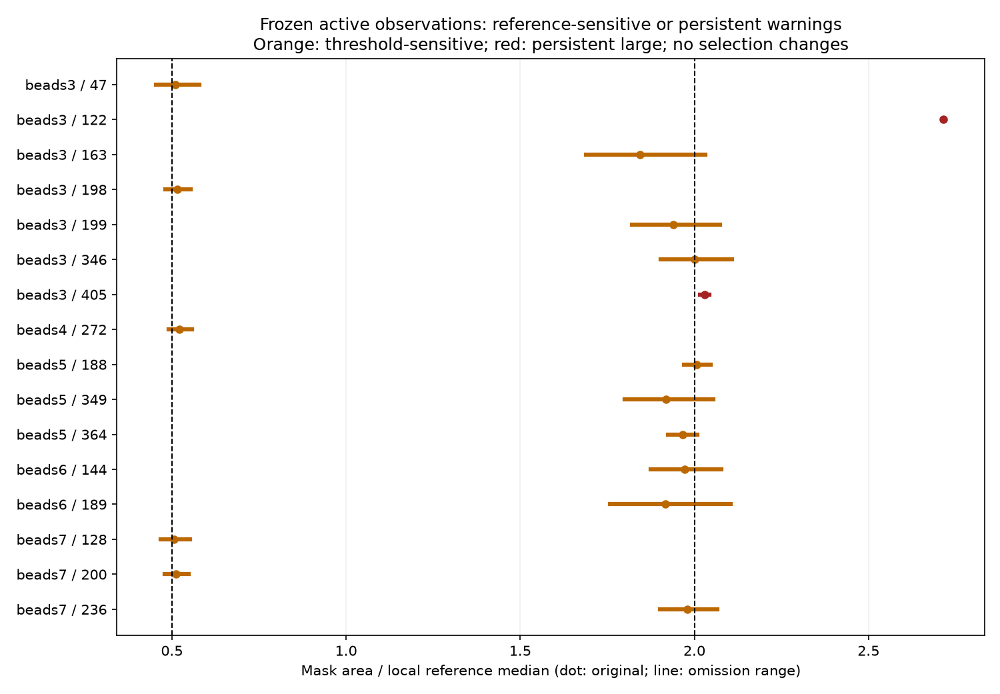
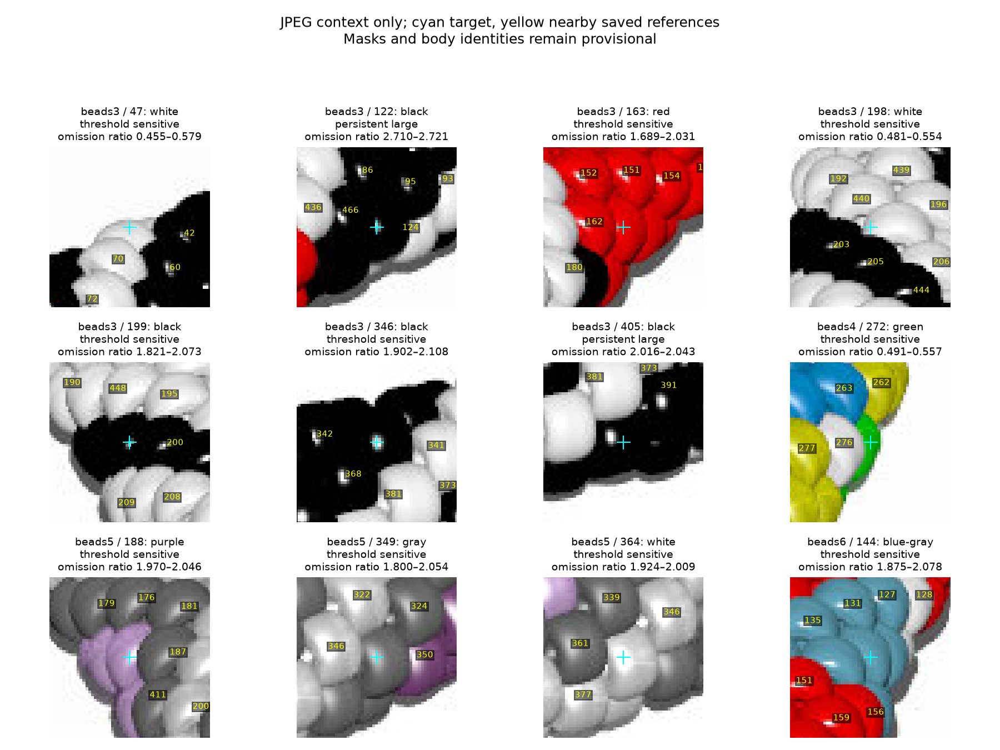
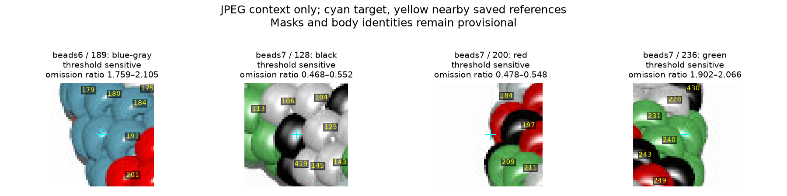

# Seven-image local-area warning stability — R081

**2,242 active observations audited: 14 threshold-sensitive, two persistently
large, and 2,226 ordinary throughout this probe.** All seven active inventories
remain unchanged. Beads3 122/405 remain persistently flagged; beads5 188 remains
unresolved despite its threshold sensitivity. No complete inventory is established.

[Illustrated review](review/r081/review.html) ·
[Queue and trials](review/r081/audit.json) ·
[All active observations](review/r081/all-observations.csv) ·
[Queue CSV](review/r081/review-queue.csv) · [Hashes](review/r081/report.json).



## Frozen-reference method

Read only the committed R069/R070/R071/R076/R077/R078/R079 inventories and their
reports, plus the seven source JPEGs for illustrations. Verify each inventory
and JPEG against its source report. Replay the original selection from all saved
active and excluded records and require exact agreement in active status,
reference IDs, medians, area ratios and warnings. Historical removed markers are
not reintroduced. Beads1's explicit 211 exclusion is scoped to beads1.

For every active observation, omit each saved reference once, recomputing the
median with no replacement or neighbor search. Keep the original target area,
reference areas, 45-pixel neighborhood and maximum eight neighbors frozen.
Require at least four remaining references. Here 2,239 targets have eight original
references and three have seven; all **17,933 omission trials** are sufficient.
308 targets have at least one subsequently area-excluded reference; those
references must remain in this audit to reproduce the original policy.

Small means ratio **<0.5**; large means **>2.0**. Equality is ordinary, as in R069.
Threshold-sensitive means the nominal and omission states are not all the same.
Persistent means the nominal flag survives every omission. Stable ordinary means
no flag in this particular probe. These ranges are not confidence intervals,
probabilities or tests of bead identity. The reference masks are provisional,
not independent or verified single-bead truth. No radius, threshold, segmentation,
edge classification or simultaneous multiple-reference perturbation is tested.

Only active observations are audit targets. Excluded slivers remain excluded;
this step neither reassesses them nor resolves their ownership. Mask/source hashes
freeze the inputs, but masks were not regenerated or edited in this step.

## Image-scoped queue

| Image | Active | Stable ordinary | Sensitive | Persistent large |
| --- | ---: | ---: | ---: | ---: |
| beads1 | 313 | 313 | 0 | 0 |
| beads2 | 318 | 318 | 0 | 0 |
| beads3 | 304 | 297 | 5 | 2 |
| beads4 | 342 | 341 | 1 | 0 |
| beads5 | 328 | 325 | 3 | 0 |
| beads6 | 310 | 308 | 2 | 0 |
| beads7 | 327 | 324 | 3 | 0 |

The queue includes thirteen previously unflagged observations: five cross the
small threshold and eight cross the large threshold. Beads5 188 is the fourteenth
sensitive observation and was already large. Beads3 346's original ratio is exactly
2.0, so it correctly had no original large warning. No crossing automatically
excludes, splits or validates an observation.

| Image / ID | Category | Original ratio | Omission range | Trial states |
| --- | --- | ---: | ---: | --- |
| beads3 / 47 | threshold sensitive | 0.5093 | 0.4548–0.5785 | 4 ordinary, 4 small |
| beads3 / 122 | persistent large | 2.7157 | 2.7103–2.7211 | 8 large |
| beads3 / 163 | threshold sensitive | 1.8445 | 1.6893–2.0311 | 4 ordinary, 4 large |
| beads3 / 198 | threshold sensitive | 0.5147 | 0.4808–0.5538 | 4 small, 4 ordinary |
| beads3 / 199 | threshold sensitive | 1.9388 | 1.8211–2.0727 | 4 ordinary, 4 large |
| beads3 / 346 | threshold sensitive | 2.0000 | 1.9024–2.1081 | 4 large, 4 ordinary |
| beads3 / 405 | persistent large | 2.0296 | 2.0160–2.0434 | 8 large |
| beads4 / 272 | threshold sensitive | 0.5222 | 0.4911–0.5574 | 4 small, 4 ordinary |
| beads5 / 188 | threshold sensitive | 2.0075 | 1.9705–2.0460 | 4 large, 4 ordinary |
| beads5 / 349 | threshold sensitive | 1.9187 | 1.8000–2.0541 | 4 ordinary, 4 large |
| beads5 / 364 | threshold sensitive | 1.9656 | 1.9242–2.0088 | 4 ordinary, 4 large |
| beads6 / 144 | threshold sensitive | 1.9717 | 1.8754–2.0784 | 4 ordinary, 4 large |
| beads6 / 189 | threshold sensitive | 1.9162 | 1.7586–2.1048 | 4 ordinary, 4 large |
| beads7 / 128 | threshold sensitive | 0.5066 | 0.4681–0.5520 | 4 ordinary, 4 small |
| beads7 / 200 | threshold sensitive | 0.5108 | 0.4783–0.5480 | 4 ordinary, 4 small |
| beads7 / 236 | threshold sensitive | 1.9803 | 1.9015–2.0658 | 4 ordinary, 4 large |





Cyan marks the target; yellow labels only saved references inside each crop.
The full reference IDs/areas are in the numerical evidence. These are location
illustrations, not newly reviewed masks or body-count decisions. Persistent area
flags do not settle the [beads3 black-region ambiguity](BLACK_REGION_METHODS.md),
and a vanishing area flag does not settle [beads5 188](BEADS5_188_DIAGNOSTIC.md).
Colors, same-color borders, white/shadow separation, beads7 manual glint repairs,
missing observations and completeness remain provisional. Chain indices stay null.

## Reproduce and verify

No bulk NPY maps, renderer, source pattern, photographs or network are needed.
Use the repository's Python 3.12 environment:

```sh
MPLCONFIGDIR=/tmp/beads-r081-mpl .venv/bin/python photo2/area_warning_stability.py --output photo2/review/r081
MPLCONFIGDIR=/tmp/beads-r081-repeat-mpl .venv/bin/python photo2/area_warning_stability.py --output photo2/output/area-stability-repeat
MPLCONFIGDIR=/tmp/beads-r081-tests-mpl .venv/bin/python -m unittest discover -s photo2 -p test_area_warning_stability.py -v
.venv/bin/python -m unittest discover -s photo2 -p test_inventory_selection.py -v
.venv/bin/python -m py_compile photo2/area_warning_stability.py photo2/test_area_warning_stability.py
```

Five numerical controls cover strict threshold equality, the known beads5 188
crossing, odd-reference medians/persistent flags, insufficient remaining references,
and preserved area-excluded neighbors with stale-selection rejection. Together
with seven existing selection controls, **12 tests pass**; compilation passes.
Twenty-five source hashes and seven curated artifact hashes verify. A second run
reproduces every artifact byte for byte; reports agree except commands. Independent
CSV recomputation reproduces all omission ranges. All 2,242 records and 17,933
trials are accounted for, and HTML local links resolve. All three illustrations
were visually inspected. No browser interaction, mask regeneration or legacy
rendering/indexing suite. No analysis/test failures; fetch required escalation
because FETCH_HEAD was read-only in the sandbox. Repeat outputs remain ignored.

```sh
.venv/bin/python - <<'VERIFY'
import csv, hashlib, json, re, statistics
from pathlib import Path
base = Path('photo2/review/r081')
repeat = Path('photo2/output/area-stability-repeat')
a = json.loads((base/'report.json').read_text())
b = json.loads((repeat/'report.json').read_text())
sha = lambda p: hashlib.sha256(p.read_bytes()).hexdigest()
for path, expected in a['sources'].items():
    assert sha(Path(path)) == expected, path
for path, expected in a['artifacts'].items():
    assert sha(base/path) == expected == sha(repeat/path), path
for report in (a, b):
    report.pop('command')
assert a == b
rows = list(csv.DictReader((base/'all-observations.csv').open()))
assert len(rows) == 2242
trials = 0
for row in rows:
    areas = json.loads(row['reference_areas_px'])
    trials += len(areas)
    ratios = [int(row['region_pixels'])/statistics.median(areas[:i]+areas[i+1:])
              for i in range(len(areas))]
    assert min(ratios) == float(row['omission_ratio_min'])
    assert max(ratios) == float(row['omission_ratio_max'])
assert trials == 17933
for link in re.findall(r'(?:href|src)="([^"]+)"', (base/'review.html').read_text()):
    assert (base/link).is_file(), link
print('Source/repeat hashes, all omission ranges and links verified')
VERIFY
```

## Saved answers and next task

No new maker questions. [R069 answers](BEADS1_QUESTIONS.md) remain applied;
older [photo questions](QUESTIONS_FOR_MAKER.md) remain pending and do not block
this work. The queue is evidence to review, not a request to identify slivers.

Next bounded task: assess beads6 144/189's same-color mask extents with JPEG-visible
boundary profiles and frozen masks. Publish an illustrated resolve-or-retain
assessment for the two newly exposed large-area sensitivities; preserve competing
body-count hypotheses and stop before mask edits, new IDs, sliver ownership,
indexing or photographs. Carry the rest of this queue and prior unresolved masks.
Recommend **gpt-6-astra / High, fresh `/new`**; user controls model/session changes.
