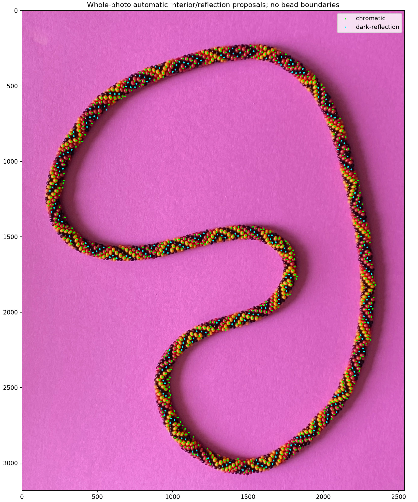
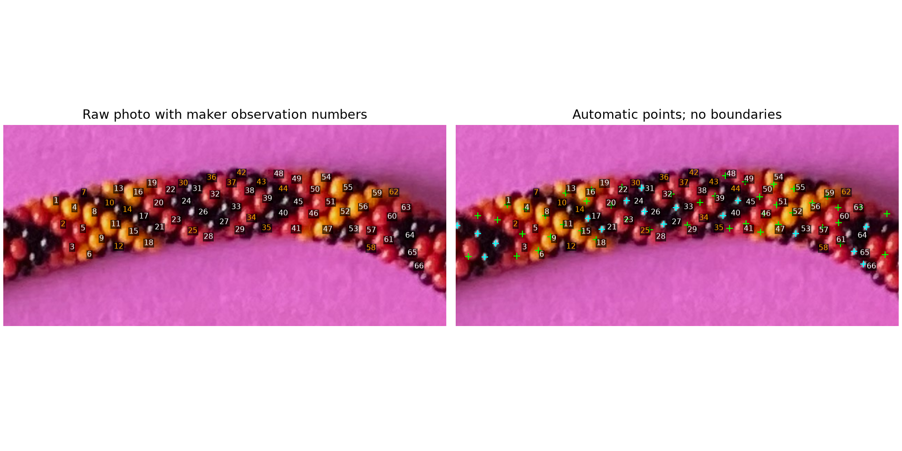
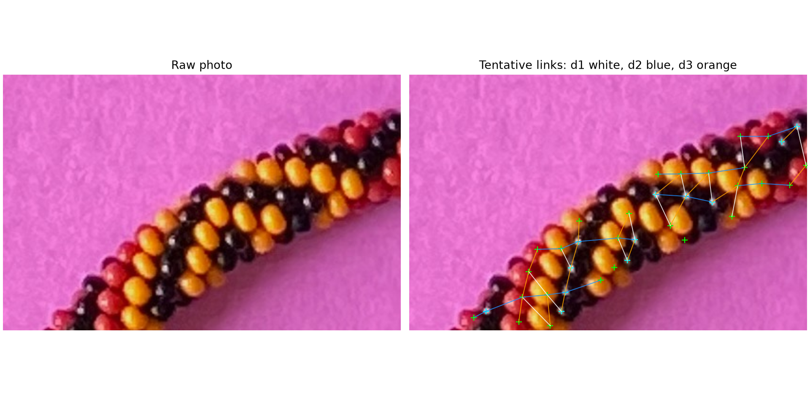
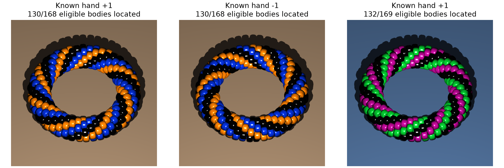

# Automatic whole-photo bead and adjacency proposals — R167

The first implementation produces **908 observation proposals and 1,330
tentative directional links around the photograph**, including 266 reflection/
dark-surround proposals. It runs from the image alone. It is incomplete and does
not establish helicity. Read the [small review question](AUTO_LABEL_REVIEW.md),
the [frozen numerical summary](review/r167/summary.json), and the comparisons below.



## Use the generated labels

The current run is in `photo2/output/r167/automatic/annotations.json`, separate
from the maker's live file. Open it with the existing labeler:

```sh
.venv/bin/python photo2/label_beads.py --full-image --annotations photo2/output/r167/automatic/annotations.json --port 0
```

Stop an existing labeler server before starting another. The automatic numbers
are observation names, not bead_index or the maker's existing numbers. Every
exported direction series contains one proposed pair; `complete` means that
the app's series is finished, not that its bead identities/unit steps are verified.
The labeler now retains automatic origin and uncertainty on subsequent saves;
editing a few marks does not confirm the rest. No browser retry is required.

For a fresh run, choose an unused output directory:

```sh
.venv/bin/python photo2/auto_label_beads.py --output photo2/output/automatic-labeler
```

Optional `--validation photo2/manual-labels-r167.json` evaluates the frozen maker
save only **after detection and adjacency decisions**. It does not seed either.
Existing annotation files are protected. `--replace-proposals` can replace only
a revision-zero generated file whose hash still matches its report. Edited or
maker files are refused; the original live annotation path is explicitly protected.
Keep `report.json` beside the proposals for provenance and detailed uncertainties.

## Method and conventions

Four approaches considered: learned color/reflection regions, blob detection,
image-derived necklace-strip detection, and projected-template neighbor walking.
Choose strip detection with local interior/reflection evidence for this first pass.

1. Resize the EXIF-oriented RGB image to a longest dimension of 1,600 pixels.
   Learn background chromaticity and variability from the perimeter, using the
   supplied substantial-margins prior. The implementation's 2.5% initialization
   width is a chosen parameter, not a maker-supplied width or fixed bead location.
   Darkness also contributes foreground evidence. No magenta definition or saved
   hue boxes are used. Shadows, enclosed paper and gaps are background; the broad
   search band is an approximation, not an accepted paper/bead mask.
2. Smooth the image-derived foreground into a search band, prune skeleton spurs,
   and trace its unique supported closed image route. Fail explicitly if that
   route is not supported; do not manufacture a bead-index closure. Largest
   component selection is declared and discarded component area is recorded.
   The approximate image axis is not a measured physical centerline.
3. Learn circular hue modes and apparent scale from this image. Use hue for
   chromatic appearance and S/V plus an interior-distance peak for conservative
   locations. Merge only close, coherently bright same-mode seeds. These support
   regions are not full bead outlines. This photo gives modes 27° and 353° and
   apparent diameter 27.19 source pixels; these are measured outputs, not runtime
   inputs for another image.
4. Detect small reflections with a narrow-versus-broad value filter. Associate
   reflections with nearby colored interiors only when the image route supports
   that association. Use a dark surrounding region for the remaining proposals;
   retain uncertain color/body extent. Reflection positions are not bead centers,
   boundaries, or measured outward minor-circle anchors. Unreflected dark-patch
   proposals were tried but excluded: they added false links without improving
   the maker-point comparison.
5. Express candidate offsets in clockwise image-strip station and inward-normal
   cross position. Estimate three angle families globally and locally. Use the
   same pair angle model from both endpoints, then require reciprocal nearest
   choices. Preserve close competing choices and unusually long links as
   ambiguities/possible skipped steps. Do not compress missing slots.

The image convention is x right, y down. Clockwise means positive shoelace area
in these coordinates. d1 is the predominantly transverse family; its exported
sign is inward. Positive d2/d3 advance clockwise, with d2 inward and d3 outward.
These are image discussion labels; signed full-string offsets and the 6/7
assignment are unverified. The axis is used for proposals, not camera calibration.
No bead_index, total N, repeating color pattern, or physical necklace measurement
is recovered. Bead size/model in the calibration remains exactly from beads.pov.

## What the photo comparison establishes



Use immutable maker revision 340: 66 points, 33 series, 96 completed links,
SHA `77bbb2c6a445763215e1a7cef24bc9acf22e721c46c698890b447ba410036abe`.
The user has continued saving; do not confuse this snapshot with the current
live file. The previous 40-point audit and wider export remain unchanged.

Allow unmatched points in the one-to-one proximity evaluator. Its original
forced assignment displaced valid local matches to remote necklace sections;
the regression is now covered. At a 20.39-pixel gate, 50/66 maker marks have
nearby automatic proposals. **Proximity does not prove body identity.** Of the
54 maker links whose endpoints are associated, 34 are reproduced in the correct
direction; the other 42 maker links have at least one unassociated endpoint.
Orange maker numbers in the comparison are unmatched, not certified edge beads.
Some marks can be away from the proposed interior/highlight of the same body;
some automatic points can split or merge bodies. Both explanations remain open.



These straight lines indicate proposed neighboring pairs; they are not bead
outlines or sampling routes. Blue is d2, orange d3, white d1. The raw left panel
lets a reviewer see both missed bodies and potentially erroneous associations.
The 297 rejected near-band-edge features are **not a count of excluded beads**.
Band clearance alone does not prove substantial physical exposure.

The full graph still has disconnected components, ambiguous choices and possible
skipped-step links; see the exact counts in the frozen summary. Broad whole-photo
coverage helps find more useful patches, but this graph cannot be treated as a
verified single loop or a helicity witness. Neither a majority of direction
angles nor positive interior ownership alone selects a hand; the earlier wrong-
family synthetic fits demonstrate that limitation.

## Independent known-bead checks



`check_auto_labels.py` executes the original bead macro and original POV-Ray
placement trigonometry independently. N=312, q=6.5, original literal radius and
annular shape, orthographic camera, two hands, and a third fixture with changed
palette/background and displacement. This synthetic N does not assert the photo's
N or contradict the supplied color-repeat restriction. Appearance and two-channel
ID renders are separate; no IDs, palette declaration or source indices enter
`detect()`. ID pixels give exact rendered ownership at proposed points.

| Fixture | Eligible bodies located | Points on paper | Duplicate points | True unsigned neighbors / links |
| --- | ---: | ---: | ---: | ---: |
| Hand +1, blue/amber/black, brown paper | 130/168 | 0 | 4 | 273/281 (97.2%) |
| Hand −1, same appearance | 130/168 | 0 | 4 | 268/274 (97.8%) |
| Hand +1, green/purple/black, blue paper, displaced | 132/169 | 0 | 3 | 276/285 (96.8%) |

Eligibility here means visible ID area ≥ max(20 pixels, 35% of the median
positive visible area). It is a declared diagnostic threshold, not guaranteed
physical exposure. True unsigned neighbors have source-loop difference 1, 6 or
7 modulo N. That score does not certify direction names/signs or transfer to the
photo. Coverage is about 78%, with misses and duplicate points explicitly counted.
Known examples support useful proposals, **not general automatic completeness**.
An initial displaced fixture clipped the substantial-margin prior and failed its
strip cycle; the corrected test expands camera framing to retain margins.

Two full-photo runs, with and without maker evaluation, produce identical
locations, IDs, learned parameters and adjacency decisions. The actual LabelStore
loads all 908 proposals and 1,330 series without a server or GUI. Three regression
tests cover unmatched evaluation, overwrite protection and labeler save provenance;
seven existing LabelStore tests also pass (10 tests total), without sockets/GUI.
Source photo, beads.pov, maker snapshots and earlier geometry fits are unchanged.

```sh
.venv/bin/python photo2/check_auto_labels.py
.venv/bin/python photo2/review_auto_labels.py
.venv/bin/python -m unittest discover -s photo2 -p test_auto_labels.py
```

Routine renders/full reports stay ignored in output/r167; curated comparisons,
parameters, source/script hashes and reproduction code are tracked here.
Detailed POV commands/hashes are in the summary and ignored calibration reports.

**Stopping point:** first whole-photo automatic proposal program, export,
independent checks and illustrated review. R168 confirms the three marks in
Q167.1 lie on distinct beads; no adjacency/helicity confirmation follows.
**Next bounded task:** address missed/merged/split central bodies and
their local directional neighbors before treating any nonlocal cycle as a hand
witness. No physical necklace, hidden-body inventory or full-boundary tracing
is required. Recommend **gpt-6.1-sol / High**, same session; no `/new` needed.
