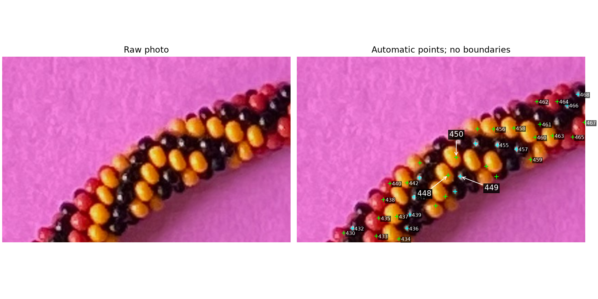

# Automatic bead-label review — R167

Q167.1: In the right-hand panel, are automatic **448 (yellow interior),
449 (black reflection), and 450 (yellow interior)** on three different beads?
These are new observation numbers, unrelated to your original numbering or
bead_index. Only the three indicated bead identities are being asked about;
no bead boundary or helicity is asserted.

Source crop [900,2000,1320,2270], EXIF-oriented original pixels. Green marks are
learned chromatic interiors; cyan marks are reflection/dark-surround proposals.
The left panel is raw, and neither panel contains proposed bead outlines.
Image produced from the frozen 908-point run, not the user's live labels.

**R168 answer:** “Yes, three different beads.” The maker confirms distinct
body identities for these three automatic marks. This does not verify all
automatic marks, adjacency directions/unit steps, complete bead extents, outward
anchors or helicity. Keep this diagnostic confirmation separate from runtime
detector inputs; coordinates/stable IDs are preserved in the frozen summary.
