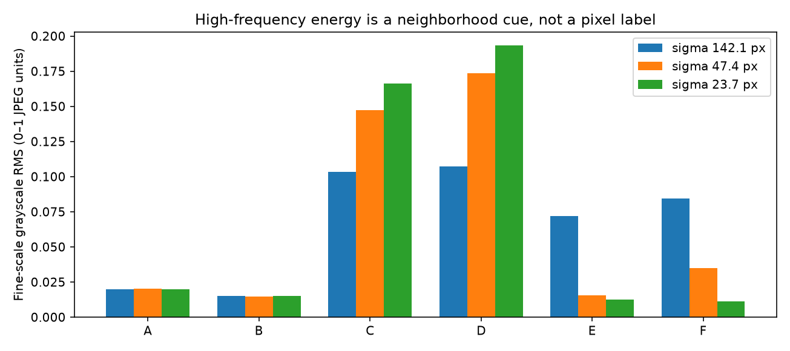

# First aspect: separate paper from necklace

The target is **all visible paper, including cast shadows**, versus visible bead
surfaces. A pixel can remain uncertain near blur or occlusion. The paper's magenta
pigment is a later, adjustable POV-Ray parameter, not a required segmentation color.

R096 notes that shadowed paper and shadowed beads seem to overlap in HSV. This
is a maker observation, not a measured distribution comparison from this step.
Treat HSV as supporting evidence: identical HSV values cannot distinguish the
two surfaces by a pixel-color rule alone. Use texture, spatial context and
reviewable uncertainty; do not spend this phase forcing a perfect HSV cutoff.

R097 clarifies the maker's previous FFT procedure: filter out the strong central
peak and inspect remaining power. The current probe follows that general idea
with a fixed central exclusion after detrending. A better-founded comparison
should show the excluded disk, compare absolute retained power with retained
fraction, and reference the response of known paper patches. It should also
compare removing only DC against excluding a finite central neighborhood, since
those are different operations. The size of the user's old exclusion is unknown.

In this report, `high_frequency_fraction` uses **detrended windowed power** as
its denominator. A fraction of original, undetrended windowed power has not yet
been computed; the next comparison will distinguish those definitions. Absolute
power is brightness-sensitive, while a fraction can amplify weak noise when its
denominator is small. Neither should decide the edge alone. This is the proposed
refinement, not an already validated improvement over the maker's method.

R093 feedback is central: the later correction had indents and bumps that should
not exist. We will review small raw/candidate comparisons frequently. A smooth
rope envelope and its bead-scale scalloped silhouette are different objects;
neither arbitrary jaggedness nor indiscriminate smoothing is acceptable.

## Five methods to consider

| Method | Implementation idea | Benefit | Main failure / review needed |
| --- | --- | --- | --- |
| **1. Local Gaussian-window 2D FFT** | Slide a soft window; remove slow brightness variation; measure directional and frequency-band texture at several scales | No magenta threshold; can later reuse directional information for lattice analysis | Broad windows mix paper and beads; paper has texture; shadows and bead edges also create frequencies |
| **2. Spatial multiscale texture** | Gaussian residuals or differences of Gaussians, gradient energy and local directional consistency | Color-independent baseline, easy to show what structures produce each score | Paper grain and hard shadows can look textured; smooth black bead portions can be missed |
| **3. Learned paper appearance with shading variation** | Learn from a few confirmed lit/shadowed paper patches; combine texture with optional normalized color and a slowly varying brightness model | Adapts to a new background instead of hard-coding magenta | Still uses observed color when enabled; colored reflection, black beads and deep shadow can overlap; retain texture-only ablation |
| **4. Sparse user labels plus region segmentation** | Mark small paper/bead interiors, including shadowed paper; propagate with random walker or graph cut using texture, gradients and optional learned color | Makes the difficult distinctions explicit and easy to correct | Can leak through weak edges or inherit a bad feature; preserve unknown pixels instead of forcing every label |
| **5. Joint inner/outer contour with a smooth rope model** | Fit a planar centerline and slowly varying width to evidence from 1–4; keep silhouette refinement separate | Discourages unsupported large-scale indents and bumps | Can impose an incorrect width or erase real scallops; geometry must not manufacture evidence where the image is ambiguous |

**Next comparison, following R095 agreement:** 1 versus 2, with a small reviewed label set from 4.
Use 5 only after reviewing the local evidence. Keep 3 as an optional baseline
rather than letting a paper hue decide the result. These are proposed methods;
only the small FFT probe below has run. Please add any method you think is missing.

R095 suggests smaller FFT radii for boundary work. Interpret this provisionally
as coarse-to-fine localization: start with the neighborhood, shrink the window
near the transition, and compare several scales. Stop shrinking when there is
too little structure or the scores disagree. Display a band of possible edge
positions, not a jagged contour made by connecting threshold crossings. The
next experiment will show a short, explained sampling route through necklace,
shadow and paper with raw context. It will not assume the current sample centers
are exact bead interiors or that low energy proves background.

## Initial FFT probe: what ran

Photo size: 2540 × 3182 = 8,082,280 pixels.
`r = 0.05 sqrt(N) = 142.146755 px`.
For this provisional implementation **r is the spatial Gaussian sigma**. This is
one interpretation of “radius,” not an assumption that your intended filter is
known. We also probe sigma `r/3 = 47.382252` and `r/6 = 23.691126` pixels.
Multiplying a local patch by a Gaussian window is different from Gaussian-blurring
the image or applying a Gaussian frequency-domain filter. Question 1 asks which
you intend. The broad probe is retained even though the smaller ones separate
these selected examples more clearly.


A/B are visually selected open-paper samples, C/D necklace samples, and E/F
paper beside the necklace with shadow. These are assistant interpretations, not
maker-confirmed labels or a representative test set. The cross marks the exact
center. Each ring marks **one sigma**, not a boundary or the whole window;
the calculation extends to a square at ±ceil(3 sigma). At the broadest scale,
C/D/E cross the image border and use reflected padding; this limitation is
recorded per sample. All smaller windows and broad F avoid that padding.

Use displayed-JPEG grayscale `0.299R + 0.587G + 0.114B`, scaled to 0–1; fit and
subtract a Gaussian-weighted brightness plane; multiply by the Gaussian; take
the 2D FFT. Sum power at radial frequencies ≥1/64 cycles per pixel. Normalize
by FFT size and squared-window weight and take the square root. This gives a
fine-scale grayscale RMS, not a probability. The 64-pixel wavelength cutoff is
an exploratory fixed setting, not an inferred bead spacing. No hue predicate,
source pattern, old spline or boundary mask enters the computation.


Each raw crop is centered on its sample and shows a 310-pixel-wide neighborhood.
The spectra use the smallest sigma, common display scaling and local image axes.
The paper has visible texture, so a nonzero FFT response does not imply a bead.

| Sample | Sigma 142.1 RMS | Sigma 47.4 RMS | Sigma 23.7 RMS |
| --- | ---: | ---: | ---: |
| A, inside-loop paper | 0.01965 | 0.02014 | 0.01982 |
| B, outside-loop paper | 0.01494 | 0.01483 | 0.01513 |
| C, upper necklace | 0.10341 | 0.14737 | 0.16629 |
| D, right necklace | 0.10713 | 0.17355 | 0.19331 |
| E, paper beside D | 0.07175 | 0.01537 | 0.01259 |
| F, paper at inner bend | 0.08437 | 0.03489 | 0.01099 |



**Lesson:** the broad window at E/F picks up nearby necklace structure even
though its center appears to be on paper. At sigma 23.7 these two values fall
below 0.013, while C/D exceed 0.16. A/B change little. This is promising local
evidence, not a validated threshold, proof of pure windows, or whole-image mask.
Gaussian tails, paper texture, dark smooth beads, image processing and blur still
need controls. No outline was generated or adopted in this step.

For later 1/6/7 spacing and helicity work, retain the full directional spectrum
and an explicit centerline tangent/normal coordinate convention. A radial energy
sum discards direction. Test spectra from known opposite-helicity POV-Ray examples
at multiple section angles before interpreting the photo. The maker's claim
that this can work everywhere along the centerline is a proposed capability to
evaluate; this experiment neither proves nor disproves it.

## Reproduction and checks

```bash
.venv/bin/python photo2/background_probe.py --output photo2/output/r092
```

Python 3.12; [dependency versions](requirements.txt),
[source and illustration hashes, coordinates and metrics](review/r092/report.json).
Curated review PNGs are tracked; routine reruns belong under ignored output/.

The script checks constant/linear brightness removal, sinusoid RMS, spectral
energy normalization and separation of 16-pixel versus 128-pixel synthetic waves.
The first check required a 20× RMS separation and failed: measured separation
was 8.53× because finite Gaussian windows spread frequency peaks across the
cutoff. The corrected check requires 5× separation and checks that the fast
wave has >99% and the slow wave <5% high-band power. This deliberately relaxed
control is recorded, not hidden; it is not evidence of photo classification
accuracy. All five reported controls pass. A repeat run reproduces all artifacts
byte-for-byte in this environment. Three illustrations were visually inspected.

POV-Ray is installed; no render or beads.pov modification is appropriate yet.
The photo's EXIF LensModel records **iPhone 11 Pro back triple camera 4.25mm f/1.8**;
this supports the user's iPhone expectation but does not identify scene lighting.
Source hash is in the report. Lighting research and fitting remain a later phase.

**[Two short questions for this step](QUESTIONS.md).**
