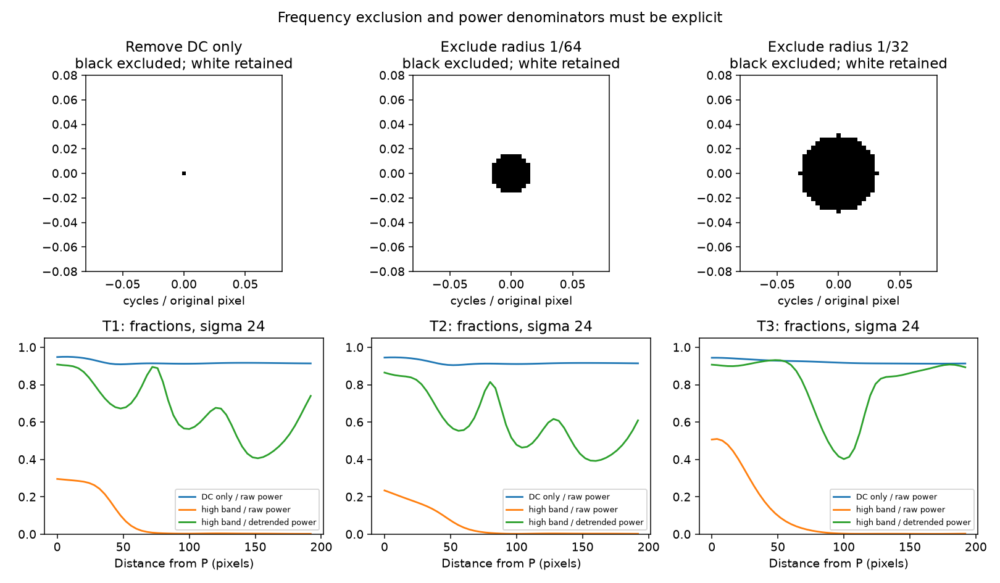

# Smaller windows at three paper/necklace transitions — R099

**Smaller windows narrow the texture transition, but do not yet locate a reliable
bead edge.** FFT and spatial texture both respond to nearby beads. Their threshold
crossings move by tens of pixels as window size and threshold change. The smallest
window can mistake a dark bead region for low-texture paper.

The maker's questions remain optional. This step continues the agreed background
comparison, retaining Gaussian sigma as an explicit provisional convention. No
whole-image mask, contour, centerline, material, lighting or helicity fit was made.

## Read the pictures first


Each row shows **raw pixels**, then a **sampling route**, then a **cyan box spanning
the competing score crossings**. The box is not a proposed bead shape, calibrated
confidence interval, or proof that the true edge lies inside it. Its thickness
across the route is only a display choice. Shadows on paper remain background.

P starts in the necklace region and Q ends on paper. These placements and the
paper-control labels are assistant visual interpretations, not maker-confirmed
ground truth. Travel is horizontal rightward for T1/T2 and vertically downward
for T3, without assuming a recovered centerline or exact geometric normal.

| Path | P → Q, original pixel coordinates | Reason / limitation |
| --- | --- | --- |
| T1 | (2200,1170) → (2392,1170) | Yellow face through a dark outer shadow, then lighter paper |
| T2 | (1780,1702) → (1972,1702) | Yellow face at inner bend through a shadow; crosses other bead structure on the way out |
| T3 | (1410,275) → (1410,467) | Dark bead region near a glint, toward paper below; exact P interior status provisional |

An initial preview placed T1 P=(2180,1170) and T2 P=(1760,1690) near internal
seams. Those starts were rejected before measurement and moved onto visible
yellow faces. Their coordinates/reason are preserved in the report; they were
not silently used as interior labels. T3 remains deliberately provisional.

Full travel explanations keep endpoint-only panels separate from routes, and
show pixel color strips with the same distance axis as the measurements:
[T1](review/r099/T1.png), [T2](review/r099/T2.png), [T3](review/r099/T3.png).
Color strips illustrate the pixels; the algorithms use grayscale, not HSV rules.

## What changed with scale

Four Gaussian sigmas: **48, 24, 12 and 6 pixels**. These are rounded follow-up
scales, not exact repeats of the previous 47.38/23.69 values. The old 142-pixel
probe remains preserved. Every new FFT uses the same 289×289 pixel square and
frequency grid; smaller sigmas change the weights, not the FFT grid. All squares
fit in the photo without padding. Sample centers are four pixels apart.

The table uses a threshold of **twice the largest paper-control RMS**, separately
for each scale and method. Values are distance from P to the last above-threshold
sample's transition to below-threshold samples, reported at the four-pixel
interval midpoint. This is a diagnostic crossing, not subpixel edge precision.

| Path | FFT sigma 48 | FFT 24 | FFT 12 | FFT 6 | Spatial 24 | Spatial 6 |
| --- | ---: | ---: | ---: | ---: | ---: | ---: |
| T1 | 86 | 54 | 42 | 26 | 46 | 26 |
| T2 | 86 | 58 | 46 | 30 | 42 | 26 |
| T3 | 106 | 82 | 70 | 62 | 70 | 58 |

Large windows carry bead texture farther onto paper. Smaller windows reduce that
mixing but also lose the surrounding bead structure. In T3, sigma-6 spatial
texture falls below a 3× reference threshold **at P itself**; that setting has no
valid bead-to-paper crossing. Its profile also dips and rises again along the
path, illustrating why the first threshold crossing is unsafe.

Across sigmas 24/12/6, three score variants and thresholds 1.5×/2×/3×, crossing
spreads are **T1: 18–62 px; T2: 2–62 px; T3: 54–90 px**. T3 has one unresolved
setting out of 27; T1/T2 have 27 returned crossings each. Excluding sigma 48 from
these boxes focuses the display on smaller windows; all 108 combinations,
including sigma 48, remain in the report. Agreement is not established accuracy.

## A Gaussian-window trap, and a useful correction

Multiplying even a constant patch by a Gaussian produces a broad central FFT
peak. Removing only the center bin leaves much of that peak. Shrinking the window
broadens it further: on a perfectly flat gray patch (value 0.5), the raw fraction
remaining after removing just DC rises from **65.7% at sigma 48 to 99.5% at sigma 6**
on this fixed grid. These percentages depend on the grid/window convention.

Even excluding a fixed frequency disk can leave the window's own spectrum:
outside radius 1/64 cycles/pixel, constant-patch raw RMS is **0.0234 at sigma 24**
and **0.4147 at sigma 6**. It is not image texture. Subtracting a fitted brightness
plane before windowing reduces this control response below 1e-15 at all scales.
This supports detrending as a correction for that artifact; it does not prove
better photo-boundary accuracy. The maker removed a central *peak*, whose exact
extent is unknown, so DC-only removal is a control, not a claimed reproduction
of the maker's method.



The blue raw DC-only fraction stays high on necklace and paper. The green fraction
uses detrended power in both numerator and denominator and can stay high on paper
because the small remaining signal is largely fine-scale texture. The orange
fraction uses undetrended high-band power divided by undetrended total power;
at sigma 24 it separates these examples better, but the constant-patch failure
at smaller windows shows why that appearance alone cannot select a method.

## Exact computation and limitations

- Displayed JPEG grayscale is `0.299R + 0.587G + 0.114B`, scaled to 0–1.
- For FFT, compare raw and Gaussian-weighted least-squares-plane-subtracted
  patches. Multiply by the Gaussian; retain either all frequencies except DC,
  radial frequencies ≥1/64, or radial frequencies ≥1/32 cycles/original pixel.
  There is no high-frequency cutoff in this background experiment. R098's
  direction band-pass is a separate future task.
- Power normalization is `sum(|FFT|²)/(pixel_count * sum(window²))`; RMS is its
  square root. Each fraction divides retained power by total power from the
  same raw or detrended spectrum. Absolute power/RMS remains brightness-sensitive.
- Spatial texture is the full grayscale image minus its sigma-4 Gaussian blur,
  then RMS averaged with the same squared window. It is an independent spatial
  computation, but probes related frequency content, not independent physical evidence.
- References are maxima over 18 **overlapping** windows at two old clear-paper
  locations, nine centers spaced 24 pixels apart at each. They are not 18 independent
  validation samples, and do not represent all paper or shadow appearances.
  Threshold multiples are exploratory, not probabilities or fitted confidence levels.

The fixed cutoffs and thresholds were specified before measuring these paths.
Only endpoint placement changed after raw visual inspection. No setting was
adopted for full segmentation. Controls pass for plane removal, amplitude scaling,
fraction scaling invariance, Parseval normalization, known crossing and unresolved
endpoints. No analytic-test failures occurred. Initial endpoint failures are above.

## Reproduce

```bash
.venv/bin/python photo2/background_transitions.py --output photo2/output/r099
```

[Script](background_transitions.py) · [parameters, controls, crossings and hashes](review/r099/report.json).
The command produces all figures, report and 660-row samples.csv: 588 path/scale
measurements and 72 paper/scale measurements. Full metrics remain in the local
output CSV; curated question figures and report are tracked. Python 3.12.14,
dependencies from [requirements.txt](requirements.txt). Repeat artifacts are
byte-identical in this environment; source/helper/artifact hashes verified.

**Next:** use the [two illustrated questions](TRANSITION_QUESTIONS.md) to review
the crossing locations. Then assess a few nearby parallel paths and additional
paper controls, retaining failed dark-bead settings. Stop before connecting
crossings into a global contour. Small windows alone are not yet a boundary rule.
