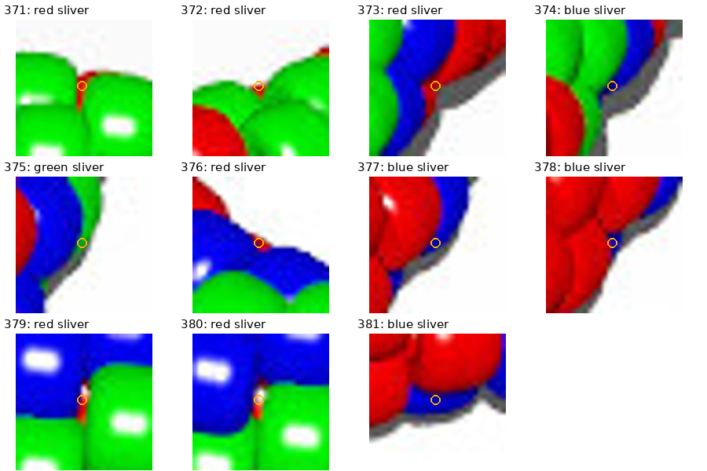
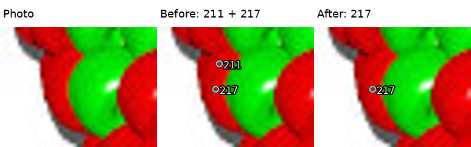

# beads1.jpg: two image-review questions — R068

The [review page](review/r068/review.html) has the full image, IDs and magnified
crops. Cyan marks 323 supported body observations; orange marks 37 fragments whose
independent bead identities remain unresolved. Their sum is not a bead count.
No additional construction-pattern information is needed, and these questions
do not block reviewing the next generated image. Answers can refer to IDs.

1. **Mostly hidden beads:** In the sheet below, can you tell whether red fragment
   **371** (between two green bodies) and blue fragment **381** (below a red body)
   belong to separate mostly hidden beads, or to bodies already visible nearby?
   Any similar fragment you recognize would help establish how to treat these.
   The [whole-image map](review/r068/overview.png) gives their wider context.

   

2. **Duplicate marker:** I treated **211 and 217** as two highlights/markers on
   the same red bead and retained 217. Does the raw crop support that, or do you
   see a real boundary separating two beads? The three panels show the photo,
   original markers and revised interpretation.

   

The earlier [photo-2 shadow questions](QUESTIONS_FOR_MAKER.md) remain saved;
no answers have been received for either set. Future answers will be recorded
in the handoff rather than requiring you to repeat them.
