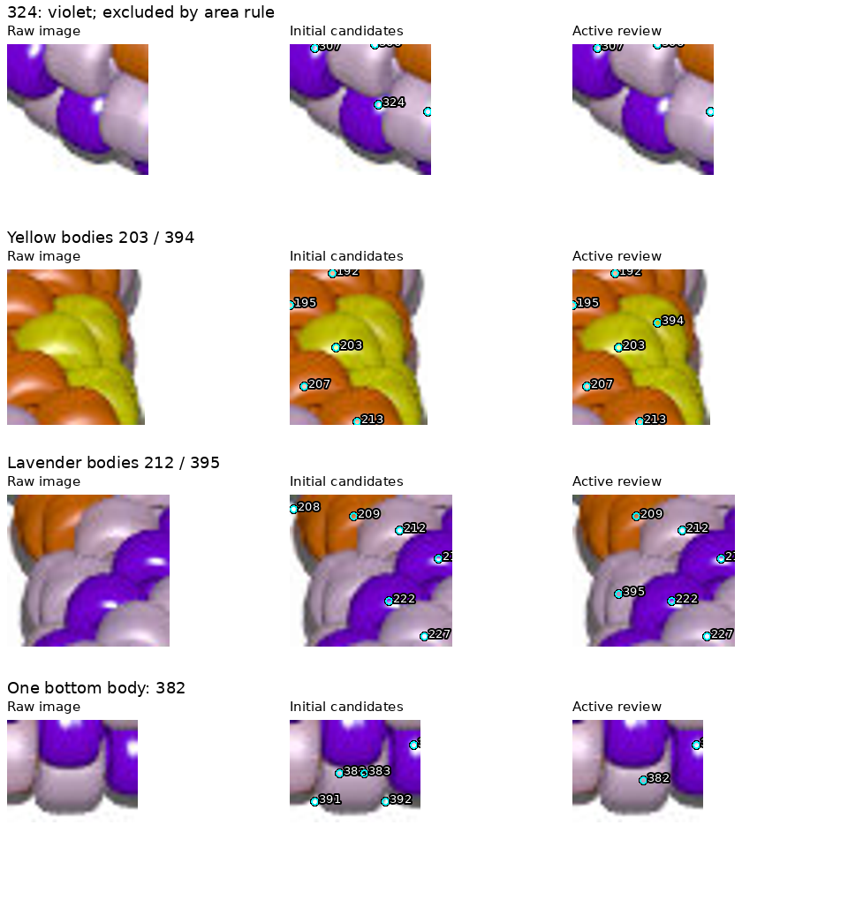

# beads2.jpg: active visible inventory — R070

The reviewed map contains **318 active body observations**: 111 orange,
124 lavender, 45 violet and 38 yellow. Slivers are ignored under R069.
This is an image-only observation map, not a verified total bead count or
recovered pattern. No POV-Ray pattern definitions or render truth were consulted.

[Interactive map](review/r070/review.html) ·
[Whole-image overview](review/r070/active-overview.png) ·
[Correction close-ups](review/r070/corrections.png) ·
[Region boundaries](review/r070/regions.png) ·
[Observation records](review/r070/inventory.json) · [Report](review/r070/report.json).



## Review and corrections

The original brightness detector found 392 candidates. Review of the whole image
and eight overlapping numbered crops removed 55 unsupported boundary/background
markers and one duplicate (383). Seven known edge fragments remain recorded but
ignored, without ownership assignments. Local area excludes another 13 body
candidates, leaving 318 active after two added bodies:
`392 - 56 + 2 - 7 - 13 = 318`.

- Large-area warnings led to two additions: yellow body 394 next to 203 and
  lavender body 395 below 212. Both have substantial visible areas and image
  boundaries separating them from their neighbors. Their exact borders remain
  provisional. Both warnings clear after the additions.
- Bottom lavender markers 382 and 383 represent one reviewed body. Move 382
  into that body and remove 383. Its area passes the local check.
- Marker 324 was wrongly called lavender because of its highlight. Correct it
  to violet and move it into the colored body. Its 187-pixel region is only
  0.472 of the local median, so the unchanged area rule excludes it. This
  illustrates that the heuristic intentionally omits some real partial bodies.
- The exclusion of 211 is specific to beads1. Beads2's independent marker 211
  is a supported violet observation and remains active.

An intermediate draft incorrectly treated the body near 324 as an additional
observation, giving 319 active observations. Reviewing the original marker
resolved this; the final count is 318. ID 393 is unused, not a missing chain index.
All IDs are observation references; actual bead-chain indices remain unknown.
The saved edits are in [beads2-review-r070.json](beads2-review-r070.json).

## Method

Reuse R059 brightness peaks, but adapt the region support to this JPEG's palette.
Beads1's dominant-RGB-channel mask would omit pale lavender. Here core pixels
require RGB chroma at least 12 and maximum channel at least 35, plus an HSV hue
in `(0.025, 0.23)` for warm colors or `(0.63, 0.94)` for purple colors. Warm hue
at least 0.105 is called yellow; otherwise orange. Purple saturation over 0.45
is called violet; otherwise lavender. These are assistant-chosen image labels,
not recovered pigment values. Neutral background/shadow is excluded.

Fill enclosed highlight holes up to 64 pixels, assigning the nearest core color;
retain the large central opening. Seed a separate compact watershed for each
palette class from the reviewed markers. Use smoothed brightness, compactness
0.002, seed snapping up to 6 pixels (actual active maximum 2), and assignment
limited to 28 pixels from a same-color seed. Same-color outlines and bright
transitions between violet and lavender remain approximate.

Apply the unchanged R069 local-area selection: up to eight original reviewed
body candidates within 45 pixels, minimum four; exclude below half their median
area; flag above twice it. All active observations have eight references, with
no remaining warnings. The same image dimensions and similar bead scale justify
retaining these pixel parameters for this step, without claiming general validity.
The 13 area-excluded body IDs are 42, 72, 194, 210, 230, 251, 262, 291, 297,
304, 324, 330 and 385; 11 are near an edge under the R069 distance rule.

The color support contains 106,675 pixels. Before selection, 3,111 remain
unassigned, in 88 components of at least six pixels plus smaller residuals.
The largest residual is 203 pixels on a narrow orange edge region; it is left
unassigned under the sliver policy. The largest 24 initial unassigned regions
were viewed in raw magnified crops; they also revealed the misclassified 324.
Do not promote every colored residual to another bead. Filtering ignores a
further 2,583 assigned pixels, leaving 100,981 active pixels, without growing
neighbors into excluded regions. All support falls within the reviewed crops;
this coverage does not prove complete body detection or correct color labels.

## Checks and reproduction

```bash
.venv/bin/python photo2/beads2_inventory.py --output photo2/output/beads2-final --review-bundle photo2/review/r070
.venv/bin/python -m unittest discover -s photo2 -p test_beads2_inventory.py -v
.venv/bin/python -m unittest discover -s photo2 -p test_inventory_selection.py -v
```

Four new palette/segmentation/image-scope controls and seven selection controls
pass (11 tests), as does compilation. Two runs reproduce 13 curated artifacts
(11 PNGs, HTML and inventory JSON) and three bulk NPY maps byte for byte; reports
match except command paths. Seven source hashes verify. All active regions are
nonempty, connected, palette-pure, and preserve their seeds. IDs are unique;
removed/excluded IDs are absent from active labels; retained pixels do not move
or grow; indices stay null. Visual review included all eight numbered crops,
raw close-ups, overview and region boundaries. No test or execution failures.
No renderer, indexing, other-image changes or full legacy regression was run.
Bulk maps and scratch/repeat outputs remain ignored; curated review is committed.

## Questions and next step

No new maker questions for beads2. The [beads1 answers](BEADS1_QUESTIONS.md)
continue to govern slivers; earlier [photo-shadow questions](QUESTIONS_FOR_MAKER.md)
remain saved and do not block generated-image work. Bright point-source lighting
remains the maker's hypothesis, not a result measured here.

Next: review beads3.jpg from its JPEG alone, adapting support for its red, black
and white appearance; distinguish neutral beads from neutral shadows. Apply R069
without silently discarding dark or pale bodies. Stop at its reviewable active
map and checks before indexing or pattern inference. Recommended model:
gpt-6-astra / High; stay in this conversation, no `/new` needed.
