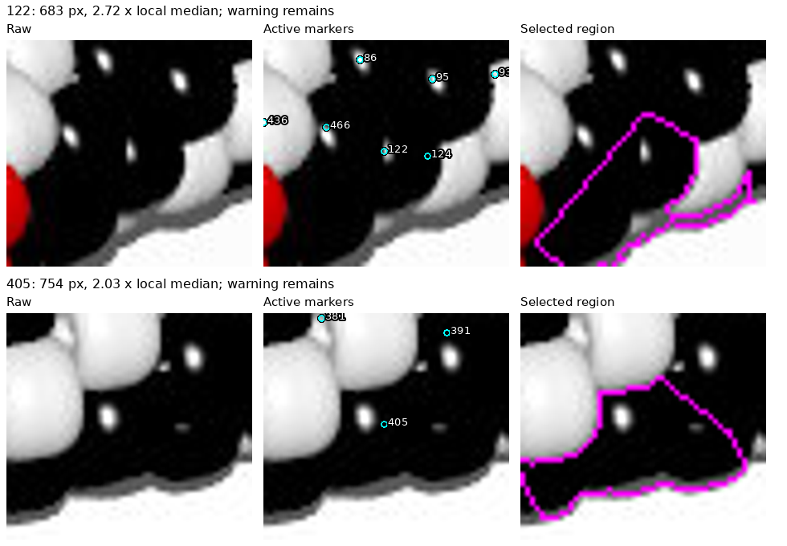

# beads3.jpg: neutral-body review — R071/R072

R073/R074 follow-up: [neighborhood geometry and HSV measurements](BLACK_REGION_METHODS.md)
examine 122/405 without changing this inventory. Local center/outline calibration
is now the next task before further inventory or index changes.

The current image-only map has **304 selected observations**: 120 white,
117 black and 67 red. **Regions 122 and 405 remain unusually large and uncertain.**
This is a reviewed provisional map, not a verified complete inventory or pattern.
No POV-Ray pattern definitions, layouts or renderer truth were consulted.

[Interactive review](review/r071/review.html) ·
[Full map](review/r071/active-overview.png) ·
[Black-region close-ups](review/r071/black-regions.png) ·
[Locations](review/r071/black-region-locations.png) ·
[Observation records](review/r071/inventory.json) · [Report](review/r071/report.json).



## What the black-region images show

R072 requested pictures of the remaining black regions. Each close-up row shows
raw pixels, active observation IDs, and the current region outlined in magenta.
The [location image](review/r071/black-region-locations.png) gives whole-bracelet
context. These outlines are algorithmic assignments, not confirmed bead edges.

- **122:** 683 assigned pixels, 2.72 times its local median. The region extends
  down the dark edge and includes an uncertain strip below the neighboring white
  bead. Another black body, 466, was added after reviewing the left-hand glint;
  the remaining region is still too uncertain for an exact outline/count claim.
- **405:** 754 pixels, 2.03 times its local median. The bright highlight and faint
  neighboring highlight do not establish a reliable separating boundary. Dark
  body and edge/shadow pixels can inflate this region. It remains one recorded
  observation with a possible-merge warning, not a claim of one physical bead.

Earlier warnings at 36 and 176 cleared after adding image-supported black bodies
465 and 467. The [four-region comparison](review/r071/warnings.png) retains the
context. We did not assign identities to slivers or turn every highlight into
another bead. No new maker question is required; the pictures are saved for review.

## Method and corrections

The R059 baseline supplied 435 brightness markers. Full-image, eight-crop and
coordinate-grid review removes 152 markers: 109 unsupported boundary/background
markers and 43 duplicate peaks. It adds 32 substantial visible-body observations,
IDs 436–467, and revises marker locations/colors where the raw image supports it.
Eleven small observations fail the unchanged R069 local-area rule:
`435 - 152 + 32 - 11 = 304`. All original removal records are preserved in
[beads3-review-r071.json](beads3-review-r071.json), with duplicate references
resolved to retained records. These are image-specific IDs, not chain indices.

Neutral beads require a different foreground method from beads1/2. The initial
guessed manual outline cut through bodies and was rejected. The final search
envelope starts from R059's largest dark-channel annulus, closes gaps with a
10-pixel disk and fills enclosed holes up to 1,500 pixels. This restores bright
white surfaces that the original threshold omitted while preserving the central
opening. The [cyan envelope](review/r071/envelope.png) was visually reviewed.
It still includes uncertain shadow strips and is not a verified boundary spline.

Within that envelope, red requires red-channel dominance over the other channels
by more than 40 and red at least 45. Remaining pixels below maximum RGB 95 are
black; remaining pixels are white. Enclosed bright holes up to 64 pixels within
black support are treated as highlights. Colors at markers use this support,
the baseline's red indication, and explicit visual corrections. Merely excluding
bright samples, as R059 did, often mislabeled white bodies as black. A local
brightness median also confused strong black-bead glints with white; it was not
adopted. White/red highlight transitions remain approximate.

Segment each palette class separately. Red and white use smoothed brightness
and compact watershed with weight 0.03; the older 0.002 weight let bright white
regions absorb dimmer adjacent bodies. Black uses a flat surface with the same
geometric compactness: glints do not provide trustworthy body boundaries. Black
seeds move at most four pixels toward nearby interior support. Other seeds can
snap at most six pixels to their palette; actual maximum across active seeds is
four. Assignment is limited to 28 pixels from a same-color seed.

A check found disconnected islands in five provisional regions after distance
clipping. The final pipeline retains only each seed-connected component and
leaves 97 detached pixels unassigned. This prevents disconnected shadow/highlight
patches from being counted in a body's area. It does not recover physical borders.

R069 selection compares area with up to eight original reviewed bodies within
45 pixels, requiring at least four. Every active record has seven or eight
references. Below half the local median is excluded; above twice it is warned,
not silently removed. The excluded IDs are 8, 146, 245, 324, 330, 334, 354, 373,
393, 424 and 426; eight are near the envelope edge. These are heuristic choices
on approximate masks. No fragment ownership is inferred, and retained regions
do not grow when exclusions are applied. The two large-area warnings stay active.

The envelope contains 114,882 pixels. Before selection, 5,342 are unassigned,
including 93 components of at least six pixels and smaller residuals. Reviewing
the 18 largest intermediate residual crops found a substantial black body near
179,94; other large residuals include neutral shadow strips. Selection ignores
another 1,482 assigned pixels, leaving 108,058 active pixels. All support lies in
the eight reviewed crops; coverage does not establish completeness or correctness.

## Reproduce and check

```bash
.venv/bin/python photo2/beads3_inventory.py --output photo2/output/beads3-final --review-bundle photo2/review/r071
.venv/bin/python -m unittest discover -s photo2 -p test_beads3_inventory.py -v
.venv/bin/python -m unittest discover -s photo2 -p test_inventory_selection.py -v
```

Five new neutral-body/connectivity controls and seven selection controls pass
(12 tests); compilation passes. Two runs reproduce 17 curated artifacts
(15 PNGs, HTML and inventory JSON) and four NPY maps byte for byte; reports agree
except command paths. Seven source hashes verify. Final active regions are
nonempty, connected, palette-pure and seed-preserving; IDs are unique, excluded
IDs absent, and filtering leaves retained pixel assignments unchanged. All bead
indices remain null. These checks validate bookkeeping, not exact bead boundaries.
No test/execution failures. Rejected exploratory approaches are described above.
No render, indexing, other-image changes or full legacy regression was run.
Routine maps and exploratory/repeat outputs stay ignored; review images are committed.

## Handoff and next step

No open generated-image questions require an answer. Earlier
[photo-shadow questions](QUESTIONS_FOR_MAKER.md) remain saved. The maker's bright
point-source lighting explanation remains a hypothesis, not a measured cause.

The handoff now starts with a progress table. Its procedure explicitly carries
image-specific exclusions, provisional counts, palette limitations and remaining
warnings forward; it requires checking colors/masks before applying area filters.
The generated-images-first priority is now explicit in AGENTS.md.

Next bounded task: review beads4.jpg from the JPEG alone, adapting to its palette
(including white), applying R069, and stopping after its active map and checks.
Carry beads3 warnings 122/405 forward; no source-pattern lookup or indexing.
Recommend gpt-6-astra / High and a fresh `/new` with the updated handoff.
