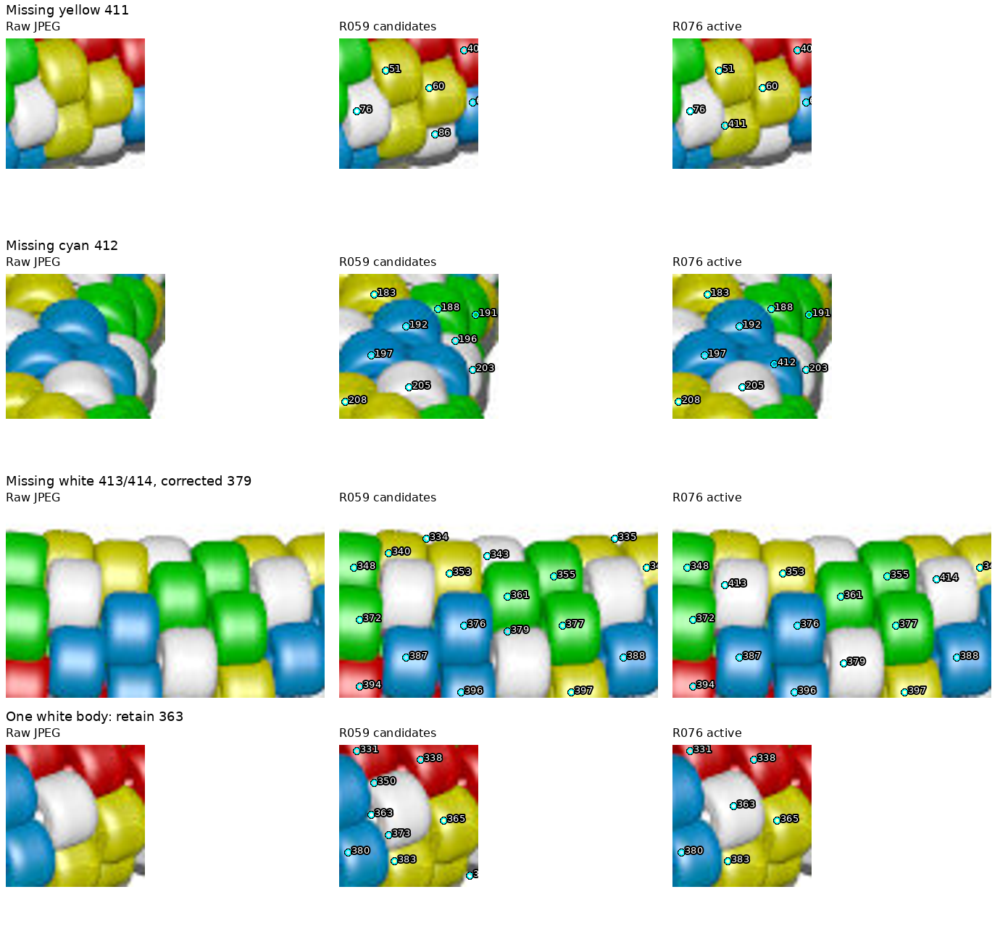
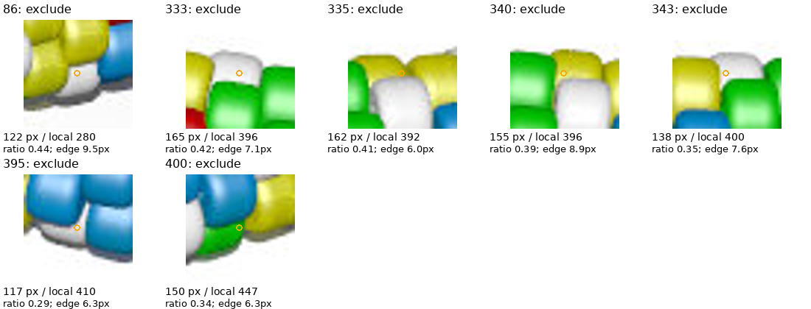

# beads4.jpg: five-color inventory — R076

**342 provisional active observations:** 49 red, 70 yellow, 72 green,
78 cyan and 73 white. Cyan retains the R059 name for the blue-looking beads.
No complete inventory, physical centers, chain indices or pattern is established.

[Review page](review/r076/review.html) · [Active map](review/r076/active-overview.png) ·
[Records](review/r076/inventory.json) · [Parameters, checks and hashes](review/r076/report.json)



## Review and changes

Only beads4.jpg and the image-derived R059 detector were used. No POV source,
pattern, renderer truth or other image's observation IDs were consulted. Review
covered the full JPEG, eight baseline and revised numbered crops, coordinate
close-ups, palette/envelope/region maps, and the 24 largest intermediate residual
crops. The curated crops cover all support pixels; this is not completeness proof.

Starting from 410 candidates, remove 68 records, add seven visible bodies
(411–417), and exclude seven small regions: **410 − 68 + 7 − 7 = 342**.
The removals preserve 64 unsupported boundary peaks/tiny fragments and four
white-body duplicates in [the edits file](beads4-review-r076.json). They are
review decisions, not ground-truth identities. No fragment ownership was sought.

The additions are yellow 411/417, cyan 412/416 and white 413–415. Adding 411 and
412 clears the initial large-region warnings on 60 and 192. Color corrections
recover white 14, 379 and 382 and yellow 357. Markers 350/373 duplicate white
363; 385 duplicates white 382. Final area-sheet review found marker 196 was a
white-body boundary duplicate of 203, mislabeled green by the baseline; it is
removed as a duplicate, not used as evidence of a sliver. Markers were moved
onto visible bodies where needed; these positions are not calibrated centers.

No large-area or sparse-reference warnings remain on beads4. Same-color
watershed borders, white/shadow separation and completeness remain unresolved.
Beads3's separate warnings 122/405 remain unchanged.

## Masks and selection

The envelope closes R059 foreground gaps with a 10-pixel disk and fills enclosed
holes up to 1,500 pixels, preserving the main opening. This retains white bodies;
the envelope itself can include shadows. Within it, chroma ≥20 and saturation
≥0.16 define chromatic support. Hue divisions are .08/.22/.47, with red also
above .94. Remaining pixels with maximum RGB ≥95 provide provisional white
support. Dark neutral shadows are omitted. Enclosed white holes of at most 64
pixels inside a chromatic class are treated as glints. These palette-specific
choices were visually reviewed, not validated against renderer labels.

Each class uses Gaussian-smoothed brightness (sigma 1) and compact watershed
(weight .03), with seed snap ≤6 pixels and assignment radius 28 pixels. Retain
only the seed-connected component; 22 detached pixels remain unassigned.
Color boundaries and same-color seams are approximate. Some shadows above the
white cutoff and color fringe pixels can survive; no exact outline claim follows.

R069 selection remains unchanged: up to eight original reviewed neighbors within
45 pixels, at least four required; exclude below half the local median area,
warn above twice it. Active rows have at least seven references. Beads1's 211
exclusion does not apply here; beads4 211 stays active. The seven excluded IDs
are **86, 333, 335, 340, 343, 395, 400**; six meet the support-edge criterion. Their pixels
stay unassigned after selection; active regions do not expand into them.



Support has 116,962 pixels: 6,116 initially unassigned, 1,009 ignored by selection,
and 109,837 active. There are 120 original unassigned components of at least six
pixels; these are residual pixel regions, not bead identities or missing counts.
Small ignored portions and missing chain positions remain unresolved.

## Reproduction and checks

Use local Python 3.12 and the dependencies in requirements.txt:

```sh
.venv/bin/python photo2/beads4_inventory.py --output photo2/output/beads4-final --review-bundle photo2/review/r076
.venv/bin/python photo2/beads4_inventory.py --output photo2/output/beads4-repeat --review-bundle photo2/output/beads4-review-repeat
.venv/bin/python -m unittest discover -s photo2 -p test_beads4_inventory.py -v
.venv/bin/python -m unittest discover -s photo2 -p test_inventory_selection.py -v
.venv/bin/python -m py_compile photo2/beads4_inventory.py photo2/test_beads4_inventory.py
```

Four new controls cover five-color classification, white versus enclosed glints,
dark-shadow rejection, envelope repair, adjacent white bodies and disconnected
support. Together with seven existing selection controls, **11 tests pass**.
Compilation passes. The pipeline checks unique IDs, removed IDs absent,
nonempty connected palette-pure active regions, seed preservation, area agreement,
no pixel reassignment during filtering and null chain indices. Actual maximum
seed snap is 1.414 pixels. These checks validate bookkeeping, not bead truth.

Seven source hashes verify. Two runs reproduce 16 curated artifacts (14 PNGs,
HTML and inventory JSON) and four bulk NPY maps byte for byte; reports match
except command paths. Recheck with:

```sh
.venv/bin/python - <<'PY'
import hashlib, json
from pathlib import Path
root = Path.cwd()
first = root / 'photo2/review/r076'
second = root / 'photo2/output/beads4-review-repeat'
a = json.loads((first / 'report.json').read_text())
b = json.loads((second / 'report.json').read_text())
sha = lambda p: hashlib.sha256(p.read_bytes()).hexdigest()
for name, digest in a['sources'].items():
    assert sha(root / name) == digest, name
for name, digest in a['artifacts'].items():
    assert sha(first / name) == digest == sha(second / name), name
for name, digest in a['bulk_artifacts'].items():
    assert sha(root / 'photo2/output/beads4-final' / name) == digest
    assert sha(root / 'photo2/output/beads4-repeat' / name) == digest
for report in (a, b):
    report.pop('command')
assert a == b
print('Hashes and repeat artifacts agree')
PY
```

HTML links were checked; browser interaction was not exercised. No legacy
rendering/indexing suite was run. One exploratory print used the wrong field
name (`local_area_ratio` rather than `area_ratio`); corrected without changing
analysis. A preliminary HTML-link check ran before this document existed and
failed on its link; the completed bundle is rechecked before delivery. No unit
test failures. Bulk, scratch and repeat outputs remain ignored; curated evidence
is committed under R065.

## Saved questions and next task

No new maker question is needed. R069 sliver guidance remains applied; older
[photo-shadow questions](QUESTIONS_FOR_MAKER.md) remain pending and do not block
this work. The suspected point-source lighting explanation remains unverified.

Next: beads5 JPEG-only palette/body review, including its neutral colors; apply
R069 and stop at an illustrated active map and checks. Carry beads3 122/405 and
all provisional-boundary warnings. Recommend gpt-6-astra / High with a fresh
`/new`; choose model/session in the UI, then provide `/status` and `Continue`.
