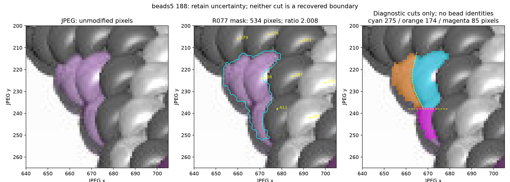
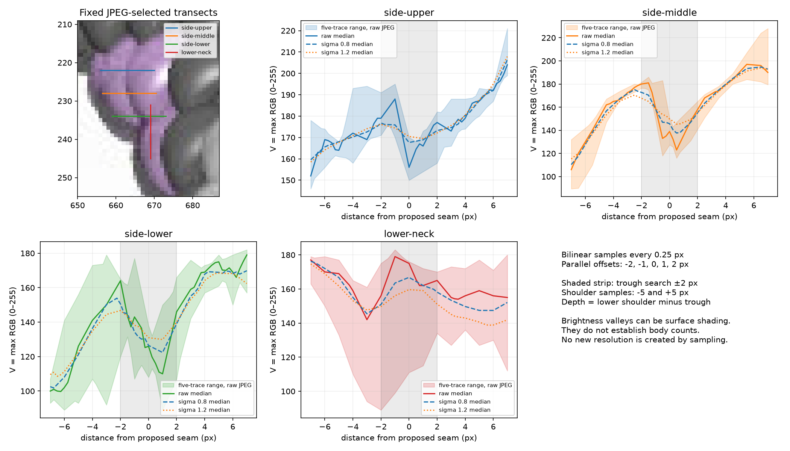
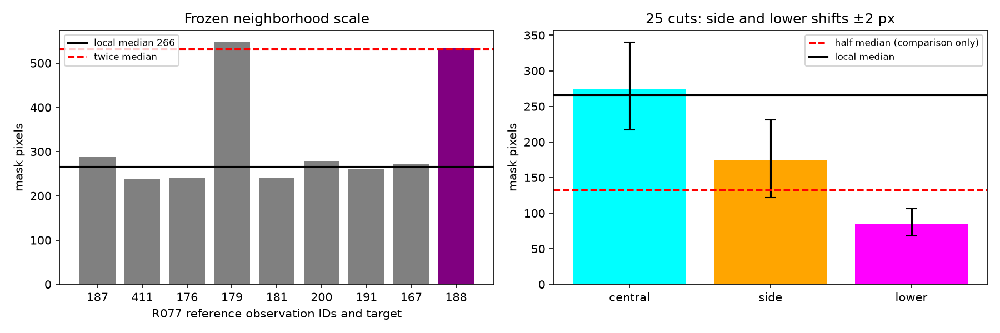

# beads5 188: retain the unresolved mask — R080

**Keep the 328-observation inventory unchanged, with 188's warning retained.**
Its 534-pixel mask is not a reliable single-body outline. A side seam supports
adjacent visible portions, but this diagnostic does not establish a stable split
into two substantial bodies. Preserve both hypotheses: one central substantial
body with uncertain narrow portions in its mask, or two adjacent upper body
portions with an uncertain lower continuation. These are not exhaustive.

[Illustrated review](review/r080/review.html) ·
[Measurements](review/r080/diagnostics.json) ·
[RGB profiles](review/r080/profiles.csv) · [Hashes](review/r080/report.json) ·
[Unchanged active inventory](review/r077/inventory.json).



The JPEG shows a bright central purple portion, a darker side portion separated
by a curved seam, and a narrow lower continuation. The cyan saved mask joins
all of these. Yellow dashed cuts are deliberately approximate annotations,
not recovered boundaries. No narrow portion is given a bead identity or chain
position, and no pixels are reassigned. Sliver ownership remains outside scope.

## Boundary evidence

Four fixed transects sample the JPEG at 0.25-pixel intervals using bilinear RGB
interpolation. Each uses five parallel traces at offsets −2 through +2 pixels.
V is maximum RGB, on the 0–255 scale. Gaussian smoothing of each RGB channel at
sigma 0, 0.8 and 1.2 pixels tests sensitivity; it does not add image resolution.
All coordinates and parameters are in [the annotation file](beads5-188-r080.json).

The reported depth is the lower of two shoulder samples at distances −5/+5,
minus the minimum within ±2 pixels of the annotated seam on the median trace.
This is a descriptive measurement, not a calibrated boundary classifier. Negative
depth means the chosen trough is brighter than a chosen shoulder; it does not
prove there is no local valley elsewhere on the trace.

| Transect | Raw median depth | Sigma 0.8 | Sigma 1.2 |
| --- | ---: | ---: | ---: |
| Side upper, y=222 | 8.00 | 0.37 | −1.85 |
| Side middle, y=228 | 28.00 | 9.75 | −0.25 |
| Side lower, y=234 | 16.00 | −1.28 | −7.47 |
| Lower neck, x=669 | 3.00 | −3.47 | −9.15 |



The middle side seam has positive raw depths on all five parallel traces
(10.5–38). Upper and lower side traces include negative depths at some offsets.
The lower-neck minimum lands at the −2-pixel search boundary for every sigma;
this fails to locate a stable cut there. The visible side seam deserves to
remain in the evidence, but shading, JPEG sampling and occlusion prevent these
profiles from deciding how many usable bodies to retain. Blurring a narrow real
seam can attenuate it too; smoothing sensitivity is not evidence against a seam.

## Mask scale and cut sensitivity

Keep the original eight R077 reference masks, IDs
187/411/176/179/181/200/191/167, with areas
288/238/240/547/240/279/261/271 pixels. Their median is 266; target 188 is
534/266 = **2.0075**. These references are provisional masks, not bead truth;
in particular, 179 itself has a large 547-pixel extent. No new review or
identity decision for 179 is made here.

Leaving out each reference in turn changes the median to 261 or 271 pixels,
and the target ratio to **2.0460 or 1.9705**. Four of eight cases fall below the
warning threshold. This tests reference sensitivity only; it does not revise
the R069 neighborhood or clear the warning. An unflagged mask is not thereby
validated.

For a separate area probe, divide only 188's saved pixels at a JPEG-selected
curved side cut and horizontal y=238 cut. Move each cut independently by
−2/−1/0/+1/+2 pixels, for 25 combinations. Every combination conserves the
original pixels exactly; all parts are diagnostic, not new observations.

| Portion | Nominal pixels | Range under shifted cuts | Ratio to 266-pixel median |
| --- | ---: | ---: | ---: |
| Central | 275 | 217–340 | 0.816–1.278 |
| Side | 174 | 122–231 | 0.459–0.868 |
| Lower | 85 | 68–106 | 0.256–0.398 |



The central portion is of ordinary local mask scale throughout this probe.
The side portion crosses the half-median cutoff as the cut moves; the lower
portion stays below it. Thus the aggregate's twice-median area does not establish
two substantial bodies. Do not promote the side or lower portion to a new ID,
and do not use this exploratory partition as a new active mask. The uncertainty
concerns mask extent and visible-body count; no sliver ownership was investigated.

## Reproduction and checks

The script rebuilds the original masks from the JPEG and frozen R077 records,
verifies all seven baseline source hashes and requires the regenerated labels'
NPY hash to match R077 exactly. It never consults POV source, source patterns,
renderer truth, photographs or chain indices. The active inventory is unchanged.

```sh
MPLCONFIGDIR=/tmp/beads-r080-mpl .venv/bin/python photo2/beads5_188_diagnostic.py --output photo2/review/r080
MPLCONFIGDIR=/tmp/beads-r080-mpl .venv/bin/python photo2/beads5_188_diagnostic.py --output photo2/output/beads5-188-repeat
MPLCONFIGDIR=/tmp/beads-r080-mpl .venv/bin/python -m unittest discover -s photo2 -p test_beads5_188_diagnostic.py -v
.venv/bin/python -m unittest discover -s photo2 -p test_beads5_inventory.py -v
.venv/bin/python -m unittest discover -s photo2 -p test_inventory_selection.py -v
.venv/bin/python -m py_compile photo2/beads5_188_diagnostic.py photo2/test_beads5_188_diagnostic.py
```

Three new controls check partition pixel conservation, subpixel sampling against
an analytic RGB field, and a known valley versus monotone brightness slope.
Together with four beads5 and seven selection controls, **14 tests pass**;
compilation passes. These validate calculations, not bead counts or boundaries.
All three final illustrations were inspected. Six curated artifacts reproduce
byte for byte; reports agree except output command paths. Source hashes and HTML
local links verify. No browser interaction, rendering or legacy indexing suite
was run. The static page has no interactive controls.

```sh
.venv/bin/python - <<'PY'
import hashlib, json
from pathlib import Path
first = Path('photo2/review/r080')
second = Path('photo2/output/beads5-188-repeat')
a = json.loads((first/'report.json').read_text())
b = json.loads((second/'report.json').read_text())
sha = lambda p: hashlib.sha256(p.read_bytes()).hexdigest()
for name, expected in a['sources'].items():
    assert sha(Path(name)) == expected, name
for name, expected in a['artifacts'].items():
    assert sha(first/name) == expected == sha(second/name), name
for report in (a, b):
    report.pop('command')
assert a == b
print('All source and repeat hashes agree')
PY
```

Initial notes lookups used nonexistent photo2/PLAN.md and root requirements.txt;
corrected paths/reads followed. The failed requirements lookup prevented a chained
scratch crop command from running, so the first crop view failed too; regeneration
succeeded. Initial Matplotlib import used its temporary cache after a permissions
warning; final commands set a writable MPLCONFIGDIR. An out-of-crop marker label
in the first plot was clipped before publication. Staged whitespace check caught CSV CRLF line endings; the writer now emits LF,
and both bundles were regenerated and hashes reverified. No analysis or test failures.
Git fetch required escalation for read-only FETCH_HEAD. Scratch/repeat outputs
remain ignored; the three curated images and numerical evidence are committed.

## Saved questions and next bounded task

No new maker question. [R069 answers](BEADS1_QUESTIONS.md) remain applied; older
[photo questions](QUESTIONS_FOR_MAKER.md) remain pending and do not block this work.
Beads3 122/405 remain unresolved; colors, borders and completeness remain
provisional across all seven generated images. No complete inventory or pattern
is established, and all chain indices remain null.

Next: audit the stability of local-area warnings across all seven frozen active
inventories by leaving out one reference at a time. Publish an image-scoped
review queue distinguishing threshold-sensitive flags from persistent flags;
stop before any mask changes, new body decisions, indexing or photographs.
This is a robustness audit, not a completeness test. Recommend **gpt-6-astra /
High, fresh `/new`**; model/session changes remain user-controlled.
