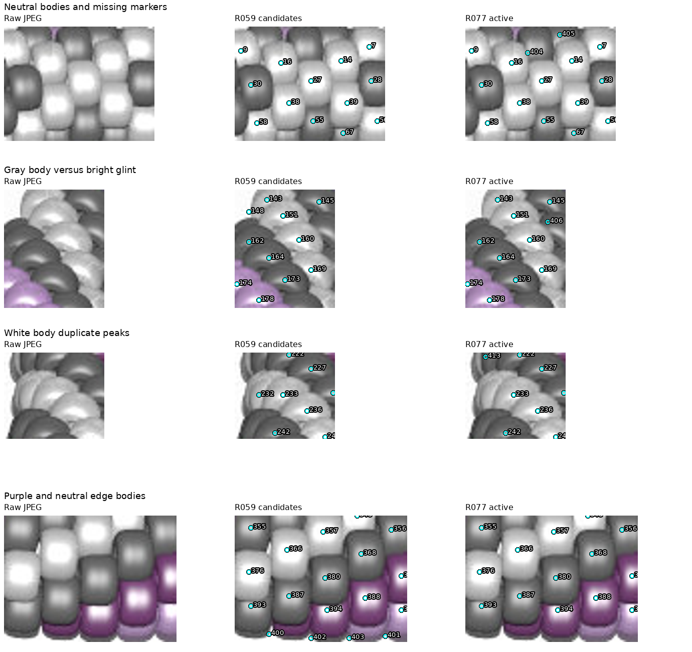
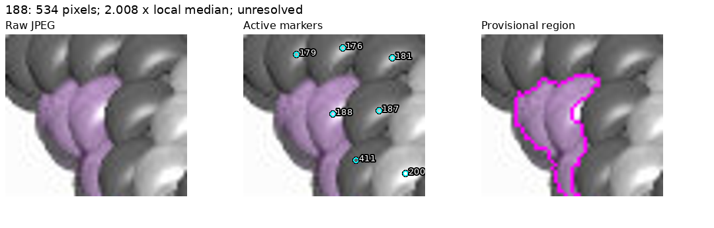
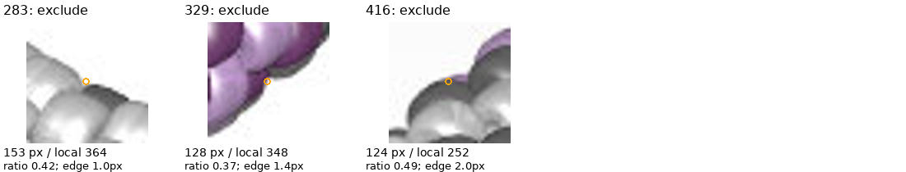

# beads5.jpg: purple and neutral inventory — R077

**328 provisional active observations:** 93 purple, 136 gray and 99 white.
No complete inventory, physical centers, chain indices or pattern is established.
**Beads5 188 remains an uncertain possible merge.** Beads3's separate 122/405
warnings remain unchanged; observation IDs are image-specific.

R080 follow-up: [boundary and scale diagnostic](BEADS5_188_DIAGNOSTIC.md)
retains the unresolved 188 mask and this inventory unchanged. Its warning is
sensitive to the reference set; visible seams do not establish a stable split.
The current next task is in [PLAN.md](../PLAN.md); the R077 next task below is historical.

[Review page](review/r077/review.html) · [Active map](review/r077/active-overview.png) ·
[Records](review/r077/inventory.json) · [Parameters and hashes](review/r077/report.json)



## JPEG review

Only beads5.jpg and image-derived records/code were used; no POV source, source
pattern, renderer truth or other image's IDs informed these annotations. The
full JPEG, eight baseline/revised numbered crops, coordinate close-ups,
12 largest intermediate residual crops, envelope, palette and region overlays
were inspected. All support lies inside the reviewed crops; this does not prove
completeness. Color labels and marker positions are visual annotations, not
calibrated physical centers or material recovery.

Starting with 403 R059 candidates, remove 88, add 16 visible gray bodies
(404–419), then exclude three small regions: **403 − 88 + 16 − 3 = 328**.
The [edits file](beads5-review-r077.json) preserves 87 unsupported boundary/tiny
fragment removals and one duplicate white-body peak (232, retaining 233).
Review corrected gray/white body labels, purple 359/394/395, and marker positions
218/406/407. Neutral additions clear intermediate large-region flags at
183/210/172. The final 188 flag appears after neighboring neutral regions are
corrected: its area is unchanged but its local reference median decreases.
This illustrates the heuristic's dependence on the reviewed neighborhood.



Region 188 has 534 pixels, **2.008 times** its 266-pixel local median. Its outline
includes adjoining purple portions with uncertain seams. Retain the possible-
merge warning; this is not a clean one-bead mask or evidence of a missing chain
index. No ownership was sought for the narrow portions. Neutral seams, shadows,
color labels and inventory completeness remain provisional throughout the map.

## Support and local-area selection

Close the baseline foreground with a 10-pixel disk and fill enclosed holes up
to 1,500 pixels, preserving the main opening. This restores bright neutral bodies
but retains some shadow support. Purple pixels require min(R,B) − G ≥12 and
HSV saturation ≥0.13. Neutral support uses maximum RGB ≥45 inside the envelope.
Repair enclosed holes up to 128 pixels inside purple support. The initial
64-pixel repair left visible purple glints unfilled; the larger cutoff repairs
those enclosed glints while preserving substantial neutral bodies. Glints open
to neutral support can still remain unfilled.

**Gray and white share neutral pixel support.** A brightness cutoff between
them would split highlights and shaded bodies. Body-level visual labels remain
separate from these two support classes. Within each support class, brightness
smoothed at sigma 1 and compact watershed weight .03 divide seeded regions;
seed snap is limited to 6 pixels and assignment distance to 28. Retain only the
seed-connected component; one detached pixel is left unassigned. The support-
class check validates purple versus neutral only, not true gray/white borders.

R069 parameters are unchanged: up to eight original reviewed neighbors within
45 pixels, at least four required; exclude below half their median area, warn
above twice it. The three exclusions are **283, 329 and 416**, all near the
support edge. Their area ratios are .421, .367 and .491. In particular, 416 is
close to the cutoff and sensitive to approximate segmentation. Active masks do
not expand after filtering. Beads5 211 remains active; beads1's exclusion does
not transfer here. Slivers and missing chain positions remain unassigned.



Support: 117,017 pixels; 1,279 initially unassigned, 405 ignored by selection,
115,333 active. The 35 unassigned components of at least six pixels are residual
pixel regions, not missing-bead counts. No lighting hypothesis was verified.

## Reproduction and checks

Use the local Python 3.12 environment and requirements.txt:

```sh
.venv/bin/python photo2/beads5_inventory.py --output photo2/output/beads5-final --review-bundle photo2/review/r077
.venv/bin/python photo2/beads5_inventory.py --output photo2/output/beads5-repeat --review-bundle photo2/output/beads5-review-repeat
.venv/bin/python -m unittest discover -s photo2 -p test_beads5_inventory.py -v
.venv/bin/python -m unittest discover -s photo2 -p test_inventory_selection.py -v
.venv/bin/python -m py_compile photo2/beads5_inventory.py photo2/test_beads5_inventory.py
```

Four new controls cover purple glint versus full neutral body, neutral brightness
overlap/shadow rejection, competition between gray/white markers on shared
support with detached islands, and envelope gap repair. Together with seven
selection controls, **11 tests pass**. Compilation passes. The pipeline checks
unique IDs, removed IDs absent, connected nonempty active masks, seeds preserved,
support-class purity, area agreement, no filtering reassignment and null chain
indices. Maximum seed snap is 4 pixels; minimum local references is seven.
These are bookkeeping checks, not validation against bead truth.

Seven source hashes, 17 curated artifacts (15 PNGs, HTML and inventory JSON)
and four bulk maps verify. Repeated artifacts match byte for byte, and reports
match except command paths. Recheck with:

```sh
.venv/bin/python - <<'PY'
import hashlib, json
from pathlib import Path
root = Path.cwd()
first = root / 'photo2/review/r077'
second = root / 'photo2/output/beads5-review-repeat'
a = json.loads((first / 'report.json').read_text())
b = json.loads((second / 'report.json').read_text())
sha = lambda p: hashlib.sha256(p.read_bytes()).hexdigest()
for name, digest in a['sources'].items():
    assert sha(root / name) == digest, name
for name, digest in a['artifacts'].items():
    assert sha(first / name) == digest == sha(second / name), name
for name, digest in a['bulk_artifacts'].items():
    assert sha(root / 'photo2/output/beads5-final' / name) == digest
    assert sha(root / 'photo2/output/beads5-repeat' / name) == digest
for report in (a, b):
    report.pop('command')
assert a == b
print('Hashes and repeat artifacts agree')
PY
```

HTML links checked; browser controls not exercised. No legacy rendering/indexing
suite or other-image edits. No analysis execution or unit-test failures. Initial
Git fetch required escalation because FETCH_HEAD was read-only. Bulk, scratch,
repeat outputs and environment remain ignored; curated evidence is committed
under R065. Source hashes and the commands above recreate every curated image.

## Saved questions and next task

No new maker question is needed. The R069 answers remain applied; older
[photo-shadow questions](QUESTIONS_FOR_MAKER.md) remain pending and do not block
this review. The illustrated 188 warning is retained for future diagnostics.

Next: beads6 JPEG-only palette/body review, apply R069, and stop after an
illustrated active map and checks. Carry beads3 122/405, beads5 188 and all
provisional-border warnings. Recommend gpt-6-astra / High with a fresh `/new`;
model/session changes remain user-controlled. Beads7 follows in a later step.
