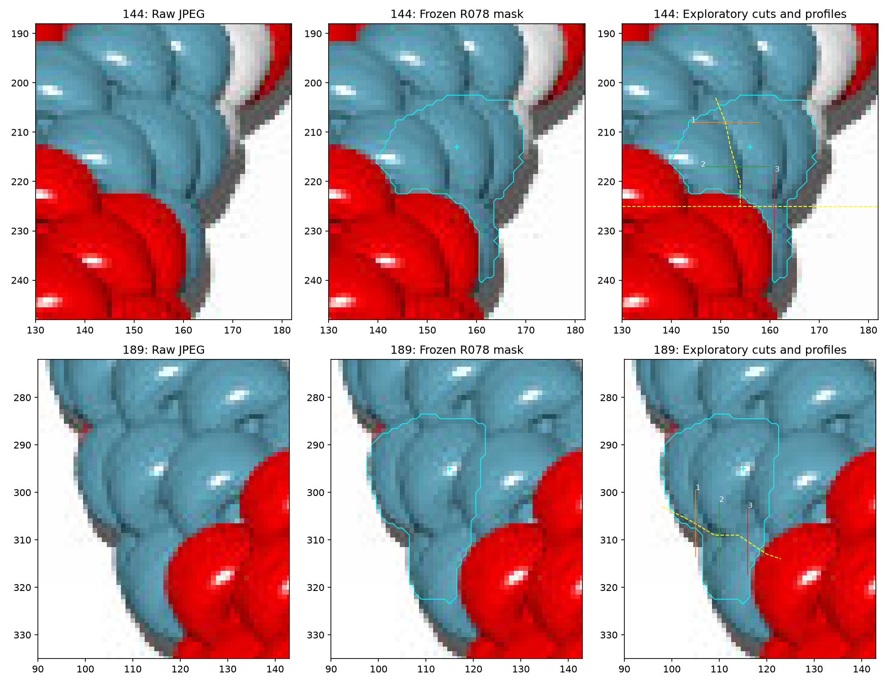
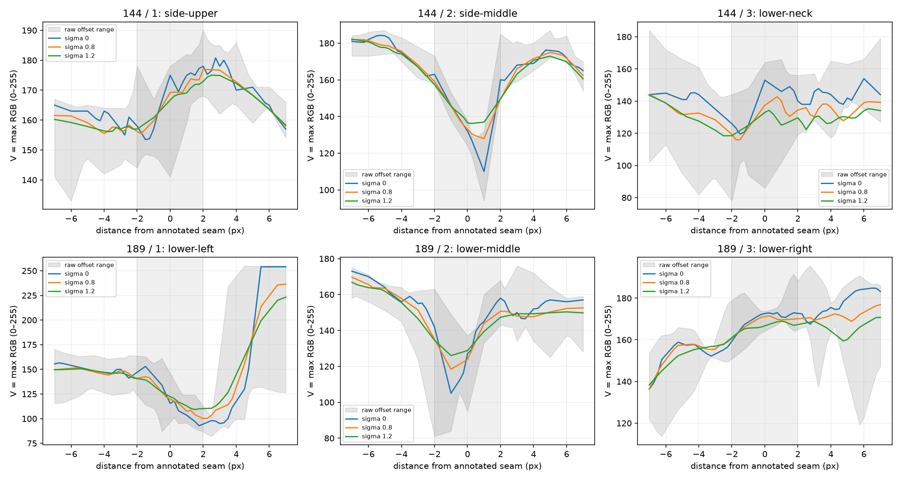
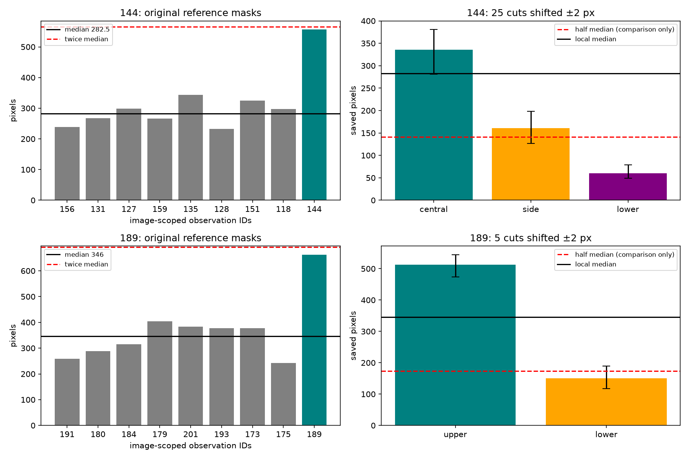

# beads6 144/189: retain unresolved mask extents — R082

**Keep both observations unresolved and the 310-observation inventory unchanged.**
The JPEG contains seams within the saved masks, but the tested cuts do not establish
two consistently substantial visible bodies. The masks should not be treated as
verified single-body outlines. No active mask, ID, exclusion or index changes.

[Illustrated review](review/r082/review.html) · [Measurements](review/r082/diagnostics.json) ·
[RGB samples](review/r082/profiles.csv) · [Hashes](review/r082/report.json) ·
[Unchanged inventory](review/r078/inventory.json).



Cyan shows the frozen mask and original marker, not a physical center. Yellow
cuts are JPEG-selected exploratory annotations; numbers identify profile lines.
Coordinates are original image pixels. Beads6 144 includes a bright left portion,
a central portion and a narrow lower continuation. Beads6 189 includes an upper
portion and a lower continuation. The central/upper portions themselves retain
uncertain side extents. The cuts are not an exhaustive segmentation proposal.
No narrow portion receives an identity or ownership assignment.

## Competing interpretations

For **144**, preserve one substantial central body with uncertain adjacent portions
included in its mask, versus two substantial adjacent portions across the side
seam. Its middle side valley survives all three smoothing settings, but the
smaller side area's eligibility depends on the exploratory cut placement. The
narrow continuation stays below half the local median; do not resolve its ownership.

For **189**, preserve one substantial upper body with uncertain lower continuation,
versus two vertically adjacent usable portions. A curved lower seam is visible
on the left and middle, but the right profile is a brightness slope without a
located trough in the annotated search interval. The lower area's eligibility
also depends on cut placement. Neither alternative is selected as body truth.

## Boundary profiles

Reuse R080's bilinear RGB sampler and descriptive trough measure. Six fixed lines
sample every 0.25 pixel at five parallel offsets (−2 to +2 pixels). Smooth RGB
channels at sigma 0, 0.8 and 1.2 pixels; V is maximum RGB on the 0–255 scale.
Depth is the lower shoulder at distances −5/+5 minus the minimum within ±2 pixels
on the median V trace. Negative depth means a chosen shoulder is darker than the
search-window minimum. This is not a calibrated boundary or body-count classifier.
Coordinates, cuts and parameters are frozen in [annotations](beads6-boundaries-r082.json).

| ID / profile | Raw depth | Sigma 0.8 | Sigma 1.2 |
| --- | ---: | ---: | ---: |
| 144 / side-upper | 9.50 | 3.56 | 0.84 |
| 144 / side-middle | 66.00 | 46.95 | 36.71 |
| 144 / lower-neck | 21.50 | 13.35 | 11.49 |
| 189 / lower-left | 57.25 | 48.99 | 40.41 |
| 189 / lower-middle | 52.00 | 31.94 | 23.84 |
| 189 / lower-right | -1.20 | -3.27 | -7.90 |



144's middle-side raw depth is 66/255 and remains 36.71 at sigma 1.2; its upper
side is much weaker. Its lower-neck trough reaches the search edge at sigma 1.2.
189's middle lower trough stays at offset −1 pixel, but the right profile's minimum
is at −2 for all sigmas. The left profile approaches/crosses the outer silhouette
at its positive end: its bright shoulder includes background, so this is not
independent evidence of an internal body boundary. Offset bands include genuine
image variation as well as placement sensitivity. Shading, occlusion and JPEG
sampling remain confounders; smoothing sensitivity does not disprove a real seam.

## Frozen references and exploratory area cuts

The original eight references and pre-selection areas stay fixed, including any
subsequently excluded references. These are provisional masks, not single-bead
truth. Leave-one-reference-out sensitivity reproduces R081:

| Target | Saved pixels | Local median | Original ratio | Omission range |
| --- | ---: | ---: | ---: | ---: |
| 144 | 557 | 282.5 | 1.9717 | 1.8754–2.0784 |
| 189 | 663 | 346 | 1.9162 | 1.7586–2.1048 |

Both targets are originally below the strict >2 warning threshold; four of eight
omissions cross it for each. Keep R081's diagnostic sensitivity flags without
rewriting R078's saved selection warnings. These ranges are not confidence intervals.

For 144, shift the piecewise-linear side cut horizontally and y=225 cut vertically
by −2/−1/0/+1/+2 pixels, producing 25 partitions. For 189, shift the curved lower
cut vertically by the same values, producing five partitions. Only original
mask pixels are counted. All 30 partitions conserve every original pixel exactly.
No cut is promoted to an active boundary.

| Target / portion | Nominal pixels | Shifted range | Range / local median |
| --- | ---: | ---: | ---: |
| 144 / central | 336 | 281–381 | 0.995–1.349 |
| 144 / side | 161 | 127–198 | 0.450–0.701 |
| 144 / lower | 60 | 49–79 | 0.173–0.280 |
| 189 / upper | 513 | 474–545 | 1.370–1.575 |
| 189 / lower | 150 | 118–189 | 0.341–0.546 |



144's side crosses half its 282.5-pixel local median; 189's lower portion crosses
half its 346-pixel median. Thus neither candidate split gives two portions above
the comparison cutoff throughout this small perturbation. This does not show that
either portion is physically a sliver, and the cutoff is not an identity test.
Keep both one/two-body alternatives and the original pixels without reassignment.

## Reproduction and checks

Use repository-local Python 3.12. The script verifies all seven R078 source hashes
and the saved inventory hash, regenerates labels and requires the NPY hash to
match R078 exactly. No local bulk-map cache is needed. Source patterns, POV files,
renderer truth, photographs and chain-index inference are not consulted.

```sh
MPLCONFIGDIR=/tmp/beads-r082-mpl .venv/bin/python photo2/beads6_boundary_diagnostic.py --output photo2/review/r082
MPLCONFIGDIR=/tmp/beads-r082-repeat-mpl .venv/bin/python photo2/beads6_boundary_diagnostic.py --output photo2/output/beads6-boundary-repeat
MPLCONFIGDIR=/tmp/beads-r082-tests-mpl .venv/bin/python -m unittest discover -s photo2 -p test_beads6_boundary_diagnostic.py -v
MPLCONFIGDIR=/tmp/beads-r082-tests-mpl .venv/bin/python -m unittest discover -s photo2 -p test_beads5_188_diagnostic.py -v
.venv/bin/python -m unittest discover -s photo2 -p test_beads6_inventory.py -v
.venv/bin/python -m unittest discover -s photo2 -p test_inventory_selection.py -v
.venv/bin/python -m py_compile photo2/beads6_boundary_diagnostic.py photo2/test_beads6_boundary_diagnostic.py
```

Two new curved-cut controls, three reused diagnostic controls, four beads6 controls
and seven selection controls pass (**16 tests**); compilation passes. These check
calculations and bookkeeping, not body truth. All three final figures inspected.
All source/artifact hashes and byte-identical repeat artifacts verify; reports
agree except command paths. All 30 partitions conserve pixels; 5,130 CSV rows
recompute the saved profile statistics. HTML local links resolve. No browser
interaction, full legacy rendering/indexing suite or other-image assessment.
No analysis/test failures. Fetch needed escalation for read-only FETCH_HEAD.
Scratch/repeat/environment remain ignored; curated evidence is committed.

```sh
.venv/bin/python - <<'VERIFY'
import csv, hashlib, json, re
from pathlib import Path
import numpy as np
base = Path('photo2/review/r082')
repeat = Path('photo2/output/beads6-boundary-repeat')
a = json.loads((base/'report.json').read_text())
b = json.loads((repeat/'report.json').read_text())
sha = lambda p: hashlib.sha256(p.read_bytes()).hexdigest()
for path, expected in a['sources'].items():
    assert sha(Path(path)) == expected, path
for path, expected in a['artifacts'].items():
    assert sha(base/path) == expected == sha(repeat/path), path
for report in (a,b): report.pop('command')
assert a == b
rows = list(csv.DictReader((base/'profiles.csv').open()))
assert len(rows) == 5130
data = json.loads((base/'diagnostics.json').read_text())
for target in data['targets']:
    area = target['target']['region_pixels']
    for variant in target['partition_sensitivity']:
        assert sum(variant['areas'].values()) == area
    for metric in target['profile_measurements']:
        group = [r for r in rows if int(r['target_id']) == target['target']['id']
                 and r['profile'] == metric['name'] and float(r['sigma_px']) == metric['sigma_px']]
        distances = sorted({float(r['distance_px']) for r in group})
        trace = np.array([np.median([float(r['value']) for r in group if float(r['distance_px']) == t]) for t in distances])
        t = np.array(distances)
        index = np.flatnonzero(abs(t)<=2)[np.argmin(trace[abs(t)<=2])]
        depth = min(np.interp([-5,5],t,trace))-trace[index]
        assert abs(depth-metric['median_trace']['depth_below_lower_shoulder']) < 1e-10
        assert t[index] == metric['median_trace']['trough_offset_px']
for link in re.findall(r'(?:href|src)="([^"]+)"', (base/'review.html').read_text()):
    assert (base/link).is_file(), link
print('Hashes, repeat artifacts, 30 partitions, 5130 samples and links verified')
VERIFY
```

## Saved answers and next bounded task

No new maker questions. [R069 answers](BEADS1_QUESTIONS.md) remain applied; older
[photo-shadow questions](QUESTIONS_FOR_MAKER.md) remain pending and do not block
this work. Carry beads3 122/405, beads5 188, the rest of the
[R081 queue](AREA_WARNING_STABILITY.md), all provisional colors/same-color and
white-shadow borders, beads7 glint repairs, missing observations and null indices.
None of the seven inventories is verified complete.

Next: assess beads5 349/364's newly exposed large-area sensitivities using the
JPEG and frozen masks. Publish an illustrated resolve-or-retain assessment with
competing body-count hypotheses, then stop before mask changes, new IDs, sliver
ownership, indexing or photographs. Recommend **gpt-6-astra / High, fresh `/new`**;
user controls model/session changes.
