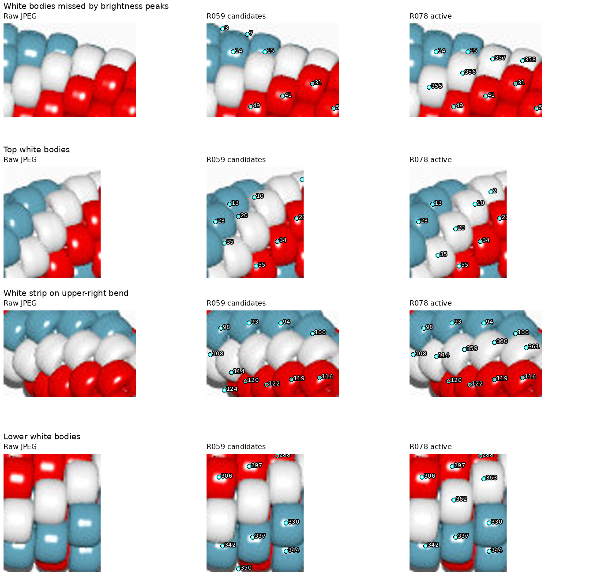
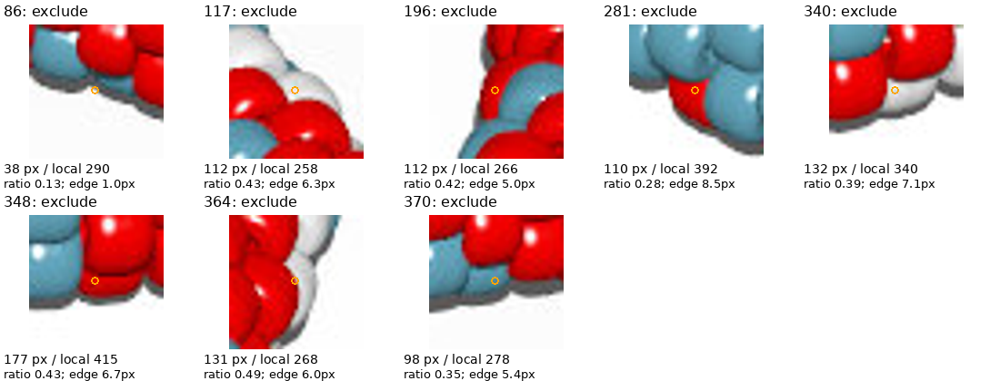

# beads6.jpg: red, blue-gray and white inventory — R078

**310 provisional active observations:** 140 red, 118 blue-gray and 52 white.
No complete inventory, physical centers, chain indices or pattern is established.
No large-area or sparse-reference warnings remain on beads6. Beads3 122/405 and
beads5 188 remain unresolved; observation IDs are specific to each image.

[Review page](review/r078/review.html) · [Active map](review/r078/active-overview.png) ·
[Records](review/r078/inventory.json) · [Parameters and hashes](review/r078/report.json)



## JPEG review

Only beads6.jpg and image-derived records/code informed this review. No POV
source, source pattern, rendering, photo analysis or indexing was used. The full
JPEG, eight baseline/revised numbered crops, coordinate close-ups, the largest
12 intermediate residual regions, foreground envelope, palette and region maps
were inspected. Expanded top review boxes include 206 support pixels initially
outside the crop coverage. Final coverage includes all support; it does not
establish inventory completeness.

354 R059 candidates − 53 removals + 17 additions − eight small regions = **310**.
The [annotations](beads6-review-r078.json) retain 50 unsupported boundary/tiny
fragment removals and three duplicates (253→248, 258→241, 308→307). Blue-gray
is the visual palette name. Several baseline blue-gray labels were actually
white bodies; colors and marker positions were corrected before selection.
Exploratory addition 365 duplicated 248 and was withdrawn; its ID is not reused.

Added 11 white bodies and six blue-gray bodies. Blue-gray 367/368 clear initial
large-area flags at 46/96. Residual review adds blue-gray 369–372, with 370 then
excluded by the unchanged area rule. White 364 is also excluded. Intermediate
zero-area masks at 175/327 were annotation errors: correct the marker/color,
rather than treating a bad mask as evidence of a sliver. No sliver ownership was
attempted. Remaining narrow residual strips stay unassigned.

## Masks and selection

Close the baseline envelope with a 10-pixel disk and fill enclosed holes up to
1,500 pixels, preserving the main opening. Within it, red requires
R−max(G,B) ≥25; blue-gray requires min(G,B)−R ≥12. Both require HSV saturation
≥.13. Other pixels with maxRGB ≥95 have white support. Fill enclosed chromatic
glint holes up to 128 pixels. White bodies larger than this remain separate;
glints open to white support can still be missed. The envelope and white cutoff
retain uncertain shadow margins. These classes are provisional, not calibrated
material colors or true bead silhouettes.

Per-class compact watershed uses brightness smoothed at sigma 1, compactness
.03, seed snap ≤6px and assignment radius 28px. Keep only the seed-connected
component: one detached pixel remains unassigned. Same-color seams are still
approximate; passing the area heuristic does not validate a boundary.

R069 selection is unchanged: compare against up to eight original reviewed
neighbors within 45px, require at least four, exclude below half the local median
and warn above twice it. Eight exclusions: **86, 117, 196, 281, 340, 348, 364,
370**, all near the edge. White 364 has ratio .490 and is threshold-sensitive.
Beads6 211 is removed for its own unsupported edge peak, independently of the
maker's explicit beads1 211 exclusion. No explicit excluded ID transfers here.
Filtering leaves excluded pixels unassigned and never expands retained regions.



101,998 support pixels; 3,884 initially unassigned, 910 ignored by selection,
97,204 active. The 125 initial unassigned components ≥6px are residual pixel
regions, not missing-bead counts. Chain indices stay null. No lighting hypothesis
was verified. Completeness, colors, physical centers and same-color/white-shadow
borders remain provisional.

## Reproduction and checks

Use local Python 3.12 and requirements.txt:

```sh
.venv/bin/python photo2/beads6_inventory.py --output photo2/output/beads6-final --review-bundle photo2/review/r078
.venv/bin/python photo2/beads6_inventory.py --output photo2/output/beads6-repeat --review-bundle photo2/output/beads6-review-repeat
.venv/bin/python -m unittest discover -s photo2 -p test_beads6_inventory.py -v
.venv/bin/python -m unittest discover -s photo2 -p test_inventory_selection.py -v
.venv/bin/python -m py_compile photo2/beads6_inventory.py photo2/test_beads6_inventory.py
```

Four new controls cover red/blue glints versus white bodies, white/shadow support
and envelope limits, three-class segmentation with detached islands, and gap
repair without filling the central opening. Together with seven selection
controls, **11 tests pass**. Compilation passes. Pipeline checks unique IDs,
removed IDs absent, connected nonempty active masks, seeds preserved, class
purity, area agreement, no filtering reassignment and null chain indices.
Maximum seed snap is 2px; every active record has eight local references.
These validate implementation bookkeeping, not bead ground truth.

Seven source hashes, 17 curated artifacts (15 PNGs, HTML, inventory JSON), and
four bulk maps verify; repeated artifacts match byte for byte and reports match
except command paths. Recheck with:

```sh
.venv/bin/python - <<'PY'
import hashlib, json
from pathlib import Path
root = Path.cwd()
first = root / 'photo2/review/r078'
second = root / 'photo2/output/beads6-review-repeat'
a = json.loads((first / 'report.json').read_text())
b = json.loads((second / 'report.json').read_text())
sha = lambda p: hashlib.sha256(p.read_bytes()).hexdigest()
for name, digest in a['sources'].items():
    assert sha(root / name) == digest, name
for name, digest in a['artifacts'].items():
    assert sha(first / name) == digest == sha(second / name), name
for name, digest in a['bulk_artifacts'].items():
    assert sha(root / 'photo2/output/beads6-final' / name) == digest
    assert sha(root / 'photo2/output/beads6-repeat' / name) == digest
for report in (a, b):
    report.pop('command')
assert a == b
print('Hashes and repeat artifacts agree')
PY
```

HTML links checked; browser controls not exercised. No full legacy rendering or
indexing suite. One exploratory residual-sheet command failed because its crop
coordinates were floats; rounding corrected it. No pipeline or test failures.
Git fetch required escalation for read-only FETCH_HEAD. Routine/scratch/repeat
outputs and environment remain ignored; curated images are committed under R065.

## Saved questions and next task

No new maker questions. Saved R069 answers remain applied; older
[photo-shadow questions](QUESTIONS_FOR_MAKER.md) remain pending and do not block
generated-image review.

Next: beads7 JPEG-only palette/body and mask review, including dark/neutral
regions; apply R069 and stop after an illustrated active map/checks. Carry
beads3 122/405, beads5 188, all provisional-border warnings and null indices.
Recommend gpt-6-astra / High, fresh `/new`; user controls model/session changes.
