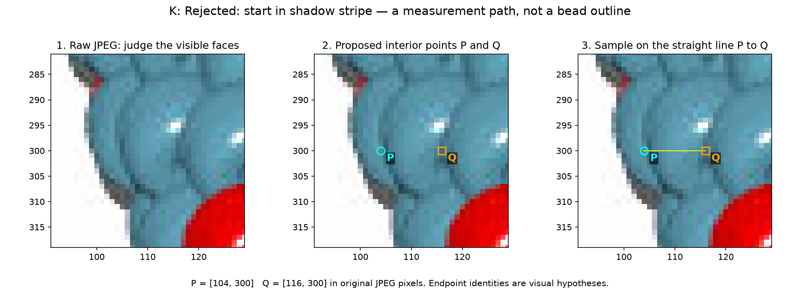
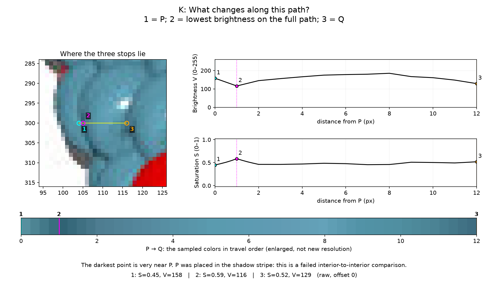
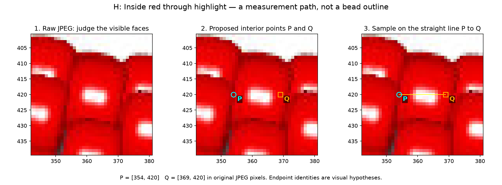
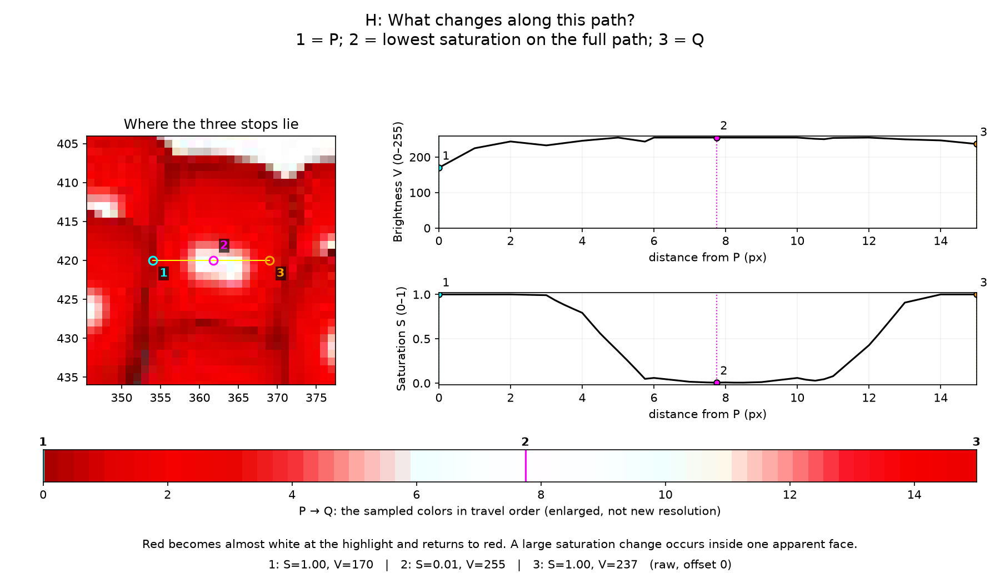

# What changes between visible bead interiors — R087

**The paths now show useful appearance evidence, but do not recover boundaries
or settle bead identities.** A cyan seam candidate can show a brightness dip with
little saturation change. A highlight inside one apparent red bead can change
saturation almost completely. Endpoint selection matters: one initial connection
started in the shadow it was supposed to test and has been rejected.

Start with [the illustrated walkthrough](review/r087/review.html), or the
[two questions](BEADS6_SV_QUESTIONS.md). The review includes raw images, endpoints,
full paths, sampled-color strips and stops linked to S/V plots. All 310 beads6
observations remain unchanged; 144/189 remain unresolved.

## Why the R082 lines were unsatisfying

The maker described [R082's comparison](review/r082/boundary-comparison.png) as
showing "mysterious unexplainable paths." The picture combined three different
things without enough visual explanation of why their positions were chosen:

- Cyan was the saved segmentation mask and marker, both provisional.
- Yellow curves were hand-selected **area-partition trials**. The 144 side curve
  roughly followed a dark side gap; its horizontal y=225 cut was a simple division
  of the lower extension. The 189 lower polyline was another guessed division.
  Neither was fitted from a bead model or established as an actual outline.
- The numbered colored lines were short **brightness probes** across those
  guesses. They did not start at two supported bead interiors. One 189 probe
  reached the exterior background, making its bright shoulder misleading.

Those trials measured how guessed cuts changed areas. They did not explain which
3D exposed surfaces were present. R084–R086 corrected that conceptual gap with
pose/occlusion evidence and planarity. R087 replaces the unexplained-line
presentation with an explicit path-selection hypothesis. It still needs review;
clearer pictures alone do not validate the chosen interiors.

## A: a proposed connection across the side seam near 144

P=(145,216) is on the cyan patch to the right of its bright glint. Q=(160,216)
is on the broader cyan patch to the right of the dark stripe. They were selected
visually from the JPEG, not from mask centers or known renderer positions. A
straight line is the simplest way to ask what happens between those two proposed
interiors. It is a sampling route; it does not trace the boundary.


At the left upper section, the planar loop has an oblique image tangent. The
atlas allows broad and narrower overlapping visible faces at such section views;
we should not force the combined outline into an oval. Two exposed faces across
the stripe and one face with internal shading remain competing interpretations.
The atlas supplies that possibility, not a fitted local pose or source index.


Along A, cyan darkens near x=154 and brightens again. The raw brightness dip below
the lower endpoint-window median is 46/255; it remains 31.85 after sigma 1.2 RGB
smoothing. Translating the line by ±2 pixels gives raw dips 46–79. This supports
investigating the side seam. A shading valley can produce similar measurements,
so this does not establish two beads or a usable split.

## K and B: show a failed placement before its replacement

Initial K used P=(104,300) and Q=(116,300) near 189. Inspection shows P in/next to
the very shadow stripe being tested, rather than in a supported interior. The
minimum occurs only one pixel after P, inside the two-pixel endpoint window.
This invalidates the intended comparison. A negative descriptive dip here does
**not** mean that a boundary is absent. The failure stays in the review and CSV.





Revised B selects P=(112,300), on the central cyan portion below its highlight,
and Q=(127,302), on the broader right cyan portion below its highlight. This tests
the intervening side edge rather than the narrow left face or lower extension.
It is a different connection, not a controlled numerical improvement of K.
The near-vertical planar section view makes side coverage plausible, but the
chosen points and neighboring-body interpretation remain image hypotheses.


B's raw dip is 37.42/255, 34.19 after sigma 1.2; its ±2-pixel raw range is
37.42–46.84. Saturation medians at its ends differ by only 0.017. This is useful
same-color boundary evidence, not a determination of 189's full extent or count.

## H: why a large color signal can occur within a bead

P=(354,420) and Q=(369,420) lie on the same apparent broad red face. The route
crosses its white highlight. The first trial stopped at x=366, inside the
highlight shoulder; Q was extended after visual review to show the return to red.
This exploratory correction is recorded in the annotations.





The raw S range is 0.994, larger than either color-transition example, while
both endpoint-window medians are red (S difference 0). V stays high through the
highlight. A large S change somewhere along a path cannot alone define a bead
boundary. Cyan highlight control I similarly changes S by 0.476. Their apparent
single-body status is a visual hypothesis; no renderer ownership was consulted.

## Measurements and comparison controls

[Coordinates and hypotheses](beads6-sv-paths-r087.json) ·
[All measurements](review/r087/measurements.json) ·
[9,240 RGB/S/V samples](review/r087/profiles.csv).

Eleven paths including rejected K, five perpendicular translations −2/−1/0/+1/+2
pixels, and three RGB smoothing sigmas 0/0.8/1.2 pixels give 165 traces. Gaussian
smoothing uses reflective image edges. Straight lines include both endpoints;
spacing is at most 0.25 pixel. RGB is bilinearly sampled from Pillow-decoded JPEG
channels in their stored 0–255 encoding, without linearization. Then V=max(R,G,B)
and S=(max−min)/max, with S=0 for black. No perceptual/material calibration is implied.

The first/last two-pixel windows supply endpoint medians. The interior excludes
those windows. Dip = lower endpoint V median minus interior minimum; negative
values are allowed. S delta = last minus first endpoint median. These are
**descriptive measurements, not classifier thresholds**. Journey figures mark
full-path extrema instead, so their stop 2 can be outside the metric's interior
window (as K demonstrates). The gray bands on technical profiles show offset
ranges, not confidence intervals. See [A–E](review/r087/profiles-1.png),
[F–J](review/r087/profiles-2.png), [rejected K](review/r087/profiles-3.png).

| Path | Comparison | Raw V dip | ±2 px raw dip range | Raw S end−start |
| --- | --- | ---: | ---: | ---: |
| A | 144 cyan side candidate | 46.00 | 46.00–79.00 | 0.064 |
| B | 189 central/right cyan candidate | 37.42 | 37.42–46.84 | 0.017 |
| C | cyan/red near 189 | 39.29 | −6.11–45.72 | 0.513 |
| D | shading within apparent 144 central face | 0.66 | −5.96–0.66 | 0.028 |
| E | front red/red candidate | 44.00 | 44.00–61.50 | 0.013 |
| F | front cyan/cyan candidate | 79.00 | 35.00–84.00 | 0.010 |
| G | front white/cyan candidate | 40.00 | 34.00–47.00 | 0.317 |
| H | red highlight control | −8.00 | −12.00–−7.00 | 0.000 |
| I | cyan highlight control | −53.25 | −55.50–−7.00 | −0.157 |
| J | cyan shading control | 1.75 | −3.00–1.75 | −0.029 |
| K | rejected endpoint placement | −10.75 | −16.50–−6.75 | −0.007 |

Same-color examples A/B/E/F show positive dips across these translations;
nominal dips survive all tested sigmas. C's dip can disappear with translation,
even though cyan/red remains visually apparent. G encounters both a color
boundary and an internal cyan highlight on the same path. D/J produce slopes
with shallow/negative dip scores and minima at the search edge. I's end window
still includes a highlight shoulder, illustrating endpoint-statistic sensitivity.

Visual inspection places these corridors inside the necklace silhouette; this
is not an automated background/ownership guarantee. Some translated endpoints
encounter highlights, intentionally retained in the offset bands. Endpoints
were not independently jittered, curved routes were not evaluated, and the
samples were selected to illustrate behavior rather than measure error rates.
Planar tangent arrows in the overview are qualitative direction annotations,
not camera calibration, chain direction or assigned major/minor angles. No local
out-of-plane section tilt is introduced. No per-JPEG atlas-index lookup was used.

## Reproduction and checks

```sh
MPLCONFIGDIR=/tmp/beads-r087-mpl .venv/bin/python photo2/beads6_sv_paths.py --output photo2/review/r087
MPLCONFIGDIR=/tmp/beads-r087-repeat-mpl .venv/bin/python photo2/beads6_sv_paths.py --output photo2/output/beads6-sv-repeat
MPLCONFIGDIR=/tmp/beads-r087-tests-mpl .venv/bin/python -m unittest discover -s photo2 -p test_beads6_sv_paths.py -v
.venv/bin/python -m py_compile photo2/beads6_sv_paths.py photo2/test_beads6_sv_paths.py photo2/verify_beads6_sv_paths.py
.venv/bin/python photo2/verify_beads6_sv_paths.py --review photo2/review/r087 --repeat photo2/output/beads6-sv-repeat
```

Five analytic controls pass: encoded colors/black; oblique bilinear ramps and
normal offsets; a within-body highlight S counterexample; a shading valley V
counterexample; and invalid path rejection. These check calculations, not body
truth. Source/baseline hashes, all 15 artifacts, byte-identical repeats, 165 metric
records recomputed from 9,240 samples, and HTML links are verified. Curated figures
were inspected. No browser interaction, renderer/legacy suite or indexing tests;
no masks/IDs/counts/exclusions or other inventories were edited. Initial endpoint
failures and an atomic documentation-patch context mismatch were corrected and
recorded; no numerical test failure occurred.

The [report](review/r087/report.json) records source/image hashes, parameters,
environment and command. Raw/repeat scratch work and .venv remain ignored.
Old R082 artifacts are preserved. The guidance now requires explained paths and,
where useful, travel-order color strips with image-linked stops and lessons.

## Saved questions and next step

[Two illustrated questions](BEADS6_SV_QUESTIONS.md) ask whether A's endpoints are
useful and whether revised B connects the intended visible portions. Pending;
no answers invented. R069's ignore-slivers guidance remains applied. Older
photo-shadow questions remain pending and do not block generated-image work.

Next: incorporate endpoint feedback, then evaluate independently perturbed
interior endpoints in these same two neighborhoods, keeping rejected routes
visible. Publish a small illustrated supported/ambiguous/rejected path assessment;
stop before segmentation edits, indices or source-pattern lookup. If no answers
arrive, retain endpoint identities as hypotheses. Recommend gpt-6-astra / High
and a fresh `/new`; no automatic next experiment.
