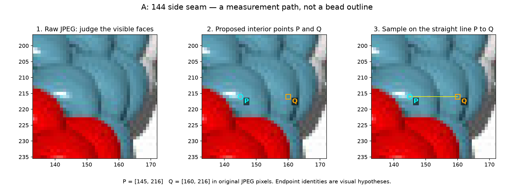
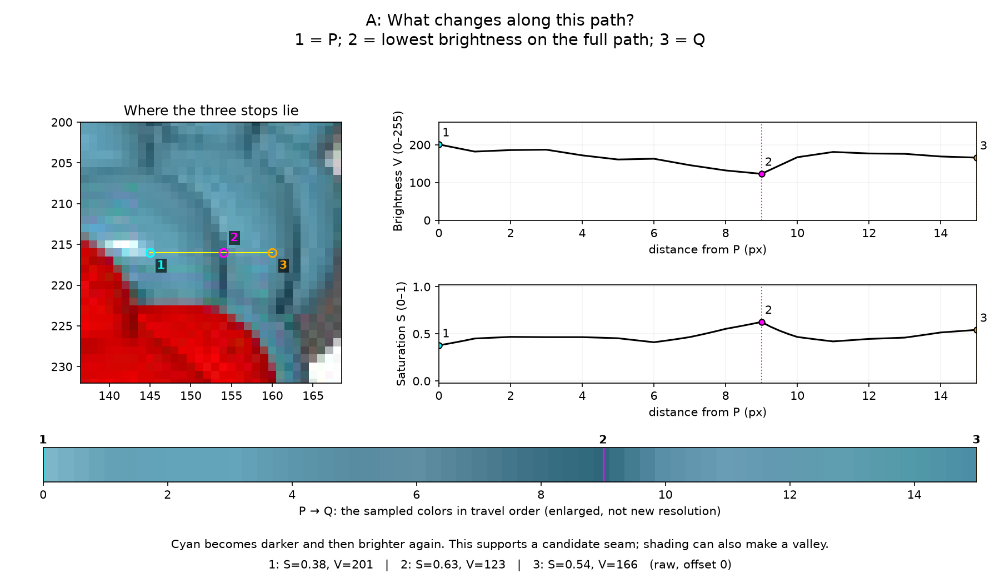
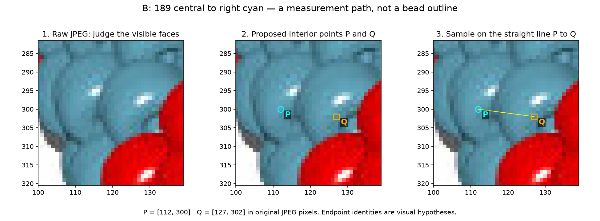
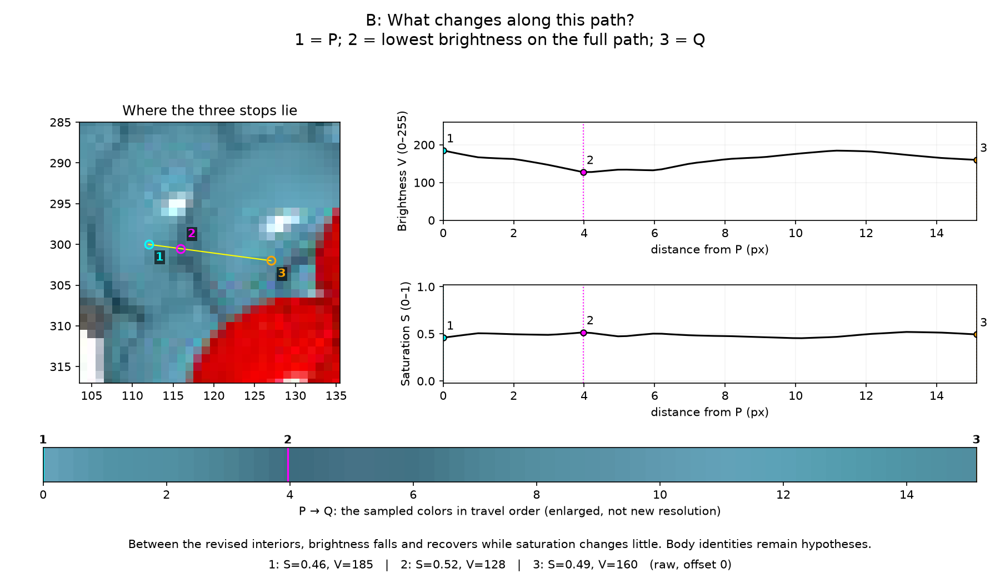

# Two questions about choosing useful paths — R087

**Both questions are pending.** These concern substantial visible portions in
beads6, not sliver ownership. The [walkthrough](BEADS6_SV_PATHS.md) explains the
old R082 lines and the new method; the [review page](review/r087/review.html)
shows the full set of pictures and measurements.

Each picture shows raw pixels, then proposed points P and Q, then a straight
sampling line. The line is where I read colors and brightness; it is not meant
to be a bead outline. The follow-on picture shows what changes as we travel from
P to Q. These are my visual hypotheses, not recovered bead identities.

## 1. Are A's two interiors a useful choice?

Near observation 144, I put P on the cyan patch just right of its highlight,
and Q on the broader cyan patch to the right of the dark stripe. **Do P and Q
lie inside two separate substantial visible bead portions, or is this a poor
connection to test?** If a point is poorly placed, a direction such as “move P
left/up” is enough; no exact coordinates or drawing are necessary. “Unclear” is
also useful. The lower extension is outside this question.

The path gets darker near stop 2 and brightens again. That makes the stripe a
candidate seam, but shading could do this too.

## 2. Does revised B examine the right neighboring portions?

Near 189, the first path K started in a shadow stripe; I have rejected it.
B instead connects a central cyan interior below its glint to the broader cyan
interior on its right. **Does B now examine the right pair of visible portions,
or would you choose a different connection in this crop?** Please describe which
portion or endpoint I am misreading, if any. The narrow left face and lower
continuation do not need ownership decisions.

For comparison, [the rejected K picture](review/r087/explain-K.png) and
[what happened along K](review/r087/journey-K.png) make the initial placement
mistake explicit. [The red-highlight example](review/r087/journey-H.png) shows why
a strong saturation change can also happen inside one apparent bead.

Answers by question number are enough. Future sessions must preserve these
questions and any answers in the handoff. This review does not change the inventory.
