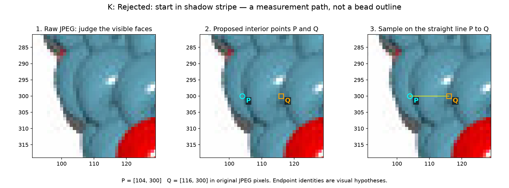

# Beads6 questions — answers saved, R089

**The two questions are answered.** The maker replied on 27 September 2026 and
also commented on both supporting examples. The [original three-page PDF](review/r088/beads6-questions.pdf)
is preserved as the document that was reviewed; its “pending” footer is historical.

| Reply / picture | Maker's answer | What changes in the analysis |
| --- | --- | --- |
| Q1 / A | P and Q are on different beads. The bright spot left of P is specular reflection. The surface darkens toward the first bead's edge, then lightens over the next bead. | Use the original A endpoints as a maker-confirmed different-bead pair. The one-bead explanation for this pair is superseded. |
| Q2 / B | P and Q are on different beads, for the same reason. | Use the original B endpoints as a second maker-confirmed different-bead pair. |
| Q3 / H | The bright spot is specular reflection; it does not signal a bead boundary. | Keep specular highlights out of boundary evidence. A highlight can change the sampled color within a bead. |
| Q4 / K | Both points are on boundaries between beads. | Reject **both** P and Q as interior references. My earlier explanation identified only P's problem and was incomplete. |

The PDF numbered only Q1 and Q2. Q3→H and Q4→K are interpreted from the order
of its two supporting examples on page 3; this association is recorded as an
inference. The answers themselves are preserved in [REQUEST_LOG](../REQUEST_LOG.md)
and a [structured record with coordinates and source hashes](beads6-sv-answers-r089.json).

**Value terminology:** the maker's visual description is darkening then lightening.
In conventional HSV, V=max(R,G,B), so V **falls** as pixels darken and **rises**
as they lighten. The reply used the opposite increase/decrease wording. The
saved R087 traces already use the conventional definition and are unchanged.

## The answered pictures

[A: the two different beads](review/r087/explain-A.png) ·
[B: the second different-bead pair](review/r087/explain-B.png) ·
[H: specular-highlight example](review/r087/journey-H.png).

K needs the explicit correction below: both marked endpoints are on boundaries,
even though the old picture's title mentions only the starting point.

These answers label the relationships at the original marked points. They do
not supply exact boundary pixels, complete bead outlines, eligibility of small
portions, chain indices, or labels for perturbed endpoints. All 310 active beads6
observations remain unchanged; full mask extents near 144/189 remain unresolved.
No new maker questions are needed for this round. Older photo-shadow questions
remain pending and separate from these answers.

Next: assess independently perturbed endpoints around the confirmed A/B pairs,
using H as a highlight example and K as an invalid-interior example. Show the
route and what changes along it; stop before masks, counts or indices are edited.
[Historical assessment](BEADS6_SV_PATHS.md) · [PDF reproduction](review/r088/README.md).
