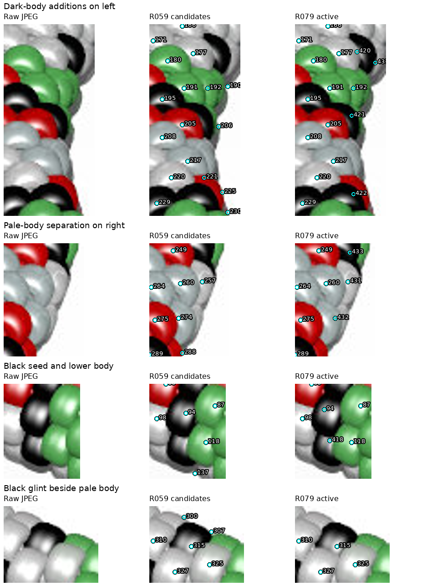
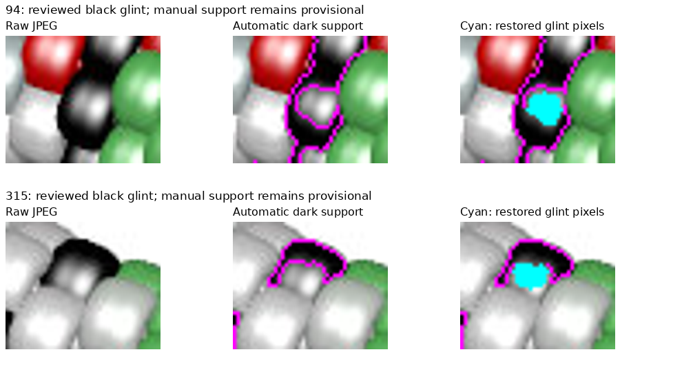
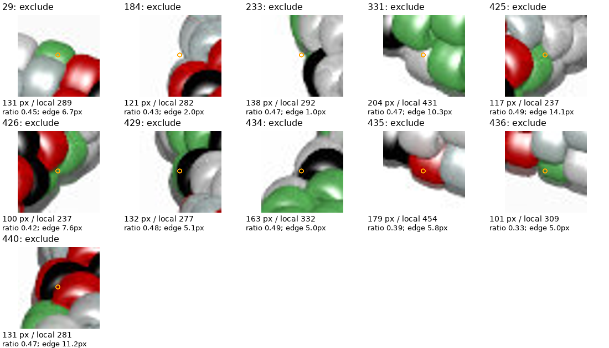

# beads7.jpg: five-color inventory — R079

**327 provisional active observations:** 45 red, 86 green, 62 black,
41 silver and 93 white. “Silver” is a pale blue-gray image label, not a claim
about physical composition. No complete inventory, physical centers, chain
indices or pattern is established. Beads3 122/405 and beads5 188 remain unresolved.

[Review page](review/r079/review.html) · [Active map](review/r079/active-overview.png) ·
[Records](review/r079/inventory.json) · [Parameters/hashes](review/r079/report.json)



## JPEG review

Only the JPEG and image-derived records/code informed the review; no POV source,
source pattern, rendering, photo analysis or indexing. Reviewed the full image,
eight baseline/revised numbered crops, coordinate close-ups, 16 initial and 12
later residual close-ups, envelope/palette/region maps and correction/area sheets.
The left review box was expanded to include 1,315 initially uncovered support
pixels. All final support is within the review boxes; this is coverage, not
proof of completeness.

417 baseline candidates − 102 removals + 23 additions − 11 area exclusions =
**327**. The [annotations](beads7-review-r079.json) retain 101 unsupported
boundary/tiny-fragment candidate removals and duplicate 133 of green 131.
Several removed boundary markers have nearby new interior observations: for
example white 431/432 replace the inadequate marker locations near 257/274.
No identity or chain correspondence is inferred from that proximity.

Many baseline white labels were glints on red or black bodies. Corrected these
from the JPEG. Pale silver/white labels share neutral support; reviewed silver
labels were aided by draft-region median G−R and B−R differences ≥5 (typically
8–12), versus approximately zero for white. This is an image-specific cue, not
calibrated material recovery. Chromatic spill, lighting and same-color seams can
still change the labels. Marker 24 was incorrectly labeled black in an initial
draft; its zero-area mask was corrected to white before selection. Marker 331
was similarly corrected from green to white before its small-area exclusion.

Additions 431/432 separate pale bodies from initial large region 260; 437/438
separate pale bodies from 163/214. These clear the area flags, without proving
that the resulting boundaries are correct. No beads7 large-area or sparse-reference
warnings remain. Beads7 211 is active; beads1's explicit exclusion is image-specific.

## Support masks and black glints

Close the baseline envelope with a 10px disk and fill enclosed holes ≤1,500px,
preserving the central opening. Red requires R−max(G,B) ≥25; green requires
G−max(R,B) ≥20; both require saturation ≥.13. Remaining maxRGB <95 pixels have
black support. Remaining envelope pixels share pale-neutral support. The
image-derived envelope includes uncertain shadow margins.

Fill enclosed glint islands ≤192px without overwriting chromatic cores. The
initial 128px limit omitted the 131px glint at black 362 and caused an artificial
small-area exclusion. Increasing the limit restores that body. Some glints remain
open to adjacent pale support. Two manually reviewed radius-5px disks restore
only neutral pixels to black: center (532,119) for 94, (269,403) for 315. Background
and red/green cores cannot be overwritten. These are provisional local corrections,
not a validated general highlight-recovery algorithm. Other open glints can remain
unassigned or enter neighboring pale masks.



Black 94 initially seeded a small disconnected side of its body, even after moving
the marker to (530,116). Glint repair reconnects the support before selection.
Black 315 is also retained after repair. Thus their initial small masks were not
accepted as evidence of slivers.

Per-class compact watershed uses sigma-1 brightness and compactness .03, a 28px
assignment limit and ≤6px seed snap. Black uses a flat surface and searches for
an interior seed within 4px, penalizing displacement by .5px per pixel. Keep only
the seed-connected component; 74 detached pixels remain unassigned. Shared
neutral support does not establish silver/white borders or actual bead silhouettes.

## R069 selection

Unchanged: compare with up to eight original reviewed neighbors within 45px,
require at least four, exclude below half their median area, warn above twice it.
Eleven exclusions: **29, 184, 233, 331, 425, 426, 429, 434, 435, 436, 440**.
Nine are near the heuristic edge; 425 and 440 are not. Ratios .494 at 425 and
.490 at 434 are threshold-sensitive. No sliver ownership was investigated.
Excluded pixels remain unassigned; retained masks do not expand during filtering.



112,078 support pixels; 5,992 initially unassigned; 1,517 ignored by selection;
104,569 active. The 133 original unassigned components ≥6px are residual pixel
regions, not missing-bead counts. Completeness, pale colors, physical centers,
same-color seams and dark/neutral shadow separation remain provisional. All chain
indices are null; no lighting hypothesis was verified.

## Reproduction and checks

Use local Python 3.12 and photo2/requirements.txt:

```sh
.venv/bin/python photo2/beads7_inventory.py --output photo2/output/beads7-final --review-bundle photo2/review/r079
.venv/bin/python photo2/beads7_inventory.py --output photo2/output/beads7-repeat --review-bundle photo2/output/beads7-review-repeat
.venv/bin/python -m unittest discover -s photo2 -p test_beads7_inventory.py -v
.venv/bin/python -m unittest discover -s photo2 -p test_inventory_selection.py -v
.venv/bin/python -m py_compile photo2/beads7_inventory.py photo2/test_beads7_inventory.py
```

Five controls cover enclosed chromatic/dark glints versus larger pale bodies,
shared neutral support, constrained manual glint repair, connected multiclass
segmentation and envelope gap repair. Together with seven selection controls,
**12 tests pass**. Compilation passes. Pipeline checks unique IDs, removals,
nonempty connected active masks, retained seeds, support classes, pixel areas,
null indices and no filter reassignment. Maximum seed snap 5px; every active
record has eight local references. These are implementation checks, not ground truth.

Seven source hashes, 18 curated artifacts (16 PNGs, HTML, inventory JSON) and
four bulk maps verify. Repeated artifacts are byte-identical and reports agree
except command paths. Verify them with:

```sh
.venv/bin/python - <<'PY'
import hashlib, json
from pathlib import Path
root = Path.cwd()
first = root / 'photo2/review/r079'
second = root / 'photo2/output/beads7-review-repeat'
a = json.loads((first / 'report.json').read_text())
b = json.loads((second / 'report.json').read_text())
sha = lambda p: hashlib.sha256(p.read_bytes()).hexdigest()
for name, digest in a['sources'].items():
    assert sha(root / name) == digest, name
for name, digest in a['artifacts'].items():
    assert sha(first / name) == digest == sha(second / name), name
for name, digest in a['bulk_artifacts'].items():
    assert sha(root / 'photo2/output/beads7-final' / name) == digest
    assert sha(root / 'photo2/output/beads7-repeat' / name) == digest
for report in (a, b):
    report.pop('command')
assert a == b
print('Hashes and repeated artifacts agree')
PY
```

HTML links checked; browser controls not exercised. No full legacy rendering or
indexing suite. No command/test failures; intermediate annotation and mask errors
are documented above. Routine/scratch/repeat outputs and environment remain
ignored; curated images are committed under R065.

## Saved questions and next step

No new maker questions. R069 answers remain applied; older
[photo-shadow questions](QUESTIONS_FOR_MAKER.md) remain pending and do not block
JPEG work. All seven generated images now have provisional active maps, with
no verified complete inventory.

Next bounded task: assess **beads5 188** with JPEG-visible boundary profiles and
neighboring-mask scale, retaining competing one/two-body hypotheses. Publish an
illustrated resolve-or-retain decision and stop before indexing or photographs.
Carry beads3 122/405 and all color/border limitations. Recommend **gpt-6-astra /
High, fresh `/new`**; user controls model and session changes.
