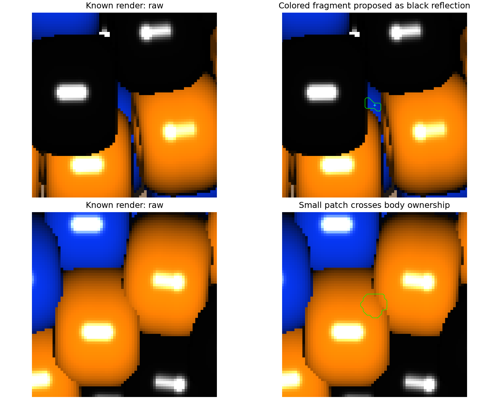
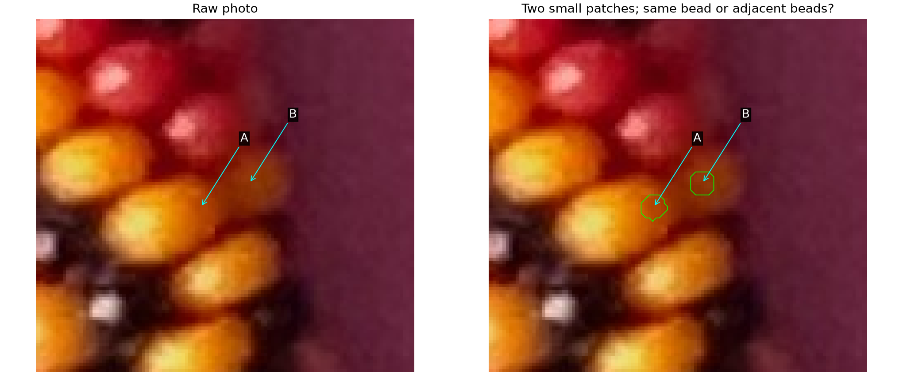
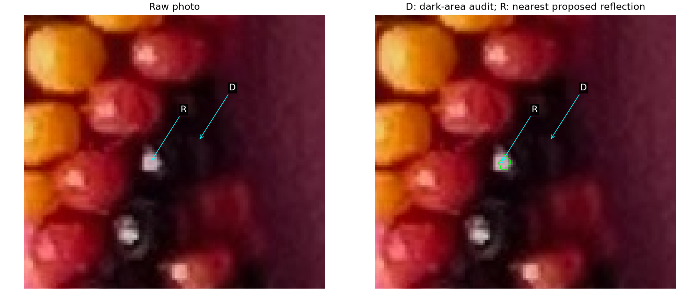

# Trusted interiors and body identities; ownership audit — R193–R195

The maker answers both Q192 questions **yes**. Preserve the exact reply and
reviewed image/candidate hashes in [the answer record](interiors-confirmed-r193.json).
The [current trusted ledger](review/r193/trusted-facts.json) adds precisely:

| Question | Observation names | Confirmed evidence |
| --- | --- | --- |
| Q192.1 | 959 yellow, 566 red, 565 yellow | Pictured small loops inside their respective bodies, away from dark seams |
| Q192.2 | 561, 558, 557 black | Three distinct black bodies; each pictured loop and reflection cross inside its corresponding body |

There are now **11 maker-confirmed positive region records**, plus two smaller
subsets inherited from the earlier confirmed regions. Six confirmed black
reflection locator records are separate from those regions. These counts mix
historical maker names and new observation names; they are not string indices
or a complete globally resolved body inventory. Unlabelled loops in the earlier
question pictures remain proposals. No full boundaries, body centers or outward
anchors are inferred. The earlier [R192 experiment](TRUSTED_BEAD_BASIS.md) and its
candidate pixels and supporting pictures are preserved.

**Further answers, R194–R195:** A119 and B960 are two different yellow beads.
D is inside a black bead different from the bead at R777. Preserve these
[exact identity answers and reviewed hashes](ownership-answers-r194-r195.json).
They establish point/body identities, not new safe loops. D's reflection and
positive region remain unresolved; its aliases to any other existing observation
are also unknown. Retain D in the coverage ledger without counting it as a
globally new unique body or attaching R777's reflection to it.

## Diagnose before changing the detector

Four comparisons: misplaced seeds, patches spilling across neighbors, colored
features mistaken for black reflections, and bodies lost through exclusions or
duplicate observations. The new curator audits the frozen input-only inventories
against known rendered body ownership. It changes neither image detection nor
simulated placement. No manual answers enter detector runtime.

Keep the previous diagnostic eligibility rule and denominator unchanged: at
least 12 true-body pixels with a 3-pixel inset, and at least one of those pixels
passing the approximate band-clearance gate. This rule is not a certified
definition of the maker's intended visible central bodies. In particular, a
body's safest pixels can pass that gate while the detector's seed fails it.

| Known fixture | Previous single-body coverage | Correct appearance and ≥3px pixel clearance | Missing: excluded seed only | Missing: no accepted seed | Missing: mixed region | Missing: unresolved region |
| --- | ---: | ---: | ---: | ---: | ---: | ---: |
| Positive hand | 87 / 141 | 84 / 141 | 35 | 15 | 3 | 1 |
| Negative hand | 87 / 141 | 81 / 141 | 35 | 16 | 3 | 0 |
| Changed palette/background/placement | 84 / 142 | 80 / 142 | 37 | 16 | 4 | 1 |

Thus the largest recorded miss category is the provisional edge gate. This
does **not** mean all of those bodies should be accepted: the maker excludes
indistinguishable edge slivers, and the evaluator's eligibility can admit weaker
visibility than intended. Retain these reasons instead of silently discarding
bodies or changing the denominator. Among misses there are 42/42/45 colored
bodies and 12/12/13 black bodies. [Full ownership/miss/duplicate audit](review/r193/ownership-audit.json)
retains every witness.



At top, the proposed black reflection is actually on a small colored fragment
between darker bodies. At bottom, a colored seed is correctly inside one bead,
but its small patch crosses into a touching bead of the same color. A correct
seed, matching hue and a small footprint do not by themselves establish a safe
region. Across all three fixtures, 13 of the 15 mixed regions are black proposals;
the other two are chromatic. All six falsely assigned black-reflection points
already have their seeds on colored bodies: these are identity errors rather
than relocation to the wrong body during native refinement.

The falsely assigned reflection support has median saturation 0.951–0.985 and
70.5–100% membership in learned color families. Correct black-reflection support
is neutral in these particular renders. In the real photo's 256 candidate
reflection supports, learned-family fraction is at most 11.4%; the three newly
confirmed black supports have fraction zero. These are **diagnostic appearance
measurements**, not a newly adopted rejection threshold or a guarantee for
different lighting, reflected colors and materials. [Photo checks](review/r193/photo-audit.json)
also retain all close same-color pairs; none is automatically merged.

## Q193.1 — Close yellow observations: one bead or two?



A is observation **119**; B is **960**, added by the native coverage search.
They are 16.41 native pixels apart (about 0.60 apparent bead diameter). The
interior bridge's value ratio is 0.925 and hue coherence 1.00, which alone could
suggest a duplicate. **Are A and B two different yellow beads, or two patches
of the same yellow bead?** **R194: “Two different yellow beads.”** Preserve the
distinct identities; the bridge measurements are a counterexample to merging
solely by proximity, matching hue and a bright connection.
This does not ask for a bead boundary or an exact center.
This identity check alone will not certify the new loops' seam clearance.

The measurement follows the straight A→B path at 25 evenly spaced native-image
positions, interpolates RGB, then converts to HSV. Discard four samples at each
end; compare the minimum interior V with the smaller endpoint V. Hue coherence
is the fraction of remaining samples with S>0.35 whose circular hue is within
20° of the input-learned mode. Low-saturation samples do not vote on hue.
This short diagnostic path does not establish a seam or a common body.

## Q193.2 — Does an unmatched dark area represent a missing body?



D marks a native unassociated dark area at (241,1272). R is the nearest proposed
reflection, observation **777**, about 21 pixels away. **Does D lie in the same
black bead as R, in a different black bead, or in a gap/background?** If this
stretch is too close to the edge to tell, retain uncertainty and exclude it from
the trusted active set. **R195: “Different black bead.”** D is a confirmed black
body point, separate from R777. Its own region/reflection and other aliases remain
unknown. No pixels, new string index or global unique-body count is invented.

## Reproduction and stopping point

```bash
.venv/bin/python photo2/audit_bead_evidence.py
.venv/bin/python -m unittest discover -s photo2 -p 'test_bead_evidence*.py'
```

The audit requires the saved R192 native calibration inventories and R167
appearance/ID fixtures. Their exact hashes, source code and curated outputs
are recorded in [the summary](review/r193/summary.json). Recreate those routine
inputs with the R192 reproduction commands if needed. The curator verifies
the earlier reviewed photo, candidate ledger and two supporting images before
applying answers. Nine tests cover extraction plus exact confirmation scope,
changed-answer/identity refusal, mixed/false/duplicate/excluded accounting and
keeping identity answers separate from region/reflection confirmation.

**Stopping point:** six reviewed patches promoted, prior evidence preserved and
ownership/miss causes diagnosed, and both new identity answers incorporated.
Universal photo reliability and coverage remain unverified. **Next bounded
task:** locate D's reflection/positive patch and check other aliases, then test
image-derived region separation and evidence-based eligibility before promoting
more bodies. Keep unknown aliases, missing bodies and uncertain
reflections explicit. Fitting and the saved zero-net-stretch allowance remain
deferred. Recommend **gpt-6.1-sol / High**, same session; no `/new`.
