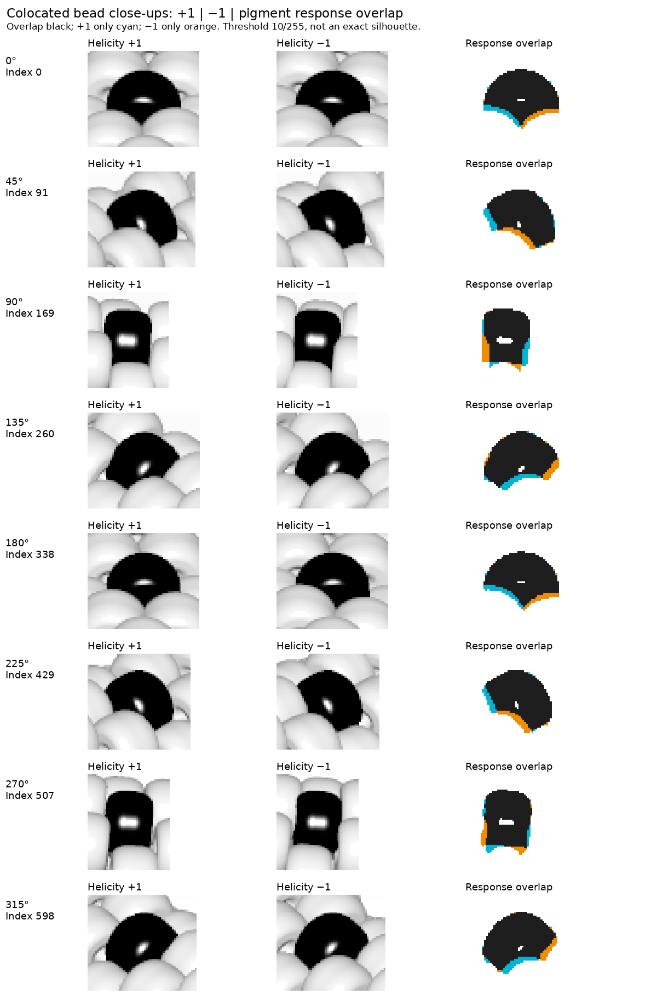

# One black bead: eight necklace locations and both helicities — R084

This is a known-index shape experiment requested by the maker. It replaces the
queued beads5 area diagnostic as the current step. The full review is
[here](review/r084/helicity.html): eight paired animations, aligned close-ups,
and links to all 416 frames in contact sheets. Each helicity has eight walks
advancing the black bead by one index for 26 frames. There are no extra baseline,
object-ID or isolated-bead renders. The maker explicitly extended the initial
one-location request to eight locations, then requested opposite helicity.

## What the experiment shows

The visible portion is an occluded part of the rounded bead, not a fixed oval.
As the index advances around the rope, a broad exposed face becomes a side
crescent, disappears behind adjacent beads, and reappears at the opposite edge.
The foreground neighbors carve concave boundaries into the visible portion.
A bead can retain a white specular highlight even when its pigment is black.

In the +1 sequence at the first location, indices 0/1 have broad/side exposure; 3/4 have no measurable
pigment response, and 5/6 reappear at the other edge. Indices 6/7/8 show another
broad-to-side progression. At the 45° location, indices 85/86/87 progress from a
broad central portion to an outer-edge portion; 88/89 disappear and 90 reappears.
These are render indices, **not** observation IDs in any beads1–beads7 inventory.



For these static comparisons, the selected black index is divisible by 13:
0,91,169,260,338,429,507,598. At exactly 6.5 beads/turn, changing the sign of the
minor-circle winding leaves those beads at the same 3D position and orientation.
The surrounding beads' overlap changes. This isolates a subtle difference in
the exposed edges without mistaking movement of the black target for a change
in its visible shape. The cyan/orange areas show where the two pigment-response
masks differ; they are not exact geometric silhouettes.


The colocal comparisons reveal the difference the maker pointed out: the
foreground overlap switches between sides of the black bead. In the 0°/180°
examples, the lower-left and lower-right cut-ins change in opposite directions.
At 90°/270°, the side coverage and lower corners change. These cues rotate with
the local rope direction; the total exposed area can remain nearly unchanged.

| Region | Colocated index | +1 response pixels | −1 response pixels | Response intersection / union |
| --- | ---: | ---: | ---: | ---: |
| 0° | 0 | 700 | 696 | 0.8713 |
| 45° | 91 | 667 | 678 | 0.8655 |
| 90° | 169 | 653 | 664 | 0.8317 |
| 135° | 260 | 678 | 666 | 0.8589 |
| 180° | 338 | 687 | 678 | 0.8724 |
| 225° | 429 | 792 | 810 | 0.8693 |
| 270° | 507 | 871 | 885 | 0.8661 |
| 315° | 598 | 827 | 806 | 0.8749 |

Across these eight examples, paired response areas differ by less than 2.6%
(relative to their pair mean), yet intersection/union is only 0.832–0.875.
This measures localized differences in visible pigment response, including
sampling/lighting effects; it is not an exact geometric silhouette measurement
or a calibrated helicity classifier. Fixed camera/light and opaque material
are deliberate controls, and the result has not been validated on photographs.

In the paired animations the index is always matched, but most intermediate
indices have different minor-circle positions between the two helicities. Those
frames illustrate the opposite progression as well as changing visibility.
Camera, light and bead hole axes remain fixed; this is the existing `Helicity`
switch, not a mirrored picture or reversed camera.

[Wider context at each comparison](review/r084/helicity-overview.png) ·
[All +1 walks](review/r084/angles.html) ·
[All −1 walks](review/r084/opposite/angles.html)

The review retains all hidden positions in the sequence. No existing inventory
is changed, and no ignored fragment is assigned ownership. In particular this
does not resolve beads6 144/189 or establish their original source indices.

## Consequence for the boundary method

The maker's criticism identifies two gaps in R082. Its short transects measured
V=max(R,G,B) across hand-selected candidate seams, rather than following S and V
along a path between neighboring bead interiors. It also did not compare those
regions with the visible shapes predicted by the bead geometry and occlusion.

This experiment supplies direct examples for the second gap. A future boundary
comparison should use the rounded bead surface, neighbors' overlap and local
viewing direction to predict the exposed portion, then check S/V evidence along
candidate paths between visible interiors. The numerical area cutoff alone
cannot establish a bead's identity or boundary.

The white/black palette has essentially zero saturation. It cannot test the
usefulness of saturation changes in the colored JPEGs, and recoloring creates
contrast that same-color neighbors do not have. S/V path tracing remains the
next bounded task; it has not been implemented here. The synthetic shapes are
calibration evidence, not proof that a particular JPEG region has a given shape.

## Scene and measurement details

The scripts use the original `beads.pov` placement and `bead-shape.inc` geometry,
with legacy palette case 3: shiny opaque white/black, phong 1.5, roundedness 0.8,
height/size 0.7, relative size 1.0. CustomColorPattern supplies 676 entries with
exactly one black; CustomPatternGroups=1. This gives 104 turns at exactly 6.5
beads per turn. Both Helicity=+1 and -1 are rendered. Starts are
0,84,169,253,338,422,507,591, approximately
45° apart around the major circle. Each 26-frame walk spans 25 index increments,
13.31° along the major circle, and covers four groups of 6.5 bead positions.
Start phase also varies with the chosen integer index; this is a sample of views,
not a phase-matched isolation of viewing angle.

The camera stays at <50,-600,500>, look_at 0, angle 10; light stays at
<100,-1000,1000>, White*1.4, with the original white plane. Clock is
0.2500025001; POV-Ray reports residual rclock=0.000000027. Images are 1200×900
8-bit PNG, quality 9, antialias threshold 0.1, jitter off, two render threads.
POV-Ray 3.7.0.10.unofficial emits the existing missing-assumed_gamma/version
warnings; legacy gamma behavior is retained. No claim of matching the older
JPEG encoding or every original render setting is made.

For each walk, a pixelwise maximum of its 26 images approximates an all-white
reference without rendering a 27th image. With these opaque materials, no
reflection and no radiosity, the pigment change is localized to the bead's
visible surface, apart from sampling effects. The report counts pixels whose
largest channel decrease exceeds 3, 10 or 25 on the 0–255 scale. Counts are
**pigment-response areas, not exact silhouettes**: clipped highlights and weak
edge pixels can be absent. Zero means no measurable response at that threshold
and resolution. Small nonzero responses are retained as evidence without
changing the instruction to ignore slivers in active inventories.

Within each walk the crop and scale are fixed. Each single-helicity eight-row
overview selects
three consecutive frames around the largest response at each location; all
26 frames remain available in the contact sheets and animation. Overview crop
sizes can differ between locations. The animations are display derivatives,
not additional POV-Ray renders. Raw PNGs, wrappers and renderer logs stay ignored;
curated sheets, animations, reports and review pages are committed.

## Reproduce and verify

```sh
.venv/bin/python photo2/black_bead_angles.py
.venv/bin/python photo2/black_bead_angles.py --helicity=-1
.venv/bin/python photo2/black_bead_angles.py --analyze-only
.venv/bin/python photo2/black_bead_angles.py --helicity=-1 --analyze-only
.venv/bin/python photo2/compare_black_bead_helicity.py
.venv/bin/python photo2/verify_black_bead_walk.py
.venv/bin/python photo2/verify_black_bead_walk.py --helicity=-1
.venv/bin/python photo2/verify_black_bead_walk.py --comparison
.venv/bin/python -m py_compile photo2/black_bead_walk.py photo2/black_bead_angles.py photo2/verify_black_bead_walk.py photo2/compare_black_bead_helicity.py
```

The first two commands render missing frames only and validate/reuse existing
frames. The analyze-only commands and comparison rebuild illustrations from the
same renders, with no new POV-Ray image. [The comparison report](review/r084/helicity-report.json)
links the two eight-location reports, which in turn link each
walk's source/image hashes, commands, actual phase and response measurements.
The verifier, run for each helicity, checks all 416 one-black assignments,
consecutive indices, image
sizes, source/artifact hashes, response counts, sixteen 26-frame animations and
HTML links. It does not prove exact silhouette recovery or test an inverse model.

Checks completed: both 208-frame verifications, comparison verification and
compilation pass. All 416 raw frames have exactly one black assignment and
consecutive indices within each walk; source/image/artifact hashes, response
counts, 24 animations and local links verify. The comparison creates no extra
renders. Ninety-two artifacts checkpointed before comparison remain byte-identical.
Inspected both eight-location overviews, all eight aligned shape close-ups and
selected full walk sheets. No browser playback, inverse-model tests or legacy
rendering suite was run. Initial overly strict phase assertion and a draft
comparison-script newline syntax error were corrected; no render was repeated.

No new maker questions; prior photo-shadow questions remain pending. Next:
measure S and V along a few explicitly illustrated paths between visible bead
interiors in beads6, guided by this shape experiment; compare real candidate
seams with within-bead shading/highlight controls. Stop at an illustrated method
assessment before changing masks, counts, exclusions or indices. Recommend
**gpt-6-astra / High, fresh `/new`** when ready; no need to continue tonight.
