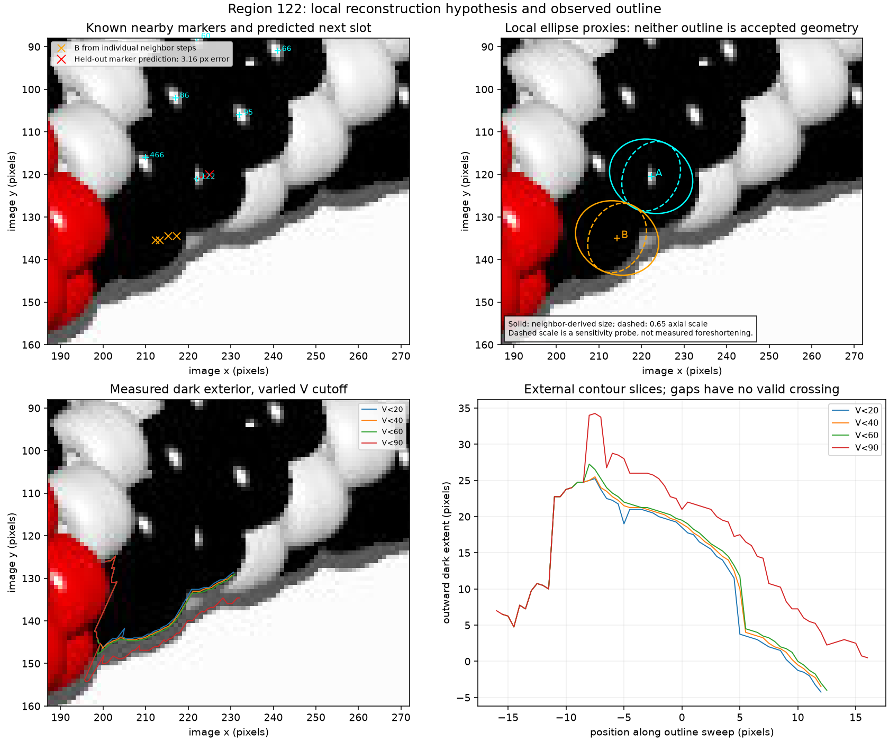
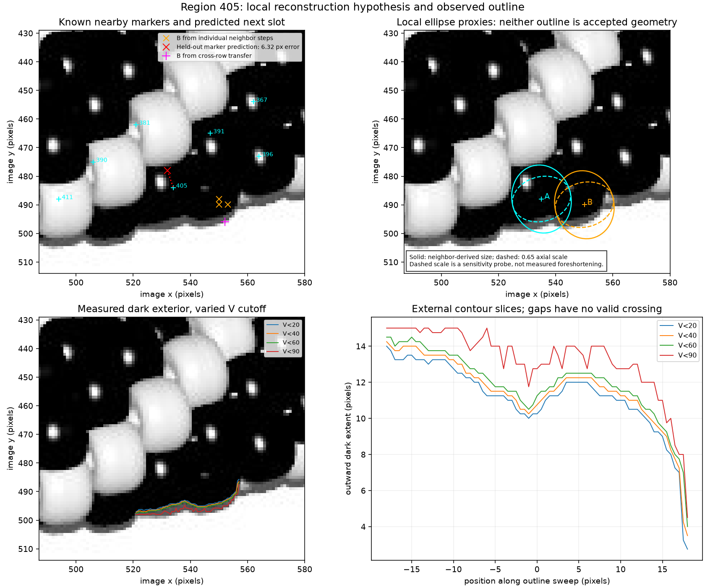

# Black regions: neighborhood geometry first — R073/R074

The maker recommends predicting neighboring bead positions and comparing their
projected outlines as the primary method. HSV profiles provide supporting
evidence. This first diagnostic implements that direction on **beads3 regions
122 and 405**, using only the JPEG and the saved R071 observations. It exposes
position/shape calibration errors that must be fixed before accepting splits
or bead indices. The inventory remains **304 provisional observations**.

[Interactive outline inspection](review/r073/review.html) ·
[Numerical measurements](review/r073/diagnostics.json) ·
[RGB/HSV samples](review/r073/profiles.csv) · [Reproduction report](review/r073/report.json).

## Local geometry and its prediction check

Hand-selected nearby marker pairs provide examples of one local row step.
Their median displacement predicts another slot. These are image-space
adjacency hypotheses, not known index differences. For the existing target,
withhold every pair containing that target and predict its marker from a
neighbor. Separately leave each calibration pair out and predict its endpoint
from the other displacements. This is a small diagnostic on preselected pairs,
not independent validation across the bracelet.

| Region | Held-out target prediction | Existing marker | Error | Calibration pair leave-one-out errors |
| --- | --- | --- | ---: | --- |
| 122 | (225, 120) from 95 | (222, 121) | 3.16 px | 2.24–4.12 px |
| 405 | (532, 478) from 391 | (534, 484) | 6.32 px | 1.80–3.16 px |

At 405 the error exceeds all three calibration-pair errors. Marker positions
can be displaced from highlights and physical centers; local projection can
also change spacing. These checks cannot distinguish those causes yet. A
highlight, reviewed marker and visible-mask centroid are three different
quantities. Existing markers are comparison measurements, not center truth.

For outline inspection, use neighboring masks' second moments to estimate a
common principal axis and ellipse radii. Transfer their median marker-to-mask
centroid offset to the candidate positions. Uniform filled ellipses would have
radius twice the corresponding coordinate standard deviation, but these masks
are neither full ellipses nor confirmed silhouettes. The resulting outlines
are deliberately labeled **proxies**. Row direction and bead long axis are
estimated separately. This is a 2D neighborhood model, not a reconstruction of
POV-Ray's 3D projection, occlusion, holes or lighting.

The interactive page moves candidate B in 0.25-pixel increments along the two
projected axes and changes its axial scale. It does not save changes or fit an
optimum. Static images also show a 0.65 axial-scale sensitivity probe; that
number is not measured foreshortening. All inspected alternatives remain
hypotheses. The next-slot estimate at 122 uses the full local step set; only the
held-out test excludes target-containing pairs.



At 122 the candidate below the existing observation lies near the black/gray
edge. Its transferred outline includes shadow/background. The data do not
establish a second full body or its center. Other local arrangements remain
possible, including continuation below neighboring 466.



At 405, transferring a row step gives candidate B near (550.06, 489.97).
Transferring a cross-row displacement instead gives (552.06, 495.97), a
6.32-pixel disagreement. The proxy outline visibly extends into background.
Simply adding an ellipse at a predicted slot does not resolve the region.
The small exterior indentation near x=538 supports examining separate bodies,
but does not determine their count or internal boundary.

## HSV supporting measurements

Sample bilinearly interpolated RGB at intervals no larger than 0.25 pixels,
then convert to HSV. Use the candidate-center line and, separately, a manually
placed highlight/dark-patch line. Extend each by 25% at both ends. Five parallel
traces at offsets −2, −1, 0, 1 and 2 pixels show sensitivity to line placement;
retain both the center trace and median V. H is displayed only if V ≥ 0.08
and S ≥ 0.15. These neutral samples supply no usable hue under that rule.
Peaks with median-V prominence ≥5 are measurements, never bead counts.

| Region | Nearly black samples on candidate-center line (max RGB ≤2) | Median V in middle 60% of five-line profile, 0–255 |
| --- | ---: | ---: |
| 122 | 77.6% | 0.76 |
| 405 | 71.7% | 0.74 |

At 122 the manually placed line also lacks a distinct second glint. Small
multiple peaks around its first highlight illustrate why peak counting fails.
At 405 the separately placed line finds a faint second highlight: centerline
V reaches 76.36, but the five-line median reaches only 6.43. It is narrow and
placement-sensitive. The candidate-center line misses it and has no detected
median-V peaks. This supports looking there; it does not establish two beads.

[122 HSV plot](review/r073/122-hsv.png) · [405 HSV plot](review/r073/405-hsv.png).

## How uncertain is the dark exterior?

Sweep outward along fixed rays, locating the last neutral dark sample with
V below 20, 40, 60 or 90. Reject saturated red neighbors unless V ≤5, and mark
clipped/no-crossing rays missing. This measures a dark envelope, which can
include shadow or another body; it is not a segmented bead boundary.

| Region | Rays with a crossing at all four cutoffs | Median cutoff-dependent band | Maximum band |
| --- | ---: | ---: | ---: |
| 122 | 52/65 | 5.38 px | 13.75 px |
| 405 | 73/73 | 2.00 px | 4.75 px |

These are distances along the chosen sweep rays, **not calibrated uncertainty
intervals or pure shadow widths**. In particular, 122 includes neighboring red
transition pixels and rays reaching different parts of the envelope. The plots
make that failure visible. The much larger sensitivity at 122 warrants reduced
weight for this exterior when fitting a local model. At 405, a roughly 2-pixel
indentation persists at the lower cutoffs, despite the wider shadow cutoff.

An exploratory unrotated one/two-ellipse exterior fit did not favor the
two-ellipse model. It was rejected: fitting an incomplete envelope with that crude shape
is underconstrained and is not evidence for one bead. Those exploratory
fits are not acceptance results; the reproducible diagnostic here retains
the measured contours and competing hypotheses instead of selecting a count.

## Next bounded task and saved advice

Calibrate projected centers and outlines on clearer neighboring bead bodies,
using their visible contours and local occlusion. Fit local spacing/projection
jointly, then repeat withheld-neighbor position and contour checks. Stop at an
illustrated calibration report before assigning missing beads or indices.
Maintain alternative local arrangements when evidence cannot distinguish them.
Only after geometry passes those checks should dark-region splits be assessed
with visible-area support and the existing ignore-slivers rule. Beads4 review
is deferred for this local diagnostic.

**Saved maker answer (R074):** approach 2 is primary because it should be more
reliable in very black regions and neighbor prediction is necessary for proper
indexing; approach 1 can solve part of the problem. No new questions are needed
for the calibration step. Earlier photo-shadow questions remain in
[QUESTIONS_FOR_MAKER.md](QUESTIONS_FOR_MAKER.md); they do not block this work.

## Reproduce and check

Use Python 3.12 and the locally pinned requirements. If ignored R071 bulk maps
are missing, rebuild them into scratch review output, preserving the committed
R071 bundle:

```sh
.venv/bin/python -m pip install -r photo2/requirements.txt
.venv/bin/python photo2/beads3_inventory.py --output photo2/output/beads3-final --review-bundle photo2/output/r071-rebuilt-review
.venv/bin/python photo2/black_region_diagnostics.py --output photo2/output/black-region-r073 --review-bundle photo2/review/r073
.venv/bin/python -m unittest discover -s photo2 -p test_black_region_diagnostics.py -v
```

The diagnostic verifies the image, source inventory and label-map hashes before
use. The report binds configuration, code, tests, dependency file, sources and
seven artifacts (four PNGs, HTML, CSV and measurements JSON). Bulk maps,
environment, caches and exploratory outputs remain ignored. Five controls cover
bilinear measurements, black/undefined hue, two-glint measurements, target
holdout leakage, and clipped/red exterior scans. Matplotlib was initially
missing; installation in `.venv` resolved that import failure. No POV source,
renderer truth, source indices or photo inputs are used.
