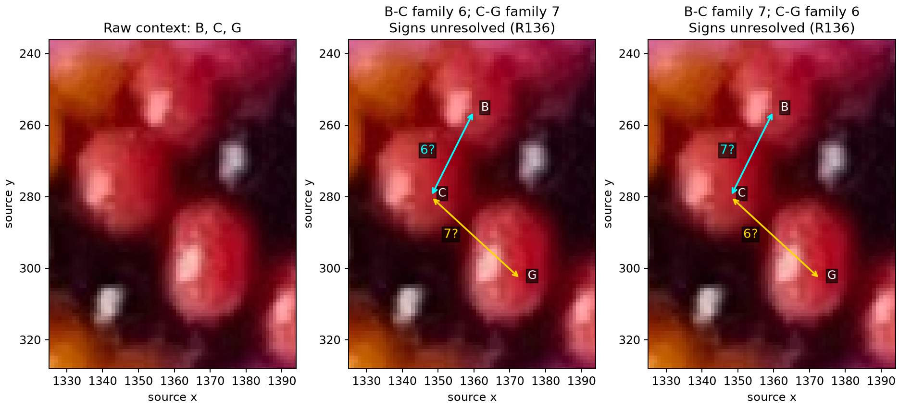
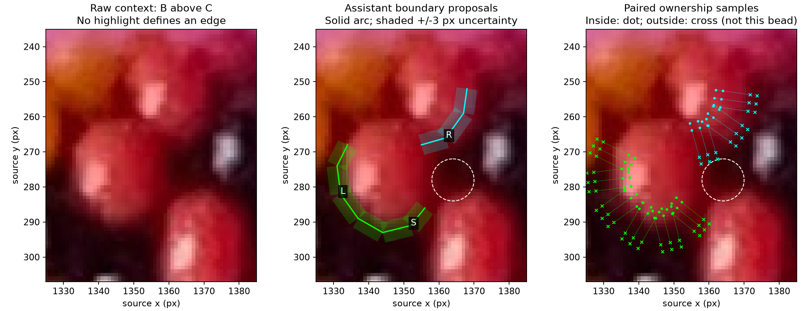
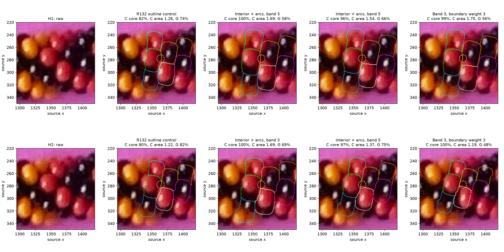
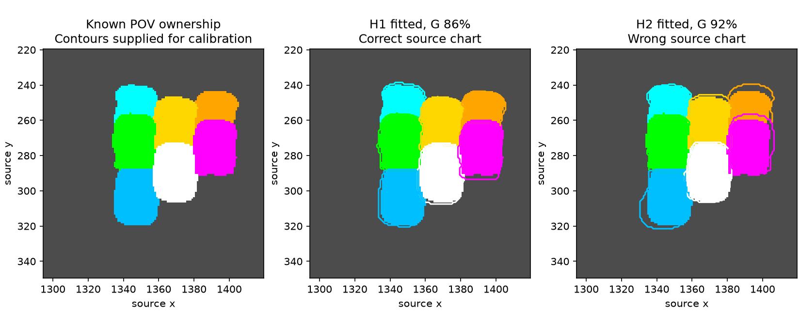

# Boundary brackets and local correspondence — R135–R136

**Completed to review:** sparse boundary brackets did not produce a reliable
replacement fit under the two older charts. R136 then supplied coupled B/C/G
families that neither chart represents. Preserve the comparison as a diagnostic;
next test those family alternatives before further shape tuning. This is stage 1
(local geometry and neighbors) in [PLAN.md](../PLAN.md).

## Maker evidence received during the step

[Q132.1 answer](SURFACE_CONSTRAINT_QUESTIONS.md) and
[hashed annotation with signed discussion alternatives](neighbor-review-r136.json):

- If B–C is direction 6, C–G is direction 7.
- If B–C is direction 7, C–G is direction 6.
- Both signs remain unresolved.



Both previous photo charts assign B/C to family 1. Neither represents the supplied
alternatives; supersede them as active photo mappings. Keep their frozen reports
as historical controls. This does not choose either family or sign, establish
E/F/H/J relations, supply a full-string origin, or recover indices. With C as a
local discussion origin, the weighted sums permit B = +/-6 and G = +/-7, or
B = +/-7 and G = +/-6. Eight signed alternatives are recorded without acceptance.
The coordinates are relative labels, not physical bead centers or source indices.

R136 arrived after all eight numerical cases completed. No fit in this experiment
uses the new relations. Future candidate graphs will use the maker's C/G family
information; G's pixels can remain withheld from continuous fitting, but its
neighbor family will no longer be unknown to that graph construction.

## Methods and raw evidence

Three methods were presented: paired inside/outside boundary samples, distance
to selected segments, or image-gradient transition matching. Selected the first
for this bounded test. No new detector, appearance range or model geometry.

R137 requested [wider raw context and whole-photo placement](review/r135/wider-context.png),
now included in both question files.



[Three hand-selected segments](boundary-arcs-r135.json) follow C's left (L) and
lower (S) red-to-dark transitions and B's lower-right (R) transition. These are
assistant proposals, not maker-confirmed outlines. Segment labels L/S/R are
separate from bead observation IDs; original observation L remains excluded. Uncertain upper paper-shadow
and black-on-dark edges are omitted from the new boundary constraints. Black
E/F/H/J still supply their previous interior cores; G is held out. The complete
original twelve observations and excluded A/D/I/K/L remain preserved; D is
separate from B. This fitting patch does not establish a complete body inventory.

In source pixels, x points right and y down after EXIF orientation, without
resizing. An interior hint sets each segment's inward normal; it is not a center,
highlight anchor or torus-outward point. Samples are placed roughly every three
pixels along each segment. For half-band h, pairs lie h+1 and h+3 pixels inward
and outward. The arc and its intervening uncertainty band receive no ownership
label. Inside samples request that body's ownership; outside samples request
only that it is not the owner. Dark pixels are not thereby classified as paper
or assigned to another bead. No fixed hue box is used.

Both samples must lie outside the existing diagnostic radius-6 circle about P.
They must also stay on the intended sides of the supplied rough region: inside
within its polygon, outside beyond it. This local validity check does not penalize
the rest of the polygon exterior. Cores use the same erosion-3 support as R132,
with unknown P excluded from penalties and distance-transform boundaries.

A preflight synthetic check found three invalid pairs at thin/concave portions:
nominal inward offsets crossed a second boundary. The region validity check
rejects all three; no photo pairs are rejected. The first two synthetic fits
before this correction were retained only in ignored diagnostic outputs and
are superseded. On the final known truth pose, all retained synthetic cores and
brackets agree exactly. A targeted thin-body test guards this failure.

## Fitting and checks

The geometry is the existing rounded annular bead and straight planar section,
including latent occluders. Six continuous pose/scale parameters are refitted;
the 55-degree local camera/phase convention remains a gauge, not measured camera
elevation. The photo uses the frozen nominal perspective calibration. Local
bounds and two starts from R132's outline/core fits are identical across methods;
G never ranks starts or enters the numerical training loss.

The loss is mean per-body core miss plus w times mean per-body bracket miss.
Bracket sides count equally; B and C count equally despite different sample totals.
Two-pixel then one-pixel core sampling uses bounded Powell search with at most
350 evaluations per stage. A worse final line-search result does not replace its
starting pose. The bracket coordinates remain subpixel and use Python ownership.
Final full-grid visible masks and region metrics are independently rendered by
POV-Ray, not inferred from those bracket scores.

Six cases compare both charts on a known contour-supervised synthetic example
(h=3, w=1), and the photo at h=3/5, w=1. Two more photo cases test w=3, h=3 after
the first comparison retained size/support tradeoffs. Every reported C/F core
metric and area/G overlap uses common erosion-3/radius-6 evaluation support.
Training bracket scores at h=3 and h=5 have different support; the compact report
also evaluates all candidates on the common h=3 brackets. No holdout score
selects an accepted chart or influences numerical fitting.

## Results and stopping point



| Photo chart / constraint | C core covered | F core covered | C area / rough observed area | G overlap |
| --- | --- | --- | --- | --- |
| H1 old outline control | 81.7% | 85.0% | 1.26 | 73.9% |
| H1 band 3, weight 1 | 100.0% | 87.3% | 1.69 | 58.1% |
| H1 band 5, weight 1 | 96.2% | 92.8% | 1.54 | 65.8% |
| H1 band 3, weight 3 | 99.5% | 84.4% | 1.70 | 55.6% |
| H2 old outline control | 79.9% | 72.7% | 1.22 | 82.4% |
| H2 band 3, weight 1 | 100.0% | 83.8% | 1.69 | 68.6% |
| H2 band 5, weight 1 | 97.0% | 83.4% | 1.37 | 75.0% |
| H2 band 3, weight 3 | 99.7% | 67.8% | 1.19 | 48.2% |

Overlap is intersection/union against an uncertain assistant polygon with P's
circle removed. It is not an accuracy probability. Area ratios are diagnostics,
not measured physical size errors. Stronger H2 brackets improve C's apparent
size, but H core coverage falls to 30.2% and mean training-core coverage to 69.6%.
The raw comparisons show why C alone cannot determine the fitting decision.
H1 retains an enlarged C. No tested replacement is accepted.



In the known synthetic example, the correct chart satisfies all cores/brackets;
the wrong chart satisfies every bracket and 99.89% of training cores. G overlap
is 86.3%/91.9%, favoring the wrong chart in this single measure. Sparse arcs improve
local size constraints but still do not establish correspondence. The supplied
contours make this an assisted geometry test, not automatic image detection.

All eight full-grid Python/POV checks pass: at most 12 differing pixels out of
16,250 (0.074%). Eight of 32 optimization stages hit their evaluation caps, across
six cases. Retain that limitation: these local fits do not prove an impossible
geometry, a global optimum, or that the entire mismatch is caused by the chart.
R136 supplies independent maker evidence for changing the chart premise.

**Stop:** completed boundary comparison and preserved R136. **Next bounded task:**
compare the two coupled B/C/G family alternatives and unresolved signs, rebuilding
other proposed patch relations from supported evidence. Keep P unknown, active
central black bodies, missing slots, and G's pixel holdout. Do not carry the old
E/F/H/J offsets into a new graph as maker facts. [Q135.1](BOUNDARY_ARC_QUESTIONS.md)
about L/S remains pending; Q132.1 is answered. Recommend gpt-6.1-sol / High;
stay in this session, no /new required.

## Records and reproduction

[Six-case report](review/r135/report.json),
[stronger-weight report](review/r135/weight-report.json),
[common comparison and hashes](review/r135/summary.json), and
[final integrity checks](review/r135/checks.json). They preserve source
hashes, starting/final poses, selected samples, render commands and optimizer
outcomes. R126/R132 numerical reports remain unchanged. Ordinary scenes, raw
logs, cached images and the superseded preflight run remain ignored.

```sh
.venv/bin/python photo2/fit_boundary_arcs.py
.venv/bin/python photo2/check_boundary_weight.py
.venv/bin/python photo2/review_boundary_arcs.py
.venv/bin/python -m unittest discover -s photo2 -p 'test_*.py' -v
```

The stronger-weight helper hashes the original tracked six-case report as a
comparison reference; its fit starts come from R132. It does not require replacing
tracked reports to run. The reviewer regenerates
old control renders from tracked poses; it does not require ignored R132 PNGs.
`fit_boundary_arcs.py --resume` resumes only unchanged-source complete cases.
No packages were installed and no agents were delegated.
