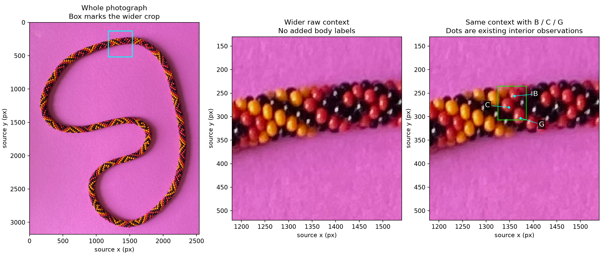

# Local boundary review — R135

## Q135.1 — C's left and lower segments

Do the green segments **L** and **S** follow C's left and lower boundary, or does
either run through C's visible surface? Suggested answers: both plausible;
only L plausible; one or both misplaced/unclear. An unclear answer is useful.

L/S/R label segments, not additional beads; original observation L remains excluded.
The band is an assistant proposal, with +/-3 source pixels of uncertainty;
it is not a maker-supplied exact edge. Dots are proposed samples inside C;
crosses mean outside C, without assigning paper or another bead. Cyan R is the
separate B segment. Highlights do not define any of these edges. The omitted
circle about P remains unassigned under R130–R131. Q132.1 about B/C's
neighbor family is answered by R136 with coupled 6/7 alternatives, signs unresolved.

**Status: pending.** This is optional evidence review. Independent synthetic
checks can proceed while waiting. See [PLAN.md](../PLAN.md) for the current stage.

## R137 — Wider context requested

The cyan box in the whole photo locates the wider crop. The middle view is raw;
the right view labels existing B/C/G interior observations. Its green box locates
the small boundary-question crop. The patch is at the top of the necklace beside
a yellow-to-red/black transition. No new bead or center annotation is introduced.
