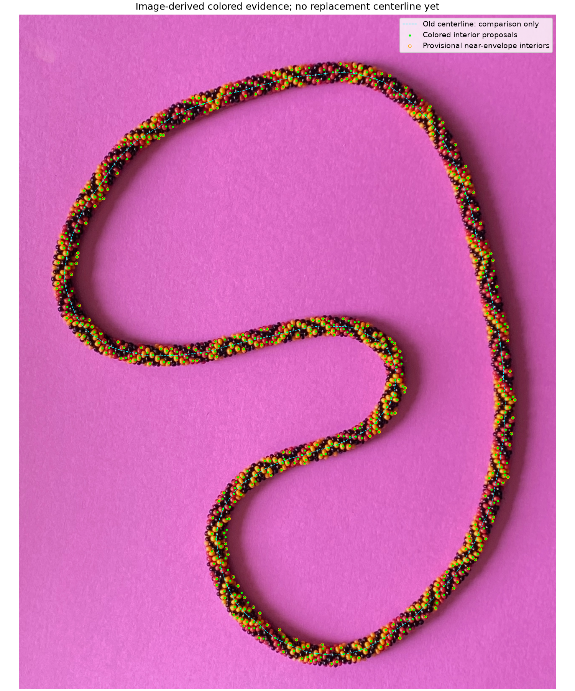
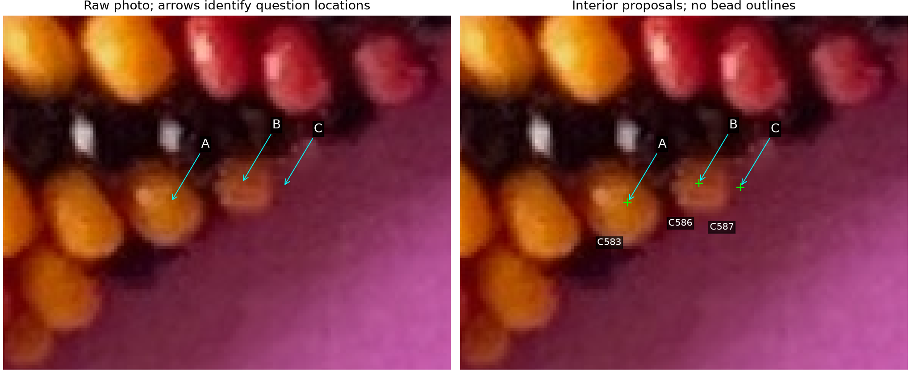
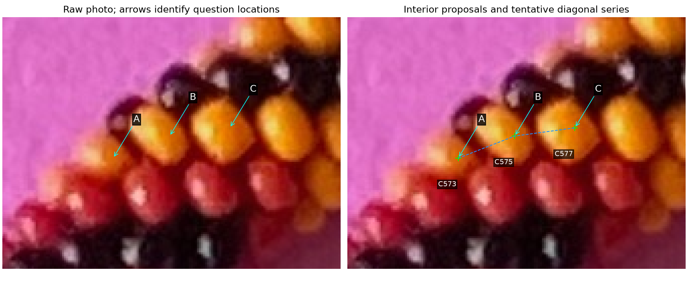

# Replacing the boundary-derived centerline — R187

The current centerline inherits errors from the earlier boundary method. We can
take over much of the red/yellow selection, but shaded edge points and diagonal
unit steps need checks before they constrain a replacement curve.

## How the existing centerline was made

The original `fft-image-explorer/beads-photo-2_splines.json` used image-only HSV
foreground/background tracing, with outer152 and inner142 control points.
Its centerline builder resampled the two closed control curves, found the
nearest outer-polyline point for each sampled inner point, and used their
midpoints. This is a nearest-point pairing, not a guaranteed normal cross-section
of the rope. The saved result contains303 points including closure.

Those coordinates were rounded to four decimals in historical
`photo2/centerline.json` at2c4c116 and preserved in
[spline-seed-r175.json](spline-seed-r175.json). They match the original rounded
coordinates exactly; maximum unrounded difference is0.00005 source pixels.
The current forward model fits a periodic cubic spline with a2-pixel smoothing
budget per point, then inverse-projects it to the table plane and sets scale
from assumed N. Count changes do not repair its projected path. The source file
hash matches the original provenance; [audited files/settings](spline-provenance-r187.json).

Errors in the traced boundaries—including shadow—and non-normal nearest pairing
can bias the midpoint curve. Smoothing cannot independently verify or correct
that bias. The maker now explicitly rejects its defects and requests another
method. This is qualitative feedback, not supplied corrected coordinates.

## Four alternatives and the selected approach

| Method | What it contributes | Limitation |
| --- | --- | --- |
| Maker-selected paired edge beads | Strong ownership evidence on both sides | Interior point is not the actual edge; sparse pairs may be oblique |
| Automatic colored-bead envelope | Broad support, skips much paper/shadow | Color overlap, partial visibility, misses and false extrema |
| Diagonal-series geometry | Local lattice directions, relative positions and tangent constraints | False links, skipped black beads and center displacement |
| Joint smooth-curve/width/lattice fit | Combine supported edge bodies and series with literal 3D bead geometry | Needs explicit uncertainty, correspondence checks and both-hand alternatives |

Choose the **joint fit**, beginning with an automatic candidate-evidence review.
The proposed later fit will use supported colored interiors as body-ownership
constraints, near-edge bodies as side/width constraints, and checked diagonals
as lattice constraints. Interior marks won't be equated to boundary or outward
points. Fit a smooth periodic centerline at bracelet scale, preserving supported
bead scallops separately. Gaps without reliable bodies remain inferred and
distinguished from verified support; retain black/missing slots and tentative
directions. Keep both helicities and unknown N/camera/closure. Your41 saved
visible-part centers remain a separate validation/reference set.

**This step builds evidence; it does not yet fit or adopt a replacement spline.**
The old spline, viewer choices/scores and all maker annotations remain unchanged.

## Automatic pass and what it establishes

The unchanged image-derived detector found **642 colored-interior proposals**,
with learned hue modes27° and353°. Hue identifies appearance; saturation/value
and interior-distance evidence choose conservative locations. Modes and scale
are estimated from the input; no saved color boxes or maker coordinates enter.
The image-derived search-strip axis supplies ordering/side discussion only.
The old303-point spline is not an input to detection or proposal selection.

The new evidence layer selects **237 near-envelope interior candidates**
(119 outer-side,118 inner-side), from local15th/85th percentiles of cross-strip
colored proposals within4 apparent diameters in station. At least8 local points
and noncollapsed cross spread are required. These are heuristic candidate sides,
not physical edge exposure or measured bead boundaries. Existing detection had
zero colored features excluded by its final band-clearance gate in this image;
the new layer does not pretend to recover omitted edge beads from that list.

Colored endpoints retain **618 tentative links** and **117 candidate diagonal
chains** of at least3 observations. Directions come from the existing angular
proposal estimator, whose errors are documented in [NEIGHBOR_ANGLES.md](NEIGHBOR_ANGLES.md).
Deleting black observations does not create links across them. Original detector
observation numbers are retained; new C-numbers are observation names, not
bead_index. Chain directions/unit steps, missing bodies and physical centers
remain unresolved. No candidate cycle is promoted to bead-index closure.



[Frozen evidence and parameters](review/r187/evidence.json),
[question markers, ownership checks, source hashes](review/r187/summary.json).
Editable proposal file: `photo2/output/r187/colored/annotations.json`. If useful,
open it separately in the existing labeller; source files and your live saves
are protected:

```bash
.venv/bin/python photo2/label_beads.py --full-image --annotations photo2/output/r187/colored/annotations.json --port 0
```

### Q187.1 — Doubtful colored point beside a yellow edge bead



**Does C (C587) lie on visible paper, or inside a bead?** A=C583 and B=C586
appear to be yellow interiors. C was proposed as another chromatic interior,
but visual inspection suggests it may lie on shaded paper beside B. This is
precisely why unreviewed colored extrema cannot define the new centerline.
**R188 answer: “Cannot tell.”** C's body/side constraint remains unresolved and
is not adopted as a verified anchor. [Preserved answer](colored-review-answers-r188.json).
Arrows identify pixel locations; green crosses are proposals, not bead outlines.

### Q187.2 — A short yellow diagonal series



**Are A→B→C consecutive neighbors along one diagonal direction, with no bead
skipped?** A=C573, B=C575, C=C577. **R189 answer: “Yes, consecutive diagonal
neighbors.”** These are supported consecutive bodies along one diagonal family,
without a skipped bead. [Preserved series/positions](diagonal-confirmed-r189.json).
The program proposes d2; that name and its signed6/7 mapping remain unverified.
The dashed line joins interior proposals and does not follow bead boundaries.
This does not locate their exact physical centers/outward anchors or select N.

## Checks and limits

Existing confirmed yellow interior loops8 and11 each contain a new colored
proposal. Confirmed red loop20 contains none: a point elsewhere on the same
body could still exist, so this is a failed strict-interior check rather than
proof that the whole red bead is absent. Color-mode ownership does not establish
complete red/yellow coverage. C587's possible paper error remains explicit;
the maker cannot establish its ownership from this image.

The same evidence layer was tested on existing independent literal-POV renders,
with detection and all candidate decisions finished before reading rendered
body IDs. No new renders or geometry changes were needed:

| Known fixture | Colored proposals | On paper / black | Duplicates | Rim candidates on paper / black | True unsigned neighbors / colored links |
| --- | ---: | ---: | ---: | ---: | ---: |
| Hand+1, blue/amber | 91 | 0 / 0 | 3 | 0 / 0 of36 | 133 / 136 |
| Hand−1, blue/amber | 91 | 0 / 0 | 4 | 0 / 0 of34 | 129 / 133 |
| Hand+1, green/purple, displaced | 92 | 0 / 0 | 3 | 0 / 0 of35 | 133 / 136 |

These show useful color-independent interior proposals, with duplicates and
link errors. They do not certify real-photo rim points, physical edge exposure,
diagonal names/signs or a replacement centerline. The image's shadowed red/paper
HSV overlap still needs spatial/texture/geometry context; see
[HUE_TRANSITIONS.md](HUE_TRANSITIONS.md).

Three new tests pass: colored filtering preserves black/missing slots and only
existing links, periodic local side support without any saved curve, and cycles
remain unresolved. Four existing automatic-detector tests also pass, including
actual labeller exports/provenance and overwrite protection. The actual labeller
loads642 points/618 series without a server. Source hashes, syntax and image
inspection checked. No GUI/server/launcher test or model/count refit.

```bash
.venv/bin/python photo2/colored_centerline_evidence.py --output photo2/output/r187/colored
.venv/bin/python photo2/review_colored_centerline.py
.venv/bin/python -m unittest discover -s photo2 -p test_colored_centerline_evidence.py
.venv/bin/python -m unittest discover -s photo2 -p test_auto_labels.py
```

Use a fresh output directory on repeat detection; existing generated or maker-
edited annotations are refused. Curator `--run` accepts another proposal run.
The known rendered appearance/ID fixtures are read-only inputs; recreate them
with `check_auto_labels.py` if absent on another checkout.

Stopping point: provenance audit and automatic colored/side/diagonal candidates
for small ownership/neighbor review. Next task: incorporate these answers,
reject or represent false edge proposals, then fit a new curve from supported
bead geometry rather than old boundary midpoints. Recommend **gpt-6.1-sol / High**;
same session, no `/new` needed.
