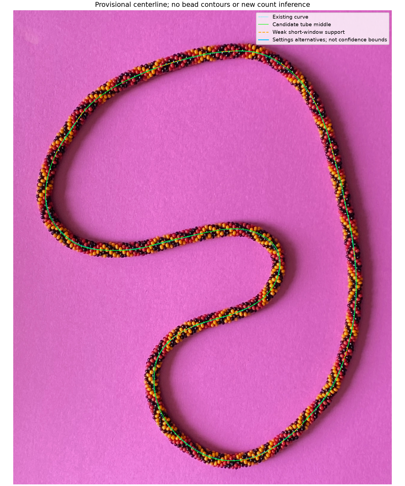
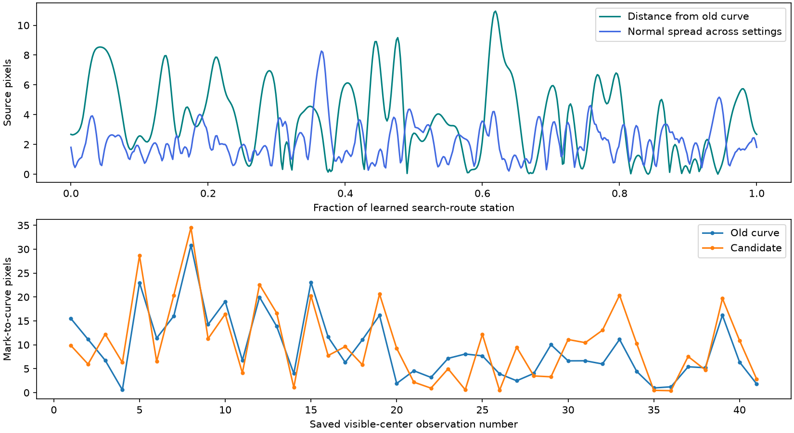
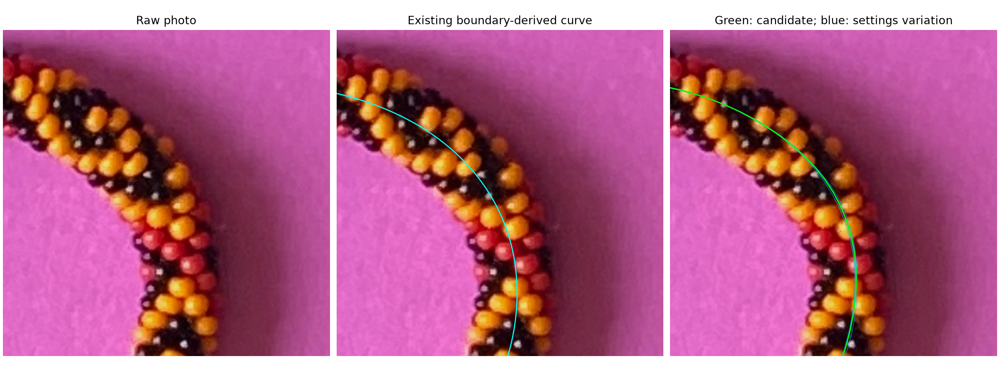
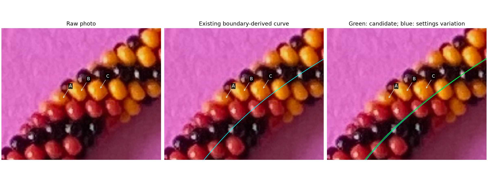

# Candidate centerline from colored bodies — R190

We now have a new closed curve computed from the colored-body observations,
independently of the old boundary-midpoint spline. **It is a candidate, not an
adopted replacement.** R191 favors the old curve at the reviewed bend. It does
not improve the saved-center check, and known
renders reveal a remaining bias. Your annotations, 41 saved centers, viewer
settings, scores and original spline are preserved.



Green is the new tube-middle candidate; dashed cyan is the existing curve.
Thin blue curves show changes of fitting settings. Orange dashes mark stretches
without enough opposite-side support under the shorter-window setting. Even
the green stretches rely on proposed body ownership, not verified edge anchors.
No bead outlines are drawn. The blue alternatives are not confidence bounds.

## What was done in this step

Following the [evidence review](CENTERLINE_BEAD_REVIEW.md), three implementations
were considered: nearby paired colored bodies, a smooth tube through the whole
colored-body cloud, and the full joint lattice/camera/curve fit. This step takes
the second route with local opposite-side checks, as an initializer for the
joint fit. A single confirmed diagonal with unresolved 6/7 mapping cannot yet
supply an exact physical-axis tangent. It remains supported topology evidence.

The detector learns appearance, scale and an approximate closed search route
from the photo. Neither the old spline, saved center coordinates, old hue boxes
nor held-group maker labels enter this fit. Observation C587 is explicitly
excluded in the **assisted diagnostic** because its ownership was unresolved
in R188. A separate input-only fit includes it to measure this intervention.
No saved label is silently made an automatic runtime prior.

Of the 642 colored proposals, 619 pass the substantial-interior checks after
that exclusion. At 182 stations, use a window extending six apparent diameters
in either direction. At least 12 admitted observations and two observations
supporting each tail are required. The 15th/85th cross-position percentiles
provide paired sides. Their locations describe the distribution of visible
colored interiors, **not the physical bracelet edges**.

Fit both sides together as a shared periodic middle plus a varying nuisance
half-span. Robust residual weights limit isolated inconsistent side support.
The middle uses 48 Fourier harmonics with a curvature penalty; the half-span
uses four. Its span is not a calibrated tube radius. The fit has no penalty
pulling it toward the old curve. Unsupported stations are retained in the
support records rather than filled with old centerline coordinates. The route
must close without degeneracy or self-intersection.

Five settings vary window radius (4, 6, 8 diameters) and smoothing cutoff
(24, 32, 48). The declared primary setting is six diameters/cutoff 32; saved
centers were not used to pick a winning setting. This coarse curve does not
recover bead scallops, camera, physical width, phase, bead indices, N or helicity.
Both hands remain unresolved for the later literal bead-geometry fit.

## What the comparisons show

The first, more strongly smoothed fit distorted the real inward bend. Its
saved-center distance RMS was 13.90 pixels against the old curve's 11.65.
[Frozen rejected fit](review/r190/over-smoothed-fit.json) and
[failure record](review/r190/over-smoothed-check.json) preserve that example.
Reducing the smoothing bias restores the bend; it does not independently
validate its physical middle.

The revised primary differs from the existing smoothed curve by a maximum
10.95 source pixels (RMS 4.50). The five settings span at most 8.27 pixels
in the candidate's normal direction, with a median span of 1.94. Including
C587 changes the candidate by at most 1.13 pixels (RMS 0.16). These are
sensitivity measurements, not total error bounds. The primary has provisional
paired support at all 182 stations; the shorter window has support at 148,
leaving about 19% of the displayed route dependent on wider-window support.
Overlapping windows are correlated and are not 182 independent measurements.

| Curve | RMS distance of 41 saved centers to curve, source pixels |
| --- | ---: |
| Existing curve | 11.65 |
| New primary | 12.98 |
| Window 4 / cutoff 32 | 13.23 |
| Window 8 / cutoff 32 | 12.93 |
| Window 6 / cutoff 24 | 12.89 |
| Window 6 / cutoff 48 | 13.06 |

The marks are centers of visible bead portions, often near the axis; they are
not measurements of the physical centerline. This table is a reference check,
not the previous predicted-bead SSE and not proof that the old curve is correct.
It gives no support for claiming an improved curve or adopting the candidate.



Independent appearance-only fits on three existing literal-POV renders finish
before reading the known source geometry. The new primary's RMS distance to the
true projected tube axis is 6.18, 5.97 and 6.99 pixels for the positive hand,
negative hand and changed-palette/displaced fixtures respectively. Both fitting
settings tested have similar errors. These failures matter: the distribution
of visible colored interiors need not be symmetric about the physical axis.
Smoothness and robust rejection cannot remove a consistent appearance/coverage
bias. This step does not yet implement the full joint 3D lattice fit proposed
in R187, and must not be presented as its successful completion.

## Q190.1 — Middle placement at the tight bend



This crop is centered on the largest difference between the revised candidate
and the old curve. **Does the green curve place the middle of the rope better
than the cyan curve, does cyan look better, or can you not tell?** Blue lines
show settings alternatives. We are comparing middle placement, not requiring
the curve to go through every visible bead center. **R191 answer: “Cyan existing
curve.”** Preserve the [exact answer and image](centerline-review-answer-r191.json).
The new middle estimate is rejected at this bend and is not installed. This
does not verify the old curve everywhere or supply numerical corrected points.

The confirmed C573→C575→C577 series is also shown in context:



Its identities and consecutive diagonal relation remain confirmed. Candidate
image angles are recorded for later geometry work; no d2/signed 6/7 assignment,
outward anchors or helicity follows from them.

## Files and reproduction

[Candidate spline](review/r190/candidate-spline.json) uses the existing forward
model's source-pixel point format, with zero additional smoothing. It is saved
separately and has not been installed in the viewer. [Full fitting support](review/r190/fit.json),
[checks, parameters and hashes](review/r190/summary.json), and
[frozen evaluation marks](review/r190/saved-centers.json) make the comparison
reviewable without writing to your live saves.

```bash
.venv/bin/python photo2/fit_bead_centerline.py --exclude 587 --output photo2/output/r190/checked
.venv/bin/python photo2/review_bead_centerline.py
.venv/bin/python -m unittest discover -s photo2 -p test_bead_centerline.py
```

Use a fresh output directory on repeat fitting; existing reports are protected.
The curator accepts `--run` and `--output`. Existing known renders in
`photo2/output/r167/calibration` are read-only fixture inputs; recreate with
`check_auto_labels.py` if absent. Five geometric tests cover closed ellipse
recovery, rigid-motion consistency, isolated false support, missing sides,
explicit exclusion, systematic bias, segment distances and crossing rejection.
No GUI, launcher or server test, count scan, new render or live curve replacement.

**Stopping point:** a reproducible candidate and its failure/sensitivity review.
**Next:** use the bend feedback and supported diagonal/near-edge bodies to
separate true axis placement from visibility/color-coverage bias in the literal
3D fit. Do not adopt this symmetric-interior estimate as the physical axis.
Recommend **gpt-6.1-sol / High**, same session; no `/new` needed.
