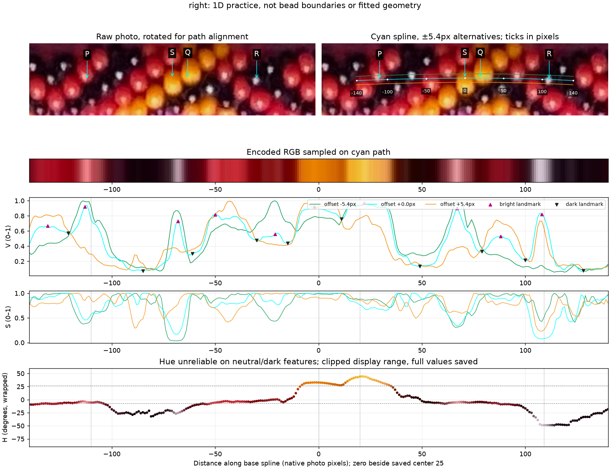
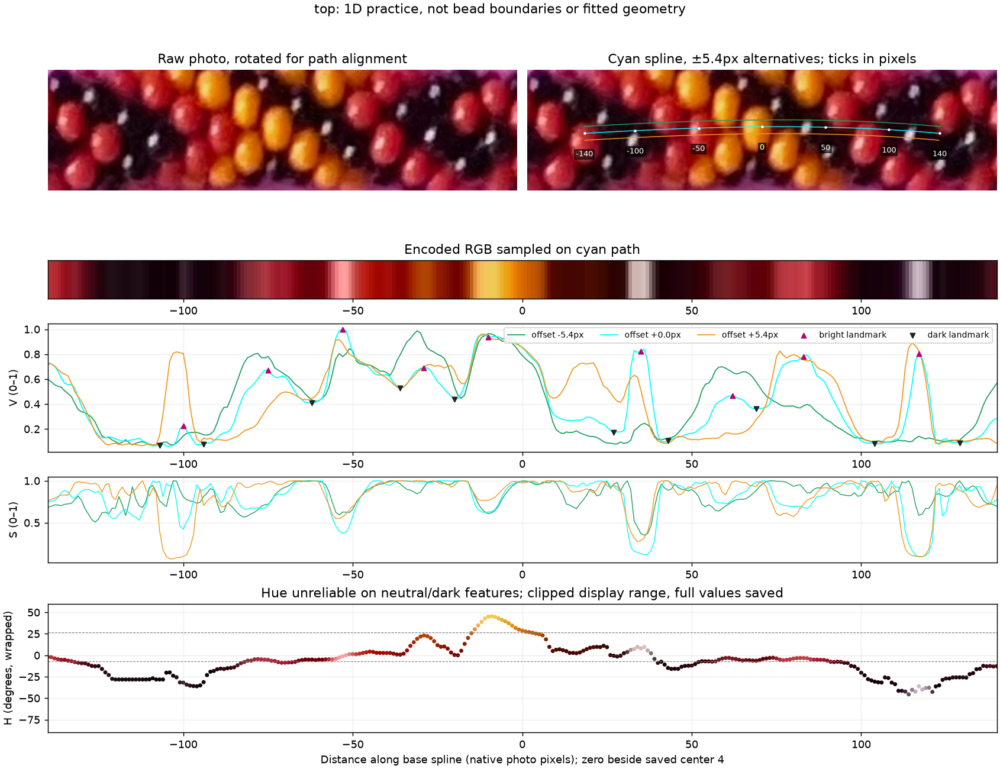
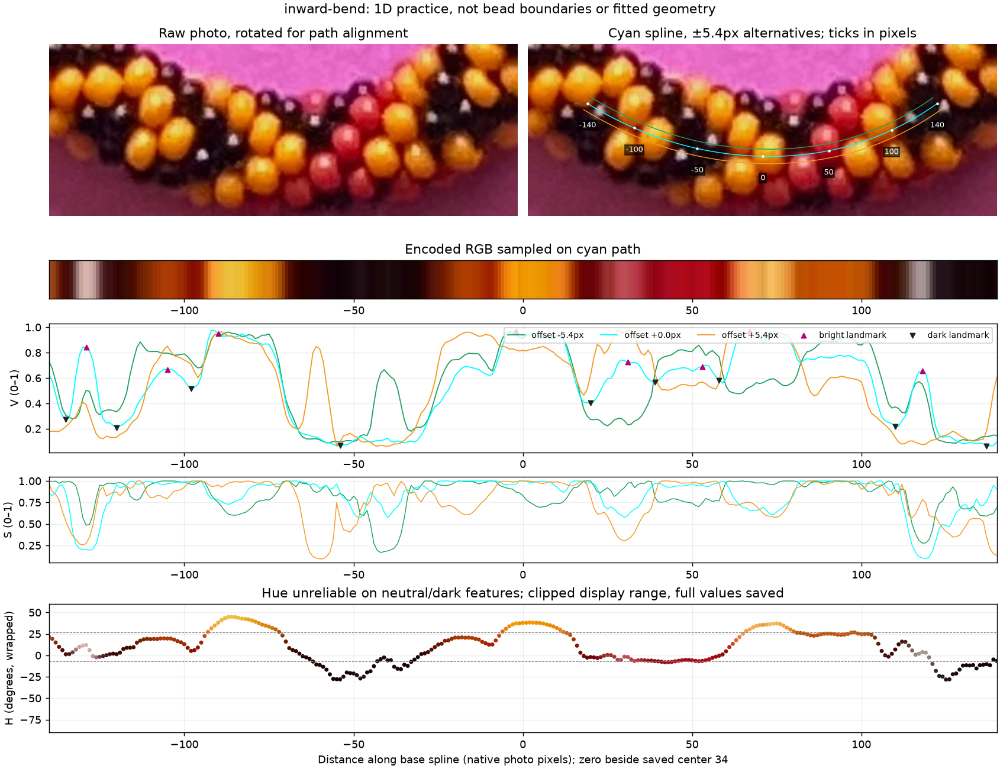

# 1D practice along the existing spline — R203

R208 follow-up: [Parallel-path measurements at all208 interior references](PARALLEL_PROFILE_CUES.md),
with the unchanged S/Q/R example and known-owner counterexamples.

Your suggestion is implemented as a diagnostic: sample original RGB along the
current centerline, convert to H/S/V, and compare the graphs with raw context.
The same spline is sampled at offsets ±5.44 pixels to reveal sensitivity to the
path. It is not refitted. Full-loop samples are in the reproducible routine
`photo2/output/r203/profiles.npz`; the three reviewed sections are below.

## Q203.1 — Two yellow bodies or one?



**Do S (0 pixels) and Q (+20 pixels) lie on two different yellow beads?**
The raw panel is rotated for horizontal path alignment; original sample
coordinates are preserved in [the report](review/r203/report.json). The graph
shows a modest V dip between them and a hue shift, while both remain yellow.
This tests the distinction between two bodies and shading within one body.
**R204 answer: “Two different yellow beads.”** This establishes distinct bodies
at the two pictured points, without certifying exact seam pixels, their centers
or adjacency. Across these21 samples, V reaches0.758 at+11px: about15.6% below
the lower endpoint. Endpoint hue changes from32.7° to44.1°, a11.4° difference.
This is a confirmed example where a modest brightness dip and hue variation
both deserve attention; it does not establish a universal seam threshold.

## Q203.2 — Reflection on a black body?

In the same image, **is R (+109 pixels) a specular reflection on a black bead?**
It is a bright, nearly neutral point with a dark surround in this path; this
is a proposed interpretation, not a black bead admitted to the position set.
**R205 answer: “Yes.”** R is a maker-confirmed specular reflection on a black
bead. Black beads remain excluded from the positional set. The reviewed point
is not an optical centroid, bead center or minor-outward anchor.

[Exact answers and frozen image bindings](profile-answers-r204-r205.json) ·
[Measured transition and bounded facts](review/r203/confirmed-profile-facts.json).
Both questions are answered; none are pending. Original question images and
coordinates remain unchanged.

P points to a bright red area for comparison. At R, H alone is especially
misleading because saturation is only about0.080. S has H32.7°/S1.0/V0.898;
Q H44.1°/S0.767/V0.940; R H311.3°/S0.080/V0.787. RGB is encoded JPEG, not
linear light. These values describe appearance, not pigments or physical centers.

## Other sections and measurements





Sample the two-pixel-smoothed, unchanged periodic spline at one native-pixel
arclength steps:9236 samples per route. Bilinear-interpolate RGB first; convert
the interpolated RGB to HSV afterward, avoiding linear interpolation across the
hue wrap. Hue is shown in degrees relative to red; the plotted range is clipped
to−90°…60°, but the full values are saved. Low-S/dark hue remains uncertain.
The display rotation changes no sampling coordinates or values.

The cyan path shows the old spline. Green/orange are ±5.44px alternatives;
distance ticks connect the graph to the photograph. Each section spans281
samples around a saved center, selected for practice only. Bright/dark triangles
are extrema of a gently smoothed V trace with a learned residual-noise prominence
floor. They are neither complete bead counts nor certified seams. Some red
glints produce bright peaks within a bead; the broad yellow plateau can span
several bodies. Path offsets can move or remove a reflection peak. Hue drift
offers complementary evidence, as you suggested, but does not establish an edge
without ownership and raw context.

No physical/string indices, adjacency, camera/count/phase/stretch adjustment or
fit occurs here. Saved manual coordinates and spline define this assisted
practice, not automatic reconstruction priors. The image-only distributed
colored-patch extraction remains separate.

```bash
.venv/bin/python photo2/practice_centerline_profiles.py
.venv/bin/python photo2/record_profile_answers.py
.venv/bin/python -m unittest discover -s photo2 -p test_profile_answers.py
```

[Script](practice_centerline_profiles.py) · [report/sample coordinates](review/r203/report.json)
· [source/output hashes](review/r203/summary.json).
Next: transfer the supported
hue/brightness-transition evidence to neighboring paths and the distributed
colored set. gpt-6.1-sol / High; same session, no `/new`.
