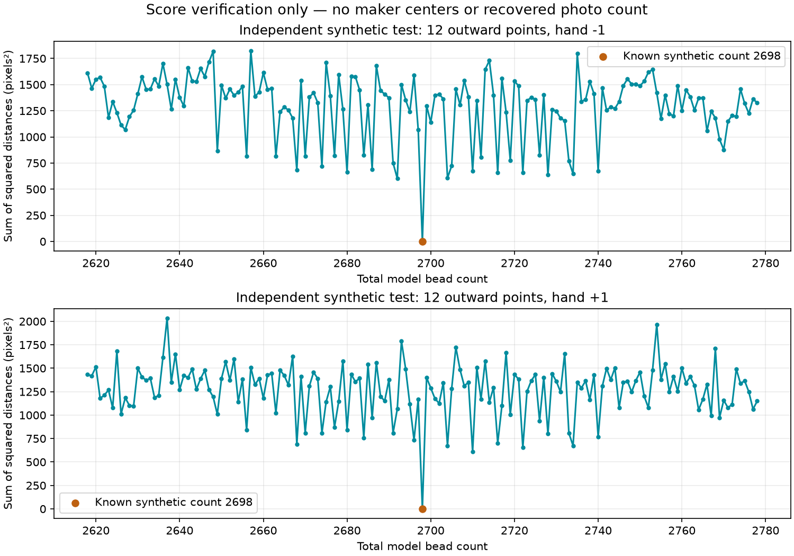

# Visible-part center marks and count-error graph — R184–R185

Restart the running viewer with Ctrl+C, run it again, and reload the browser:

```bash
.venv/bin/python photo2/tangent_viewer.py
```

1. Enable **Mark bead centers**. Zoom with the wheel and click the center of
   each substantial visible bead part near the centerline. Spread approximately
   10–20 marks around the whole bracelet. Each gets a unique observation number.
   Dragging still pans; a drag does not create a mark.
2. Click an existing orange mark or its number in the side panel to select it.
   **Move**, then click its corrected position. Number edits, Delete and Undo
   are available. The yellow cross indicates the selected mark. Hide the cyan
   circles or guides when they obscure the photo.
3. **Save centers** writes `photo2/output/tangent-viewer/centers.json`.
   It reloads on restart, and each subsequent save preserves the previous
   document in `centers.previous.json`. Unsaved edits show a warning before
   leaving the page. Download centers JSON preserves a draft if saving fails;
   it can be opened using `--centers path/to/downloaded.json` after restarting.
4. Choose From, To and Step, then **Save & plot error**. The initial range is
   2000–3600 with step **1**, testing every integer. A scan runs in the background
   with progress and Cancel controls; up to2001 counts are supported per scan.
   Larger steps are faster but can miss narrow minima. Use a narrower range for
   detailed review rather than relying only on a coarse scan's lowest point.
5. The graph reports the lowest sampled sum and RMS error. It selects that
   count in the photo and shows proposed matches with pink dashed lines.
   Click the graph to inspect another tested count. Switch helicity and plot
   again to evaluate its existing registration using the same marks.
6. Download the graph PNG or score JSON. The complete score and its observation
   snapshot are also saved to `centers-score.json`, with a previous backup.
   Full-photo PNG export includes visible marks and proposed-match lines.

Marks remain fixed in original-photo coordinates when count, helicity, zoom,
pan or guide width changes. They are independent of the older bead/adjacency
labeller and its numbers. That labeller's annotations are never imported or
edited. **Save choice** remains separate from **Save centers**.

The `--centers` option chooses another center file; by default it is beside the
viewer choice file selected with `--save`. Existing unrelated documents, source
photo mismatches and conflicting revisions are rejected before overwriting.
If another window has saved newer centers, download your draft before reloading
and reconcile the two documents. Marks changed during a scan invalidate its
display; the completed score retains the exact earlier observation snapshot.

## Metric and interpretation

Three methods were presented: fixed bead correspondences, nearest distinct
predictions, and phase refitting for each count. This implementation starts
with **nearest distinct predictions**. At each count, construct all exposed
minor-outward points using the existing full-loop visibility test. Assign each
marked center to a different prediction to minimize:

**S(N) = Σᵢ [(xᵢ − x̂ₘᵢ(N))² + (yᵢ − ŷₘᵢ(N))²].**

The assignment uses squared Euclidean distances and an exact rectangular
linear assignment solver. Every mark contributes; there is no outlier trimming,
distance cutoff or reuse of a prediction. The graph's units are original,
EXIF-oriented photo **pixels²**, independent of browser zoom. RMS is
sqrt(S / number_of_marks), in pixels. Match distances and tentative generator
indices are retained for inspection; they are not established photo bead_index.

The selected hand uses its saved original registration from R179. Phase,
origin, camera, spline and physical bead dimensions stay fixed throughout the
scan. Changing count changes closure, spacing and projected physical scale on
the fixed image spline, as in the earlier overlays. The adjustable green width
guide changes neither predictions nor the score. No centerline or phase fit
is performed, and no old held-out22–25 group is automatically added to scoring.

Your chosen **visible-part centers** and model **outward surface points** are
different position definitions. Near-central, substantially visible beads are
the requested useful starting sample; occlusion can still shift the visible
center. Centerline/camera/width bias and changing nearest correspondences can
produce error floors, aliases or multiple minima. These scores quantify this
fixed-model proxy fit, not a statistical confidence or a guaranteed bead count.
After your marks exist, inspect matches/residual directions before deciding
whether to refine correspondences, phase or centerline. No photo-derived N or
helicity is claimed from the synthetic validation below.

## Preserved maker feedback and validation

R184 answers [Q183.1](WIDTH_GUIDES.md): green107% is closer but still too small;
the centerline is good but imperfect. [Exact feedback and source hashes](width-feedback-r184.json)
preserve this qualitative assessment. No further numeric width or corrected
centerline coordinates were supplied, so no new physical-size/spline correction
is invented. Existing wider-guide controls remain available.



The two panels use separate sets of12 synthetic exposed outward points at known
N2698, one for each hand. They are **not maker marks or visible-area centroids**.
Testing2618–2778 at every integer recovers2698 with zero error in each test;
nearby hypotheses have positive errors. This validates score mechanics, not
photo reconstruction. [Parameters, points, scores, code hashes and checks](review/r184/validation.json)
retain the complete reproduction record.

Thirteen Python tests and seven JavaScript checks pass: original four frozen
overlays remain unchanged; point persistence/backups/source checks/conflicts,
distinct optimal squared-distance matching, known-count recovery for both hands,
background score completion without a server, source-coordinate clicks, stable
IDs, move/renumber/delete/undo and viewport behavior are covered. Syntax checks
pass. Browser/server/launcher interaction was not tested or launched.

```bash
.venv/bin/python -m unittest discover -s photo2 -p test_center_marks.py
.venv/bin/python -m unittest discover -s photo2 -p test_tangent_viewer.py
node photo2/tangent_viewer/marks.test.mjs
node photo2/tangent_viewer/viewport.test.mjs
.venv/bin/python photo2/review_center_scores.py
```

Stopping point: manual center capture and a reproducible provisional count-error
graph. Next task: read your saved10–20 marks and review proposed correspondences
and residuals around the entire bracelet before further geometric fitting.
Recommended model/reasoning: **gpt-6.1-sol / High**; same session, no `/new`.
