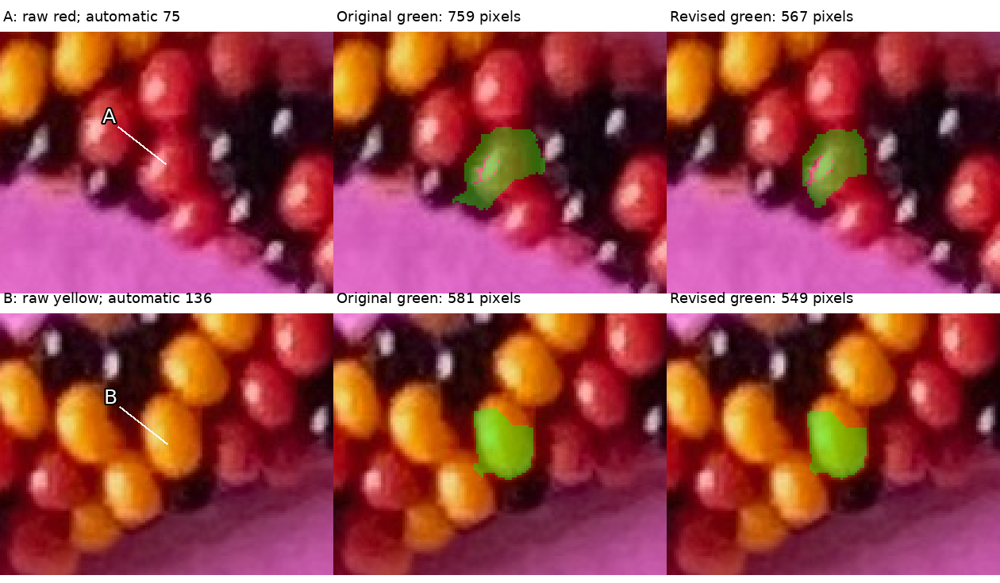
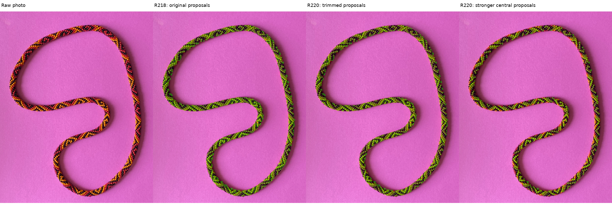
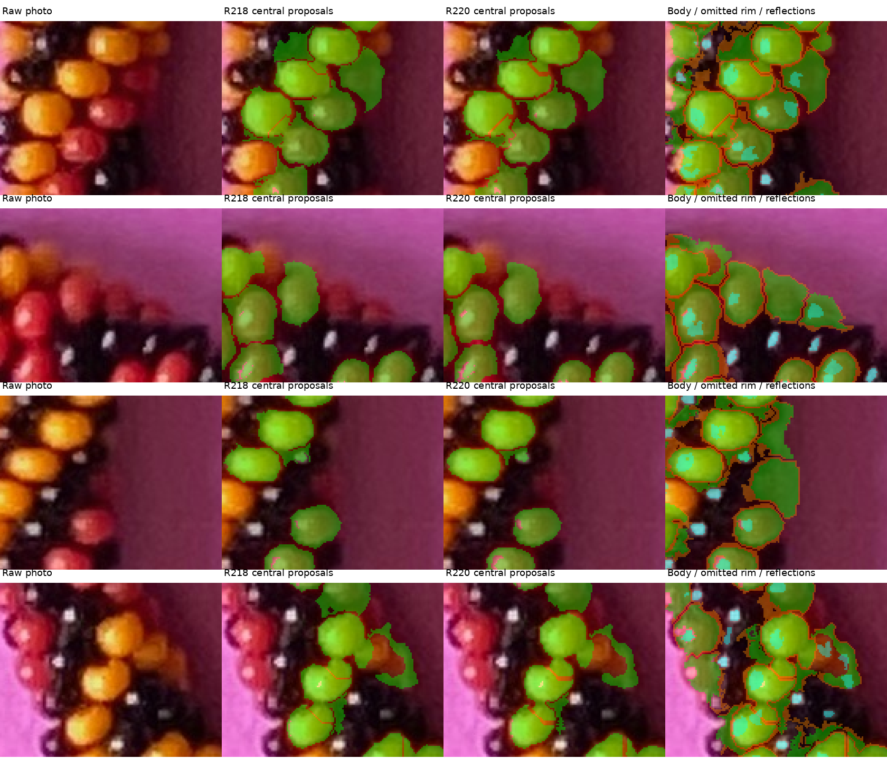

# Conservative colored-mask trimming — R220

The revised **red A has 567 pixels instead of 759**, and **yellow B has 549
instead of 581**. Both extents are smaller; they still need visual review before
being treated as trusted single-bead masks. The target remains 70–90% of each
bead's actual visible part, wholly inside it, with reflections separate.
Extraction uses image-derived appearance and scale, without manual bead marks,
adjacency, saved centerline or simulated photo positions.

The selected trim retains **71.24–71.93%** of all visible colored pixels in four
known render examples. Mixed-owner pixels decrease, but fewer beads have one
pure region covering 70–90% than before trimming. This is a conservative
coverage/ownership tradeoff, not a general improvement on every measure or a
measurement of photo recall. Position fitting remains deferred.

## Q220.1 and Q220.2 — Revised extents

Each row shows raw photo, the original green mask, and the revised green mask.
The arrow identifies the target visible face; it is not a physical bead center.
A/B and automatic numbers75/136 refer to the same proposals reviewed in R218,
with new observation UUIDs for the changed extents. They are unrelated to the
manual bead numbers or earlier R215 A/B.

**Q220.1:** Does revised green A retain roughly 70–90% of the red bead's visible
part while staying inside it, excluding the nearby black bead?

**Q220.2:** Does revised green B retain roughly 70–90% of the yellow bead's
visible part while staying inside it, excluding the adjacent yellow bead?



Both questions are pending. [Exact pixels and locations](review/r220/review-locations.json)
and [the as-issued manifest](trimming-questions-r220.json) freeze the new extents.
The [R219 answers](mask-refinement-answer-r219.json) rejected the originals:
A covered maker-estimated 100% plus some black bead; B 95% plus “1% of an adjacent
yellow bead”. The latter is not a calibrated fraction of B's selected pixels.
No exact contaminated pixels or full-bead silhouettes were supplied. The old
judgments do not establish recall, containment or acceptance of these new masks.

## Whole necklace and surrounding context





For zooming, use the native [body overlay](output/r220/body-overlay.png),
[stronger central proposals](output/r220/central-candidates.png) or
[body/rim/reflection layers](output/r220/body-band-reflections.png).
Green is retained body support, orange is omitted candidate support, and cyan
is the separate reflection mask. Omitted support is not a certified boundary
band or a declaration that those pixels are paper.

There are **1,287 automatic proposals and 491,629 retained pixels**, with **596
stronger central proposals and 314,143 pixels**. All 1,287 keep seed-connected
support in the selected photo result; observation numbers are not string indices
or a unique-bead inventory. The whole-image panels show where proposals occur.
[Eight image-angle sector counts](review/r220/distribution.json) are 65/94/104/2/
114/80/70/67. This bent necklace makes those sectors unequal physical lengths;
the counts do not establish uniform torus arc-length coverage.

## Methods compared and selected candidate

Four approaches were presented before implementation:

| Method | Interior rule | Observed limitation |
|---|---|---|
| Fixed inset | Distance from the automatic candidate edge ≥.055 apparent diameters | Cuts an entire pixel shell at once; substantially under-covers many known faces |
| Diffuse brightness | Seed-connected support ≥45% of candidate diffuse-brightness Q90 | Red A improves, but yellow B is unchanged and remains rejected |
| Outward first drop | Stop each sampled ray at its first brightness/support drop | Rejects too much red A and creates radial gaps; 0.5px/180-angle approximation |
| Brightness stability | Agreement at three smoothing scales, conservative rim exclusion and seed connectivity | Needs a raw brightness guard and fractional rim ranking to avoid blur-supported tails or large shell losses |

The **brightness-stability method with weakest-rim ranking is selected for
review**, without treating its output as already confirmed. Its smoothing sigmas
are .025/.05/.075 apparent diameters, minimum .5px. At least two scales must have
seed-connected support above 45% of that scale's local candidate brightness Q90.
A raw diffuse-brightness floor of 45% prevents smoothing from borrowing enough
brightness to retain a dark extension. Compact reflection brightness is median
replaced only when calculating diffuse support, using the frozen reflection
mask; neutral reflections can still lie inside retained colored support.

The rim score uses distance inside the candidate plus .25 relative diffuse
brightness minus .25 of the existing dark-valley score. Exclude its weakest 15%,
also requiring the existing minimum inset max(.5px,.018 diameters). Intersect
these tests with the original retained pixels and keep the seed-connected part.
**An 85% own-candidate preference is not 85% actual visible-bead recall.** No new
pixels, colors, seeds or adjacency edges are added. Region means summarize mask
pixels and are not physical bead centers or outward anchors.

An earlier stability version used a fixed .045-diameter inset; it lost too much
coverage in the first two render examples. Ranking gives a gentler change.
The next version admitted a dark tail in an adverse circular-face test because
blur spread the face's brightness across the edge. The raw floor fixes that
test. [Both development comparisons and failure](review/r220/development-comparison.json)
remain recorded. These corrections used development evidence, not a withheld
generality test.

## Known visible pixels and ownership

All variants finish extraction before owner IDs are read. The controls are the
same four existing R218 scenes, covering both hands and changed palette,
background, placement and framing. Actual recall includes missed and small
colored bodies. Eligible-body thresholds are unchanged. A pure single region
has ≥98% one-body purity; its coverage cannot be assembled from separate pieces.

| Known example | All colored recall, original → selected | One pure region in 70–90%, original → selected | Mixed-owner minority pixels, original → selected |
|---|---:|---:|---:|
| + hand, blue/amber/black | 76.93 → 71.24% | 77 → 64/112 | 1,794 → 1,442 |
| − hand, same palette | 76.74 → 71.31% | 80 → 67/113 | 1,365 → 1,136 |
| + hand, changed palette/background/placement | 77.80 → 71.93% | 82 → 72/113 | 1,354 → 993 |
| + hand, changed framing at image border | 77.77 → 71.78% | 86 → 74/112 | 1,319 → 870 |

Median eligible-body coverage is 73.89–74.83%. No eligible body is completely
missed, and no retained pixels belong to paper or black bodies in these render
examples. Some regions still mix different colored bodies, and some bodies
are under-covered, over-covered or split. Color purity alone cannot check
same-color ownership; the maker's original yellow-B correction illustrates it.
[All methods, per-body coverage and owner witnesses](review/r220/calibration.json).

Two adverse controls pass: a brighter same-color neighbor across a dark bridge
is excluded, in red/yellow/blue hue variants; neutral reflections inside a
supported colored disk remain, while an attached dark tail is excluded.
No new scene rendering or change to the original POV model was needed.

## Preserved facts, files and stopping point

All **1,339 reflection masks, weighted positions and 868 tentative candidate
associations remain unchanged**. They are candidate-based ownership proposals,
not an assurance that a reflection lies in a revised body mask or identifies
a black bead's center. Candidate/domain/family/dark-valley arrays are unchanged.
The newly generated baseline exactly repeats the frozen R218 photo arrays.

The earlier R215 confirmed yellow829 still overlaps **two** new proposals,
retaining 550/624 of its old confirmed pixels (449+101). Its duplicate identity
problem is unresolved; trimming does not fix it. Red719 retains 638/713 old
confirmed pixels in one proposal. Earlier confirmations remain tied to their
original extents and are not transferred to the new masks.
[Exact prior-fact overlaps](review/r220/prior-fact-check.json).

[Region/confidence records](review/r220/regions.json),
[source/output/protected hashes](review/r220/summary.json) and
[verification](review/r220/verification.json) preserve this run and its limits.
Routine masks, label TIFFs and native overlays are ignored under
`photo2/output/r220`; curated raw review images, questions and ledgers are tracked.

```sh
.venv/bin/python photo2/check_colored_trimming.py --stable-rim-rule inset --no-stable-raw-floor --output photo2/output/r220/calibration-initial
.venv/bin/python photo2/check_colored_trimming.py --no-stable-raw-floor --output photo2/output/r220/calibration-no-raw-floor
.venv/bin/python photo2/check_colored_trimming.py
.venv/bin/python photo2/trim_colored_masks.py
.venv/bin/python photo2/review_colored_trimming.py
.venv/bin/python -m unittest discover -s photo2 -p test_colored_trimming.py
```

Stop at this illustrated trimming review. Next preserve Q220.1/Q220.2's answers
and use them to decide whether the revised extents are adequate or need another
small rim adjustment. Keep difficult edge bodies and remaining duplicate
identities unresolved. Establish the pixel basis before fitting positions,
centerline or adjacency. Recommend **gpt-6.1-sol / High**, same conversation;
no `/new` needed.
