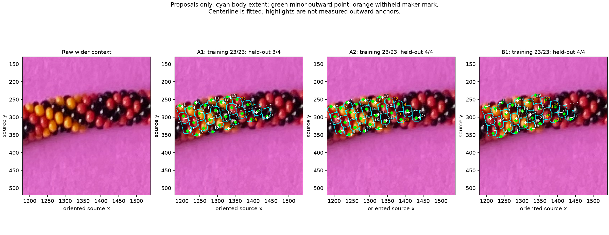
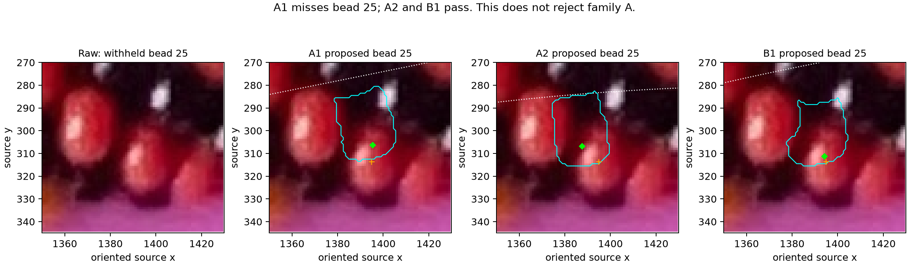

# Curved comparison of the existing 27-body patch — R156

Both family A/source winding +1 and family B/winding −1 have a curved pose that
owns all 27 maker marks, including the four withheld marks. **Neither helicity
is established.** A known opposite-family synthetic fit also owns all 27 points.
The patch is long enough for the earlier angle/count scale; ordinary points
inside bead bodies do not yet supply the supported outward positions needed to
use that scale. More marks of the same kind are not the immediate next task.



At R156 publication, [Q156.1](CURVED_PATCH_QUESTIONS.md) and the older
[Q149.1](MAKER_POINT_QUESTIONS.md) had no supplied answer. **R157 then rejects
the projected outlines as crossing into other beads and replaces outline review
with [conservative interior loops](INTERIOR_LOOPS.md).** Q156.1 is closed by that
rejection. Do not propagate the cyan outlines as accepted bead boundaries or use
them to walk the whole necklace. The numeric point-feasibility results below
remain historical evidence, not validation of those rejected extents.

## Inputs and measurement path

Read-only maker revision 162: [saved locations and series](manual-labels-r146.json),
27 numbered bodies in one connected chart, with six complete recorded neighbor
stars. [Graph evidence](LABEL_SERIES.md) establishes discussion coordinates and
two conditional assignments, not photo bead_index. All relative indices below
use maker 20 as origin; missing/latent slots are not compressed. Family A weights
d1/d2/d3 as +1/+7/+6; family B as −1/+6/+7. Both source winding signs are tried
for each family. A global string reversal is still an equivalent convention.

The raw image is EXIF-oriented to 2540×3182. Wider review crop is
[1180,130,1540,520]; coordinates are original oriented pixels, x right, y down.
Maker marks are positive visible-surface ownership evidence. There are no
measured interior endpoints, sampling routes, bead centers, outward anchors or
accepted body polygons in this experiment. Loose outward-point least squares
is only a pose initializer; the final objective asks which surface is first on
the ray through each maker mark. Unmarked pixels are unconstrained, including
paper, shadows and gaps. No fixed palette, earlier HSV boxes, specular markers,
or historical fitted outlines enter the cost.

The entire neighboring group **22, 23, 24, 25** is held out. Its graph relations
can supply candidate indices; its image locations cannot supply bounds, seeds,
costs, start ranking or candidate selection. Candidate diversity is measured
using training-only projected centers, axial offsets and outward points. Keep
up to three distinct starts rather than counting phase+360 copies as separate
evidence. Held-out scores are reported after fitting, not used to choose poses.

## Curved model and exposure

Three methods were considered before implementation: fit curved geometry to the
existing positive body marks and review its predicted outward points; fit reviewed
body boundaries; or infer outward points from shading. Implement the first now.
The latter two require evidence not yet supplied, and shading couples light/camera.

Bead size and exact rounded-annular surface remain those of beads.pov: radius
R=2.110915748921366, minor tube radius 4, outward radius 4+R=6.110915748921366,
row advance H=2.8813999972776654, roundedness .8, height ratio .7 and hole ratio .14.
Preserve the source's literal sin(180/6.5) radians convention. These are scene
units, not an inferred physical size or phone distance.

Let s=kH/q and theta=curvature*s. The local planar centerline is
gamma=(sin(theta)/curvature, (1−cos(theta))/curvature, 0), with its stable
straight limit at zero curvature. T=(cos(theta),sin(theta),0) is the bead axis;
N=(−sin(theta),cos(theta),0) is the in-plane normal. Minor phase is
phi=phase+winding*360*k/q, in degrees. Center is
gamma+4*(sin(phi)*N+cos(phi)*Z); the minor-outward wall midpoint uses 4+R
instead of 4. This midpoint is the existing convention for the annulus's flat
outer band, which has multiple equally far wall points along its axial extent.

This is a **local constant-curvature approximation**, not a global circular
necklace. The photo's overall curve need not be circular. Curvature is free in
[−.045,+.045] per scene unit. q is tested in [6.45,6.55], then separately fixed
at 6.5 within 1e-10. q/curvature are local sensitivity parameters; they neither
establish N nor enforce source-loop closure. No photo total, origin or repeat
is inferred. Additional unseen neighbors at relative indices −60 through +47
participate in occlusion; they are model slots, not detected photo bodies.

Scale, translation, image roll, elevation, azimuth and minor phase are free.
Camera elevation spans 5–89.5 degrees above the common plane; azimuth and roll
allow either side. The straight model's fixed 55-degree gauge is not imposed on
this curved planar model. Fit values near camera/pitch bounds remain uncertain,
and positive-point-only poses are not measured camera elevations.

Baseline is orthographic. Perspective sensitivity uses nominal EXIF focal
4799.175227618243 pixels and principal point (1269.5,1590.5), from the earlier
[camera check](MAKER_POINT_FIT.md). Unknown crop, phone distance and intrinsics
prevent treating those values as calibrated. Perspective sensitivity is useful
evidence about ambiguity, not an accepted photo camera.

For every derived outward point, project it, cast a ray against all rounded
neighbor surfaces, and compare both **owner and front-hit depth**. Exposure
requires the correct owner and depth agreement within .005 scene units. A
self-hidden far wall can have the correct owner yet fail this depth test. The
numerical marching epsilon is 1e-4; these tolerances are not measurement error.
Hidden/grazing outward points do not become angle anchors; missing/edge slots
remain separate. No silhouette slivers or behind-edge bodies are added to the
inventory. The existing substantial marks, including black beads, remain
positive-body evidence; their predicted outward exposure is not a photo fact.

## Results

| Dataset/camera/pitch | Family/source winding | Training marks | Withheld marks |
| --- | --- | --- | --- |
| Known curved synthetic, q free | A / +1 (true family) | 23/23 | 4/4 |
| Same synthetic | B / −1 (wrong family) | 23/23 | 4/4 |
| Photo, orthographic, q free, A1 | A / +1 | 23/23 | 3/4 |
| Same photo, A2 and A3 | A / +1 | 23/23 | 4/4 |
| Same photo, B1 | B / −1 | 23/23 | 4/4 |
| Photo, nominal perspective, q free | A / +1 | 23/23 | 3/4 |
| Same perspective, B1 | B / −1 | 23/23 | 4/4 |
| Photo, orthographic, q fixed 6.5 | A / +1 (third distinct pose) | 23/23 | 4/4 |
| Same fixed pitch, B1 | B / −1 | 23/23 | 4/4 |

The other winding signs do not approach full coverage in this bounded search.
Their failure is **not a proof of impossibility**. There are 32 deterministic
proposal starts per condition and at most three retained refinements, each with
550 Powell evaluations. Sixteen conditions produce 26 retained fits; two
refinements reach their cap. All 512 least-squares proposals terminate within
their 120-evaluation cap. The guide for misses uses surface distance or occlusion
depth; it is not a likelihood or calibrated screen error. Zero is awarded only
to first-hit ownership. Once all training points pass, fitting deliberately stops
without silently adding background or boundary constraints.



A1 misses withheld bead 25, assigning its mark to an unmarked model slot k=15
instead of expected k=14. A2/A3 pass, so A1's miss does not reject family A.
The perspective B alternatives also include withheld failures; display/report
all retained fits rather than selecting with held-out evidence.

A1, A2, A3 and B1 predict exposed outward points for all 27 bodies **in their own
models**. The photo has not independently confirmed these predictions. Loose
outward initialization favors such poses, so this count is not an exposure
measurement. The synthetic wrong family predicts 26 exposed outward points and
passes all ordinary marks. Even the true-family positive-point fits differ
substantially from the generating camera/phase and do not recover true anchors.

For central bead 11, the illustrated A1/A2/B1 outward predictions are roughly
(1278.32,307.29), (1273.90,303.68), (1282.70,309.57). They differ by up to 10.58
pixels despite all owning its supplied mark (1283.82,304.06). Camera elevations
for these candidates range from the 5-degree lower bound to nearly 89.5 degrees;
none is an elevation estimate. Cyan boundaries can spill into neighboring dark
regions because the fitting evidence contains no negative boundary constraints.
Q156.1 reviews these extents on a clear central body before using any as anchors.

## Validation and reproduction

Four meaningful tests pass: curved placement/outward positions agree with the
existing exact source-circle port at N=744 for both windings; zero curvature
matches legacy surface ownership/depth; exposure rejects a self-hidden wall
with the correct bead owner; changing all four withheld positions leaves every
training bound/proposal/ranking unchanged. N=744 is calibration only.

Independent POV-Ray checks use the original source bead macro and their own
trigonometric positions/axis rotations, rather than Python-generated centers.
Three initial camera/curvature cases and retained-fit checks report pixelwise
ownership disagreement and grazing iteration caps. See [forward checks](review/r156/parity.json),
[fit checks](review/r156/fit-parity.json), [complete fit results](review/r156/report.json)
and [image provenance](review/r156/review-provenance.json). One selected A2 point
ray has an unfinished grazing ray/body pair; A3 and B1 pass all 27 with none.
This is preserved rather than silently calling every ray fully converged.

There are 16 retained-fit render checks in addition to the three initial checks.
Worst retained-fit mismatch is 8/48,825 pixels (0.0164%); up to 195 grazing
ray/body pairs remain unfinished on a grid. Rounded maker locations can cross a
body boundary: B1's mark 1 is one example. Fifty-four additional independent
single-pixel renders put the POV pixel center on each **exact fractional** maker
location for A3 and B1; both pass 27/27. This confirms their ordinary-point
feasibility without claiming robustness to annotation error or body outlines.

```sh
.venv/bin/python -m unittest discover -s photo2 -p test_curved_patch.py
.venv/bin/python photo2/check_curved_patch.py
.venv/bin/python photo2/fit_curved_patch.py --maxfev 550
.venv/bin/python photo2/review_curved_patch.py
```

Reports retain source/image/annotation/code hashes, parameters, seeds, training
bounds, observation IDs, model owners, anchor depths/exposure, optimizer outcomes
and POV commands. Routine scenes/renders are ignored under photo2/output/r156;
curated raw/context/question images and numeric evidence are tracked. No live
annotation, source geometry, prior result, dependency or launcher was changed.

**Stopping point:** bounded curved-patch comparison and illustrated review.
**Next task:** use Q156.1's reviewed body extent, or a short reliable boundary
segment if all proposals are wrong, to constrain a central bead before deriving
photo-supported outward points. Do not advance to whole-ring indexing/colors.
Recommend gpt-6.1-sol / High; same session, no /new needed.
