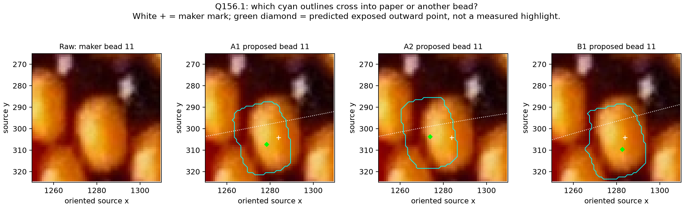

# Curved 27-body comparison — maker review

Q156.1 is **pending**. No outline, camera pose or helicity is accepted.

**Q156.1:** Which proposal best follows bead 11's visible body outline: A1, A2,
B1, or none? A short note about a side that crosses into a gap or another bead
would be particularly useful. “Unclear” is also a valid answer.

The cyan line is a proposed visible extent after neighbor occlusion. White + is
the maker's existing location. The green diamond is the model's predicted
minor-outward point; it is not a measured highlight or boundary marker. The
dotted white centerline is also fitted. Each panel shows the same unmodified raw
pixels, source crop [1250,265,1310,325], EXIF-oriented x right / y down. Bead 11
is a substantial central body, away from the top/bottom silhouette slivers.

Labels A1/A2 name two different retained poses of family A with source winding
+1; B1 names the first retained pose of family B with winding −1. These are
diagnostic candidates, not recovered photo indices or measured camera elevations.
See [experiment](CURVED_PATCH_FIT.md) for the full results and limitations.
The older [Q149.1](MAKER_POINT_QUESTIONS.md) remains pending independently.
