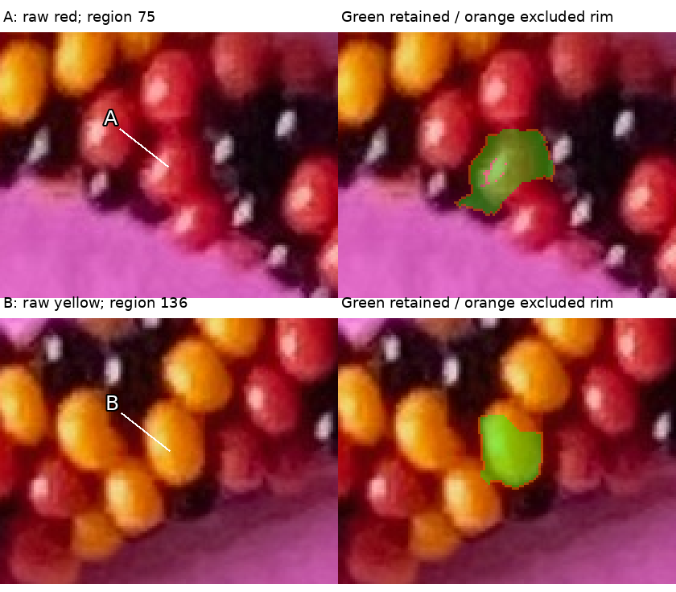
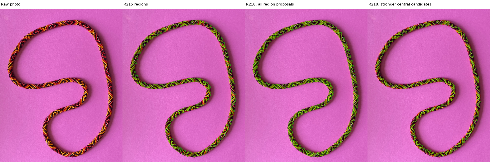
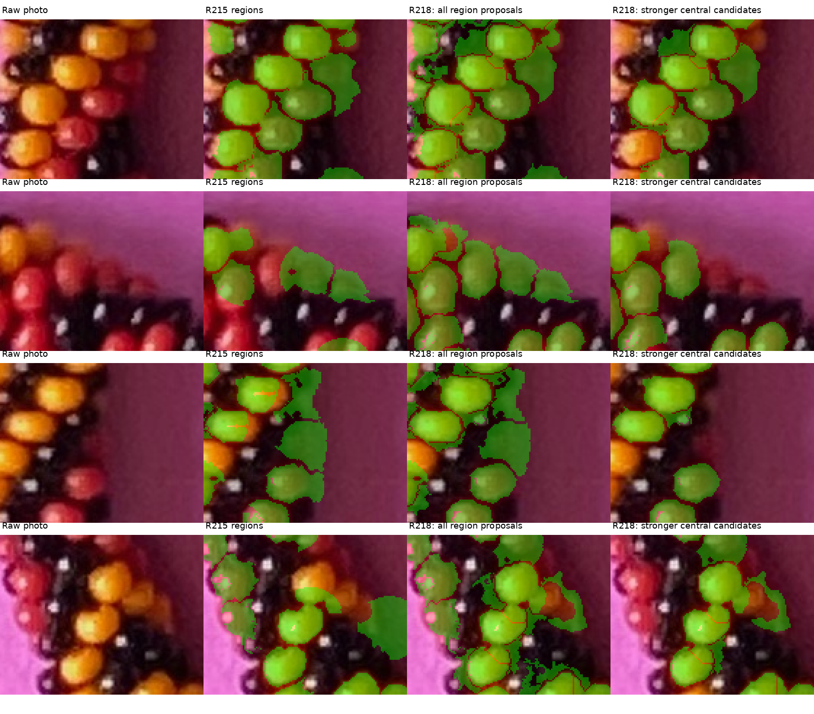

# Diffuse-core mask refinement — R218

The current task is to improve the broad colored masks before position fitting.
The target remains 70–90% of each selected red/yellow bead's actual visible part,
with dark rims omitted and reflections recorded separately. Extraction uses the
photo alone: no manual bead marks, adjacency series, saved spline or simulated
photo positions.

The new method raises colored-pixel recall on four known render examples from
**69.87–74.17% to 76.74–77.80%**. It also improves the number of beads covered by
one sufficiently pure region. The photo has **596 stronger central region
proposals**; these are neither confirmed distinct beads nor a measured photo
coverage percentage. The earlier confirmed yellow example still exposes an
unresolved duplicate-region issue, described below. Fitting remains deferred.

## Q218.1 and Q218.2 — Two newly recovered faces

The first row marks **red A**, automatic region75. The second marks **yellow B**,
region136. These are new automatic numbers, unrelated to the manual bead labels
or the earlier A/B review. Neither face had retained pixels in the R215 output.
Green shows retained pixels; orange shows the omitted candidate rim.

**Q218.1:** Does green A capture roughly 70–90% of the red bead's visible part,
while staying inside that one bead?

**Q218.2:** Does green B capture roughly 70–90% of the yellow bead's visible part,
while staying inside that one bead?



Both questions are pending. [Exact pixels, locations and prior-mask overlap](review/r218/review-locations.json)
and [the as-issued manifest](mask-refinement-questions-r218.json) freeze what is
being reviewed. Answers concern these illustrated masks, not every proposal,
exact centers, bead indices or adjacency.

## Whole image and fixed comparison contexts





For zooming, use the full-resolution [new body overlay](output/r218/body-overlay.png),
[stronger central subset](output/r218/central-candidates.png) or
[body/rim/reflection layers](output/r218/body-band-reflections.png).
The third comparison column includes weak proposals to expose their failures.
The fourth omits weak cores and seeds near the image-derived search-band edge.
Unpainted regions remain unresolved or excluded; they are not declared paper.

## Methods and selected change

Four approaches were considered before implementation:

| Approach | Useful when | Main risk |
|---|---|---|
| Add diffuse-brightness seeds | A visible face lacks a seed | Extra seeds can fragment one bead |
| Reseed regions from prominent diffuse cores | Old seeds sit poorly within faces or miss neighbors | One face can have multiple supported cores |
| Merge fragments across a clear interior bridge | Two regions belong to one colored face | A mistaken bridge joins different beads |
| Grow from nearby reliable color evidence | Masks omit clear connected face pixels | Growth can enter ambiguous rims/paper |

The first two were compared with frozen R215. **Diffuse reseeding is selected**:
it gives more known bodies a single region in the requested coverage range.
The merge/growth approaches remain available for subsequent refinement; no
adjacency graph or manual body labels were introduced.

The frozen R215 extractor learns paper appearance, hue families and apparent
scale from the image. The new stage median-replaces compact reflection pixels
only in the diffuse-brightness calculation. Smoothed brightness, color support
and distance from unsupported pixels identify prominent cores. Prominence is
8% of the learned family's 90th-percentile diffuse brightness; same-family
seeds closer than .35 apparent diameters are suppressed. An old automatic seed
is retained only where no new core lies within .65 diameters.

A dark-valley watershed then grows the candidates. Hue defines the color support;
an absolute penalty for distance from a global hue mode is removed from this
boundary cost. Keeping the old .15 penalty reduced recovery in the comparison.
Seed-relative diffuse floors, radius/support guards and weakest-rim exclusion
remain. Retaining about 90% of a proposed candidate is a preference, not proof
of actual visible coverage. Pixel means remain region summaries, not physical
bead centers or outward anchors.

The stronger central subset additionally requires a prominent diffuse core,
seed clearance of at least .55 diameters from the estimated search-band edge,
and diffuse core brightness at least 45% of its learned family's bright-core
reference. These image-derived checks are confidence proposals. They do not
prove full silhouettes, correct ownership or uniform physical arc-length coverage.

## Measured coverage and ownership

The table uses all visible colored pixels for recall, including bodies that
were missed. Eligible-body counts retain R215's declared area threshold. The
single-region column requires at least 98% one-body purity and 70–90% recall of
that body's visible pixels; fragments cannot add together to pass this column.

| Known example | All colored recall, old → new | Bodies in 70–90%, old → new | One pure region in 70–90%, old → new | Missing eligible bodies, old → new |
|---|---:|---:|---:|---:|
| + hand, blue/amber/black | 71.87 → 76.93% | 79 → 94 / 112 | 63 → 77 / 112 | 2 → 0 |
| − hand, same palette | 69.87 → 76.74% | 81 → 92 / 113 | 64 → 80 / 113 | 4 → 0 |
| + hand, changed palette/background/placement | 74.17 → 77.80% | 88 → 97 / 113 | 68 → 82 / 113 | 1 → 0 |
| + hand, changed framing at image border | 73.52 → 77.77% | 85 → 96 / 112 | 73 → 86 / 112 | 1 → 0 |

No retained paper or black-body pixels occur in these four render examples.
Some bodies remain under-covered, over-covered, split or mixed. Minority-owner
pixels in mixed regions fall from 4,010/3,562/3,230/3,815 to
1,794/1,365/1,354/1,319. Adding seeds gives fewer minority pixels in two examples,
but fragments more complete faces; its pure-single-region counts are only
66/66/75/74 versus reseeding's 77/80/82/86.

All image-only masks finish before owner IDs are read. These existing scenes
are development/regression controls, not independent generality tests.
[Full per-body and mixed-owner witnesses](review/r218/calibration.json).
The metrics above concern all new proposals, not just the stronger central subset.

## Reflections and a preserved failure

All **1,339 photo reflection masks and positions are unchanged** from R215.
Tentative colored-region associations are recalculated for the new region labels;
868 spots associate with a candidate, without maker confirmation of ownership.
The previously confirmed reflection28 has its exact 32 pixels preserved.
No black body outline or bead center is inferred from a reflection.

An initial version reopened hue holes at neutral reflections while generating
new cores. That split the previously confirmed yellow mask into three regions.
Reusing the surrounding colored support for those reflection pixels reduces
this to **two regions**, retaining 604/624 confirmed pixels in their union.
The larger region contains 490 of those pixels; the smaller contains 114.
**That duplicate-region problem is still unresolved.** The previously confirmed
red mask retains 707/713 pixels in one new region. Old confirmations do not
approve the new extents or require rewriting the old masks.
[Exact overlap audit](review/r218/prior-confirmation-check.json).
[Earlier hue-cost and reflection-hole comparisons](review/r218/development-comparison.json).

Two adverse unit controls check distinct same-color cores across a dark valley
and one diffuse body with two neutral reflections. The latter covers red,
yellow and blue hue families. Both controls pass. Existing reflection extraction
and its physical/diffuse-only controls remain unchanged; no new render was made.

## Files and next bounded task

The photo output has **1,287 region proposals, 553,887 retained pixels and
61,949 omitted rim pixels**. The stronger central subset has 596 regions and
350,159 retained pixels. Unassigned color-domain pixels remain explicit.
No unique-bead count or complete trusted photo inventory is claimed.
[Region/seed/confidence records](review/r218/regions.json) and
[source/output/protected hashes](review/r218/summary.json) preserve this run.
[Verification](review/r218/verification.json) confirms eight curated payloads and
the native mask archive repeat byte-identically, checks unchanged reflections
and historical evidence, and binds the questions to exact retained pixels.
Routine native masks, TIFFs and overlays stay ignored under `photo2/output/r218`;
curated raw review images, parameters and measurement ledgers are tracked.

```sh
.venv/bin/python photo2/check_mask_refinement.py --hue-weight .15 --no-neutral-support --output photo2/output/r218/probe/hue-biased
.venv/bin/python photo2/check_mask_refinement.py --no-neutral-support --output photo2/output/r218/probe/neutral-holes
.venv/bin/python photo2/check_mask_refinement.py --output photo2/output/r218/calibration-final
.venv/bin/python photo2/refine_colored_masks.py
.venv/bin/python photo2/review_mask_refinement.py
.venv/bin/python -m unittest discover -s photo2 -p test_mask_refinement.py
```

Stop at this refinement review. Next preserve the two visual answers and address
remaining duplicate or weak regions using clear nearby color/diffuse evidence.
Keep difficult edge regions unresolved. Establish the pixel basis before
position, centerline or adjacency fitting. Recommend **gpt-6.1-sol / High**,
same conversation; no `/new` needed.
