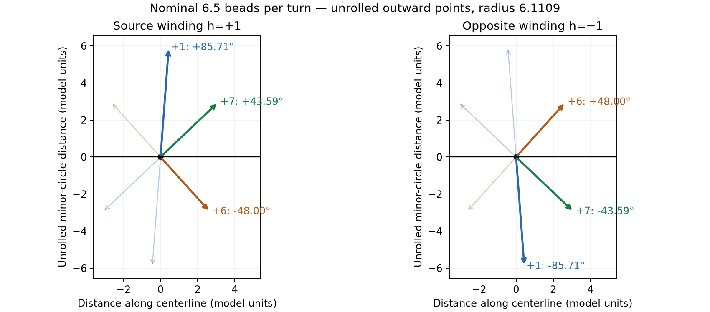

# Directions 1, 6 and 7 at minor-outward bead points — R150–R151

The requested points are the bead's greatest **minor-radial extent from the local
necklace centerline**. Use the outer-wall band's midpoint, matching
`minor_outward_point` in [the placement module](bead_placement.py). This is the
small-circle outward direction, not the bracelet's major-circle outer edge.
No maker annotation is reclassified as a measured outward anchor.

With the nominal 6.5 beads per turn and the local straight-tube approximation,
the signed **3D point-to-point** angles relative to forward centerline are:

| Index-step direction | Source winding h=+1 | Opposite winding h=−1 |
| --- | ---: | ---: |
| +1 | +85.54° | −85.54° |
| +6 | −47.72° | +47.72° |
| +7 | +43.31° | −43.31° |

Source h=+1 increases `row_angle` with increasing bead index, as `beads.pov` does.
Forward centerline is increasing major angle/index. Positive transverse direction
is increasing minor angle. These conventions avoid assigning image-clockwise or
right/left-handed names without defining a viewing frame. Negative index steps
reverse the corresponding displacement; unoriented line angles are modulo 180°.

## Calculation and the two angle definitions

Three approaches were presented: unrolled surface directions, 3D chords joining
the selected points, and camera projection. Calculate the first two; camera
projection additionally requires pose and minor-circle position.

Literal [source placement](../beads.pov) gives:

```text
chain_minor = 4
bead_radius = 4 * 0.96 * sin(180 / 6.5) = 2.110915748921366
outward-point radius rho = 4 + bead_radius = 6.110915748921366
advance per turn H = 0.65 * (2*bead_radius) * 1.05 = 2.8813999972776654
nominal advance per index p = H / 6.5 = 0.443292307273487
```

The radius preserves the literal sine expression; POV-Ray takes its argument in
radians. No source size, row spacing or bead geometry is changed.

For positive index step j and helicity h, take the shortest signed minor-circle
displacement δ = wrap(h*2π*j/q) into (−π,π], where q=6.5 nominally. Neighbor
direction 6 crosses the short gap backwards around the minor circle rather than
following the thread through almost a full turn. For h=+1:

| j | δ | Centerline advance jp | Outward reference arc rho*δ | Transverse chord |
| --- | ---: | ---: | ---: | ---: |
| 1 | +55.384615° | 0.443292 | +5.907079 | 5.679768 |
| 6 | −27.692308° | 2.659754 | −2.953540 | 2.924876 |
| 7 | +27.692308° | 3.103046 | +2.953540 | 2.924876 |

For actual straight lines joining the points in 3D, transverse displacement has
magnitude L=2*rho*sin(abs(δ)/2). The signed inclination is
sign(δ)*atan2(L,jp), producing the first table. Its sign denotes the minor-circle
side, not a common global 2D plane for every chord.

For a direction drawn on the **unrolled reference tube**, use arc length instead
of chord: α=atan2(rho*δ,jp). This gives:

| Direction | Source h=+1 | Opposite h=−1 |
| --- | ---: | ---: |
| 1 | +85.71° | −85.71° |
| 6 | −48.00° | +48.00° |
| 7 | +43.59° | −43.59° |



The plot is a geometry diagram, not photographic evidence. Its reference tube
passes through the outer-wall midpoints; it is not a continuous physical bead
surface. Earlier center-radius calculations are superseded as the primary answer
by R151's requested outward-point focus.

## Literal default scene and torus curvature

The loop rounds `nrows`, making q=N/round(N/6.5), rather than always exactly 6.5.
At clock=0, source pattern 1 has N=24×28=672, nrows=103 and q=6.524271845.
For that supplied generator count, the local outward-point **3D chord** angles
are +85.54°, −49.04°, +41.91° for h=+1; h=−1 reverses signs. Unrolled angles
are +85.71°, −49.34°, +42.16°. This N is a source example, not a photo bead count.

The full torus is curved, so exact 3D chord inclinations also vary with section
phase. Measuring against the planar centerline tangent at the midpoint major
angle, the source N=672 example gives these unsigned ranges over section phase:

| Direction | Exact torus angle range, either helicity |
| --- | ---: |
| 1 | 85.03°–86.05° |
| 6 | 45.68°–52.79° |
| 7 | 38.57°–45.77° |

Ranges sample phase at 0.5-degree spacing. Thus same bead size alone does not
make one exact angle valid everywhere on a torus. Camera-projected angles also
depend on camera and position around the minor circle. Outward anchors still
require their own exposure/occlusion check; none is supplied by this calculation.

## Reproduce, checks and stopping point

[Patch-size calculation](PATCH_SUFFICIENCY.md) uses these angles to obtain the
centerline span giving one extra direction-6 neighbor step: 6.46 nominal row
spacings, with seven direction-6 steps versus six direction-7 steps.

```sh
.venv/bin/python photo2/direction_angles.py
.venv/bin/python photo2/direction_angles.py --nbeads 672
```

[Nominal report](review/r150/nominal.json) and
[default-source report](review/r150/N672.json) preserve dimensions, both helicities,
arc/chord definitions, source/code hashes and checks. Twenty-four comparisons
against existing local placement at four section phases agree within 1e-12 degrees.
Ten comparisons against the existing full-torus `minor_outward_point` agree within
1.1e-14 model units. No new image fit, dependencies or source/annotation edits.

**Stopping point:** intrinsic outward-point angles calculated; no photo helicity
or 6/7 assignment inferred. **Next task:** project these outward anchors under
the competing camera/section poses and check their exposure before comparing
observed direction angles. Q149.1 remains pending; neither fit is accepted.
Recommend gpt-6.1-sol / High; same session, no /new needed.
