# 208 distributed colored interior references — R201–R203

The selected set contains **115 red and 93 yellow interior patches**, spread
around the entire necklace. No black bead is selected. These use your R202
permission to accept safe interiors: their small positive-patch centroids are
reference positions, **not estimates of full visible-part centers**. The
[exact requests](distributed-position-scope-r201-r203.json) preserve that scope.

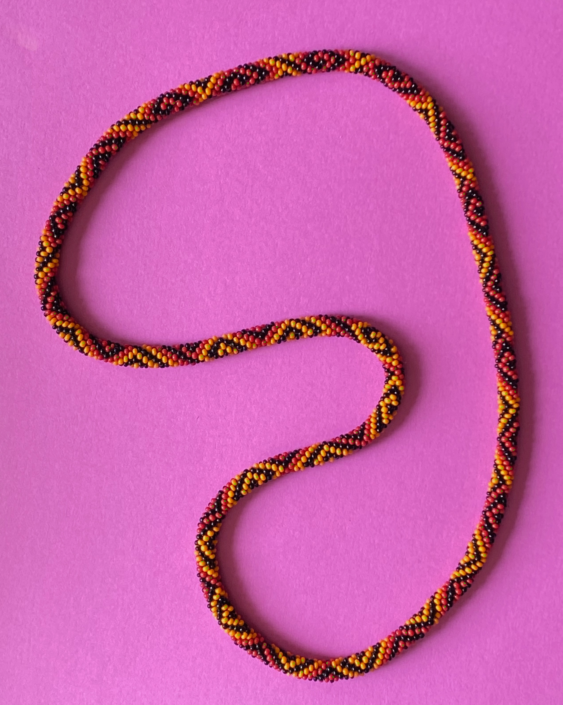

The green loops enclose small colored patches; they do not trace bead outlines.
The PNG preserves native2540×3182 photo coordinates for zooming. All selected
patches have paired unmarked raw crops below. The detector's image-derived loop
is divided into20 equal image-arclength sections; selected counts range8–13 per
section. The largest gap between selected references is about1.22% of that loop,
compared with12.93% for the earlier41 marks on the old spline. These use different
approximate routes, so the comparison describes coverage rather than physical
angle or a corrected centerline. Density is approximately uniform, not identical
in every section.

## How this set was selected

Four methods considered: colored-support centroids, distance-based interior
centers, agreement under modest hue/S/V changes, and balanced sampling along
the loop. The first strict native-centroid attempt produced863 colored regions
but only38 stable centers; touching regions and changing thresholds prevented a
distributed few-hundred set. [Failure counts and parameters](review/r201/center-attempt.json)
are retained. No center accuracy is claimed for those regions.

After your safe-interior clarification, reuse the input-only R192 conservative
patch extractor. Learn background, color modes, scale and approximate route
from this image. Hue is circular; local S/V checks keep small patches away from
rejected appearance support. Require at least12 native positive pixel centers
and3px clearance from rejected support. Test that at least95% of each patch
survives a modest stricter H/S/V condition. This yields505 colored proposals.
Clearance from rejected support is not measured physical seam clearance.

Raw inspection revealed weak shaded fragments among the initial choices. Favor
patches above each learned color family's20th brightness percentile, leaving403
supported proposals. This is a conservative sampling preference, not a universal
bead/background classifier or fixed photo HSV box. It retains explicit exclusions.

Select references in round-robin quality order across20 route sections, requiring
at least1.25 learned apparent diameters between selected patch centroids
(about33.99px here). This sparse preference reduces selecting two nearby patches
as independent anchors, while preserving both as separate observations. It does
not merge aliases or prove distinctness. It selects208 instead of padding to300
with close alternatives. [Earlier adverse subset results](review/r201/subset-attempts.json)
remain visible: brightness alone did not resolve known duplicates/cross-body patches.

The runtime uses neither your41 centers, the old spline, a simulation nor saved
color boxes. Maker marks are read only afterward for nearest-reference diagnostics;
those distances are not center errors or established body correspondences.
Semantic red/yellow names are assigned after extraction, from raw inspection and
prior color facts. [All colored observations, exclusions, IDs, pixels and loops](review/r201/interiors.json)
retain the original automatic observation numbers/UUID convention. They are
independent of maker numbers and model/string indices, which remain unknown.

## Raw review of all selected patches

Each pair shows the same76×76 native crop enlarged twice: unmarked raw on the
left, the selected small loop on the right. A-numbers are automatic observation
numbers, not string indices. All11 pages and the whole-photo view were inspected.
Selected loops appear within colored surfaces; no clearly identified black,
paper or cross-body patch was found in this selected photo set. This is curator
visual judgment, not a new maker-confirmed region ledger or exact pixel truth.
[Sealed visual-review record](review/r201/visual-review.json).

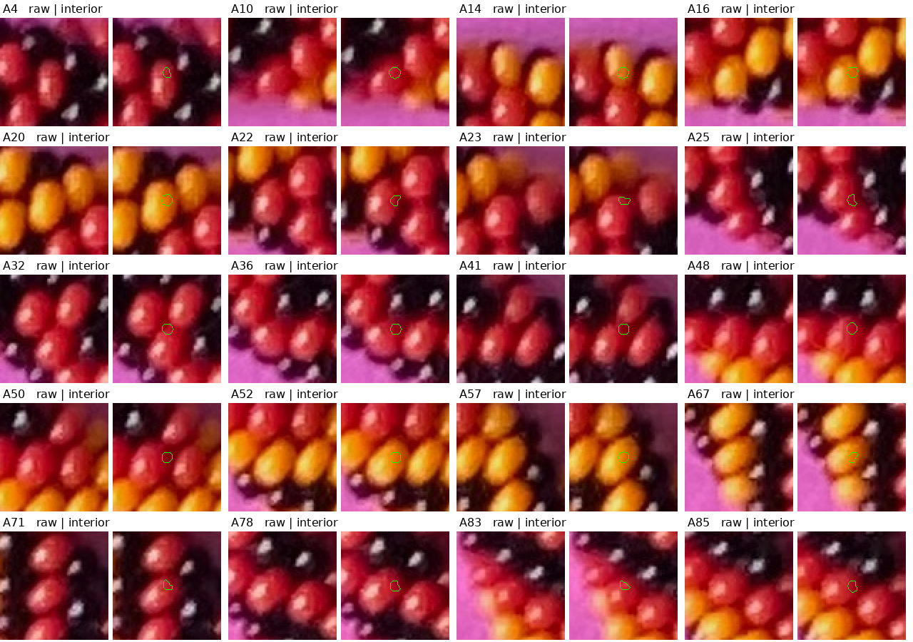

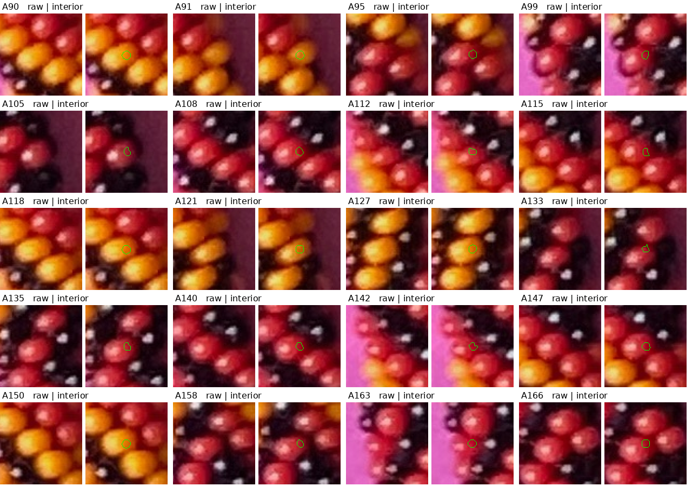

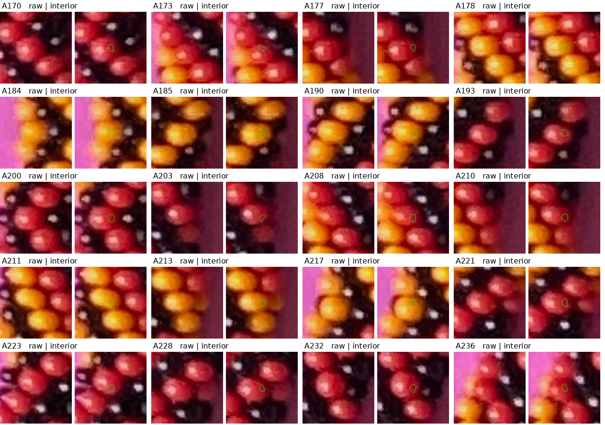

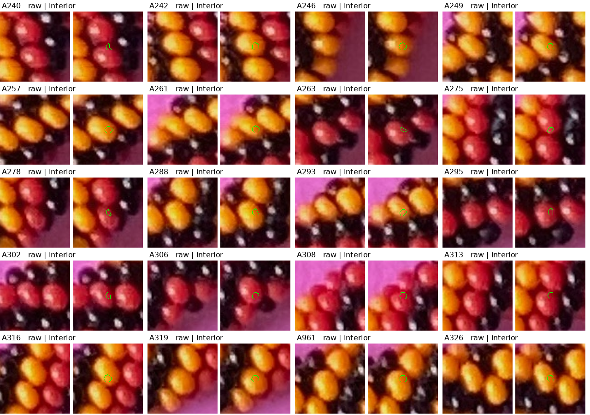

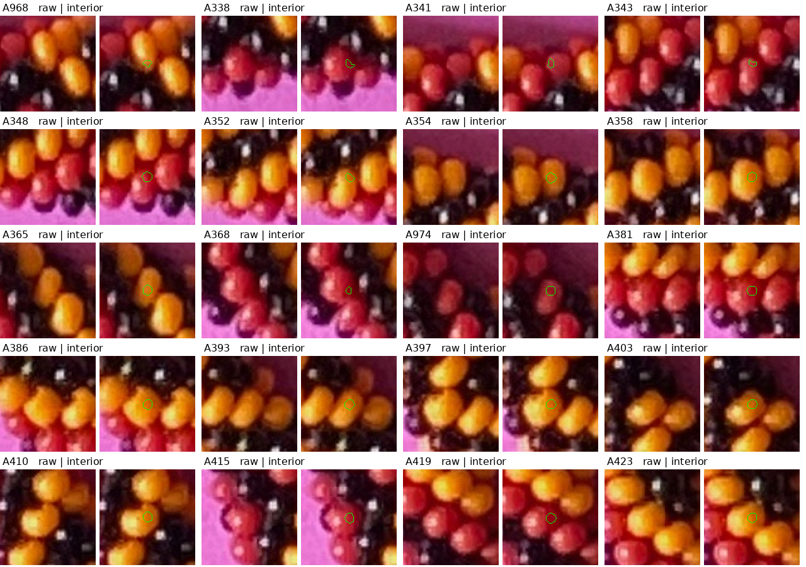

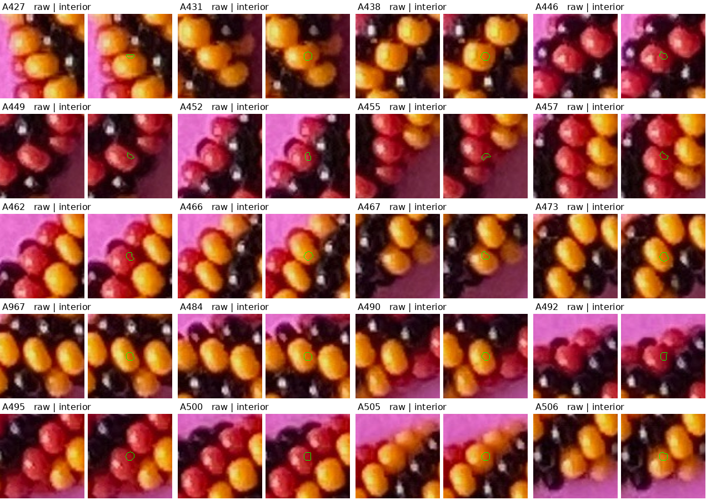

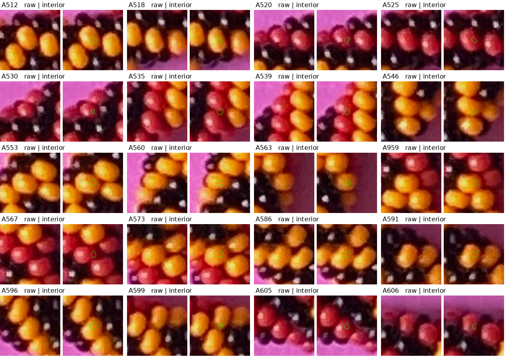

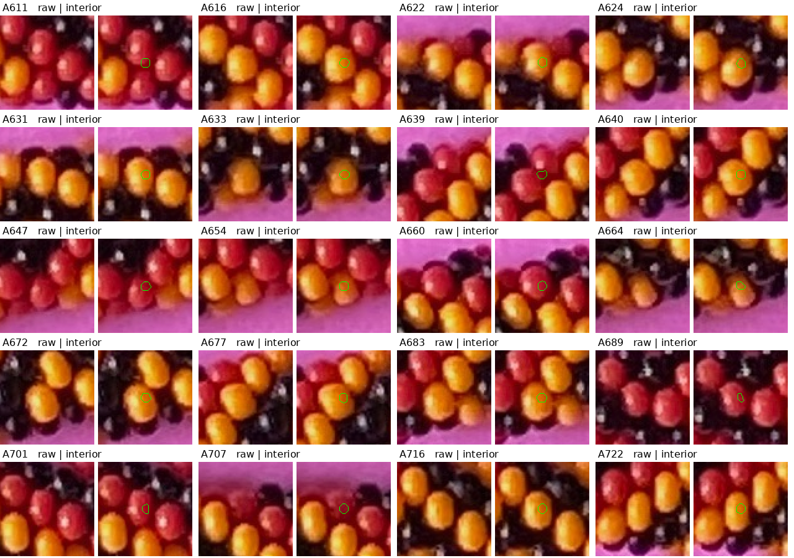

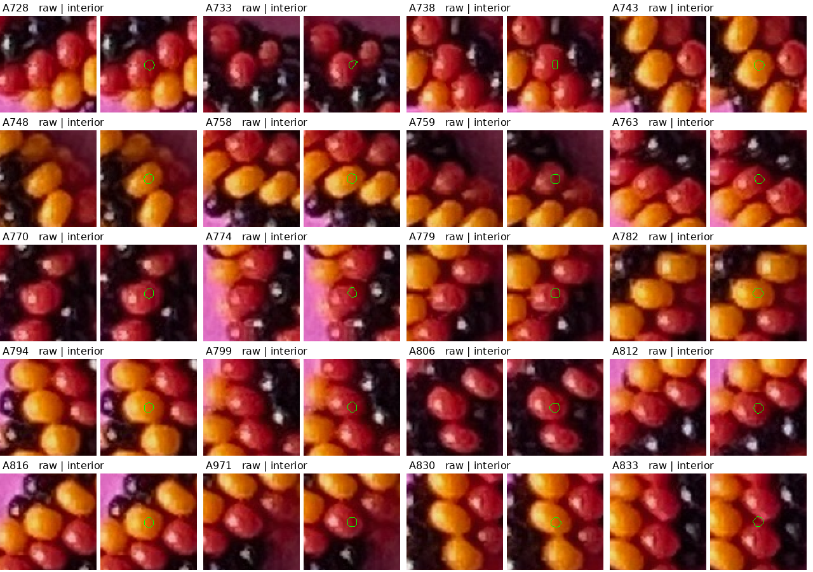

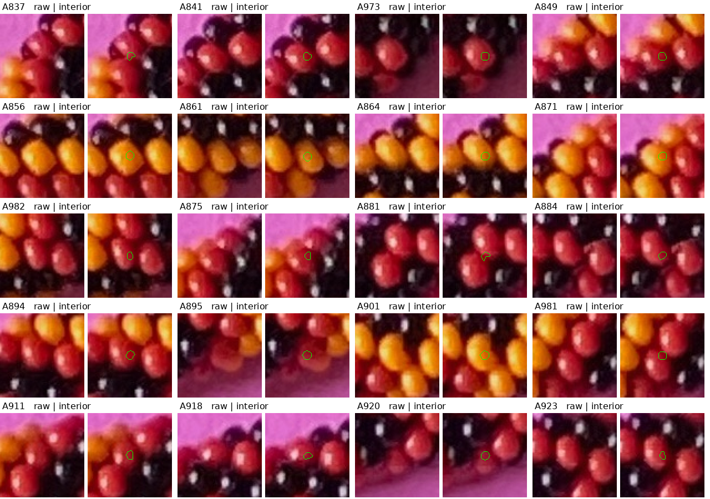

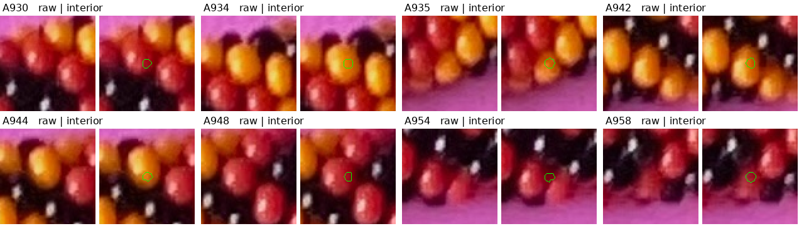

## Validation and 1D practice

All image-only extraction/selection finishes before rendered IDs or maker marks
are read. On three existing known examples—both hands and a changed palette/
placement—the final selected sets contain27,25 and20 patches. **All72 lie wholly
on distinct colored bodies**, with no selected black/background/mixed-body
patches or duplicate bodies in these fixtures. Minimum true native pixel margins
are4.0,5.0 and2.83px. [Full ownership witnesses](review/r201/calibration.json).
This supports the selected subset's precision on these examples; it does not
establish all-photo correctness, complete coverage or a guaranteed unique208
photo beads. Unselected/missing bodies have not been resolved.

The known interior centroids can differ from full visible-area centroids by up
to15.86px. Your safe-interior allowance is consequential: later matching must
use interior membership/ownership, not silently treat these as exact centers or
minor-outward anchors. Original41 maker center marks remain available separately.

Your proposed1D practice is implemented in [CENTERLINE_PROFILE_PRACTICE.md](CENTERLINE_PROFILE_PRACTICE.md).
It samples the existing spline and nearby paths around the whole loop, and shows
raw context, an RGB strip and H/S/V for three sections. Two small questions test
the interpretation of nearby yellow areas and a possible black reflection.
R204 confirms S/Q are different yellow beads; R205 confirms R is a black
reflection. Both answers are bound to the unchanged question image and points.
The S/Q trace has a15.6% V dip and11.4° endpoint hue change; exact seam pixels
remain unknown. Black beads remain excluded from the positional set. The spline
is unchanged.

```bash
.venv/bin/python photo2/review_distributed_interiors.py
.venv/bin/python -m unittest discover -s photo2 -p test_colored_positions.py
.venv/bin/python photo2/practice_centerline_profiles.py
.venv/bin/python photo2/record_profile_answers.py
.venv/bin/python -m unittest discover -s photo2 -p test_profile_answers.py
```

Seven controls pass: balanced sampling without deleting other observations,
spacing across section boundaries without alias merging, RGB-before-HSV hue-wrap
sampling, periodic one-pixel route/unit normals, and explicit mixed/background/
duplicate/black evaluator witnesses, bounded point-fact promotion and rejection
of changed question points/replies. Complete curated extraction and profile
artifacts repeat byte-for-byte. Source, native pixels, selected spacing/coverage,
question seals and ten protected input hashes checked. [Hashes and final summary](review/r201/summary.json).
[Curator seals, answer checks and reproduction checks](review/r201/curation-summary.json)
include the separate visual review and exact-answer records.
No new render, GUI/server, model fit, count scan or camera/phase/centerline/stretch
change. Live saved annotations, centers and scores remain untouched.

Stopping point: a screened, sparse distributed colored-interior set and1D
practice examples with both answers recorded. Next bounded task: transfer
supported1D cues to neighboring
paths and this set before correspondence refinement. gpt-6.1-sol / High; same
session, no `/new`.
