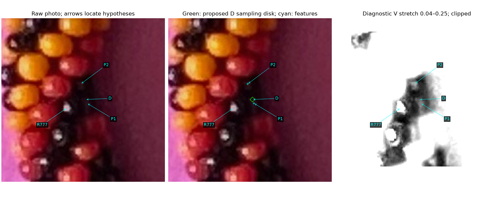
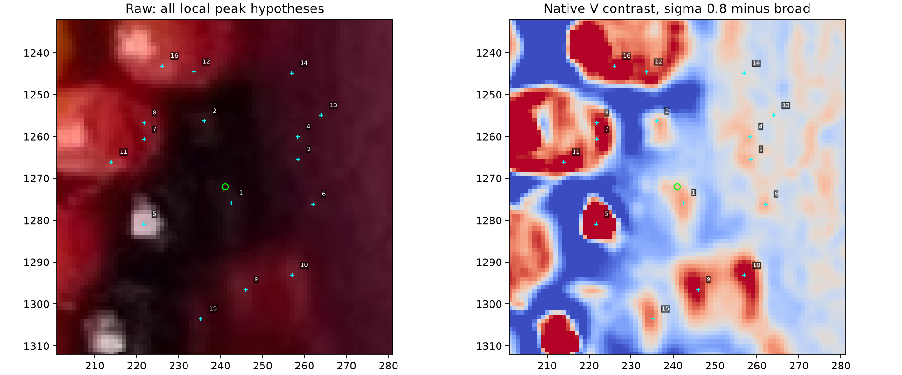

# D interior confirmed; reflection hypotheses rejected — R196–R199

Resume the bounded task after R195: locate the confirmed black point D's own
reflection/positive patch and check existing aliases. **R198 confirms D's tiny
interior patch; R197 rejects both P1/P2 as specular reflections on D's bead.**
D remains distinct from R777; its own reflection and other aliases are unresolved.
The [updated trusted ledger](review/r196/trusted-facts.json) preserves these exact
positive/negative facts. No detector, earlier ledger, live save or simulated fit
is changed. This is an assisted local diagnostic, not an automatic all-bead
reconstruction: the maker's point selects the window.

**R199 scope correction:** use enough reliable beads, distributed around the
bracelet, to begin matching predicted positions with small centerline adjustments;
do not require every visible bead. Exclude black bodies without obvious specular
reflections from the current position basis. Thus D's confirmed interior remains
in the factual ledger but is inactive for positional fitting. [Exact scope](position-basis-scope-r199.json),
[active evidence subset](review/r196/active-position-basis.json): 11 region records,
six black-locator records and two colored point-identity records, with possible
aliases. These are evidence types, not exact bead centers/outward anchors or a
count of independent beads. The 41 saved maker visible-center marks are preserved
and are the next distributed references to audit under this scope.

Four methods compared: native V peaks, contrast at several scales, bright
support with dark surroundings, and existing observation associations. Use
native local contrast and scale/threshold alternatives, retain all local peaks,
and present raw context for the two near-D features. Existing aliases remain
proposals except the maker-confirmed distinction from R777.

## Q196.1 — Which spot is D's specular reflection?



The left panel uses the raw photo with locating arrows. The middle repeats the
raw pixels with cyan crosses on P1/P2 and a tiny green proposed sampling loop at
D. The right shows HSV V as gray, linearly stretched from 0.04 to 0.25 and
clipped outside that interval; it is a diagnostic enhancement, not new evidence
or recovered bead boundaries. R777 identifies the other black body.

**Which marked spots, if any, are specular reflections on the black bead
containing D: P1, P2, both, or neither?** “Cannot tell” is also useful. A bright
feature's presence or stability alone does not settle its body or specularity.
Do not use either point as a physical center or outward anchor. **R197: “Neither.”**
Keep both excluded as D specular reflections; other body/appearance explanations
remain unknown. [Exact answers and reviewed hashes](D-interior-answers-r197-r198.json).

## Q196.2 — Tiny positive sampling patch at D

In the same middle panel, **does the tiny green loop at D stay entirely inside
its black bead, comfortably away from interbead seams and the background?**
It is a two-native-pixel-radius sampling proposal (13 pixel centers), selected
around the previously confirmed point. It is not an automatically recovered
body region. The automatic dark-support inset failed its minimum of 12 native
pixels; preserve that failure rather than silently changing its acceptance.
Geometric guard clearance on the sampling disk is not bead-boundary clearance.
**R198: “Yes.”** Promote precisely these 13 pixel centers and the displayed
closed loop as a black positive interior. Geometric guard distance remains
distinct from a measured numeric bead margin. R199 subsequently excludes D
from the active position basis because it has no obvious established reflection.

## Measurement route and why the coarse filter omits these features

Original EXIF-oriented pixels, x right/y down; image 2540×3182. D=(241,1272).
Window [173,1204,309,1340], selected only for this assisted diagnostic. Its scale
comes from the frozen image-derived apparent diameter, 27.19 native pixels.
Find local maxima of Gaussian-smoothed V minus a broader V average; reference
narrow sigma0.8, broad sigma5.438 native pixels, positive response floor0.003,
three-pixel peak spacing. The low floor creates a hypothesis catalog, not a
calibrated noise rejection rule. Check narrow sigmas0.6/0.8/1.2/1.8, allowing
three-pixel matching shifts. Every cataloged local maximum is retained.

Around each maximum, use a four-pixel disk and a 4–8px surrounding ring. Select
the connected bright support above 60% of its raw peak-to-ring-median contrast;
locate its centroid with squared positive contrast weights. Repeat with50/70%
thresholds. If a filter maximum has no positive raw peak-to-ring-median contrast,
retain it as unresolved rather than pretending its connected support is a
localized reflection. A low-V maximum can still be texture, JPEG structure or
reflected color. The support pixels themselves are unconfirmed.

For the question, select the two nearest positive raw-contrast features to D
whose centroids are more than half an apparent diameter from a frozen observation
seed. This question selector does not establish new unique bodies or exclude
aliases on farther observations. Learned hue/S measurements are reported after
selection; no fixed red/yellow hue boxes enter native peak extraction.

| Feature | Weighted native location | Native contrast response | Original coarse response | Matches / 4 scales |
| --- | --- | ---: | ---: | ---: |
| P1 | (242.46,1275.84) | +0.03779 | −0.02737 | 4 |
| P2 | (236.13,1256.31) | +0.03665 | −0.08657 | 4 |

Both lie in the approximate search band. The unchanged detector's learned
response floor is0.02982; neither feature reaches the peak-candidate stage, so
changing the later reflection suppression/ownership rules would not propose
them. This differs from R169's bright-neighbor suppression mechanism. Following
R197, **neither is an established missed D reflection**: positive local contrast
is not successful reflection recovery.

| Native-kernel comparison at the same integer peaks | P1 | P2 |
| --- | ---: | ---: |
| Original equivalent narrow2.175 / broad10.876 | −0.02484 | −0.08922 |
| Narrow0.8 only; original broad | −0.00744 | −0.05681 |
| Original narrow; broad5.438 only | +0.02039 | +0.00424 |
| Narrow0.8 and broad5.438 | +0.03779 | +0.03665 |

Native resolution alone does not restore the positive response with original
kernels. The broad average includes the brighter neighboring surfaces and
reflection; a smaller comparison neighborhood reduces that bias. This is a
local explanation, **not a globally adopted filter or threshold**. Different
filters need their own noise/false-positive evaluation.

The weighted positions move by about0.35px/0.19px under the50/70% alternatives
(see the exact report for unrounded values). These are sensitivity measurements,
not physical localization error bounds. P1/P2's support learned-color fractions
are0.586/0.895; reflected color and neighboring colored bodies remain plausible.
No automatic black classification or brightest-spot assignment follows.



[Full report: pixels, alternatives, failures and nearby observations](review/r196/report.json)
keeps original region/reflection-only/edge-excluded statuses. Eleven frozen seed
observations lie within68px of D; none is silently merged or relabelled. R777
remains confirmed distinct. Other body aliases are unresolved; nearest distance
alone cannot establish them.

## Validation and stopping point

```bash
.venv/bin/python photo2/recover_local_reflections.py
.venv/bin/python -m unittest discover -s photo2 -p test_local_reflections.py
```

Four tests pass: weak Gaussian feature beside a stronger one with
native-origin/threshold/scale checks, flat-image refusal, and a filter maximum
without a positive raw peak retained as unresolved, and precise positive-patch
promotion with negative reflection facts/no invented locator. Mathematical
controls do not certify photographed bead identities or specular ownership. Known
necklace fixture inference is not expanded or claimed to improve in this step.
[Source/output/current preserved-input hashes](review/r196/summary.json) retain
the unchanged earlier evidence and live maker saves. No GUI/server, new render,
camera/count/phase/centerline/stretch change or simulated fit.

**Stopping point:** D's tiny interior established, P1/P2 rejected for D, failed
automatic inset preserved, and active reliable-subset scope saved. Twelve total
confirmed region records; D inactive leaves 11 in this position evidence subset.
No questions pending. **Next bounded task:** audit the 41 saved visible-center
marks for reliable colored bodies and black bodies with obvious reflections,
and assess their distribution before initial correspondence/limited centerline
refinement. A complete global inventory is no longer a prerequisite. Small
centerline adjustments are authorized once sufficient positional evidence is
supported; no fit or stretch is performed in this step.
Recommend **gpt-6.1-sol / High**, same conversation; no `/new`.
