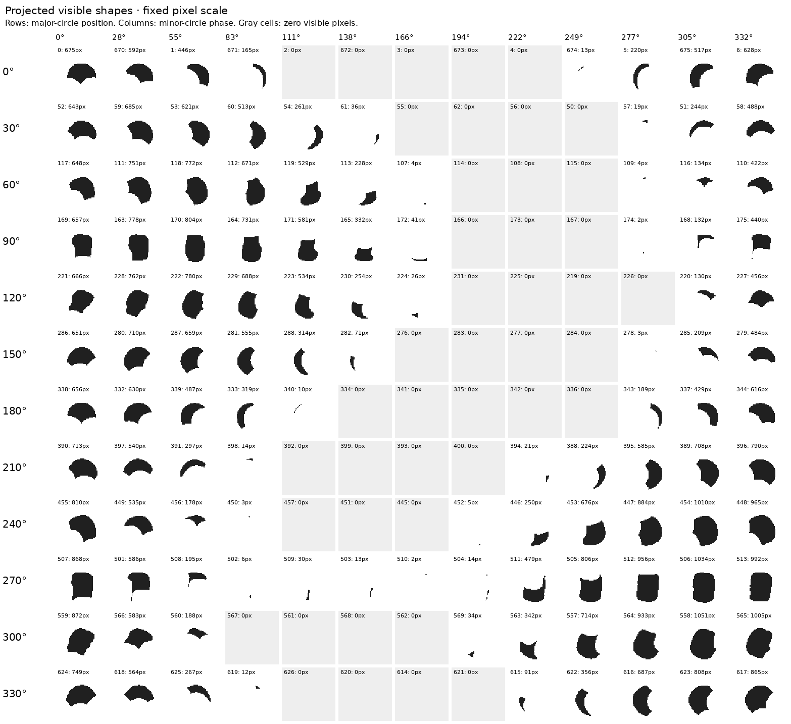

# Visible bead shapes around the full circle — R085

**Use a family of exposed shapes indexed by local view and position around the
rope, rather than one oval rotated around the necklace.** The maker requested
this generalization with either helicity; this experiment uses +1 only. The maker
subsequently clarified the key distinction: helicity governs minor-circle
progression, while the section's camera-relative angle governs which shape
family is visible during major-circle progression. In this fixed torus/camera,
major angle indexes that section orientation. R086 confirms the necklace is
flat on paper on a table: use its planar local direction and the global camera
view of that plane. Do not fit independent out-of-plane section deviations.
This constraint preserves the bead shapes and minor-circle placement in 3D.

[Interactive full-circle atlas](review/r085/review.html) ·
[Task-specific reasoning guide for future sessions](SHAPE_REASONING.md) ·
[All outlines on the white necklace](review/r085/outlines-on-white.png).



Rows sample the major circle every 30°; columns hold cross-section phase fixed.
The labels are known synthetic indices and visible pixel counts. Gray cells are
hidden at this raster. Every cell uses the same pixel scale. The nearest bead of
each phase is at most 3.373° from the requested major angle.

At approximately 55° minor phase, the 90° major-circle row has a broad 804-pixel
portion; the 270° row has only 195 pixels. At approximately 277° minor phase,
the corresponding portions have 2 and 956 pixels. Exposure swaps around the
necklace. Phase-0 shapes change from cap-like portions near major angles 0°/180°
to taller, side-bounded portions near 90°/270°. Neighbors' cut-ins and perspective
matter as well as image rotation.

The [tangent-aligned atlas](review/r085/tangent-shapes.png) rotates each shape so
the local projected rope direction points right. Shapes still differ after this
alignment. There is no universal recovered 2D template, trained interpolation
model or photo fit here; the existing 3D bead/occlusion model supplies these
pose-dependent shapes. See the reasoning guide for how to use them in later tasks.

## Complete coverage and appearance check

One additional object-label render covers all **676** known bead positions.
There are **483** nonzero visible masks and **193** zero-pixel positions at
1200×900. Of the nonzero masks, 441 have at least 12 pixels and 392 at least 100.
These are calibration counts, not an active JPEG inventory or sliver selection.
All visible masks sum to 225,907 pixels. The viewer preserves every index;
[the coverage grid](review/r085/visibility-grid.png) shows all 52 groups of 13.

The 208 earlier +1 black-bead frames provide an appearance comparison. For 123
pairs with at least 100 pixels in both masks, the median fraction of response
pixels inside the object label is 95.20% (minimum 83.77%), and median fraction of
label pixels covered by the response is 99.27% (minimum 93.64%). Across all
72,028 response pixels, only 25 fall beyond a one-pixel dilation of the matching
label. Antialiasing, thresholding and clipped highlights mean the two mask types
are not identical. These measurements support geometric alignment and do not
establish an image-only bead detector.

## Method and reproducibility

Use unchanged `beads.pov` and `bead-shape.inc`, 676 beads, 104 turns, 6.5/turn,
original camera, Helicity=+1 and phase zero. The existing R023 instrumentation
assigns RGB bytes of index+1 to each bead, removes light/plane, sets gamma 1 and
emission-only material, and disables antialiasing/jitter/dithering. It uses case-1
bodies; the script checks that their proportions match the case-3 white/black
bodies used for R084. The geometry and transforms remain the original model.
R084's residual phase was 0.000000027; here it is zero, not a changed viewing
angle or independently fitted geometry.

The white appearance reference is the pixelwise maximum of existing black-index
0/1 beauty images. The outlines come from the object-label image, with highlights
and shadows excluded from ownership. These are direct known synthetic labels;
none are transferred into the existing seven JPEG inventories.

Python extracts masks/contours, checks projected centers and tangent direction,
and selects 12×13 representative shapes. The stored masks retain their original
coordinates; tangent rotation is a display derivative. Every selected mask fits
inside its display crop without clipping. Small calibration portions are retained
without revisiting R069 fragment ownership.

```sh
# First generation only: exactly one new POV-Ray render.
.venv/bin/python photo2/full_circle_shapes.py
# Rebuild from that same saved render; adds no render.
.venv/bin/python photo2/full_circle_shapes.py --analyze-only
.venv/bin/python photo2/verify_full_circle_shapes.py
node photo2/check_full_circle_viewer.cjs
.venv/bin/python -m py_compile photo2/full_circle_shapes.py photo2/verify_full_circle_shapes.py
PYTHONPATH=photo2 .venv/bin/python -m unittest test_legacy_visibility.LegacyVisibilityChecks.test_missing_indices_do_not_compress_repeat_slots test_legacy_visibility.LegacyVisibilityChecks.test_id_decode_preserves_byte_boundaries_and_rejects_unknown_codes test_legacy_visibility.LegacyVisibilityChecks.test_instrumentation_rejects_unrecognized_scene -v
```

R084 raw frames are prerequisites for the appearance check; recreate them with
[its documented commands](BLACK_BEAD_WALK.md) if switching computers. Do not rerun
those 416 beauty renders when the local files and hashes are already available.
Source/render hashes, one-render command, all 208 comparisons and summary metrics
are in [report.json](review/r085/report.json); raw render/layout/log files remain
ignored. Curated illustrations, full shape data and the viewer are committed.

Checks: all 676 shapes, 156 unclipped atlas cells, 208 appearance comparisons,
source/artifact hashes, links, and renderer parameters verify. Three existing
non-rendering controls pass; Python compilation and viewer JavaScript checks
pass. The mock-DOM check exercises all 676 indices and previous/next wrapping;
visual browser interaction was not tested. All eight
atlas artifacts rebuild byte-identically without an extra render. Two atlases
were visually inspected. A verifier initially tested empty bounding-box corners
against the rotation margin; corrected it to test actual mask pixels (maximum
radius 20.81 pixels within the 30-pixel half-crop). No image required correction.

The next analysis task remains S/V paths between bead interiors with controls,
using the visible-shape guidance rather than relying on area cuts alone. Stop
before mask/count/index changes. Existing unresolved regions, missing indices,
color/border warnings and pending photo-shadow questions remain unchanged.
