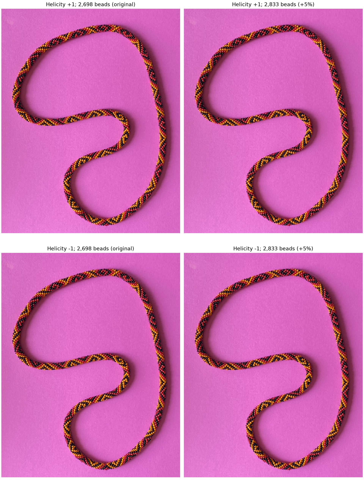
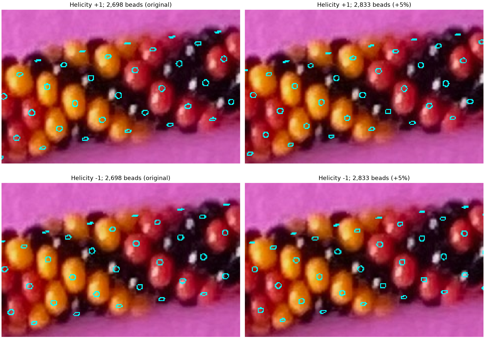

# Both helicities at original and +5% counts — R179

**R180–R182 update:** [Maker drift review](drift-review-r180.json) reports
similar behavior for both helicities, without identifying a correct count.
The [interactive count viewer](TANGENT_VIEWER.md) now supplies zoom/pan and
a slider so the maker can find a preferred value.

Four matched sets of cyan tangent-circle images are available. Each retains
the whole source photo at 2540 × 3182 pixels. **Rows are helicity +1 / −1;
columns are original 2,698 / increased 2,833 beads.**



| Helicity | Count | Whole original photo | Raw / local overlay | Parameters |
| --- | ---: | --- | --- | --- |
| +1 | 2,698 | [Full resolution](review/r179/plus-2698/bracelet-overlay.png) | [Local](review/r179/plus-2698/patch-overlay.png) | [JSON](review/r179/plus-2698/parameters.json) |
| +1 | 2,833 (+5%) | [Full resolution](review/r179/plus-2833/bracelet-overlay.png) | [Local](review/r179/plus-2833/patch-overlay.png) | [JSON](review/r179/plus-2833/parameters.json) |
| −1 | 2,698 | [Full resolution](review/r179/minus-2698/bracelet-overlay.png) | [Local](review/r179/minus-2698/patch-overlay.png) | [JSON](review/r179/minus-2698/parameters.json) |
| −1 | 2,833 (+5%) | [Full resolution](review/r179/minus-2833/bracelet-overlay.png) | [Local](review/r179/minus-2833/patch-overlay.png) | [JSON](review/r179/minus-2833/parameters.json) |



The larger upper-arc context is available as raw / original / increased count
for [helicity +1](review/r179/plus-spacing-comparison.png) and
[helicity −1](review/r179/minus-spacing-comparison.png). The earlier R177
figures remain unchanged. R180 supplies qualitative feedback to Q177.1;
there was no additional question in the R179 delivery.

## What is held fixed

The spline, guessed camera elevation 89° and roll 0°, physical bead dimensions,
marker radius, exposure criteria, photo and crop bounds are identical. Helicity
sign refers to increasing (+1) or decreasing (−1) minor-circle phase along the
clockwise image centerline; it is not a verified photo label.

For a fair local starting point, each helicity reuses its saved fit to the same
confirmed colored interiors 8, 11 and 20. Both fit all three at the original
count. No fresh fitting or candidate selection is performed:

| Helicity | Diagnostic chart | Phase (degrees) | Along-spline origin fraction |
| --- | --- | ---: | ---: |
| +1 | A | −22.2971970999 | 0.8015246088 |
| −1 | B | −21.9798574846 | 0.8016461718 |

Phase and origin therefore differ slightly between helicities. Within each
helicity they stay fixed when count rises 2,698 → 2,833 (+5.004%). Camera and
physical dimensions remain fixed throughout; the projected scale shrinks on
the unchanged image spline as described in [TANGENT_CIRCLES.md](TANGENT_CIRCLES.md).
The −1 images and parameters are byte-identical to the delivered R175/R177
versions, verified during generation.

Only exposed minor-outward points receive circles. Hidden beads still take
part in the full-loop occlusion calculation. Unfinished and grazing point
rays are omitted. Model exposure remains conditional on the approximate
geometry; neither a cyan circle nor its generator index is a recovered photo
identity. Small local fits and visual drift do not establish helicity or N.

## Reproduce and verify

```bash
.venv/bin/python photo2/compare_tangent_helicities.py
```

The program reads the tracked original best-fit records for both hands,
generates all four overlays, checks visibility against independent source-
macro POV-Ray body-ID renders, and saves matched crops/grids, parameter files
and [provenance/measurements](review/r179/summary.json). Routine geometry and
renders stay under ignored `photo2/output/r179`; curated evidence is tracked.
It does not change either earlier review or the live maker annotations.

Stopping point: deliver the requested four-way image comparison. Next bounded
task: incorporate the maker's spacing review, then refine an adjacent unfitted
colored patch while preserving both helicity hypotheses. Continue with
**gpt-6.1-sol / High**, same session; no `/new` needed.
