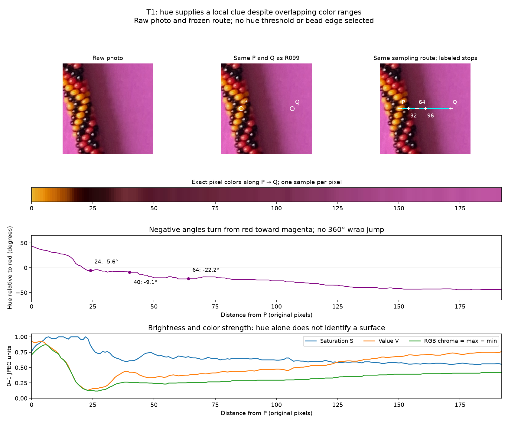
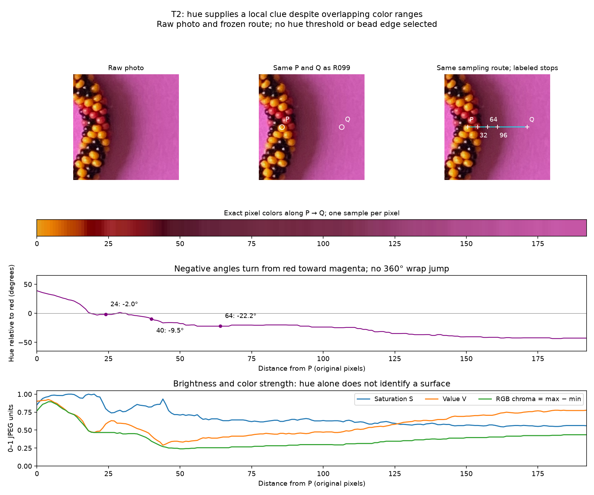

# Hue along T1/T2 and the recovered HSV map — R100–R102

**Hue supplies a local clue on both lines, despite the known overlap between
shadowed red beads and shadowed paper.** The maker confirms that the named
`red-and-shadow` / `shadow` map in fft-image-explorer is the earlier work being
described. This is prior labeled evidence, not a guess about HSV behavior.

**R103 constraint:** final code should have little knowledge of the photograph's
particular colors or bead positions. This experiment's fixed paths and saved HSV
boxes are diagnostic references only. Neither the historical boxes nor a red/
magenta rule is an input to a final automatic boundary method. A future hue cue
should measure relative local changes or image-derived appearance statistics;
location proposals should come from image evidence. This two-path experiment
does not yet demonstrate palette or placement independence.
Red at zero is only the hue plot's coordinate convention, not a classifier rule.

## The map and its revisions

Read [hsv_mask_triptych.py at 2caf070](https://github.com/rharriszzz/fft-image-explorer/blob/2caf0707c2b63a0d7540e2cac447d2f1b883d8c1/hsv_mask_triptych.py).
The map is `PRESET_PROFILES['beads-photo-2-wb']`. Its rectangles are **boxes in
HSV space**, not saved spatial rectangle coordinates. The maker reports choosing
regions known to remain inside red beads, including their shaded edges, and
similarly sampling shadowed paper; R102 confirms this is the resulting map.

All ranges below are inclusive integers on that tool's **0–255 H/S/V scale**:

| Name | Hue H | Saturation S | Value V | Saved role |
| --- | --- | --- | --- | --- |
| red-and-shadow | 0–5 or 254–255 | 75–180 | 43–109 | foreground |
| shadow | 0–36 or 250–255 | 35–180 | 31–109 | background |
| red-and-edge | 5 | 75–140 | 110–190 | foreground |
| edge | 5–36 | 35–140 | 110–190 | background |

Every HSV tuple admitted by `red-and-shadow` also matches `shadow`. Likewise,
`red-and-edge` lies entirely inside `edge`. The same color can therefore match
both foreground and background rules. These are set relations of the saved
ranges, not a new count of exact duplicate colors in manually labeled pixels.

Read all four file revisions present in the available history:

| Revision | Relevant change |
| --- | --- |
| `27b8de7` | Interactive HSV viewer; no named preset map yet |
| `4ebb4b0` | Adds red/yellow/black union rules for the original image; no white-balanced profile |
| `9bdfdb3` | Adds named original and white-balanced profiles. White-balanced red has H 0–5/254–255, S 75–217, V 43–255; shadow/edge boxes already overlap it |
| `2caf070` | Separates bright red from `red-and-shadow` and `red-and-edge`; retains shadow/edge boxes and adds overlap exploration controls |

These revisions show that overlap was already represented before the explicit
overlap names were added. They do not recover each original selection gesture.
The related hsv_tools line picker saves an expanded color-match mask and clears
the two click coordinates; its red/background mask JPEGs are retained in that
repository. Those masks are not the original hand-selected sample regions.

**Image and unit distinction:** this named overlap profile belongs to
`beads-photo-2-wb.jpg`, whose hash differs from the original photograph. We have
not transferred its thresholds to the original. The original JPEG in the sibling
repository exactly matches this repository's source hash. The older hsv_tools
OpenCV picker uses H on 0–179, whereas this map rounds matplotlib HSV×255.
The plots below use degrees, with red at zero; these conventions must not be mixed.

[Frozen profiles, revision source hashes and mask hashes](hsv-provenance-r100.json)
are reproducible with:

```bash
.venv/bin/python photo2/collect_hsv_provenance.py --output photo2/output/hsv-provenance-r100.json
```

The exporter reads immutable Git objects from sibling repositories, without
switching their branches or modifying their files. Both subset checks pass.

## What hue does on the existing routes

The R099 endpoints and lines are unchanged. Sample each original JPEG pixel
from P through Q: 193 points per route, no smoothing, interpolation or threshold.
Plot hue as an angle relative to red: e.g. H=354° becomes −6°, avoiding a false
jump at the red 0°/360° wrap. Negative values here progress toward magenta.
Saturation, value and RGB chroma accompany hue so darkness and color strength
remain visible. Neutral pixels would have undefined hue; neither route has one.





| Distance from P | T1 hue relative to red | T2 hue relative to red |
| --- | ---: | ---: |
| 24 px | −5.6° | −2.0° |
| 40 px | −9.1° | −9.5° |
| 48 px | −18.1° | −16.2° |
| 64 px | −22.2° | −22.2° |
| 192 px (Q) | −43.7° | −42.7° |

Both paths start on a yellow face, pass through reddish/dark pixels, and move
toward magenta paper. Hue shifts noticeably between the 40- and 64-pixel stops,
then continues changing farther onto the paper. That is the local clue the maker
suggested inspecting. It does **not** establish that 40–64 is the true edge:
shading, reflected color, blur and mixed pixels remain possible contributors.
We have not selected an edge, assigned those samples to a surface, or measured
the accuracy of a hue boundary rule. T3 and all R099 score results are unchanged.

Minimum V is 0.129 on T1 and 0.290 on T2; minimum RGB chroma is 0.118/0.239.
These values explain why the dark portions still have a computable hue; they
do not guarantee reliable surface identification. Keep the maker's demonstrated
color-range overlap, and combine local hue change with texture and spatial context.

```bash
.venv/bin/python photo2/hue_transitions.py --output photo2/output/r100
```

[Script](hue_transitions.py) · [report / hashes / sample stops](review/r100/report.json).
Full 386-row CSV stays in ignored output; two curated review images/report are
tracked. Conversion/wrap/achromatic controls pass; Python colorsys independently
agrees at all sampled points. Repeat artifacts and provenance export match
byte-for-byte. Image/source hashes and unchanged R099 data checked; plots inspected.

No new questions are added. These plots support the existing
[T1/T2 visual question](TRANSITION_QUESTIONS.md). The maker supplied shadow/color
interpretation and provenance, but no precise edge location or T3 answer.
Next: compare hue and texture on a few nearby parallel paths, retain their
disagreements and stop before choosing or connecting contour points.
