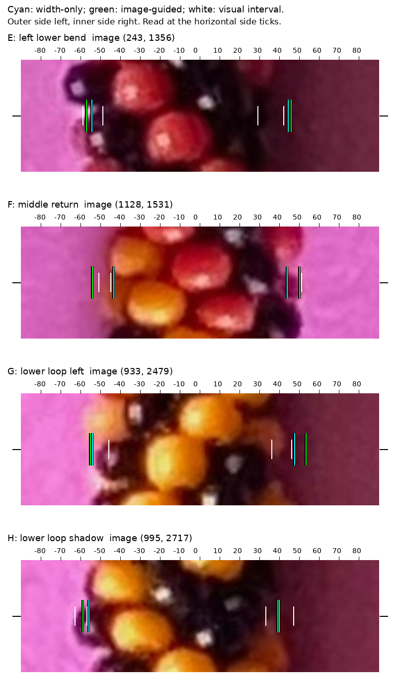

# Direct image-edge evidence — R067

**Do not adopt this image-guided candidate.** The tested local paper-transition
cue makes the frozen R066 review scores worse than the width-only correction.
It improves a few edges but frequently extends the boundary into shadow or blur.
This is a failed candidate worth retaining as evidence, not an improvement to
the reconstruction. Original geometry and defaults remain unchanged; the
width-only candidate remains provisional.

[Illustrated comparison](review/r067/review.html) ·
[questions and supporting images](QUESTIONS_FOR_MAKER.md) ·
[previous visual-review protocol](TRANSECT_REVIEW.md).

## Comparison

All distances are original-photo pixels. These are distances **outside subjective
assistant-marked intervals**, not measured true boundary errors. The same twelve
selected transects and unchanged annotations are used for every method. An edge
inside a broad interval scores zero; selection is not random or representative.

| Method | Inside visual ranges /24 | Inside or within 2px /24 | Mean distance outside | Maximum distance outside | Centers inside ranges /12 |
| --- | ---: | ---: | ---: | ---: | ---: |
| Original saved curves | 12 | 18 | 1.71 | 11.27 | 8 |
| R065 width-only candidate | 14 | 23 | 0.49 | 2.40 | 11 |
| Image-guided, default | 13 | 18 | 1.26 | 7.28 | 9 |
| Image-guided, stronger width prior (6px) | 11 | 19 | 1.04 | 6.13 | 8 |
| Image-guided, weaker width prior (12px) | 11 | 16 | 2.10 | 10.25 | 9 |
| Soft geometry fit, image weight zero | 18 | 22 | 0.35 | 2.71 | 11 |

Against width-only, the default improves four reviewed edges, worsens ten, and
ties on ten. No sensitivity variant rescues the image cue. The no-image ablation
has a lower mean outside distance but a worse maximum and fewer edges within two
pixels than width-only. It is a different soft-geometry fit, not a demonstrated
replacement. Do not pick a variant simply because it scores better on one metric
from these twelve subjective observations.

The largest reviewed regression is **G's inner edge**, from 1.58 to 7.28 pixels
outside its visual interval. At **F**, the nominally clear outer edge moves from
1.51 to 3.13 pixels outside. **H** improves: both proposed edges fall inside their
visual intervals. The intended residual concerns do not resolve: **C** remains
about 1.92 pixels too far inward relative to its interval; **E** increases from
2.40 to 3.93 pixels outward. See the E–H comparison below.



The [transition-score plots](review/r067/transition-profiles.svg) show C/E, which
were specified before the experiment, G (largest reviewed regression), and H
(an improvement). The score rewards changes toward paper-like color. A peak can
be displaced from the visible bead silhouette by colored shadow, blur, or local
bead scallops. This explains a plausible failure mechanism; it does not identify
a unique physical cause for every discrepancy.

## Method and fixed settings

The experiment uses the same 600 original normal cross sections and the R065
width model. No source patterns, bead indices or geometry truth are consulted.

1. Sample paper 35/45/55 pixels outside each **original** boundary, with tangent
   offsets −4/0/+4 pixels. Use medians of normalized red and blue channels,
   `R/(R+G+B)` and `B/(R+G+B)`, and a robust local color scale with floor .025.
   This normalization removes scalar brightness changes, not arbitrary colored
   illumination. Broad magenta/support checks pass for both edges at all 600
   sections; passing them does not establish correct edge location.
2. Search ±24 pixels around each width-only edge at one-pixel steps. Compare
   average paper-color similarity at 3/5/7 pixels outside and inside each proposed
   location, over the three tangent offsets. Add a weak brightness-transition
   term with weight .25. The similarity is a heuristic score, not a calibrated
   probability of paper or a true silhouette.
3. Optimize both offsets jointly with image weight 4, width standardization 8px,
   displacement scales 8px for nominally clear edges and 20px elsewhere, and a
   cyclic second-difference penalty on displacement with scale 6px. These are
   penalty scales, not measured statistical standard deviations. Width is a soft
   constraint; either boundary can move. Keep outer/inner offsets on their original
   sides of the reference centerline, at least five pixels from it.
4. Smooth the sampled score over one grid pixel and use C1 cubic Hermite
   interpolation with analytic derivatives. Bounded L-BFGS-B starts from the
   width-only candidate. This is a local optimization; no global optimum is claimed.
5. Run the predefined width-scale variants 6/12px and image-weight-zero ablation.
   **Only after all four optimizations**, read the frozen R066 annotations for
   evaluation. Neither the annotations nor physical cue weights were tuned to
   their results. New centers are cross-section midpoints; original/width-only
   scores preserve those methods' own saved center positions.

Default fitted widths range 91.31–113.97px. The maximum movement from a width-only
edge is 17.93px across all 600 sections, with no search-bound hits. All four final
optimizations converge (93/72/102/48 iterations in table order after the two
baselines). These are properties of the optimization, not boundary accuracy.

## Numerical failure, controls and reproduction

The first implementation used piecewise-linear interpolation of the score.
All three image-weighted fits reached the 400-iteration limit; the no-image fit
converged. Those preliminary image fits were not accepted as converged results.
The numerical interpolation was changed to C1 cubic Hermite so the force is
continuous at grid knots. The cue, search region, penalty scales and predefined
variants were retained. No attempt was made to tune them until a favorable review
score appeared. The final results above use the converged solver only.

Five new controls pass: shade-normalized color invariance, interpolation
continuity/derivatives, a finite-difference check of the full cyclic objective
gradient, known red-band silhouettes with/without a cast shadow (within two
pixels), and flat paper producing no image force. These idealized controls do
not validate the real photograph's black beads, colored shadows or blur. Nine
width tests and four transect tests also pass (18 total), as does compilation.

```sh
.venv/bin/python photo2/image_edges.py \
  --output photo2/output/image-edges-r067-final \
  --review-bundle photo2/review/r067
.venv/bin/python -m unittest discover -s photo2 -p test_image_edges.py -v
.venv/bin/python -m unittest discover -s photo2 -p test_width_correction.py -v
.venv/bin/python -m unittest discover -s photo2 -p test_transect_review.py -v
```

The committed review contains four PNGs, an SVG, HTML and a report that binds the
full report. Bulk curves, sampled score arrays and duplicate runs remain ignored.
Two runs reproduce both bulk artifacts and all six review artifacts byte for
byte. Full reports differ only in command paths; review reports additionally
bind their respective full-report hash. Eight source hashes and the unchanged
annotation hash verify. Curves are finite, closed, inside the image, and centers
are the paired-edge midpoints. Four PNGs were visually inspected; SVG parsed as
XML and file links checked. No full legacy regression, renderer or bead detector
was needed for this bounded comparison.

Full report SHA256:
`b3cf77e8920e531f4d77dd03dcad6325f5655efc92bd8848e31feb9d53a6ef68`.
Committed review report SHA256:
`1f684ea3cc65fecc6e50f4a7a345aa28a9a188dc79ddb00c1d181bb737343778`.

## Decision and next bounded step

Retain the width-only proposal for review and reject this image-cue replacement.
The requested photo-2 comparison is complete; perspective and true-edge accuracy
remain unresolved. Pending maker questions are saved with the illustrations,
without making them approval gates.

Resume the user's generated-images-first task: review and correct **beads1.jpg's
visible-bead inventory from its JPEG**, retaining unknown/sliver observations and
avoiding POV-Ray pattern lookup. Stop after a reviewable instance/color map and
its checks, before repeat inference; extend to beads2–7 afterward. Do not keep
tuning this photo experiment to the same twelve annotations. Recommend
gpt-6-astra / High; stay here, no `/new` needed.
