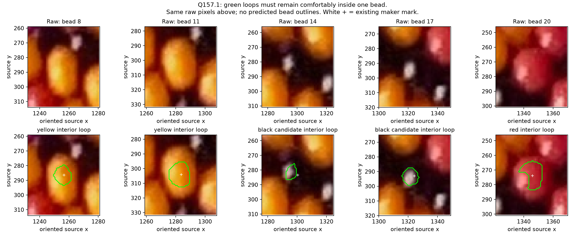
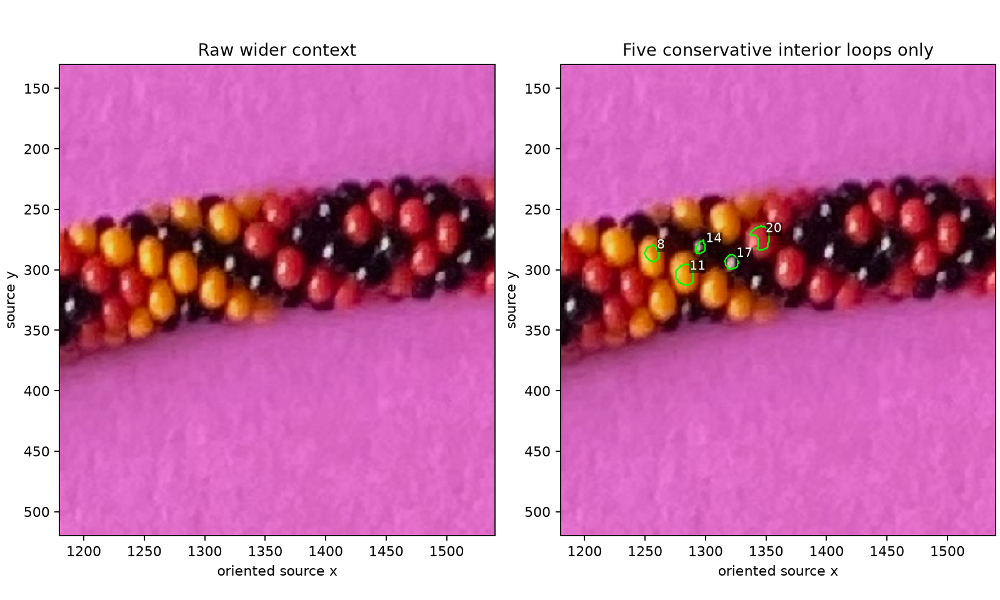

# Conservative bead interior loops

The maker rejects the previous projected bead outlines because they cross into
other beads. The replacement is a small closed loop comfortably inside a visible
body. Five central examples use hue for red/yellow appearance and saturation/value
to exclude weak or shaded fringe pixels. Black examples use a bright reflection
and its nearby dark surround. These are positive interior proposals; they do not
estimate the bead silhouette or the minor-outward point.



**Q157.1:** Do all five green loops stay comfortably inside their intended beads?
If one does not, name the bead number and the offending side. “Unclear” is valid.
This question is pending; no maker acceptance is assumed. White + marks the old
maker click, which need not be enclosed by the new conservative loop.



## Inputs and scope

The input is the unchanged original beads-photo-2.jpg, EXIF-oriented to 2540×3182,
and maker revision 162 in [manual-labels-r146.json](manual-labels-r146.json).
Coordinates are original pixels, x right and y down. This pilot selects central
maker numbers 8, 11, 14, 17 and 20. No edge slivers are added. The old held-out
group 22/23/24/25 is excluded even when deriving neighboring-mark distances.
Stable observation UUIDs and numbers are preserved; no full-string index is inferred.

Three methods were considered: shrink a seed-connected HSV region; shrink a
traced HSV contour; or place a small loop and check its pixels. The first is
implemented here. Local thresholds and the five selected marks are **diagnostic
assistance**, not an automatic reconstruction method. Historical white-balanced
HSV boxes are not reused; [HUE_TRANSITIONS.md](HUE_TRANSITIONS.md) documents why
those boxes overlap shadowed paper and have different image/unit conventions.

## Interior evidence and sampling

For each selected mark, inspect a 3.5-pixel-radius patch and a restricted local
neighborhood. A spatial guard of 0.45 times the nearest other training-mark
distance limits growth. This guard is not a bead radius or an estimated boundary;
maker clicks are ordinary visible-surface points, not centers.

For sufficiently chromatic, bright seed patches, estimate a circular mean hue.
Compare local hues to that measured hue rather than a saved red/yellow photo
range. Use a hue tolerance of max(14 degrees, 1.6 times the local 90th-percentile
absolute hue deviation). Saturation must exceed 0.65 times its local 10th percentile;
value must exceed 0.75 times its local 10th percentile. Color names red/yellow are
display names based on canonical hue proximity; they do not choose mask pixels.
For these crops, measured reference hues are about 35 degrees for yellow and
358.5 degrees for red. These are image appearance measurements, not pigment or
full color-order recovery. Hue uses degrees with circular wrap; S/V use 0–1.

For the black candidates, find a local high-value reflection component with lower
saturation, then inspect the nearby low-value surround. Restrict the neighborhood
to seven pixels from that reflection. Dark/neutral transition pixels and the
four-pixel reflection falloff supply a small local contextual region. This falloff
is a declared interpolation assumption, not a detected bead edge. Hue is not used
for black membership and is omitted from black-loop measurements. Low-value
JPEG pixels may have high saturation; black is not defined as low saturation.
The reflection locates an interior area; it is never a boundary or outward marker.

Keep the connected component nearest the maker mark, then inset it by distance
transform. Core pixel centers must be at least four pixels from rejected support
pixels; the closed contour must retain at least three pixels of that margin.
This margin is to the local support mask, **not a measured margin to the true
bead boundary**. Raw-image inspection is still necessary. Closed green contours
are dense sampling routes inside the bead; they are not attempts to go around
the actual bead edge. The report includes their exact coordinates and HSV samples.

Unknown holes are never filled merely because they are enclosed. Loops with an
unresolved enclosed hole, too few interior pixels, or insufficient inset are
rejected. The enclosed core is positive body evidence; outside it remains
unresolved. Paper, gaps and cast shadow are not relabeled as bead or background
by this procedure. The first overly restrictive pass produced a one-pixel yellow
core and fragmented reflection regions; it was discarded before publication.

## Outcome and reproduction

The five loops have been inspected against the unchanged raw crops and kept well
within the visible central bodies. They remain proposals pending maker review.
Their cores contain 116/193/58/99/194 pixels for beads 8/11/14/17/20; each closed
route is 3.5 pixels from the nearest rejected support pixel. Independent Python
colorsys conversion agrees with matplotlib HSV on all 232 sampled route pixels
within 1.2e-16. Moving the entire held-out group leaves every loop and measurement
unchanged. These checks validate computation and data separation, not true
boundary clearance or automatic detection.
Source geometry, fitted poses and previous numeric results are preserved; the
rejected outline strategy is retired from the current plan. No new helicity fit,
whole-necklace walk, repeat/color-order recovery or camera estimate was performed.

```sh
.venv/bin/python photo2/interior_loops.py
```

Optional --numbers selects other maker marks; --inset controls the conservative
support margin. This is a diagnostic script, not a claim that arbitrary marks
will work. [Report](review/r157/report.json) records hashes, parameters, stable
IDs, closed routes, HSV measurements and support margins. The curated figures
are tracked. See [integrity checks](review/r157/integrity.json) for preservation
and independent HSV checks.

**Stopping point:** five interior loops and their raw review. **Next task:** use
reviewed loops as positive surface samples when comparing existing poses, keeping
all outside pixels unknown. No full bead boundary needs to be accepted first.
Recommend gpt-6.1-sol / High; same session, no /new needed.
