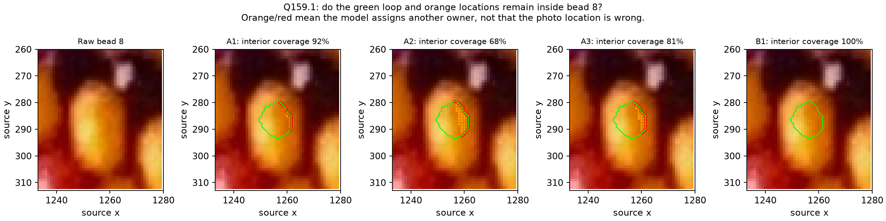
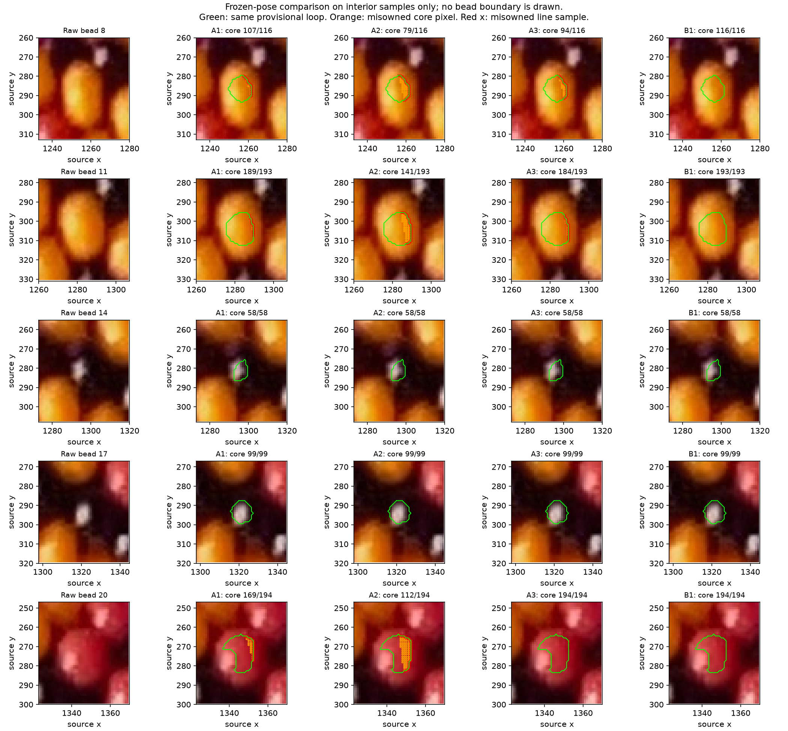

# Existing poses compared with bead interiors

The saved baseline B1 pose covers all five provisional interior loops and all
660 enclosed pixels. Every saved A pose misses some of that interior evidence.
**B is the stronger candidate among the saved poses; helicity is not established.**
At publication the loops were provisional and A had not been refitted. R160 now
confirms all five loops and [refits both families](INTERIOR_REFIT.md); use that
later result for the current conclusion. This frozen comparison is preserved.
No full bead outline is used.



**Q159.1:** Are the green loop and orange locations comfortably inside yellow
bead 8? If any are outside, identify the side. “Unclear” is valid.
**Answered in R160:** all five green loops are inside their intended beads.
Orange dots are the tested enclosed interior pixels that a saved pose assigns
to another bead; they are naturally inside the green loop. Orange/red indicate
that the model assigns another
surface owner at that photo location; they do not label the photo location as
wrong. All panels use the same unmodified raw pixels and unchanged interior loop.
The older broad [Q157.1](INTERIOR_LOOPS.md) is also answered by R160.

## Evidence and method

Inputs are the unchanged [R157 interior routes](review/r157/report.json) and
[R156 frozen candidate parameters](review/r156/report.json). Their source hashes,
maker UUIDs, relative indices and held-out roles remain separate. Loops belong
to maker 8/11/14/17/20; graph family A and B supply their conditional relative
indices, not resolved full-string bead_index. The original held-out group
22/23/24/25 supplies no loop samples. Manual marks/HSV-selected loops remain
explicit diagnostic assistance, not automatic location priors.

Three methods were considered before this step: score frozen poses on the new
interiors; refit poses using those constraints; or estimate geometric positions
from the interiors. Implement the first. Q157.1 remains unanswered, so results
are conditional on the provisional loops being inside the intended bodies.
“Continue” authorizes the comparison; it is not recorded as loop acceptance.

Sample every closed loop at equal 0.5-pixel arc-length intervals, retaining
fractional oriented-source coordinates, and every integer pixel center enclosed
by it. Polygon reconstruction reproduces the saved core pixel counts exactly.
No region is moved, expanded or selected to improve a pose. These are interior
sampling routes, not silhouette measurements. Per-bead results are averaged with
equal weight, so the smaller black cores are not overwhelmed by colored cores.

| Maker bead | Enclosed pixels | Line samples |
| --- | ---: | ---: |
| 8 | 116 | 83 |
| 11 | 193 | 106 |
| 14 | 58 | 62 |
| 17 | 99 | 77 |
| 20 | 194 | 126 |
| Total | 660 | 454 |

Use the existing exact rounded-bead first-hit ray model with all latent neighbors,
source bead size, curvature and camera parameters. Count a pass only when the
first surface is the expected relative model index for that observation. Keep
all missed samples and their actual model owners. **Outside pixels remain unknown.**
Owner −999 means no model surface hit; it is not a paper label in the photo.
There is no silhouette overlap, negative/background penalty, color-fitting loss,
refitting, camera estimate or outward-point measurement in this step.

## Frozen-pose results

| Saved orthographic pose, q free | Core pixels covered | Mean per-bead core coverage | Mean line coverage | Old held-out marks |
| --- | ---: | ---: | ---: | ---: |
| A1, source winding +1 | 622/660 | 95.46% | 84.10% | 3/4 |
| A2, source winding +1 | 489/660 | 79.78% | 75.23% | 4/4 |
| A3, source winding +1 | 629/660 | 95.27% | 87.14% | 4/4 |
| B1, source winding −1 | 660/660 | 100% | 100% | 4/4 |

All three A poses miss some yellow bead 8 and 11 evidence; all cover the two
black cores. A3 covers red bead 20's entire core but misses one of its fractional
line samples. Thus the new comparison adds constraints beyond owning a single
maker click. The question focuses on bead 8, where B's coverage exceeds even
the best saved A pose most. That rule selects only the review crop, not a loop,
fit or observation. The complete five-body comparison is below.



Fixed q=6.5 gives the same qualitative result: B1 covers all cores/routes; the
best saved A pose reaches 96.97% mean core coverage and 87.48% mean line coverage.
That A pose passes 3/4 old held-out marks; the saved A pose passing 4/4 has lower
interior coverage. Neither result is hidden by ranking on the held-out group.
The nominal phone-perspective sensitivity has a B pose covering all interiors,
but that pose misses one old held-out mark. Its first B pose passes all four
held-out marks and covers 97.37% mean core / 94.23% mean line evidence. The best
saved perspective A pose reaches 91.40% core / 84.07% line coverage. These are
separate reported conditions, not calibrated phone intrinsics or an accepted
pose selected by held-out scores. No held-out evidence is used to refit or select
which alternative is displayed.

All other previously tried source winding signs are also scored and retained in
the [complete report](review/r159/report.json); their low coverage is not a proof
of impossibility. Frozen candidate comparison alone cannot exclude another
camera/phase/curvature pose in either family. The earlier projected full-body
outlines remain rejected even when their model covers these smaller interiors.

## Calibration and checks

Generate independent known-synthetic ID rendering using the source bead macro
and separate POV trigonometric placement. Inset the five true visible body masks
by four pixels, then score the previously fitted synthetic poses on these positive
interiors. Known source indices are evaluator truth only; this tests the scoring
computation, not HSV region extraction or automatic reconstruction.

The generating A pose covers all five synthetic cores/routes. Its three earlier
correct-family point fits reach 98.75–99.52% mean core coverage; the earlier wrong
B family reaches 88.94%. All had passed 27 ordinary maker-style points. Even a
correct-family point fit can miss new positive interiors, so rejecting a frozen
pose must not be reported as rejecting its family. This motivates the next
bounded refit after interior review.

Independent POV checks and fractional miss witnesses are recorded in
[independent-checks.json](review/r159/independent-checks.json). They verify which
model owns the positive samples, not whether the photo loops are correct.
Nine separate render checks agree with Python at all 660 enclosed pixels each
(5,940 ownership comparisons). Nine exact fractional line-miss witnesses also
agree. The known generating synthetic pose covers all true positive interiors.
Grazing ray/body iteration caps remain explicit; no global uniqueness or
confidence level is claimed. The baseline B1 and A1/A3 sample rays converge;
other cases retain unfinished grazing pairs in the report.

```sh
.venv/bin/python photo2/score_interior_poses.py
.venv/bin/python photo2/check_interior_scores.py
```

Reports preserve input/code/source hashes, every retained condition, expected
and alternative owners, missing coordinates, exact parameters, equal-weight
coverage, synthetic truth and independent POV commands. Routine scenes/renders
and exhaustive sample coordinates remain ignored under photo2/output/r159;
the tracked report preserves all aggregate scores, raw-review miss coordinates
and the exhaustive report hash/reproduction path. Curated raw/interior figures and numeric
checks are tracked. Source image/geometry, live annotations and earlier results
are unchanged. No new detector, dependency or geometry fit was introduced.

**Stopping point:** provisional interiors scored against all saved poses.
**Next task:** refit both competing families using the reviewed interior samples
plus existing training marks, retaining the held-out neighbor group. Do not accept
helicity or start whole-necklace walking from this frozen comparison. Recommend
gpt-6.1-sol / High; same session, no /new needed.
