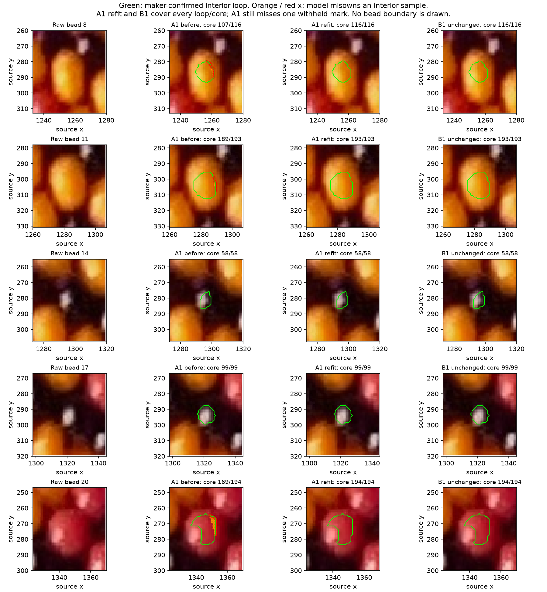

# Confirmed interiors refitted to both families

**Both families still have photo poses covering every confirmed interior sample
and all 27 maker marks.** The earlier advantage of the saved B pose disappears
when A is allowed to fit the new evidence. This remains true with q fixed at 6.5.
The five loops are useful constraints, but they do not establish helicity.

R160 confirms all green loops on beads 8/11/14/17/20 are inside their intended
red/yellow/black bodies. [Q157.1](INTERIOR_LOOPS.md) and
[Q159.1](INTERIOR_POSE_COMPARISON.md) are answered. The black beads' color is
clear; their full positions, extents and invisible boundaries remain uncertain.
Preserve this distinction in the [confirmation record](interior-confirmed-r160.json).

The orange dots in the earlier comparison were **positive interior pixels that
a model assigned to another bead**. They were inside the green loop by construction,
not attempted edge locations or evidence against black color. No loop is moved
or expanded in this refit. Outside pixels remain unknown.



Read each row from the raw crop to the unchanged green interior route, then the
model's missed samples and coverage counts. No full-body boundary is drawn.
A1 after refitting covers every displayed interior but still misses withheld
mark 25. A2 and A3, retained independently, cover all interiors and all four
withheld marks. Their identical interior success is reported below rather than
selecting one by held-out performance.

## Method and evidence separation

Consider three methods: optimize first-hit ownership, optimize distances to
rendered visible regions, or fit unknown visible surface positions. Implement
first-hit ownership from every retained R156 start. Use the unchanged source
rounded-bead geometry, local planar curved centerline, latent neighboring beads,
and camera/phase/curvature parameters. Full-string indices and closure remain
unresolved; graph A/B mappings are conditional relative indices with stable
observation UUIDs, not recovered bead_index.

Fit 23 ordinary maker marks and the five confirmed interiors. Keep the whole
22/23/24/25 group evaluator-only, including bounds and pose selection. Fit the
660 enclosed integer pixel centers and 454 fractional line samples, spaced at
0.5 pixels. Ordinary maker marks are not centers or minor-outward anchors.

The objective assigns half its weight to training marks and half to interiors.
Each interior body has equal weight, split equally between its core and route;
samples within each group have equal weight. Black samples have the same inside
ownership requirement as colored samples. Their smaller confirmed areas supply
less spatial information; there is no invented numeric confidence penalty or
inferred black boundary. This is explicit manual/HSV diagnostic assistance,
not automatic reconstruction or learned color-order recovery.

Use the existing ray residual: zero requires the expected first-hit owner; a
positive signed-distance/depth guide helps optimization elsewhere. It is not
an image likelihood or probability. Sparse least squares proposes a pose from
core pixels on a three-pixel grid and every fourth route sample. Retain a proposal
only if its **full training objective** improves. Then use bounded full-sample
Powell refinement and retain the best visited full-data pose. A zero full loss
needs no further refinement. Held-out coordinates/scores never rank poses.

Each of the 26 saved starts receives the same caps: least squares max_nfev=90,
Powell maxfev=700/maxiter=50. Numeric Jacobian evaluations are additional to
least squares' reported nfev. Local Powell widths are
[25,25,3,30,35,45,50,.025,.05], intersected with existing training-derived bounds.
Three saved A starts versus one B start in the orthographic conditions reflect
the prior retained alternatives, not equal total family compute; each receives
the same available cap. B's already-satisfied starts need no new search.
Four opposite-winding searches reach their Powell evaluation cap. Failure of
a bounded local search is not a proof that a whole family/winding is impossible.

## Results

All rows below cover 660/660 core pixels and 454/454 route samples, and pass
23/23 training marks. Preserve original start ranks and each withheld outcome.

| Condition | Family/start | Withheld marks | New evidence missed |
| --- | --- | ---: | ---: |
| Orthographic, q free | A1 | 3/4; misses 25 | 0 |
| Orthographic, q free | A2, A3 | 4/4 each | 0 |
| Orthographic, q free | B1, unchanged | 4/4 | 0 |
| Orthographic, q=6.5 | A1, A2, A3 | 4/4 each | 0 |
| Orthographic, q=6.5 | B1, unchanged | 4/4 | 0 |
| Nominal phone perspective, q free | A1, A2, A3 | 4/4 each | 0 |
| Nominal phone perspective, q free | B1, B2, B3 | 3/4 each; misses 25 | 0 |

A uses source winding +1 and B uses −1 in these rows; global index reversal is
still a convention. q-free bounds remain 6.45–6.55. The nominal phone focal
length is 4799.175227618243 pixels, a sensitivity condition with unknown
crop/distance/intrinsics, not a calibrated camera. It supplies no helicity
decision. Exact parameters, all other winding conditions, before/after scores,
failure owners, optimizer status and ray caps are retained in the
[curated report](review/r160/report.json).

Independent known-synthetic POV ID interiors provide an inverse check. The true
generator is family A/source +1, q=6.5. Initialize from the old fitted poses,
not the truth parameters. Two A starts and the wrong B/source −1 start now pass
every synthetic core/route and all 27 marks. Each synthetic core has 414–426
pixels. This is a concrete ambiguity witness for these positive constraints,
not evidence that all photos are ambiguous. Synthetic q is free in this refit;
the photo's fixed-q check above is reported separately. Exact ID masks are
evaluator assistance, not a test of HSV extraction or palette invariance.

First-hit ownership at an interior location does not establish a bead center,
complete visible extent, or its farthest minor-outward location. Saved outward
predictions check owner and first-hit depth but remain model predictions. No
outward anchor is measured or accepted by the maker's interior confirmation.

## Verification and reproduction

[Independent checks](review/r160/independent-checks.json) compare source-macro,
separate-trigonometry POV rendering with Python ownership, including all enclosed
core pixels in ten retained poses, exact fractional route witnesses and all 27
ordinary marks per checked pose. Whole-group isolation moves all four held-out
coordinates by a large offset and confirms unchanged training samples, bounds
and residuals for both families, sparse and full. Ray/body iteration caps remain
explicit; agreement at checked locations is not a global uniqueness proof.
All checks agree: 9,480 core locations, 50 exact fractional route locations,
270 exact maker marks, and four held-out isolation conditions.

```sh
.venv/bin/python photo2/refit_interior_poses.py
.venv/bin/python photo2/summarize_interior_refit.py
.venv/bin/python photo2/check_interior_refit.py
```

The first command temporarily writes the complete routine report; the second
keeps exhaustive samples ignored in photo2/output/r160/full-refits.json and
curates the tracked report/figure. Its full-record hash is retained. Inputs,
code hashes, source geometry, accepted routes, observation UUIDs, parameters and
POV commands are preserved. Original photo, source, live annotations and previous
numeric evidence are unchanged. No new dependency or detector is introduced.

**Stopping point:** confirmed-interior refit and independent verification.
**Next task:** within the existing 27-bead patch, select another clear training
body where competing poses predict different ownership, show raw context and
conservative interior evidence, and test whether it distinguishes the families.
Continue using H/S/V for colored interiors and reflection/dark context for black;
do not require a complete boundary or enlarge the patch yet. No whole-necklace
walk, closure or repeat inference. Recommend gpt-6.1-sol / High; same session,
no /new needed.
