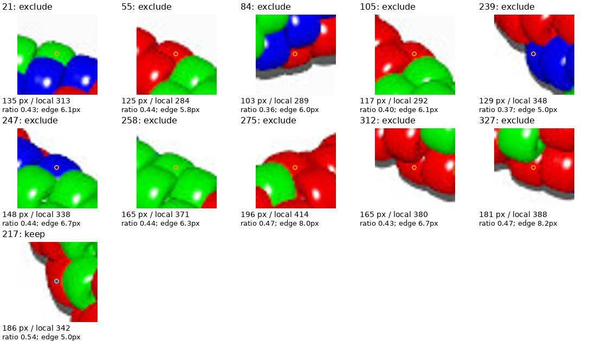

# Active inventory: ignore slivers — R069

The maker's instruction is to ignore all slivers, compare visible pixel area
with surrounding beads, and ignore marker 211. Applied to beads1.jpg, this leaves
**313 active body observations**: 130 red, 132 green and 51 blue. All 37 previously
recorded fragments and 10 additional small body candidates are excluded.
These are selected observations, not a complete bead count or recovered pattern.

[Interactive map](review/r069/review.html) ·
[Active overview](review/r069/active-overview.png) ·
[Exclusion close-ups](review/r069/area-review.png) ·
[Records](review/r069/inventory.json) · [Report](review/r069/report.json).



## Method and choices

`inventory_selection.py` selects from the existing R068 image-only region map.
It changes eligibility, not segmentation. All known fragments are ignored
regardless of size. Marker 211 was already absent and remains excluded;
217 remains active (186 pixels, 0.54 times its local median). The user's reply
does not physically establish whether 211 and 217 belong to the same bead.

For each observation, take up to eight nearby reviewed body candidates within
45 source-image pixels, excluding itself, known fragments and 211. Require at
least four references. Compare its region's pixel area with their median area.
The reference pool is frozen before filtering, preventing cascading exclusions.
All retained beads1 observations have eight references.

The initial numerical interpretation of “roughly comparable” is **at least half
the local median area**. This is an assistant-chosen heuristic, not a threshold
specified by the maker or calibrated ground truth. Regions below it are excluded.
Those above twice the median would be flagged for possible merging, not silently
discarded. Insufficient neighbors produce a warning instead of an invented area
comparison. No active beads1 observations have these warnings.

For edge proximity, close gaps in the original color-support mask with a
2-pixel-radius disk and fill enclosed holes up to 128 pixels, retaining the large
central opening. Measure the marker's distance to the resulting background.
Call it near an edge if the distance is at most the equivalent-circle radius of
the local median area: `sqrt(median_area / pi)`. This is a pixel-mask heuristic,
not an outer/inner spline or physical radius measurement. It distinguishes edge
exclusions in the audit; proximity alone does not discard a normal-sized body.

The ten additional exclusions are IDs **21, 55, 84, 105, 239, 247, 258, 275,
312 and 327**. All ten are near the edge. Another 38 near-edge body observations
remain active because their areas pass. Regions near the threshold can change
eligibility if segmentation or the threshold changes; the close-ups make that
judgment reviewable. The rule deliberately permits missing partial beads.

Original IDs, masks and historical records are preserved. Excluded pixels become
unassigned in the active map; neighbors do not grow into them. Of the original
99,768 assigned pixels, 96,124 remain active and 3,644 are ignored. The 41 earlier
unassigned color-support pixels remain unassigned. Bead-chain indices stay null.

The maker suspects excessively bright, point-like illumination, perhaps behind
the camera, exposed effects less apparent in the photographs. This is saved as
a hypothesis. This step neither reads POV-Ray patterns nor estimates or edits
the lighting. Area comparisons depend on provisional masks, especially where
same-color bodies meet. The pure selection function can be reused; the current
command-line adapter and review gallery are specifically for beads1.

## Reproduce and verify

If R068 bulk maps are absent, recreate them without rewriting its committed
review bundle:

```bash
.venv/bin/python photo2/beads1_inventory.py --output photo2/output/inventory-r068-final --review-bundle photo2/output/inventory-r068-recreated-review
.venv/bin/python photo2/inventory_selection.py --output photo2/output/selection-r069-final --review-bundle photo2/review/r069
.venv/bin/python -m unittest discover -s photo2 -p test_inventory_selection.py -v
.venv/bin/python -m unittest discover -s photo2 -p test_beads1_inventory.py -v
```

Seven selection tests and five source-inventory tests pass; compilation passes.
Two runs reproduce all four curated artifacts and the active label map byte for
byte, with reports equal except command paths. Six source hashes verify. Active
pixels/IDs are unchanged, all 47 excluded records are absent from the active map,
211 is absent and 217 present. Both PNGs were visually inspected. No numerical
or test failures; no renderer, other-image inventory or full legacy regression.
Routine NPY maps and duplicate runs remain ignored; the review bundle is committed.

The [beads1 questions](BEADS1_QUESTIONS.md) are answered operationally. Next review
beads2.jpg using its own palette and this selection policy, stopping at its
reviewable body/color map and checks before indexing or pattern inference.
