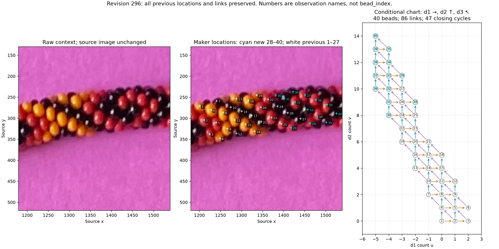

# Extended maker labels — R161

The revision-296 save has **40 beads, 30 completed series and 86 neighbor links**.
All original 27 points, stable IDs and 54 links are preserved. Thirteen new
points (28–40) add 32 links. The graph is connected, has no coordinate collisions,
and all 47 independent cycles close without exclusions. No label repair is needed.



The left panel is raw context; the middle adds the maker's surface locations,
with new points cyan. The right is a discussion-coordinate chart, not a camera
projection. No bead boundary, color label, center or outward point is inferred.

Compare graph audit, saved-pose prediction, and expanded-patch refitting; implement
the audit first. Preserve the exact [new snapshot](manual-labels-r161.json), SHA
`a525aaf05a7be8da79db93fc54f91c21205a08766912420ccc13566eed7a75e2`,
against [revision 162](manual-labels-r146.json). All old links survive the five
removed/recreated series; there are 16 new series IDs, a net increase of 11.
The ignored live file is untouched.

The 47 recorded triangle rows have independent incidence-matrix rank 47, equal
to the graph cycle rank 86−40+1. Each edge also agrees with exact integer
propagation. Thus the local triangle relation d2=d1+d3 accounts for every cycle.
This validates the supplied neighbor interpretation, not a selected 6/7 family.
Both conditional index maps are injective; neither has a wraparound closure or
same-index/different-bead conflict. See the [exact diagonal test](DIAGONAL_MINIMUM.md).

Ten beads have all six neighbors recorded: **5,8,11,14,17,20,24,26,32,33**, up
from six. The only graph-implied unrecorded unit link is 3→6 in d2; it remains
unconfirmed. Previously implied 25→26 in d3 is now explicitly supplied.

With (u,v) relative to bead 1, d1=(1,0), d2=(0,1), d3=(−1,1). Keep C=20 as
the relative-index origin. Family A weights are (+1,+7,+6), family B (−1,+6,+7).
Global reversal remains a convention; these are not full-string bead_index.

| New bead | u | v | A offset from C | B offset from C |
| --- | ---: | ---: | ---: | ---: |
| 28 | -2 | 9 | 21 | 18 |
| 29 | -3 | 11 | 34 | 31 |
| 30 | -4 | 8 | 12 | 14 |
| 31 | -4 | 9 | 19 | 20 |
| 32 | -4 | 10 | 26 | 26 |
| 33 | -4 | 11 | 33 | 32 |
| 34 | -4 | 12 | 40 | 38 |
| 35 | -4 | 13 | 47 | 44 |
| 36 | -5 | 10 | 25 | 27 |
| 37 | -5 | 11 | 32 | 33 |
| 38 | -5 | 12 | 39 | 39 |
| 39 | -5 | 13 | 46 | 45 |
| 40 | -5 | 14 | 53 | 51 |

A spans −40…53 and B −40…51. There are 54/52 unlabelled index slots within
those ranges; missing slots are not automatically hidden beads. The old ray
model's latent domain ends at +47, so it omits bead 40 under both interpretations.
Extend the domain with an occlusion-neighbor margin before testing new points;
do not count an absent model bead as evidence against a family.

The longest recorded d2 and d3 runs each have **five steps / six beads**. Examples
are d2 30→31→32→33→34→35 and d3 18→21→23→24→31→36. Their paths and all counts
are retained in the [report](review/r161/report.json). There is no observed
seven-versus-six endpoint-identity test in this save.

```sh
.venv/bin/python photo2/audit_label_extension.py
```

The script reuses the established graph audit with zero allowed exclusions and
adds independent cycle-rank, snapshot-delta, distinct-index and raw-review checks.
Source/image/annotation/code hashes are recorded. Manual evidence is explicit;
there is no automatic detector, new pose fit, color recovery or photo-N claim.

**Stopping point:** the extended save is preserved and internally consistent.
**Next task:** compare saved A/B poses with the 13 new ordinary surface points,
after extending and checking latent coverage, before deciding to refit. Keep
22/23/24/25 out of training; new points can first serve as validation. No full
boundary or larger patch is required in advance. Recommend gpt-6.1-sol / High;
same session, no /new needed.
