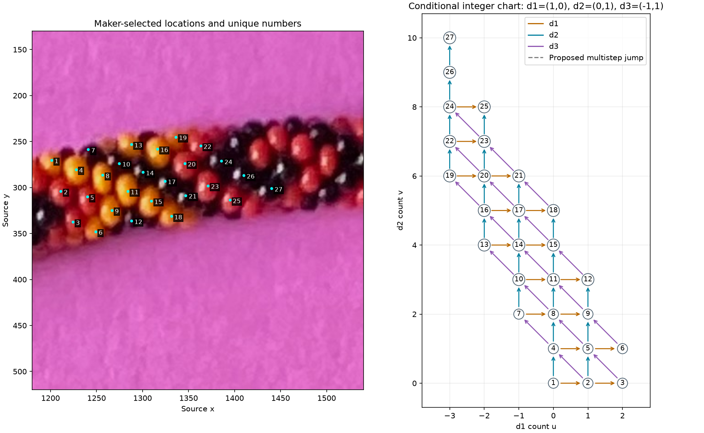

# Information extracted from maker labels and series — R144–R147

The corrected maker save connects **27 numbered visible beads through 54 recorded
links**. All **28 independent graph cycles** close exactly under the local
one-neighbor-step interpretation. There are no coordinate collisions or omitted
bodies. The 28 recorded triangles all express **d2 = d1 + d3**. This gives us a
usable coordinate system and six complete neighbor stars, before resolving 6/7.

The maker also confirms **22=B, 20=C, 23=G**. Their recorded C→B connection is d3
and C→G is d2, agreeing with the earlier coupled 6/7 family statement. Numeric
family and global string orientation remain unresolved.



## Evidence and procedure

Read the raw source and maker points first. Source `beads-photo-2.jpg`, oriented
2540×3182, SHA-256
`eb7c9edb62f5580ef56632872da48da92556d62b758295137068cc2404dc8fbb`.
Viewing crop [1180,130,1540,520]; source x right/y down. Anchors are exactly the
maker's visible-surface picks, not fitted centers or outward-torus anchors. No
sampling route, color measurement, detector, camera fit or material fit occurs.
The crops show raw pixels beside explicit point/graph overlays.

Three approaches were presented: graph/cycle checks, a local location lattice,
and Python placement/projection fitting. This bounded step chooses graph checks;
locations provide illustrated skipped-step and historical-ID context only.

Immutable curated snapshots preserve live saves, without changing the ignored
working annotation file:

| Save | Revision | SHA-256 |
| --- | --- | --- |
| [Initial maker save](manual-labels-r144.json) | 149 | ec40c84a7db8aacbdb6ef8bd4b80df66a6d9f404e77765b462d5fb47871423a8 |
| [Corrected maker save](manual-labels-r146.json) | 162 | 94470dc222324dd6d2081cd43f94f187c01f18c13958761392af14ddd8bdf7de |

For the initial 52-link graph, treating every click pair as one step is
inconsistent. Exhaustive exclusion checks found no solution with zero or one
excluded link, and exactly one solution among all 1,326 two-link exclusions:
d1 `10→12` and d2 `2→9`. The other 50 unit links connect all 27 bodies consistently.
Independent paths imply two steps through 11 and 5, respectively. Source-location
crops support these suggestions; no physical-center distance was used as proof.
[Witness paths and original analysis](review/r144/report.json).

The maker corrected these to d1 `10→11→12` and d2 `2→5→9→12`. The resulting
54-link graph needs no exclusions and gives the same coordinates. It has one
connected component, with cycle rank 54−27+1=28. Exact propagation validates every
link and hence every fundamental cycle; an independent matrix check finds rank
28 for its 28 triangle edge-incidence rows. Each triangle's signed direction
counts are (1,−1,1). This proves internal agreement of this neighbor interpretation,
not uniqueness of 3D geometry or identification of a whole-string index.
[Corrected analysis](review/r144/corrected-report.json).

[Verbatim answers and illustrated checks](LABEL_SERIES_QUESTIONS.md), with a
[machine-readable answer record](label-series-answers-r144.json), distinguish
maker facts from proposals. B/C/G matches are now maker-confirmed. E/24, H/26 and
J/21 remain tentative containment matches to historical assistant polygons; F is
not mapped. Old BC=1 charts remain historical controls, not current assignments.

## A useful neighborhood immediately available

Beads **5, 8, 11, 14, 17 and 20** each have all six directed neighbors recorded.
For bead **20=C**:

| Discussion direction | Recorded neighbor |
| --- | --- |
| +d1 | 21 |
| −d1 | 19 |
| +d2 | 23=G |
| −d2 | 16 |
| +d3 | 22=B |
| −d3 | 17 |

A seven-body fitting patch is therefore **16,17,19,20,21,22,23**. It includes
maker-located black bodies, preserves the known B/C/G relations, and meets the
requested 5–12-body seed size. G's pixels can remain withheld from continuous
fitting while its graph relation is used. This patch is a proposal for the next
bounded step, not a fit already performed.

The chart also predicts two unrecorded unit connections, **3→6 in d2** and
**25→26 in d3**. These remain graph-implied proposals; they were not added to any
maker series or accepted as independent evidence. Unselected positions stay
unknown, including edge/hidden bodies; no compressed visible-only indexing.

## Local coordinates and remaining index ambiguity

Set maker bead 1 to (u,v)=(0,0), with d1=(1,0), d2=(0,1), d3=(−1,1). These are
integer discussion counts, not image pixels or calibrated torus coordinates.
Different paths can give different three-direction counts while producing the
same (u,v), since one d2 equals one d1 plus one d3.

If d1 has magnitude 1 and d2/d3 have magnitudes 6 and 7, the triangle restricts
weights to two alternatives, plus global reversal:

| Candidate | d1 | d2 | d3 |
| --- | --- | --- | --- |
| A, clockwise progression positive | +1 | +7 | +6 |
| B, clockwise progression positive | −1 | +6 | +7 |

The global reversals of A and B fit equally well. No user fact selects A/B or
establishes the positive full-string orientation. With C=20 at (−2,6) and its
unknown full-string index K, candidate A gives `K+(u+2)+7*(v−6)`; candidate B gives
`K−(u+2)+6*(v−6)`. The table gives the additive offsets relative to C. Maker bead
numbers are names, and must not be read as the recovered bead_index.

| Maker number | u | v | A offset from C | B offset from C |
| --- | --- | --- | --- | --- |
| 1 | 0 | 0 | -40 | -38 |
| 2 | 1 | 0 | -39 | -39 |
| 3 | 2 | 0 | -38 | -40 |
| 4 | 0 | 1 | -33 | -32 |
| 5 | 1 | 1 | -32 | -33 |
| 6 | 2 | 1 | -31 | -34 |
| 7 | -1 | 2 | -27 | -25 |
| 8 | 0 | 2 | -26 | -26 |
| 9 | 1 | 2 | -25 | -27 |
| 10 | -1 | 3 | -20 | -19 |
| 11 | 0 | 3 | -19 | -20 |
| 12 | 1 | 3 | -18 | -21 |
| 13 | -2 | 4 | -14 | -12 |
| 14 | -1 | 4 | -13 | -13 |
| 15 | 0 | 4 | -12 | -14 |
| 16 | -2 | 5 | -7 | -6 |
| 17 | -1 | 5 | -6 | -7 |
| 18 | 0 | 5 | -5 | -8 |
| 19 | -3 | 6 | -1 | +1 |
| 20 | -2 | 6 | +0 | +0 |
| 21 | -1 | 6 | +1 | -1 |
| 22 | -3 | 7 | +6 | +7 |
| 23 | -2 | 7 | +7 | +6 |
| 24 | -3 | 8 | +13 | +13 |
| 25 | -2 | 8 | +14 | +12 |
| 26 | -3 | 9 | +20 | +19 |
| 27 | -3 | 10 | +27 | +25 |

These candidates span 68 or 66 potential index positions for 27 selected bodies,
leaving 41 or 39 positions without labels within those ranges. Those counts do
not establish invisible-bead counts, complete local coverage, necklace closure,
total N, colors or a repeating pattern. An index may be absent because its body
was not selected, was hidden, or lies outside this viewing patch.

## Reproduction and checks

```sh
.venv/bin/python photo2/analyze_label_series.py --annotations photo2/manual-labels-r144.json --output photo2/review/r144/report.json --review-dir photo2/review/r144
.venv/bin/python photo2/analyze_label_series.py --annotations photo2/manual-labels-r146.json --output photo2/review/r144/corrected-report.json --review-dir photo2/review/r144/corrected
.venv/bin/python -m unittest discover -s photo2 -p test_label_series.py -v
```

Four tests pass: a known synthetic lattice recovers true coordinates and all four
signed weight candidates; synthetic skipped clicks are detected without editing
input; contradictions/disconnected bodies are not accepted; original/corrected
maker saves preserve bodies and recover the expected jumps/closure. The script
records source, annotation and script hashes. Search is explicitly bounded to
at most two exclusions and 200 links; it is a patch audit, not an automatic
whole-necklace detector. Missing or ambiguous charts are not forced into a result.

**Stopping point:** this graph/coordinate extraction is complete. **Next bounded
task:** compare the two family/helicity interpretations using the seven-body patch
and Python/POV projection, with source points treated as visible-surface anchors
and no assumed camera elevation. Retain all unknown indices and excluded edge
regions. No 3D fitting occurred here. Recommend gpt-6.1-sol / High, same session;
no /new needed. The separate launch fixes remain uncommitted and unverified after
interruption; this analysis does not publish or claim completion of that work.
