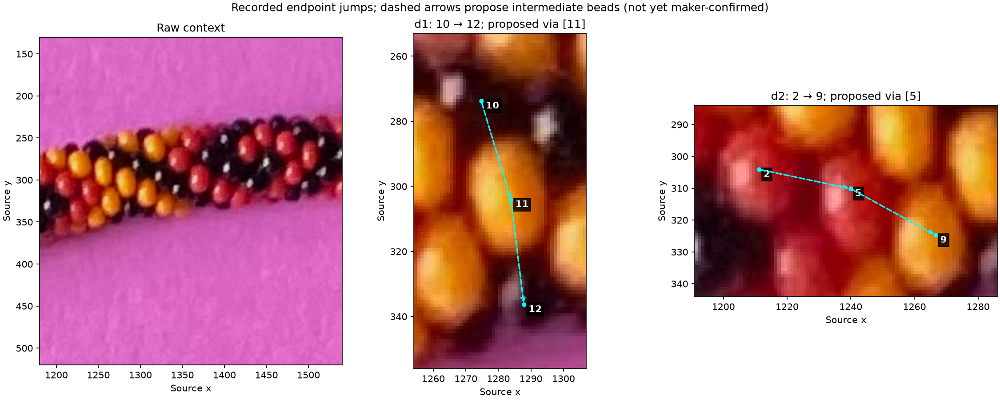
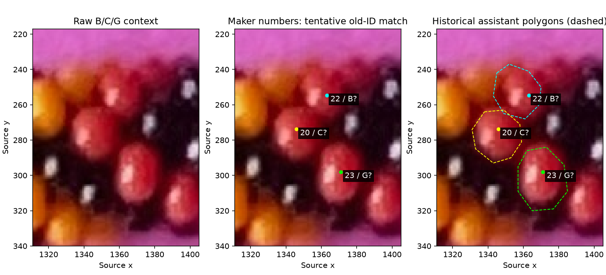

# Maker series review — R144–R147

## Q144.1 — Two recorded jumps

Asked whether d1 `10→12` passed through bead 11 and d2 `2→9` through bead 5,
so each recorded jump represented two neighbor steps.

R145, verbatim: “do you want me to fix this issue?”

Requested replacement series d1 `10→11→12` and d2 `2→5→9→12`, preserving `9→12`.
R146, verbatim: “OK, i fixed both those problems”

**Answered and applied by the maker.** Original revision 149 is preserved in
[the original snapshot](manual-labels-r144.json); corrected revision 162 in
[the corrected snapshot](manual-labels-r146.json). The corrected file contains
both requested series. Bead locations, unique numbers, stable IDs and source
metadata are identical across these saves. No assistant edits to the live file.

## Q144.2 — Reconcile earlier B/C/G names

Asked: “In the illustrated raw crop, do your numbered beads 22, 20, and 23
correspond to our earlier B, C, and G, respectively?”

R147, verbatim: “yes”

**Confirmed: 22=B, 20=C, 23=G.** These names refer to the same observed bodies;
the selected points are visible-surface locations, not measured physical centers.
Other historical polygon matches E/24, H/26 and J/21 remain tentative; F has no
contained maker point. No 6/7 assignment, string origin or pattern is supplied.

[Analysis and full coordinate/index-candidate table](LABEL_SERIES.md).
