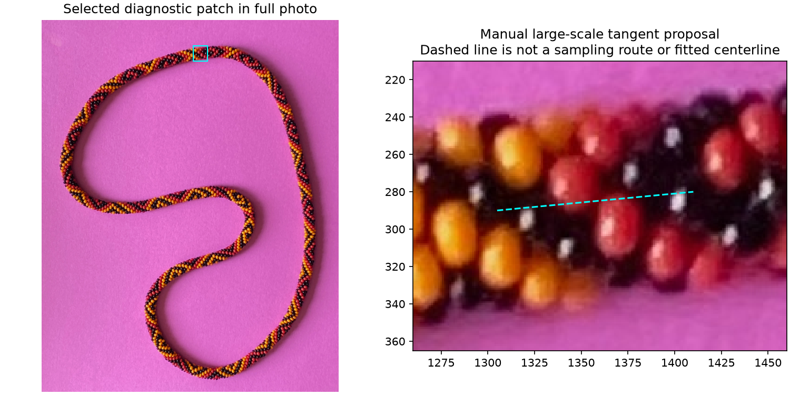
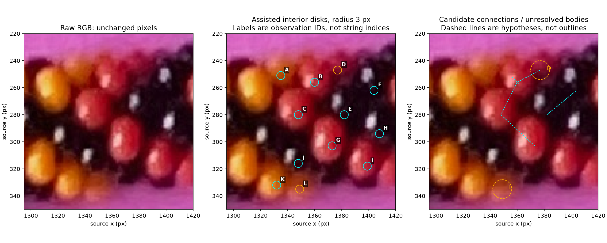
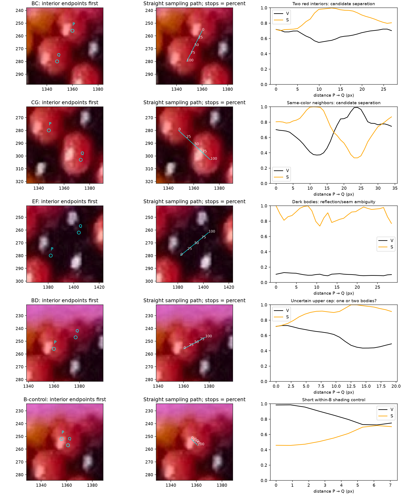
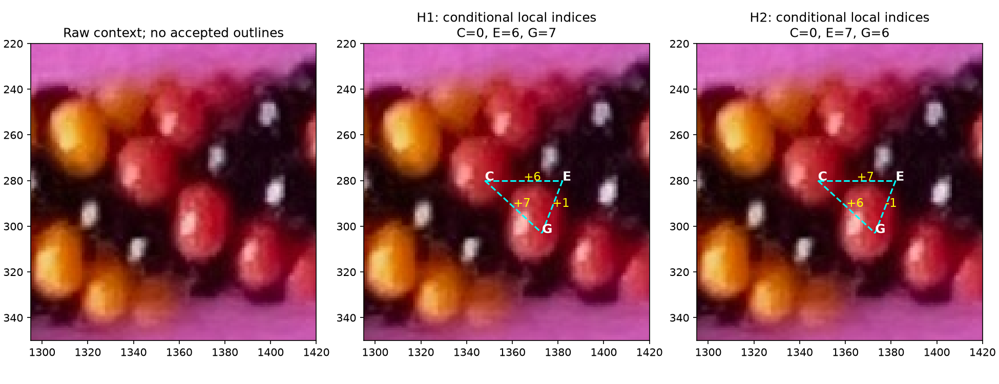
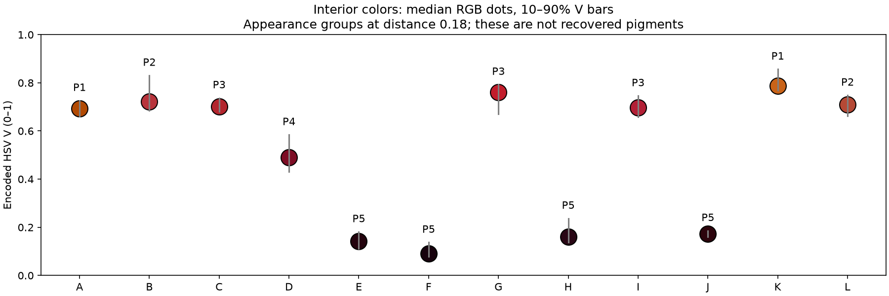
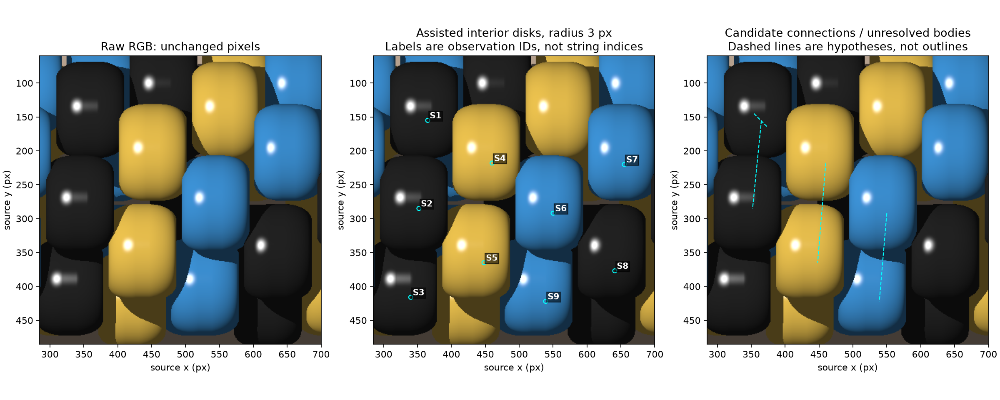
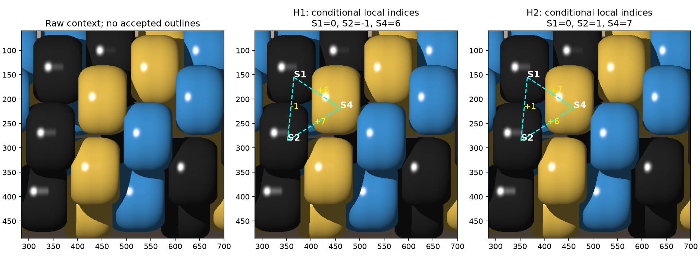

# Local observation, index and color pilot — R114

**Latest R126–R128:** [local surface fitting](LOCAL_SURFACE_FIT.md) compares two
seven-body correspondence proposals with G withheld. Both remain uncertain;
see the [small ownership question](LOCAL_SURFACE_FIT_QUESTIONS.md) before any
ring expansion. Original R114 measurements below remain frozen.

**Current R117–R125 supersession:** the [placement/anchor pilot](PLACEMENT_PILOT.md)
calibrates forward geometry and selects B/C/E/F/G/H/J for the next fit, including
four dark bodies. Edge/behind-edge A/D/I/K/L stay outside that fitting set without
erasing their records. Signed 1/6/7 direction counts are useful discussion labels,
especially for nearest neighbors; they need not drive internal fitting variables.
No new photo neighbors or indices are inferred. R115/R116 stopping instructions
below describe their historical steps, not the present handoff.

The first local pilot supports useful interior measurements, but **does not yet
justify photo bead indices or a recovered pigment palette**. Two consistent
neighbor graphs remain possible. The simple color baseline splits red-looking
surfaces and groups an uncertain orange fragment with a red-looking sample.
**R115 review:** the maker confirms D is separate from B and notes that its
proximity to the edge makes everything about D harder to establish. The
[illustrated answer](LOCAL_PILOT_QUESTIONS.md) resolves only that body distinction;
D's boundary, sampling support, pigment and index remain uncertain. Stop after
recording this feedback; the next numerical step has not begun.

**R116 priority update:** the maker suggests the clearest non-black bodies away
from the necklace edge may be enough. In the labeled inventory below, B/C/G are
assistant-selected starting candidates with broad colored faces; their selection
is not a new maker confirmation or a claim of exact centers. First test what
those anchors, plus any needed nearby clear bodies, constrain. A/K/D/I/L are
deferred from this conservative starting set because of edge proximity, partial
exposure or fragment uncertainty; E/F/H/J because of dark appearance. Deferral
does not remove any observation, establish its pigment, or resolve an index.
No numerical threshold for edge distance or color is introduced. The original
C/E/G triangle remains historical conditional evidence; black E is no longer a
required anchor for the next attempt. See the [revised method choice](../METHODS.md#assign-bead_index-and-color-to-clearly-visible-beads).

## Scope and assistance



This is a deliberately selected top-of-necklace patch, not an automatic location
estimate. All twelve observation anchors, the straight paths and the tangent
endpoints were selected by the assistant from the original RGB photograph.
No old HSV ranges, source pattern, historical bead indices or masks were used.
Colors are descriptive image appearances, not recovered POV-Ray pigments.
Paper, shadows and gaps remain background; there is no new segmentation mask.

R111/R113 already compared I1 signed graphs, I2 local 3D matching, I3 row tracking
and I4 joint constraints, with C1 interior summaries, C2 shading families and C3
reviewed prototypes for appearance. The turn restated those alternatives and
implemented the selected **assisted B1/B4/B5 + I1/C1 diagnostic**. B4 here is visual
seam/occlusion inspection, not an automatic contour detector; no outlines were
accepted. I2/C2 remain targeted follow-ups, not secretly supplied truth. The
pilot can stop unresolved without fitting a full model. Both FFT explorations
remain pending supporting tasks, with optional adoption.

## Observation coverage



[Original R114 observation table](review/r114/observations.csv) preserves all twelve selected
regions, including uncertainty. Eight substantial bodies B/C/E/F/G/H/I/J and
two partially exposed bodies A/K are proposed. **R115 confirms D is distinct
from B**; L may be a separate body/fragment or part of K. Current accounting is
**10 proposed bodies + D with confirmed separation from B + 1 unresolved region L**,
still twelve observation records, not a confirmed count of twelve beads. Ignore
verified slivers under the existing rule; L has not been verified as one.

Apply the [R115 review annotation](local-pilot-review-r115.json) when interpreting
the original table. R114 config, CSV, reports and images are frozen pre-review
evidence: their unresolved-B/D wording records the earlier state. Review changes
only D's body distinction and its provenance, not numerical measurements or
uncertainty in its other attributes. Maker feedback is diagnostic/validation
evidence, not an automatic detector output or a final runtime location prior.

The wider crop also contains context bodies outside this selected set. There is
no complete-crop or whole-photo detection-coverage claim, and no ground truth for
photo false/split/merged bodies. All twelve have measured color evidence; zero
have accepted global indices or confirmed pigment labels. C/E/G share a
conditional component under each graph hypothesis; the other nine regions have
no resolved component offset. A missing index is never compressed away.

The cyan circles are radius-3-pixel sampling disks, **not body outlines or physical
centers**. Reasons for each proposed interior are in the table/config: sample
colored faces beside reflections and dark surfaces below/right of reflections,
away from visually apparent outer seams where possible. E/H and the D/L fragments
remain especially susceptible to shaded or mixed pixels. Manual placement is
assistance, not independent verification of those pixels.

## Paths, tangent and spacing evidence



Read the raw inventory first, then the endpoint panels, then the straight routes
and measurements. B→C and C→G connect red-looking interiors; E→F tests two dark
surfaces; B→D tests the uncertain upper cap. The short within-B control crosses
the reflection/shading gradient on one proposed body. Its endpoints are not new
pigment prototypes. All paths retain highlights: none treats a highlight as a
seam, bead center or boundary marker.

Pixel coordinates are in the EXIF-transposed original 2540×3182 JPEG, x right,
y down. Paths use bilinear RGB at spacing ≤1 pixel; convert interpolated encoded
RGB (0–1) to conventional HSV, without smoothing or white balancing. V=max RGB,
S=(max−min)/max. Hue summaries are chroma-weighted circular means in degrees;
near-black hue concentration does not establish a reliable pigment hue. No
hard-coded color range determines membership. All disk pixels are retained;
manual placement and the median, rather than a brightness rejection rule, limit
highlight effects. Disks contain 29 integer pixel centers.

For a descriptive valley score, take the smaller endpoint V minus minimum V
over the middle 20–80% of the route. Negative scores mean no dip below both ends.
Shift the whole line ±2 px along its image normal; moved endpoints are not
automatically verified interiors. This is not a trained boundary threshold.

| Route | Length (px) | V dip at −2 / 0 / +2 px offset | Interpretation |
| --- | ---: | --- | --- |
| B→C | 26.83 | .187 / .154 / .140 | Persistent dark separation between red-looking surfaces |
| C→G | 33.97 | .295 / .332 / .365 | Persistent valley, followed by G's internal highlight |
| E→F | 28.43 | .070 / .015 / −.002 | Dark-body route is sensitive to a small shift |
| B→D | 19.24 | .048 / .056 / .080 | Smaller dip cannot decide one versus two bodies |
| Within B | 7.07 | .027 / .020 / −.039 | An internal shading/reflection path also changes V |

These measurements support visual separation proposals, not exact edges. The
control is shorter than the inter-body paths, so it does not calibrate a common
decision threshold. There are too few controls to estimate a seam error rate.

The manual large-scale direction between (1305,290) and (1410,280) is −5.44° in
image coordinates. Moving the endpoints vertically by up to ±3 px gives a
−8.66° to −2.18° range. This is a direction reference, **not a physical centerline,
camera calibration, or helicity measurement**. Tangent endpoints are geometric
guides, not sampling endpoints. No boundary bridge was needed for this rough
local direction.

## Conditional index alternatives



[Edge table](review/r114/edges.csv) records C→E: 34.00 px at 0°; E→G: 24.70 px
at 111.37°; C→G: 33.97 px at 42.61°. These are **interior-anchor displacements**,
not physical center spacings or bead diameters. Their lengths/angles do not
establish which edge is direction 1, 6 or 7.

| Hypothesis | C | E | G | Constraints |
| --- | ---: | ---: | ---: | --- |
| H1 | 0 | 6 | 7 | C→E +6, E→G +1, C→G +7 |
| H2 | 0 | 7 | 6 | C→E +7, E→G −1, C→G +6 |

Both satisfy the triangle and have unique local indices. Their edge labels are
proposals, not independently verified measurements, and these two hypotheses
are not an exhaustive set of camera/phase/hand possibilities. Global reversal
and origin remain reporting freedoms. Neither is selected, neither proves photo
helicity, and neither is propagated beyond this triangle. The table's accepted
component_index and bead_index fields stay empty; alternatives have their own
column. Same-color adjacency does not establish crochet adjacency.

## Interior appearance baseline



C1 uses componentwise median encoded RGB over each disk and complete-linkage
clustering with Euclidean RGB distance thresholds .12/.18/.24. These explicit
diagnostic thresholds were not learned from a held-out corpus; no fixed number
of colors or red/yellow/black box is supplied. At .18 the five groups are:

| Appearance ID | Observations | Limitation |
| --- | --- | --- |
| P1 | A, K | Yellow/orange-looking samples |
| P2 | B, L | Red-looking B grouped with uncertain orange-looking fragment L |
| P3 | C, G, I | Other red-looking faces; may share pigment with B |
| P4 | D | Singleton shaded reddish cap; R115 confirms separation from B, pigment unresolved |
| P5 | E, F, H, J | Dark surfaces; hue alone would be misleading |

The three thresholds give six/five/four groups. At .24, B joins C/G/I but L joins
them too. Four cardinal ±2 px disk shifts change three of 48 nearest-group
assignments (G/I shifted left; B shifted right). The group medians stay fixed
for this diagnostic. Leaving one anchor out of its prototype calculation agrees
with the original grouping on 11/12, with D's singleton unsupported. Group
memberships were learned using all anchors: **this is a stability diagnostic,
not independent classifier accuracy**.

This is the concrete reason to consider a restricted C2 shading comparison
after body review. Do not force five appearance groups into the maker's known
three pigment names, declare L red from its cluster, or count groups as pigments.
The pilot has not learned a whole-image palette or tested background/placement
generality. It intentionally reports this limitation instead of escalating into
a full appearance fit within the same bounded step.

## Known synthetic counterpart and failure witness



The new POV-Ray counterpart uses the existing bead macro with roundedness .8,
height ratio .7, relative size 1; 6.5 beads per cross-section turn, minor radius
4, axial advance 2.5 per turn, and a straight planar axis. Camera and lights,
palette and phase are explicitly in the generated scene. Sixty-six modeled beads
(indices −26…39) provide occlusion/context, **not a closed necklace count**. A blue,
yellow and dark palette on brown paper deliberately differs from the photo.
This is a model-family sanity check, not fitted photo geometry; bead image sizes,
lighting, blur and material appearance differ substantially. Radius-3 disks and
±2 px shifts are proportionally much smaller here, so robustness is not comparable
at equal bead-relative scale.

Render 880×520 PNG without antialiasing, two threads, POV-Ray 3.7.0.10.unofficial.
The ordinary appearance uses File_Gamma=2.2. The evaluator render uses emission
IDs in red with File_Gamma=1 and no paper plane. The script extracts the original
bead macro and does not alter beads.pov. [Render hashes](review/r114/synthetic-render-provenance.json)
record scene/source/image provenance; [appearance](review/r114/synthetic-appearance.png)
is available separately.

Nine anchors, routes and graph alternatives were selected from RGB **before the
ID image was inspected**. Known model family/generation is declared assistance;
the analysis function reads only RGB/config and no truth, masks, geometry table
or palette assignments. Anchors/graph alternatives were frozen before evaluation
and were not corrected using truth. Later reruns corrected plot/report formatting,
not synthetic inputs. Only the separate evaluator decodes IDs and palette truth.

[Evaluation](review/r114/synthetic-evaluation.json) finds nine distinct rendered
bodies at the nine anchors, all 29-pixel disks pure. There are no duplicate-ID
anchors or background anchors in this selected set; no detector or full-body
masks were produced, so automatic false/split/merged rates and total visible-body
coverage remain unmeasured. C1 yields the same three groups at all thresholds,
with **0/36 pairwise same/different-color errors**, no shift changes and 9/9
leave-one-prototype-out agreements. No color errors/unknowns occur for those nine
chosen interiors; this easy synthetic result does not repair the photo failures.



Both synthetic hypotheses pass algebraic graph checks. H1 has 3/3 correct signed
edges and 3/3 correct local indices after one component origin/orientation
alignment. H2 has 0/3 correct signed edges in the declared +x convention; even
after its best allowed global reversal, only 2/3 indices match and S4 is wrong
by −13. This is an explicit **wrong-but-consistent graph** witness. Truth scores
the alternatives; it does not give an image-only rule for choosing H1 on a new
image, nor license transplanting H1 to the photo. Six other synthetic observations
remain outside the indexed triangle.

## Reproduction and checks

Use Python 3.12.14 and the existing pinned environment; no dependencies added:

```bash
.venv/bin/python photo2/local_pilot.py render --output photo2/output/r114/synthetic
.venv/bin/python photo2/local_pilot.py analyze --config photo2/local-pilot-r114.json --output photo2/output/r114/photo
.venv/bin/python photo2/local_pilot.py analyze --config photo2/local-pilot-synthetic-r114.json --output photo2/output/r114/synthetic/analysis
.venv/bin/python photo2/local_pilot.py evaluate --config photo2/local-pilot-synthetic-r114.json --output photo2/output/r114/synthetic
```

[Photo report](review/r114/report.json), [synthetic report](review/r114/synthetic-report.json),
[photo configuration](local-pilot-r114.json), [synthetic configuration](local-pilot-synthetic-r114.json)
and [script](local_pilot.py) preserve all anchors, parameters and source SHA256s.
Full path-sample CSVs, generated scene and truth PNG stay in ignored output;
curated images, small reports and observation/edge tables are tracked.

Embedded checks cover contradictory cycles, duplicate indices, disconnected
observations and hue wrap. The first analysis attempt failed because explicit
control endpoints were passed twice to dict(); this was corrected before results
were used. Endpoint plotting was widened for the larger synthetic bodies.
The final artifacts were visually inspected; numerical and reproduction checks
are recorded in R114's request-log outcome.

R115 records the maker's B/D answer and updates the interpretation of this
observation set. R116 changes the next priority to clear non-black interior
anchors. Stop here. Next: test whether that subset constrains the local index
structure, retaining skipped positions and D's edge-related uncertainty, before
expanding indices. No full-ring count, pattern recovery or material fitting was
attempted. Recommend gpt-6-astra / High; stay in this session for discussion,
use a fresh /new for the next numerical experiment if desired.
