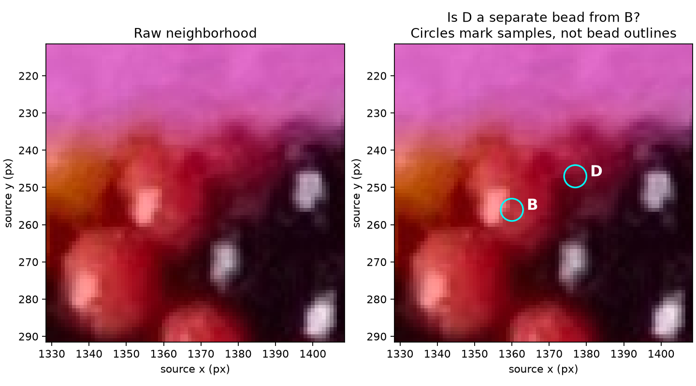

# R114 — One local body question

Status: answered in R115. **D is a separate bead from B.** D's boundary,
sampling support, color and index remain uncertain; no bead indices accepted.

Original R114 question: **Is D a separate red bead from B, a shaded part of B, or unclear?**
The circles mark sample interiors, not bead outlines. No exact pixel annotation
is needed. At the time of the question, D's separation from B was unresolved.
The small V dip on B→D did not settle the question. B's bright reflection is inside its visible surface,
not a boundary marker.

This is the only new question in this step. Older background questions do not
need answers first. [Full local evidence](LOCAL_PILOT.md) includes the other
unresolved edge fragment L, candidate neighbors, color summaries and synthetic
check. No local 6/7 family assignment or photo helicity is accepted.

## Saved response

R115, 2026-09-28:

> Yes, D is separate from B.  Being closer to the edge, everything about D is more difficult to establish.

Record D as a distinct body from B, with maker-confirmed separation. Its position
near the necklace edge makes other properties harder to establish. This answer
does not verify the disk as a pure interior, locate the boundary, resolve its
pigment, label construction neighbors, or assign an index. L remains unresolved.

[Machine-readable review](local-pilot-review-r115.json) stores the response and
the narrow status update separately from the frozen R114 measurements/config.
The original illustration remains unchanged and linked above. No further answer
to this question is needed.

## R118–R125 — Answered anchor and coordinate clarifications

The assistant asked whether “outside” meant the minor tube direction or the
whole necklace ring's outside. R119 answered: “its the smaller direction of the
necklace torus.” [Curated central visibility illustration](review/r118/central-visibility.png)
and [almost-hidden counterexample](review/r118/outward-counterexample.png) support
the discussion. R120 observes that the exceptions are almost completely hidden;
R121 directs us to ignore edge/behind-edge bodies in active work. Adopted, without
claiming universal exposure or an automatic photo selection threshold.

R123 clarifies labels as signed counts in directions 1/6/7. R124/R125 emphasize
that these can help discussion, particularly a bead's nearest neighbors, regardless
of whether they help internal fitting. Adopted: use “the +6 neighbor of B,” mark
uncertain edges, and retain stable observation IDs. No further question is pending.
Full user wording is preserved in [REQUEST_LOG](../REQUEST_LOG.md).
