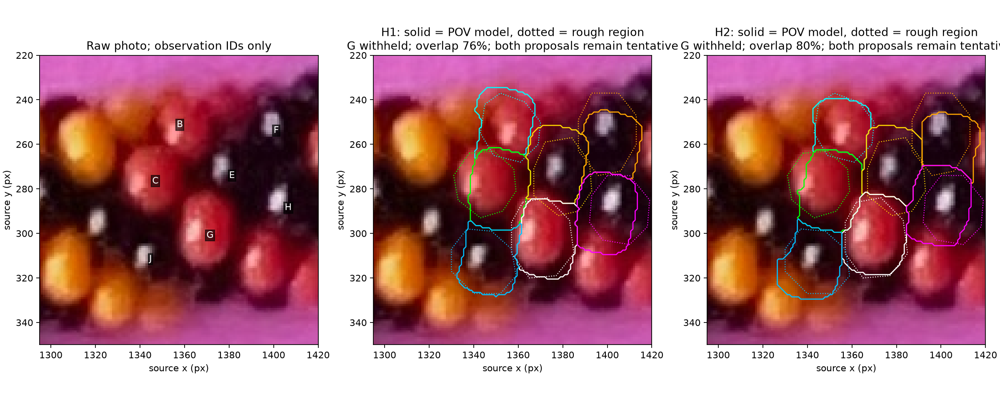
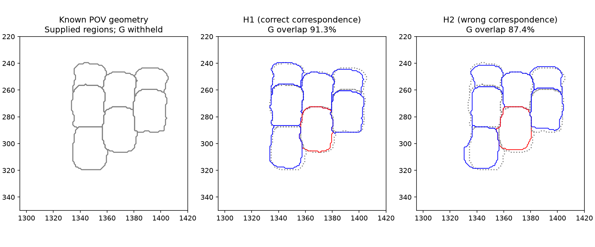
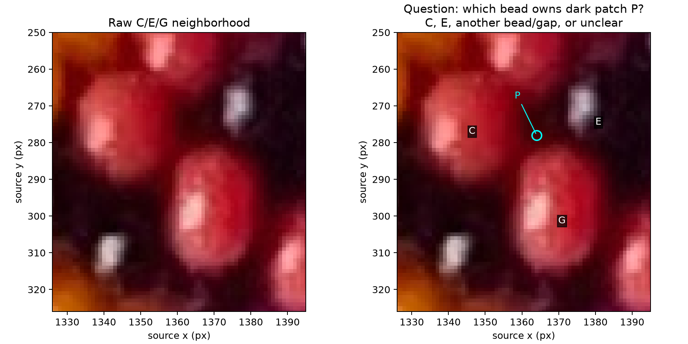
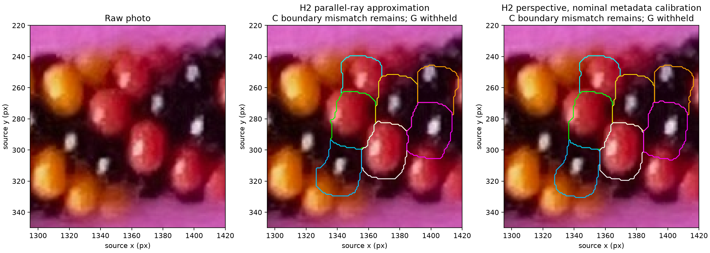

# Seven-body surface fit — R126–R128

**R135–R136 supersession:** [boundary comparison and maker neighbor alternatives](BOUNDARY_ARC_FIT.md).
The maker offers BC=6/CG=7 or BC=7/CG=6, signs unresolved. Both older charts used
BC=1; preserve their numerical evidence below as historical controls, superseding
them as active photo mappings. No new full-string index is accepted.

**Later R132:** [clear-surface constraint comparison](SURFACE_CONSTRAINTS.md)
keeps P unknown but rejects interiors-only fitting as a replacement: coverage
improves while predictions grow and withheld overlap worsens. Original R126
numerical evidence below is frozen; both local charts remain tentative.

Two fitted local models reproduce much of the seven-body patch, including the
withheld bead G. **Their 6/7 assignments remain alternatives.** Several predicted
outlines miss visible body features; neither model is ready to propagate around
the necklace. No global bead indices, exact N, pigment labels or repeat are claimed.



## Method and supplied observations

R126 continues in the same session; the user reports 84% context remaining and
declines /new. Three fitting methods were presented before implementation:
uncertain outward-point matching, visible-region/surface fitting, and full shaded
image fitting. Select surface fitting. Unknown lighting/material parameters make
full image fitting premature, and interior sample dots are not outward anchors.

[Configuration](local-fit-r126.json) adds assistant-drawn approximate polygons for
B/C/E/F/G/H/J, inspected in the raw R114 crop. These are diagnostic observations,
not maker-confirmed outlines or an automatic detector. Dark boundaries are
particularly uncertain. Their three-pixel boundary band is a diagnostic allowance,
not a measured confidence interval. A/D/I/K/L remain excluded from this fit; all
twelve original records and D/B separation are preserved.

The complete supplied polygons are visible as dotted lines above. The fitter
penalizes missing pixels well inside a proposed region and extra pixels well
outside it, allowing its uncertain boundary band. It normalizes each body's
penalty separately. RGB channels, historical color ranges, highlights and old
full-string indices do not enter the objective. This does not make the manual
region selection automatic or palette-independent inference.

G's polygon is withheld from initialization, continuous fitting and ranking.
Its proposed relative index remains part of each discrete correspondence
hypothesis; this is a held-out body prediction conditional on that hypothesis.
A test moving G far away leaves every fitted parameter and training score
unchanged. This guards against accidental use of the evaluation mask.

## Geometry and fitting

[Fitter](local_surface_fit.py) uses the straight, planar-centerline limit of the
calibrated source placement: nominal 6.5 beads per turn, original rounded annular
body, radius 2.110915748921366 and axial step 0.44329230727348686 scene units.
Every bead retains its hole axis along the section tangent. Latent indices
-26 through 40 occlude the seven active bodies; they are not new photo detections.
The local origin is the rope axis; translating it above the paper does not change
the orthographic fit. No out-of-plane centerline deformation is introduced.

Sphere tracing intersects the rounded annular surface, including its hole and
neighbor occlusion. This is not an ellipse fit or a physical-center detector.
The whole source scene, appearance settings and earlier artifacts remain unchanged.

Eight deterministic centroid-based proposals per chart/hand initialize a bounded
surface-region optimization. Centroids only initialize a rough outward-point
proposal; they are never asserted to be measured outward anchors. Powell search
uses a three-pixel grid and then a full-pixel local refinement for promising
training fits, with a 650-evaluation cap per stage. These search ranges are tuned
to this diagnostic crop; they are not an automatic image localization procedure
or a proof that the optimum is global.

A straight circular tube permits a joint camera/phase rotation around its axis
without changing its local image. A 55-degree elevation fixes that unobservable
coordinate freedom; **55 degrees is not a measured camera elevation**. A numerical
test confirms equivalent outward projections and surface ownership after changing
this coordinate convention. Camera elevation and local view must not be inferred
from a free numerical parameter in this fit.

R127: the user notes that specular reflections depend on both camera and light
and supplies no elevation estimate. Preserve that uncertainty. Reflections can
support a later joint camera/light fit, but highlights are not boundary markers.

## Checks and results

[Independent checker](check_local_surface_fit.py) renders the original POV bead
macro at supplied poses. Python surface ownership differs at only 2 and 4 pixels
out of 16,250 in two views with opposite hands. Final photo candidates differ
from independent POV renders at 0 and 4 pixels. A few grazing ray/object pairs
remain unconverged; final photo review metrics use POV ownership directly.



The inverse check fits six independently rendered synthetic body regions with G
withheld. Correct H1 has training penalty 0.0260, against 0.0865 for wrong H2;
withheld G intersection-over-union is 91.3% versus 87.4%. This is one assisted,
known example with supplied regions and candidate correspondences, not a general
detector or proof of reliable hand recovery. The wrong graph remains visually
plausible, which is a reason to retain ambiguity on the harder photo.

| Orthographic photo proposal | Mean training-body overlap | Withheld G overlap | Training penalty, 3 px band |
| --- | --- | --- | --- |
| H1 | 59.3% | 76.1% | 0.4474 |
| H2 | 60.2% | 80.5% | 0.4423 |

Overlap means mask intersection divided by union, compared with the assistant's
rough polygons; it is not an accuracy probability. H2's small score advantage is
insufficient to accept it. C's predicted shape misses part of its bright left
surface and extends into the dark region on its right; F also has a poor outline
match. Boundary ownership, correspondence and the rigid local model remain
possible causes. G's plausible prediction does not cancel those training errors.
All seven predicted minor-outward anchors lie on their assigned visible model
beads in both candidates; their corresponding photo locations remain predictions.

## Tentative neighbor descriptions

Set the local component origin at C. The numbers below are **candidate relative
indices**, not accepted full-string labels. Direction-count paths and all
candidate immediate edges are saved in the [review report](review/r126/review-report.json).

| Observation | H1 | H2 |
| --- | --- | --- |
| B | -1 | +1 |
| C | 0 | 0 |
| E | +6 | +7 |
| F | +12 | +14 |
| G | +7 | +6 |
| H | +13 | +13 |
| J | +1 | -1 |

In discussion: E is a proposed +6 neighbor of C in H1 and +7 in H2; G takes
the other family. B and J are proposed opposite direction-1 neighbors of C.
Keep every assignment tentative. The signed-count helper verifies internal
algebra, not physical correspondence. Missing and excluded beads are not compressed.

## Review question and stopping point



[Q126.1 is answered, R130–R131](LOCAL_SURFACE_FIT_QUESTIONS.md). Initially unclear
because of shadow from all four adjacent beads, P is now described by the maker
as probably outside a bead and near an edge. Keep this classification tentative;
no exact boundary, edge type, paper/gap mask or four adjacent IDs are supplied.
The shown picture contains four red, two yellow and at least two black beads,
according to the maker; these counts do not establish color-to-ID assignments
or a complete seven-body/crop inventory.

The [review annotation](local-surface-review-r130.json) overlays the frozen R126
results. No polygons, fits or scores have changed. The old numerical report's
pending question status is historical. A subsequent fit should not penalize
ownership at P; the maker supplied no numeric uncertainty-region extent.

Stop after recording this answer. Next bounded task: compare constraints from
clearer surfaces away from the shadowed junction to address C/F's shape or
correspondence mismatch. Compare methods before selecting that implementation.
Do not require P's ownership to be resolved or expand the necklace graph yet.
Stay in this session; recommendation remains gpt-6-astra / High, no /new.

## Reproduce

```sh
.venv/bin/python photo2/check_local_surface_fit.py
.venv/bin/python photo2/local_surface_fit.py --config photo2/output/r126/synthetic/synthetic-config.json --output photo2/output/r126/synthetic/final
.venv/bin/python photo2/local_surface_fit.py --output photo2/output/r126/final
.venv/bin/python photo2/check_local_perspective.py
.venv/bin/python photo2/review_local_surface_fit.py
.venv/bin/python -m unittest discover -s photo2 -p test_local_surface_fit.py -v
```

Curated reports preserve source/config/code hashes, fit parameters and independent
POV commands. Ordinary generated scenes and logs remain ignored. No dependency
was installed; the checker uses the existing NumPy/SciPy/Pillow/Matplotlib tools.
See the appended perspective assessment for R128's camera metadata and limitations.

## R128 — Close-iPhone perspective sensitivity

The maker says the photo was taken with an iPhone, likely fairly close. Direct
inspection finds lens metadata `iPhone 11 Pro back triple camera 4.25mm f/1.8`,
4.25mm focal length, 51mm full-frame equivalent and 1.96875 digital zoom. The file
is 2540×3182 with orientation 1. No subject-distance field was found. Camera
elevation, physical working distance and image crop remain unknown.

[Perspective check](check_local_perspective.py) uses a provisional image-center
principal point and nominal focal length
`51 * hypot(2540,3182) / hypot(36,24) = 4799.18 pixels`. This diagonal-equivalence
calculation is a hypothesis, especially with digital zoom/unknown cropping; it
does not calibrate the camera. Half and double that focal length bracket sensitivity.
No physical camera distance is reported from arbitrary scene units.

The pinhole model handles the patch's substantial offset from image center.
Each chart is initialized from its orthographic fit, then fitted at two-pixel
spacing and refined using the same full-pixel objective. G remains withheld.
Independent POV renders check the six final scenarios, differing at 0–8 pixels
out of 16,250; final comparison metrics use POV ownership.

| Focal scenario | H1 training penalty | H2 training penalty | H1 G overlap | H2 G overlap |
| --- | --- | --- | --- | --- |
| Half nominal | 0.7394 | 0.6536 | 72.9% | 79.1% |
| Nominal | 0.5081 | 0.4844 | 75.4% | 82.2% |
| Double nominal | 0.4593 | 0.4507 | 76.8% | 80.7% |



H2 has a modest advantage, but both proposals remain plausible and C's outline
mismatch remains. These locally optimized sensitivity scenarios neither establish
intrinsics nor justify rejecting perspective because a simpler model scores
better against rough manual regions. The known inverse test above is orthographic;
the pinhole checks validate forward rendering and explore photo sensitivity, not
a separately demonstrated perspective inverse recovery benchmark.
[Metadata, fitted parameters, hashes and independent commands](review/r126/perspective-report.json).
