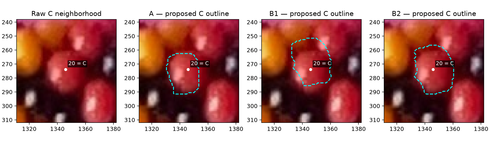

# Maker-point fit review — R149

## Q149.1 — Visible outline of C=20

In the image below, which cyan dashed outline follows the visible body C=20
most closely: A, B1, B2, or none/unclear? Please judge its extent, allowing for
shadow and occlusion; the white highlight is not a boundary marker.

**Status: pending.** No outline has been accepted or used as a fitting constraint.
This is an appearance review, not confirmation of a 6/7 assignment. A and B2
both satisfy all six training points and the withheld G point. B1 also satisfies
the six training points but misses G; B1/B2 are two poses of the same B family.
The known-synthetic example likewise permits a wrong family to pass all seven
points, so point success alone does not identify the family.

[Wider raw context](review/r149/wider-context.png),
[all seven bodies and candidate contours](review/r149/candidate-range.png),
[experiment, calibration and limitations](MAKER_POINT_FIT.md).

Q135.1 remains pending in the historical boundary review. This question supplies
the corrected maker correspondence rather than inheriting its obsolete BC=1 maps.
