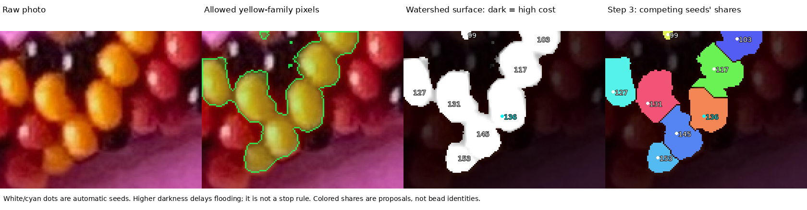
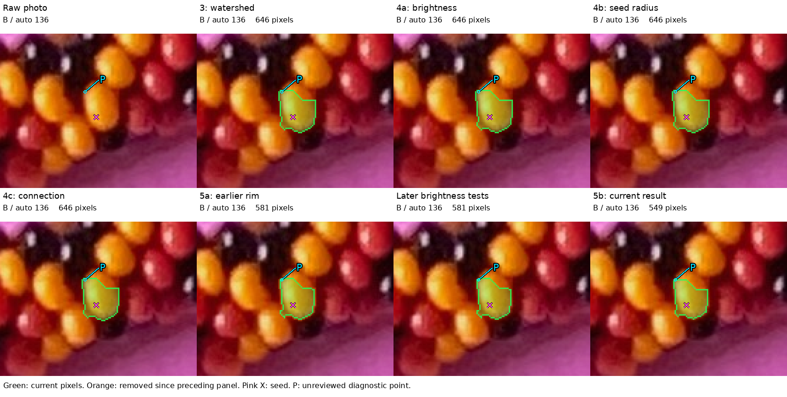
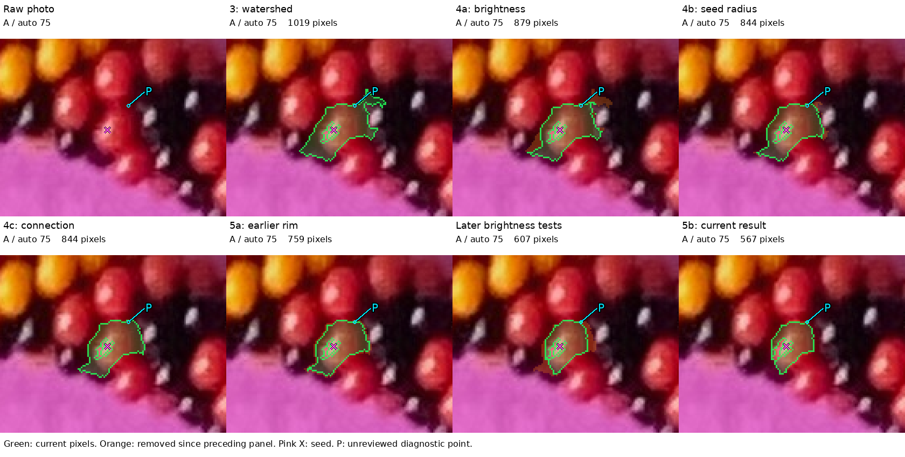
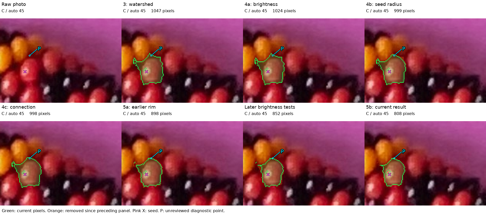
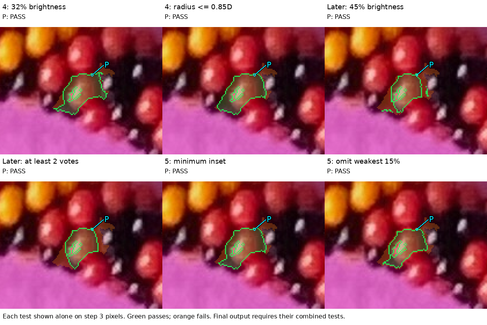
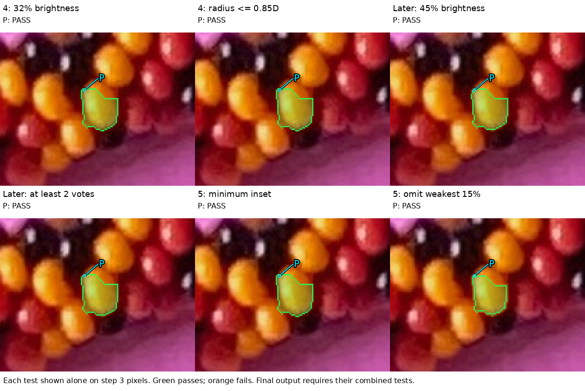

# Follow a mask through steps 3, 4 and 5 — R224

The current task is to explain where intrusive or non-round pixels enter a
proposed bead region. The maker accepts steps 1 and 2 for this discussion and
wants help examining the later decisions. These presentations observe the
existing extraction; they do not change its masks or add a roundness rule.

Open the [interactive pixel inspector](review/r224/index.html) first. Select A,
B or C, select a stage, and click a pixel in the raw photo or overlay. Its native
image coordinate and the exact pass/fail tests appear below. Zoom enlarges native
pixels; scroll to pan. Switch off the green mask or the marks to see the photo.
The interactive photographs and data are embedded in the HTML; static fallback
images sit beside it. No Internet connection is needed.

R226–R228: the maker's [blank-viewer screenshot](review/r226/blank-viewer.png)
shows an empty Example menu and no stage buttons. The classic script had a
top-level `location` variable, conflicting with the browser's own non-configurable
global. Rename it and enclose the viewer in a function scope. Static raw/mask
images now remain visible until startup succeeds; any error appears at the top.
For a tab already open, press **Ctrl+Shift+R**. The HTTP server needs no restart.
[Screenshot binding and repair record](review/r226/viewer-startup-fix.json).

If your browser needs a local address, from the repository run:

```sh
.venv/bin/python -m http.server 4001 --bind 127.0.0.1 --directory photo2/review/r224
```

Then open http://127.0.0.1:4001/. Ctrl+C stops that optional server.

Three presentation methods were selected: a sequence of stage masks, separate
pass/fail maps for individual rules, and a pixel inspector with numerical terms.
Each starts from the same raw crop; none substitutes a guessed bead outline.
Only after whole-photo extraction were earlier automatic review crops selected.
No manual bead labels, adjacency series, spline, or position model is input.

## Start with yellow B: step 3 makes the shape



The second panel is the yellow family's allowed pixel area. It can contain
several beads. The third is the watershed surface: darker means greater relative
darkness and higher flooding cost. The dots are automatic seeds. The last panel
shows which seed receives each allowed pixel. The colors and numbers identify
automatic shares, not established bead identities.

Step 3 divides pixels among seeds. It does not recognize circles and does not
reject every dark ridge as a gap. A high-cost ridge can receive a label once the
algorithm reaches it; a competing seed influences where the separating line
falls. Consequently, the watershed boundary is a proposed ownership boundary.
For B, 549 of its 646 assigned pixels have a dark-valley score of zero. The
surface has a large flat area; the separating line also depends on competing
seeds and the allowed-pixel shape. This count is not a pixel ownership judgment.



Read left to right, then the lower row. Green shows selected pixels; orange
shows pixels removed since the preceding panel. The pink X is the automatic
seed. P is a retained inspection point, whose bead ownership is unreviewed.

For B, **all 646 watershed pixels survive the step 4 brightness, radius and
connection tests**. The earlier rim removes 65 pixels, giving the previously
rejected 581-pixel mask. All 581 also pass the later brightness tests. The last
rim/connection combination leaves 549. This is an exact trace: step 4 does not
change B's watershed shape, and the later brightness tests do not repair it.
It does not yet prove which of the revised 549 pixels are wrong.

## Red A: several restrictions do have an effect



For A, step 3 assigns 1,019 pixels. Step 4 brightness removes 140, and the radius
limit removes another 35. All remaining 844 pixels are connected to the seed.
The earlier rim leaves 759; later brightness leaves 607; the final combination
leaves 567. The formerly rejected extent and the revised extent remain distinct.
The earlier maker judgment does not confirm or reject every pixel of the new one.

## C: another proposed region in the neighboring context



C is a post-extraction shape example from a previous automatic context, selected
for comparatively non-convex retained support. The context was widened to include
its entire watershed share. C is not a new confirmed bead or a manual bead label.
The inspector provides the same tests for it. Selection by shape is a diagnostic
choice, not an additional runtime rejection rule.

## What steps 4 and 5 test, separately





Each panel applies one test to the original step 3 share: green passes and orange
fails. These are individual test maps, not successive masks. All the final tests
must pass together, and the remaining component must connect to the seed.

| Test | What it actually asks | What it does not establish |
|---|---|---|
| Early brightness | Is reflection-suppressed V at least 32% of the share's Q90? | Ownership or a local brightness transition |
| Seed radius | Is the pixel within 0.85 estimated diameters of the seed? | A boundary at the actual bead's radius |
| Seed connection | Is there a path through accepted pixels to the seed? | That the path stays on one bead |
| Later brightness | Is diffuse V at least 45% of the guarded candidate's Q90? | Whether a bright neighbor is excluded |
| Two-of-three smoothing votes | Does the pixel have sufficiently bright, seed-connected support at two scales? | A physical edge; blur can carry brightness across it |
| Minimum inset | Is it at least 0.5 pixels inside the candidate here? | Distance from the actual bead edge |
| Rim ranking | Is its score above this candidate's weakest 15%? | Roundness or 70–90% actual visible coverage |

Q90 is the value exceeded by the brightest 10% of the candidate's pixels.
V is the largest RGB channel divided by 255. At separately detected reflections,
nearby median V replaces the spot only for these diffuse-brightness calculations.
The native photo and reflection masks remain unchanged.

The current rim score is:

```text
distance from candidate edge, in pixels
    + 0.25 × (diffuse V / candidate Q90)
    − 0.25 × relative darkness
```

Distance normally contributes much more than the other terms. Thus a thick
extension already assigned to the candidate can receive a good score. The rule
protects the interior of the proposed shape; it does not test whether that shape
is a plausible visible bead. A dark, narrow connection can fail the restrictions,
but a sufficiently bright connection can pass. Neither finding by itself proves
an indexing or array bug.

For example, A's marked P has an inset of 2 pixels, brightness contribution about
0.119, and darkness penalty about 0.049: score 2.070 versus cutoff 1.232. It has
diffuse V 0.412 versus the later floor 0.388, and all three smoothing votes.
Every final test passes. Your judgment of which bead contains P remains separate
from these program decisions; P was chosen for inspection, not as known spill.

The early rim uses a 10% score cutoff; the later rim uses 15% on the guarded
candidate and intersects the earlier retained mask. The extra brightness panel
places the later brightness factors before the later rim solely for explanation.
In the original code those factors are combined in one expression. The observed
final result is identical; the diagram does not claim an extra algorithm stage.

## Q224.1 — locate one specific mistake

In A, B or C, identify one green extension or retained pixel that clearly lies
outside the bead whose face the mask is intended to cover. Give its case letter
and position; the inspector's native (x, y) coordinate is useful if convenient.
If the illustrated final masks are satisfactory, say so. This asks about an
individual mistake, not approval of the whole necklace or all earlier masks.

The marked points P are optional inspection suggestions, not assertions that
they are outside. The sequence and pass/fail images are preserved with the
[native measurements and stage counts](review/r224/trace.json). The question is
pending; no maker answer or revised mask acceptance has been inferred.

## Checks and stopping point

The observer returns the original watershed result unchanged. A fresh extraction
repeats every sealed R218 array. For each illustrated region, reconstructed step
4 support, the earlier rim and the current final mask exactly match the sealed
R218/R220 arrays; the production trimming function agrees too. Source hashes,
parameters, native coordinates and payload hashes are in the
[provenance record](review/r224/summary.json).
[Verification](review/r224/verification.json) also checks image/pixel bindings,
frozen earlier question extents, protected inputs and the append-only log.
The Node viewer harness catches the restricted-global startup regression and
checks all three cases and click coordinates after zoom/pan. It does not exercise
real-browser painting; refreshed browser confirmation remains pending.

```sh
.venv/bin/python photo2/trace_colored_stages.py
.venv/bin/python photo2/trace_colored_stages.py --reuse-trace
.venv/bin/python photo2/check_stage_diagnostics.py
node photo2/test_mask_stage_viewer.cjs
```

Stop at this explanation and ownership discussion. Next bind the maker's chosen
wrong pixels to these traces and identify the rule that first admits them or
fails to reject them, before choosing a repair. Recommend gpt-6.1-sol / High,
same conversation; no `/new` needed.
